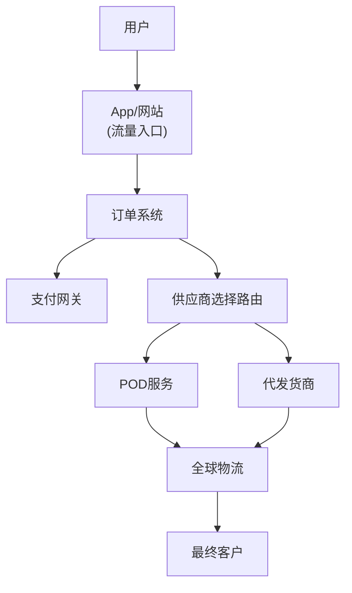
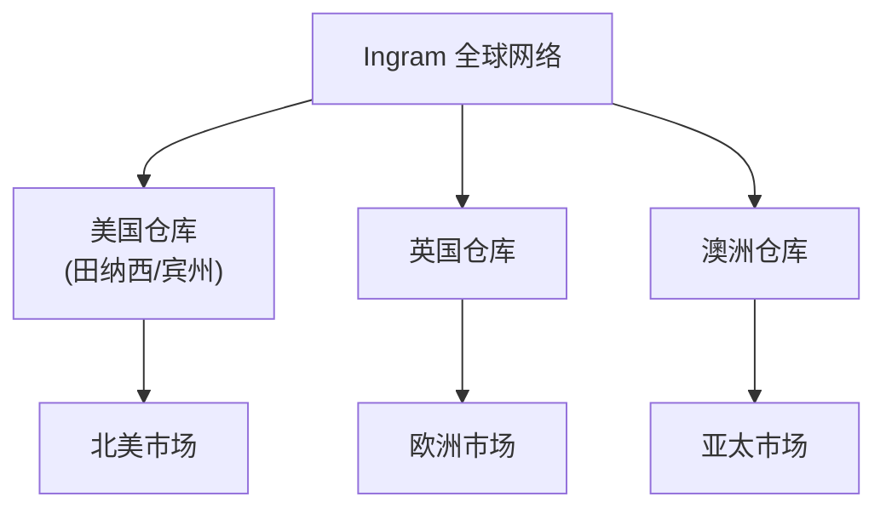
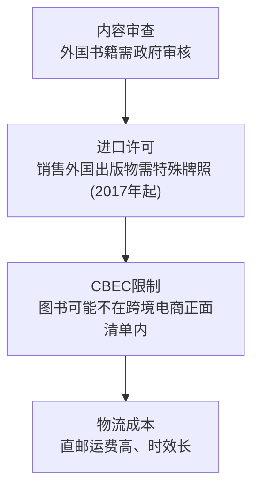
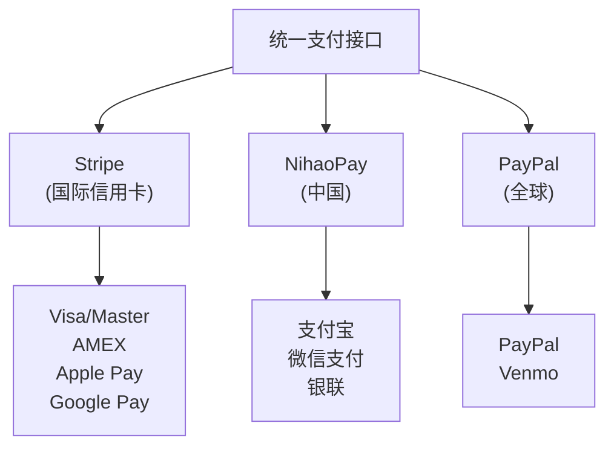
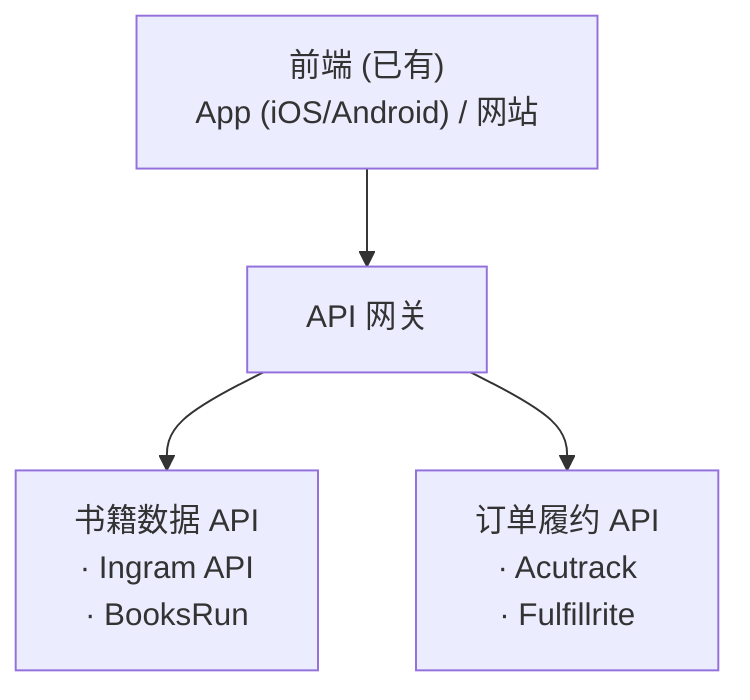
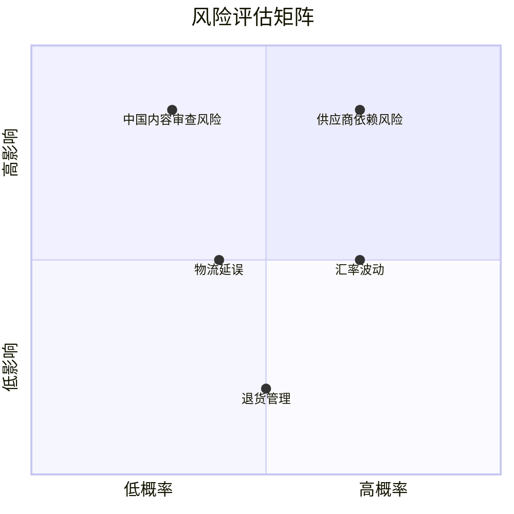
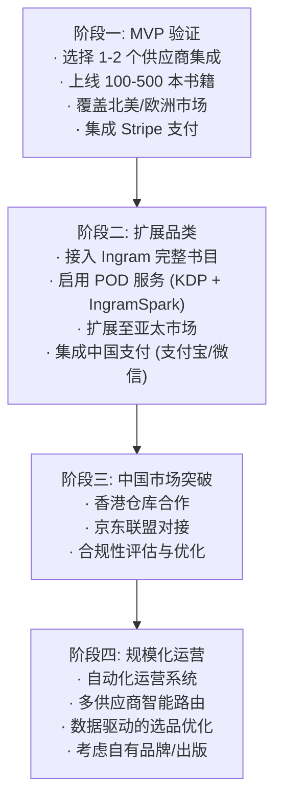

# 全球英文书籍销售商业计划

> 版本: 1.0
> 日期: 2025-12-28
> 状态: 草案

---

## 目录

1. [执行摘要](#执行摘要)
2. [商业模式架构](#商业模式架构)
3. [供应链资源](#供应链资源)
4. [全球物流方案](#全球物流方案)
5. [中国大陆市场策略](#中国大陆市场策略)
6. [支付解决方案](#支付解决方案)
7. [定价与利润分析](#定价与利润分析)
8. [平台技术集成](#平台技术集成)
9. [风险与挑战](#风险与挑战)
10. [实施路线图](#实施路线图)

---

## 执行摘要

### 业务定位

利用现有 App 和网站流量，采用**零库存代发货 (Dropshipping)** 和 **按需印刷 (Print-on-Demand)** 模式销售英文书籍至全球市场。

### 核心优势

| 优势项 | 说明 |
|--------|------|
| 流量资源 | 已有 App 和网站用户基础 |
| 零库存 | 无需囤货，降低资金压力 |
| 全球覆盖 | 借助成熟供应链触达 100+ 国家 |
| 轻资产运营 | 无需仓储和物流团队 |

### 市场规模

---

## 商业模式架构

### 整体业务流程

### 三种商业模式对比

| 模式 | 描述 | 优点 | 缺点 | 推荐度 |
|------|------|------|------|--------|
| **代发货 (Dropshipping)** | 从批发商直接发货给客户 | 品种多、价格低 | 依赖供应商库存 | ★★★★★ |
| **按需印刷 (POD)** | 收到订单后印刷发货 | 永不断货、可定制 | 成本较高 | ★★★★☆ |
| **联盟营销 (Affiliate)** | 导流至第三方平台赚取佣金 | 零运营成本 | 佣金低(4.5%) | ★★★☆☆ |

### 推荐策略: 混合模式

---

## 供应链资源

### 书籍代发货供应商

| 供应商 | 地区 | 特点 | 价格优势 | API支持 |
|--------|------|------|----------|---------|
| **BooksRun** | 美国 | 100万+书目、包含运费价格 | 批发价 | ✓ |
| **AmericanBookCo** | 美国 | 23个品类、零售价80%折扣 | ★★★★★ | ✓ |
| **Ingram Content** | 全球 | 2000万+书目、全球分销 | ★★★★☆ | ✓ |
| **Half Moon Bay** | 英国 | Shopify直接集成 | ★★★☆☆ | ✓ |
| **AliExpress** | 中国 | 无最低订购量、教育类童书 | ★★★★★ | ✓ |

### 按需印刷 (POD) 服务商

| 服务商 | 设置费用 | 全球分销 | 书籍类型 | 推荐场景 |
|--------|----------|----------|----------|----------|
| **Amazon KDP** | 免费 | Amazon生态 | 平装/精装 | Amazon销售优先 |
| **IngramSpark** | $49 | 40,000+ 渠道 | 全类型含精装护封 | 实体书店/图书馆 |
| **Lulu** | 免费 | 有限 | 平装为主 | 入门级 |
| **Draft2Digital** | 免费 | 电子书为主 | 电子书 | 电子书分销 |

### KDP vs IngramSpark 详细对比

---

## 全球物流方案

### 物流架构

> Global Connect: 额外覆盖 11 个市场，触达全球 50% 人口

### 物流服务商对比

| 方案 | 覆盖范围 | 运费 | 时效 | 适用场景 |
|------|----------|------|------|----------|
| **Ingram Global Connect** | 100+ 国家 | 本地印刷免国际运费 | 当日-3天 | 主要方案 |
| **Blackwell's** | 全球 (UK发货) | 包含在书价内 | 7-21天 | 英国版本书籍 |
| **Wordery** | 全球 | 免费 | 7-21天 | 补充方案 |
| **Better World Books** | 全球 | 符合条件免费 | 7-21天 | 二手书 |

### 书籍履约服务集成商

| 服务商 | Shopify | WooCommerce | 特点 |
|--------|---------|-------------|------|
| **Acutrack** | ✓ | ✓ | 专业书籍履约、支持捆绑 |
| **Encore Fulfillment** | ✓ | ✓ | 全渠道履约 |
| **Fulfillrite** | ✓ | ✓ | Kickstarter 集成 |
| **Shipfusion** | ✓ | ✓ | 北美仓库网络 |

---

## 中国大陆市场策略

### 挑战分析

### 可行方案

#### 方案一: 香港跳板 (推荐)

#### 方案二: 京东自营渠道

| 特点 | 说明 |
|------|------|
| 平台 | 京东 (JD.com) 是授权进口英文书销售商 |
| 优势 | 次日达、平台信任度高 |
| 模式 | 联盟导流赚取佣金 |
| 局限 | 书目有限、需用户自行在京东下单 |

#### 方案三: 自助进口 (消费者承担风险)

- 提供全球发货选项
- 客户自行承担清关风险
- 适用于学术/专业书籍刚需用户

### 中国市场消费限额

| 限制类型 | 金额 |
|----------|------|
| 单笔交易上限 | ¥5,000 (~$727) |
| 年度消费上限 | ¥26,000 (~$3,782) |

---

## 支付解决方案

### 全球支付架构

### 中国支付集成方案

| 服务商 | 支持渠道 | 月费 | 手续费 | 集成难度 |
|--------|----------|------|--------|----------|
| **Stripe** | 支付宝/微信 | 免费 | ~2.9%+$0.30 | 低 |
| **NihaoPay** | 支付宝/微信/银联 | 免费 | 2.6% | 低 |
| **China Payments** | 支付宝/微信/银联 | $79/月/渠道 | 浮动 | 中 |
| **Tazapay** | 支付宝 | 免费 | 浮动 | 低 |

### 关键数据

> 支付宝 + 微信支付覆盖中国 90% 以上在线消费者

---

## 定价与利润分析

### 利润结构模型

### 不同品类利润对比

| 书籍类型 | 典型售价 | POD成本 | 毛利率 | 说明 |
|----------|----------|---------|--------|------|
| 教育/工具书 | $25-50 | $6-10 | 35-45% | 复购率高 |
| 童书 | $15-25 | $5-8 | 25-35% | 市场增长快 |
| 小说 | $15-20 | $4-6 | 20-30% | 价格敏感 |
| 专业/学术 | $50-150 | $15-30 | 40-50% | 高价值 |

### 定价策略

| 策略 | 描述 | 适用场景 |
|------|------|----------|
| **33%法则** | 售价分三份: 成本/营销/利润 | 新手入门 |
| **价值定价** | 基于用户感知价值而非成本 | 专业书籍 |
| **免运费策略** | 将运费计入书价 | 提升转化率 |
| **捆绑销售** | 多本打包优惠 | 提升客单价 |

### 联盟营销佣金对比

| 平台 | 佣金率 | Cookie时效 | 特点 |
|------|--------|------------|------|
| Amazon Associates | 4.5% | 24小时 | 体量大、佣金低 |
| Audible | $75/新用户 | - | 有声书订阅 |
| Tan Books | 10% | 45天 | 宗教类书籍 |
| Chirp | 20% (新) / 5% (老) | 7天 | 有声书 |
| Textbook X | 5% | - | 教材 |

### 收益预测模型

#### 关键假设参数

| 参数 | 保守估计 | 中等估计 | 乐观估计 |
|------|----------|----------|----------|
| 月均访客 (UV) | 10,000 | 50,000 | 200,000 |
| 转化率 | 1.0% | 2.0% | 3.0% |
| 平均客单价 | $20 | $28 | $35 |
| 毛利率 | 20% | 25% | 30% |
| 复购率 (年) | 15% | 25% | 35% |

#### 年度收益预测

#### 分市场收益占比预测

#### 收益增长曲线 (月度)

#### 投资回报分析

| 投入项目 | 初期投资 | 月运营成本 |
|----------|----------|------------|
| 技术开发/集成 | $5,000-15,000 | - |
| 供应商账户费 | $100-500 | $50-100 |
| 支付网关集成 | $0-500 | 2.6-3.5%/交易 |
| 营销预算 | - | $500-5,000 |
| 客服/运营 | - | $500-2,000 |
| **合计** | **$5,600-16,000** | **$1,050-7,100** |

| 回报指标 | 保守 | 中等 | 乐观 |
|----------|------|------|------|
| 投资回收期 | 24 月 | 6 月 | 2 月 |
| 首年 ROI | 15% | 280% | 2,700% |
| 三年累计净利 | $12,000 | $200,000 | $1,500,000 |

#### 盈亏平衡分析

#### 中国市场额外收益潜力

| 场景 | 预估月订单 | 月销售额 | 月毛利 | 备注 |
|------|------------|----------|--------|------|
| 香港跳板 | 50-200 | $1,500-6,000 | $375-1,500 | 运费较高 |
| 京东联盟 | 100-500 | 佣金$50-250 | $50-250 | 纯佣金模式 |
| 合计潜力 | - | $1,550-6,250 | $425-1,750 | 占总收益 10-15% |

---

## 平台技术集成

### 推荐技术栈

### 关键 API 集成

| 系统 | 提供商 | 功能 |
|------|--------|------|
| 书目数据 | Ingram Content API | 2000万+书目元数据 |
| 库存同步 | BooksRun API | 实时库存状态 |
| 订单履约 | Acutrack/Fulfillrite | 自动订单处理 |
| 支付 | Stripe/NihaoPay | 全球支付处理 |
| 物流追踪 | 各履约商 API | 物流状态同步 |

### Shopify/WooCommerce 集成选项

| 插件/应用 | 平台 | 功能 |
|-----------|------|------|
| Ingram Shopify App | Shopify | 2000万书目、多币种 |
| Acutrack App | Shopify | 自动履约 |
| Spark Shipping | Shopify/WooCommerce | 多供应商路由 |

---

## 风险与挑战

### 风险矩阵

### 风险应对策略

| 风险 | 影响 | 应对策略 |
|------|------|----------|
| 中国内容审查 | 高 | 避免敏感内容书籍、香港中转 |
| 供应商依赖 | 高 | 多供应商备份、混合模式 |
| 物流延误 | 中 | 本地 POD、设置合理预期 |
| 汇率波动 | 中 | 动态定价、多币种结算 |
| 退货管理 | 低 | 清晰退货政策、选择 Global Connect (不退货) |

---

## 实施路线图

### 阶段规划

### 阶段一快速启动清单

| 任务 | 优先级 | 依赖 |
|------|--------|------|
| 注册 Ingram Content 账户 | P0 | - |
| 注册 BooksRun API | P0 | - |
| 集成 Stripe 支付 | P0 | - |
| 设计书籍展示页面 | P1 | - |
| 建立订单流转系统 | P1 | API 接入 |
| 制定退货/客服政策 | P1 | - |
| 选择首批 500 本书籍 | P2 | API 接入 |
| 测试完整购买流程 | P2 | 全部完成 |

---

## 参考资源

### 主要供应商链接

- Ingram Content Group: https://www.ingramcontent.com/
- IngramSpark: https://www.ingramspark.com/
- BooksRun: https://booksrun.com/
- Amazon KDP: https://kdp.amazon.com/
- Acutrack: https://www.acutrack.com/

### 支付服务

- Stripe: https://stripe.com/
- NihaoPay: https://www.nihaopay.com/
- China Payments: https://www.china-payments.com/

### 参考文章

- [Dropshipping Books Guide - Shopify](https://www.shopify.com/blog/dropshipping-books)
- [IngramSpark vs KDP](https://www.ingramspark.com/blog/ingramspark-vs-createspace)
- [China Cross-Border E-Commerce Guide](https://china.acclime.com/guides/entering-cross-border-ecommerce-market/)
- [Book Depository Alternatives](https://bookriot.com/book-depository-alternatives/)

---

*本文档基于 2025 年 12 月市场调研编写，建议定期更新以反映市场变化。*
