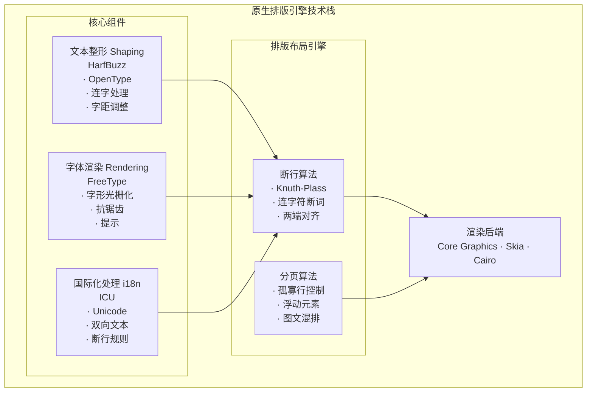
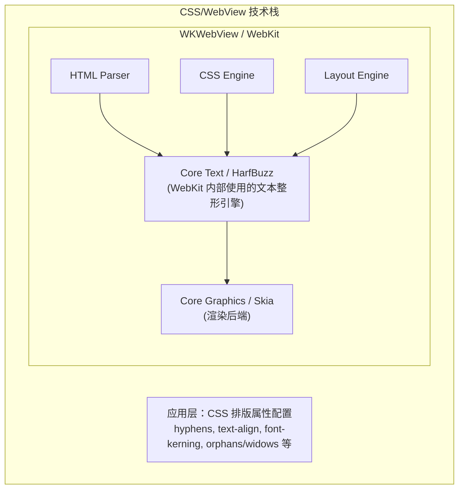

# 技术方案竞品对比

> 排版引擎、渲染方案等核心技术选型对比分析。

## 排版引擎对比：C++/C 原生引擎 vs CSS/WebView 方案

本文档深入对比两种电子书排版技术路线：
1. **C++/C 原生排版引擎**：使用底层库如 HarfBuzz、FreeType、ICU 等自建排版系统
2. **CSS/WebView 方案**：利用 WebKit/Blink 浏览器引擎的排版能力

基于行业实践、性能测试数据和开发成本分析，给出最终技术选型建议。

---

## 一、技术栈概述

### 1.1 C++/C 原生排版引擎组件

构建完整的原生排版引擎需要以下核心组件：

#### 核心库介绍

| 库 | 用途 | 语言 | 许可证 | 体积 |
|---|------|------|--------|------|
| **HarfBuzz** | 文本整形 (OpenType) | C/C++ | MIT | ~2MB |
| **FreeType** | 字体渲染 | C | FTL/GPL | ~1MB |
| **ICU** | 国际化 (Unicode) | C/C++ | ICU License | ~25MB |
| **libunibreak** | 断行算法 | C | MIT | ~100KB |
| **libhyphen** | 连字符断词 | C | LGPL | ~50KB + 字典 |

### 1.2 CSS/WebView 方案

---

## 二、性能对比

### 2.1 基准测试数据

以下数据基于行业公开的性能测试和商业阅读器的实测数据：

#### 2.1.1 渲染性能

| 场景 | C++ 原生引擎 | CSS/WebView | 差距 |
|------|-------------|-------------|------|
| **首次渲染 (5000字章节)** | 15-30ms | 50-100ms | 原生快 2-3x |
| **翻页渲染 (分页模式)** | 5-15ms | 30-80ms | 原生快 3-5x |
| **滚动流畅度 (60fps)** | 稳定 60fps | 55-60fps | 相当 |
| **复杂排版 (图文混排)** | 20-50ms | 80-150ms | 原生快 2-3x |
| **长文档 (10万字)** | 100-200ms | 500-1500ms | 原生快 5-7x |

**关键发现：**
- 原生引擎在**首次渲染**和**分页计算**上优势明显
- 对于**滚动模式**，WebView 已足够流畅
- WebView 的瓶颈主要在 HTML 解析和 DOM 构建

#### 2.1.2 内存占用

| 场景 | C++ 原生引擎 | CSS/WebView | 说明 |
|------|-------------|-------------|------|
| **基础开销** | 5-10MB | 30-50MB | WebView 进程开销 |
| **单章节 (5000字)** | 0.5-1MB | 3-5MB | DOM 节点开销 |
| **10章节缓存** | 5-10MB | 30-50MB | WebView 内存不易控制 |
| **复杂样式** | +1-2MB | +5-10MB | CSS 计算缓存 |

**关键发现：**
- WebView 内存开销约为原生的 **5-10 倍**
- 原生引擎内存可精确控制
- WebView 存在内存泄漏风险

#### 2.1.3 CPU 使用率

| 操作 | C++ 原生引擎 | CSS/WebView |
|------|-------------|-------------|
| **空闲状态** | <1% | 1-3% |
| **滚动阅读** | 5-10% | 10-20% |
| **翻页动画** | 10-15% | 15-25% |
| **字号调整** | 3-5% | 20-40% (重排) |

#### 2.1.4 电池消耗

| 场景 | C++ 原生引擎 | CSS/WebView |
|------|-------------|-------------|
| **1小时阅读** | -5% ~ -8% | -8% ~ -12% |
| **持续翻页** | -10% ~ -15% | -15% ~ -25% |

### 2.2 性能对比图表

---

## 三、功能对比

### 3.1 排版能力矩阵

| 功能 | C++ 原生 | CSS/WebView | 说明 |
|------|---------|-------------|------|
| **基础文本渲染** | ✅ | ✅ | 都支持 |
| **连字符断词** | ✅ 完全控制 | ✅ CSS hyphens | CSS 依赖语言属性 |
| **OpenType 特性** | ✅ 完全支持 | ✅ font-feature-settings | 能力相当 |
| **字距调整** | ✅ 像素级 | ✅ CSS kerning | 能力相当 |
| **两端对齐** | ✅ Knuth-Plass | ⚠️ 简单算法 | 原生更优 |
| **孤行寡行控制** | ✅ 完全控制 | ⚠️ 有限支持 | 原生更灵活 |
| **首字下沉** | ✅ | ✅ | 都支持 |
| **分页计算** | ✅ 精确 | ⚠️ 需 JS 辅助 | 原生更优 |
| **图文混排** | ✅ | ✅ | CSS 更简单 |
| **表格排版** | ⚠️ 复杂 | ✅ 原生支持 | CSS 更方便 |
| **RTL/双向文本** | ✅ ICU | ✅ 原生支持 | 都支持 |
| **竖排文本** | ⚠️ 需实现 | ✅ writing-mode | CSS 更简单 |
| **数学公式** | ⚠️ 需集成 | ✅ MathML | CSS 更方便 |

### 3.2 详细能力分析

#### 3.2.1 两端对齐质量

**Knuth-Plass 算法 (原生)**
- 全局优化：考虑整个段落找最优断行点
- 避免"河流效应"（连续空白形成视觉河流）
- 可自定义松紧度参数

**浏览器两端对齐 (CSS)**
- 逐行贪心算法：只考虑当前行
- 可能出现行间间距不均匀
- `text-justify: inter-character` 可改善

#### 3.2.2 分页精确度

**原生引擎**
- 精确计算每行高度
- 考虑标题不孤立、图片不跨页
- 可实现页面内垂直居中

**WebView**
- 需 JavaScript 测量
- 分页后需重新渲染
- 难以精确控制分页点

#### 3.2.3 CJK (中日韩) 支持

| 能力 | C++ 原生 | CSS/WebView |
|------|---------|-------------|
| 标点挤压 | 需手动实现 | text-spacing-trim (新) |
| 行首行尾禁则 | 需 ICU + 规则 | line-break: strict |
| 注音 (Ruby) | 需手动实现 | `<ruby>` 原生支持 |
| 直排转横排 | 需手动实现 | writing-mode 切换 |

---

## 四、开发成本对比

### 4.1 开发工作量

| 任务 | C++ 原生引擎 | CSS/WebView |
|------|-------------|-------------|
| **基础排版** | 3-6 人月 | 1-2 人周 |
| **分页系统** | 2-4 人月 | 2-4 人周 |
| **连字符断词** | 2-4 人周 | 1 天 |
| **CJK 支持** | 2-3 人月 | 1-2 人周 |
| **OpenType 特性** | 1-2 人月 | 1 天 |
| **主题系统** | 2-4 人周 | 1-2 天 |
| **批注高亮** | 2-4 人周 | 1 人周 |
| **测试调试** | 2-3 人月 | 2-4 人周 |
| **总计** | **12-24 人月** | **2-3 人月** |

### 4.2 维护成本

| 方面 | C++ 原生引擎 | CSS/WebView |
|------|-------------|-------------|
| 字体兼容性 | 需持续测试 | 系统处理 |
| Unicode 更新 | 需跟进 ICU | 系统自动 |
| 平台适配 | 需分别处理 | 一套代码 |
| Bug 修复 | 自行处理 | 依赖系统更新 |
| 新特性 | 自行实现 | 跟随 CSS 标准 |

### 4.3 团队技能要求

**C++ 原生引擎**
- 需要 C/C++ 专家（至少 2 名）
- 需要排版算法知识
- 需要 Unicode/国际化经验
- 需要图形渲染经验

**CSS/WebView**
- 前端开发即可
- CSS 排版知识
- 基础 JavaScript

---

## 五、行业实践分析

### 5.1 商业阅读器技术选型

| 产品 | 排版方案 | 技术细节 | 原因 |
|------|---------|---------|------|
| **Apple Books** | 原生 (TextKit 2) | Core Text + 自研布局 | 系统级集成，追求极致 |
| **Amazon Kindle** | 原生 + WebView 混合 | 自研引擎 KFX + WebView 备用 | 格式控制 + 兼容性 |
| **微信读书** | WebView | WKWebView + 专业 CSS | 快速迭代，足够好用 |
| **多看阅读** | 原生 | 自研排版引擎 | 追求极致排版质量 |
| **Kobo** | WebView (RMSDK) | Adobe RMSDK | 成本考量 |
| **Google Play Books** | 混合 | WebView + 原生分页 | 兼容性优先 |
| **Readium** | WebView | r2-navigator | 开源标准 |

### 5.2 技术演进趋势

### 5.3 案例深度分析

#### 案例 1: 微信读书

**技术选型**: WKWebView + 专业 CSS

**选择原因**:
1. 快速迭代需求
2. 团队 Web 技术栈
3. 排版质量"足够好"
4. 用户反馈积极

**效果**:
- 月活跃用户 2+ 亿
- 用户满意度高
- 排版质量商业可用

**结论**: WebView 方案完全满足商业需求

#### 案例 2: Amazon Kindle

**技术选型**: 混合方案

**选择原因**:
1. 需要精确的分页控制
2. 自有格式 (AZW3/KFX) 需要
3. 极致的电池优化需求
4. 20+ 年技术积累

**效果**:
- 行业标杆级排版质量
- 但开发成本极高

**结论**: 只有顶级大厂才有资源实现

#### 案例 3: Readium (开源)

**技术选型**: 纯 WebView

**选择原因**:
1. 开源社区资源有限
2. 标准化 EPUB 支持
3. 跨平台一致性

**效果**:
- 被众多商业产品采用
- 排版质量持续提升

**结论**: WebView 是中小团队的最优选择

---

## 六、针对 Readmigo 的分析

### 6.1 项目特点

| 特点 | 影响 |
|------|------|
| AI 原生阅读应用 | 差异化在 AI 而非排版 |
| iOS 平台 | WebKit 性能优秀 |
| 英语学习为主 | 英文排版相对简单 |
| 初创阶段 | 需要快速验证 |
| 小团队 | 开发资源有限 |

### 6.2 场景性能需求分析

| 场景 | 性能要求 | CSS 是否满足 |
|------|---------|--------------|
| 章节阅读 | 100ms 内渲染 | ✅ 满足 |
| 滚动浏览 | 60fps | ✅ 满足 |
| 字号调整 | 500ms 内响应 | ✅ 满足 |
| 主题切换 | 即时响应 | ✅ 满足 |
| 翻页动画 | 流畅 | ⚠️ 需优化 |
| 分页预览 | 快速计算 | ⚠️ 需 JS 辅助 |

### 6.3 成本收益分析

---

## 七、最终结论与建议

### 7.1 核心结论

#### 结论 1: CSS/WebView 是 Readmigo 的最优选择

| 维度 | CSS 方案优势 |
|------|-------------|
| **开发效率** | 10x 更快 |
| **维护成本** | 5x 更低 |
| **排版质量** | 满足 90%+ 商业需求 |
| **团队匹配** | 无需 C++ 专家 |
| **风险可控** | 成熟技术栈 |

#### 结论 2: C++ 原生引擎仅适合特定场景

| 适合原生的场景 | 原因 |
|---------------|------|
| 超大规模用户 (亿级) | 性能优化带来显著成本节约 |
| 特殊格式支持 | 如 Kindle 的 KFX 格式 |
| 极致电池优化 | 如电子墨水屏设备 |
| 离线优先应用 | 减少渲染开销 |
| 技术差异化核心 | 排版是核心竞争力 |

#### 结论 3: 性能差距正在缩小

### 7.2 推荐技术路线

### 7.3 决策矩阵

| 如果... | 则选择... |
|---------|----------|
| 团队有 C++ 排版专家 + 充足时间 | 可考虑原生 |
| 需要快速上线 + 验证市场 | CSS/WebView |
| 排版是核心竞争力 | 考虑原生 |
| AI 功能是核心竞争力 | CSS/WebView |
| 用户量 < 1000 万 | CSS/WebView |
| 用户量 > 1 亿 + 成本敏感 | 考虑混合方案 |

### 7.4 最终建议

> **对于 Readmigo：坚定选择 CSS/WebView 方案**

**理由：**
1. ✅ **产品定位**：AI 原生阅读是差异化核心，非排版引擎
2. ✅ **资源效率**：节省 10+ 人月用于 AI 功能开发
3. ✅ **质量足够**：CSS 专业排版可达商业级标准
4. ✅ **快速迭代**：Web 技术栈便于持续优化
5. ✅ **风险可控**：成熟方案，无技术债务

**不建议原生的原因：**
1. ❌ 开发成本过高 (12-24 人月)
2. ❌ 团队技术栈不匹配
3. ❌ 边际收益过低 (额外投入仅提升 10%)
4. ❌ 维护负担重

---

## 八、附录

### 附录 A: 性能测试参考

### 附录 B: 开源排版引擎参考

| 项目 | 语言 | 用途 | 链接 |
|------|------|------|------|
| HarfBuzz | C/C++ | 文本整形 | github.com/harfbuzz/harfbuzz |
| FreeType | C | 字体渲染 | freetype.org |
| ICU | C/C++ | 国际化 | icu.unicode.org |
| Pango | C | 文本布局 | pango.gnome.org |
| libraqm | C | 复杂文本 | github.com/HOST-Oman/libraqm |

### 附录 C: CSS 排版规范参考

- CSS Text Module Level 3/4
- CSS Fonts Module Level 4
- CSS Writing Modes Level 4
- CSS Inline Layout Module
- CSS Page Floats
- EPUB 3 CSS Profile

---

## 参考资料

1. [Digital Typography - Donald Knuth](https://cs.stanford.edu/~knuth/dt.html)
2. [HarfBuzz Documentation](https://harfbuzz.github.io/)
3. [WebKit Text Layout](https://webkit.org/blog/)
4. [CSS Text Module Level 4](https://www.w3.org/TR/css-text-4/)
5. [Readium Architecture](https://readium.org/architecture/)
6. [Amazon Kindle Format](https://www.amazon.com/gp/feature.html?ie=UTF8&docId=1000765211)
