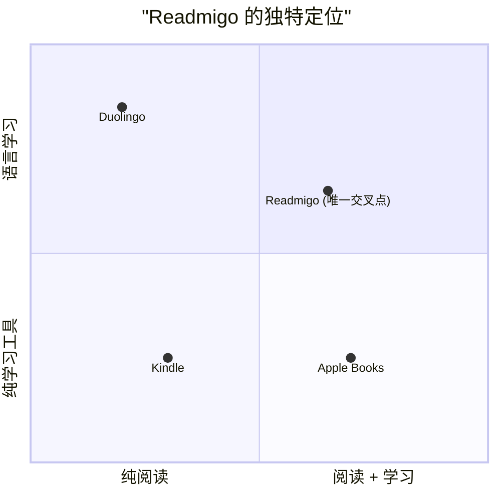
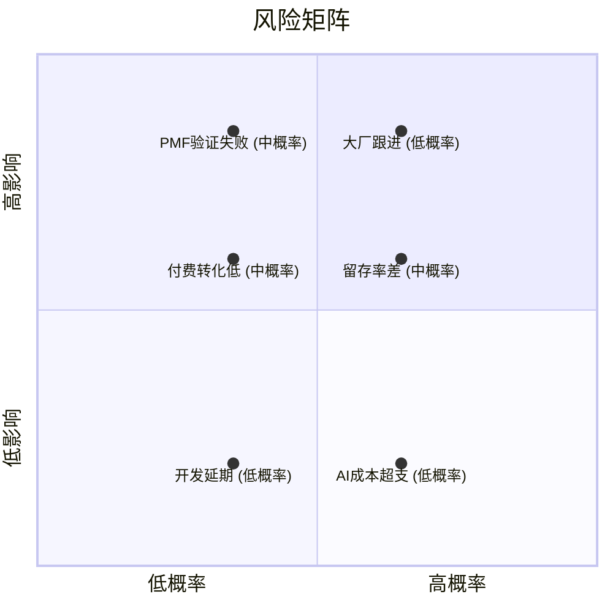

# Readmigo 可行性评估与收益预估报告

> 评估日期：2025年12月
> 基于 PRD 文档与 2025 年市场数据

---

## 目录

1. [执行摘要](#1-执行摘要)
2. [市场行情分析](#2-市场行情分析)
3. [产品优势分析](#3-产品优势分析)
4. [风险评估](#4-风险评估)
5. [收益预估模型](#5-收益预估模型)
6. [投入产出分析](#6-投入产出分析)
7. [关键里程碑](#7-关键里程碑)
8. [决策建议](#8-决策建议)
9. [数据来源](#9-数据来源)

---

## 1. 执行摘要

### 1.1 项目概述

**Readmigo** 是一款 AI 原生英文原著阅读学习产品，定位于帮助全球英语学习者轻松阅读英文原著。

### 1.2 核心结论

| 评估维度 | 评分 | 结论 |
|----------|------|------|
| 综合可行性 | **78-82%** | 项目可行，值得投入 |
| 盈亏平衡难度 | **低** | 100个年付用户即可覆盖成本 |
| Year 1 预期收入 | **$10K-$40K** | 作为副业收入可观 |
| 3年累计收入 | **$100K-$500K** | 现实区间 |
| 成为主要收入概率 | **15-20%** | 需要多个因素配合 |

### 1.3 最终判断

---

## 2. 市场行情分析

### 2.1 语言学习App市场规模（2025）

| 市场 | 2025年规模 | 预计规模 | CAGR |
|------|-----------|----------|------|
| 全球语言学习App | $73.6亿 | $243.9亿 (2033) | 16.15% |
| 英语学习App | $32.2亿 | $60亿+ (2033) | 16.3% |
| 中国语言学习App | $6.84亿 | 高速增长中 | 20%+ |

### 2.2 区域市场特点

### 2.3 Duolingo 对标分析（2025最新）

作为语言学习赛道的标杆，Duolingo 的数据具有重要参考价值：

| 指标 | 2024年数据 | 2025年数据 | 同比增长 |
|------|-----------|-----------|----------|
| 年收入 | $7.48亿 | 预计$10亿+ | +40% |
| Q3收入 | - | $2.72亿 | +41% |
| 付费用户 | 950万 | 1,200万+ | +44% |
| MAU | 1.13亿 | 1.35亿 | +20% |
| DAU | 3,700万 | 5,050万 | +36% |
| 付费转化率 | ~7% | ~8% | 持续提升 |

**关键启示**：
- 语言学习市场仍在高速增长（40%+ YoY）
- 付费转化率可达 7-8%（行业平均 3-5%）
- DAU 增速远超 MAU，说明用户粘性在提升

### 2.4 订阅App转化率基准（2025 RevenueCat报告）

### 2.5 留存率基准

| 订阅类型 | 首次续费流失 | 6个月后留存 | 1年后留存 |
|----------|--------------|-------------|-----------|
| 周付 | 30-50% | <5% | <2% |
| 月付 | 15-40% | 20-30% | ~10% |
| 年付 | 10-25% | N/A | 60-75% (上四分位) |

**策略建议**：重点推广年付套餐，年付比例目标 50%+

---

## 3. 产品优势分析

### 3.1 市场定位优势

> 差异化：唯一专注"AI + 英文原著阅读"的产品

### 3.2 商业模式优势

| 优势项 | 说明 | 竞争力评估 |
|--------|------|------------|
| AI成本可控 | 使用 DeepSeek/GPT-4o mini，成本仅占 2-4% | ⭐⭐⭐⭐⭐ |
| 内容零成本 | 公版书免费，无版权风险 | ⭐⭐⭐⭐⭐ |
| 毛利率高 | 预期 90%+ | ⭐⭐⭐⭐⭐ |
| 定价有竞争力 | $4.99/月，低于 Kindle Unlimited ($11.99) | ⭐⭐⭐⭐ |

### 3.3 创始人资源优势

### 3.4 AI工具加持优势

| 工作领域 | AI工具 | 效率提升 |
|----------|--------|----------|
| iOS开发 | Claude Code | 3-5倍 |
| 后端开发 | Claude Code | 3-5倍 |
| UI设计 | Figma AI, v0.dev | 2-3倍 |
| 内容运营 | GPT-4, Claude | 2-3倍 |
| 营销文案 | Claude, Copy.ai | 3-4倍 |

**开发周期压缩**：
- MVP：8-12周 → 5-8周（压缩40%）
- 完整产品：6个月 → 4个月（压缩35%）

---

## 4. 风险评估

### 4.1 风险矩阵

### 4.2 Top 5 风险及应对

| 排名 | 风险 | 概率 | 影响 | 应对策略 |
|------|------|------|------|----------|
| 1 | **PMF未验证** | 中 | 高 | 先做需求调研，MVP小范围测试 |
| 2 | **付费转化率低** | 中 | 高 | A/B测试定价，优化付费引导 |
| 3 | **留存率差** | 中 | 高 | 强化AI价值感知，复习系统 |
| 4 | **执行精力不足** | 中 | 中 | AI工具辅助，控制MVP范围 |
| 5 | **竞品跟进** | 低 | 高 | 快速迭代，建立用户粘性 |

### 4.3 风险等级评估

| 风险项 | 等级 | 说明 |
|--------|------|------|
| 用户获取 | 🟢 低 | 9万精准粉丝作为启动流量 |
| 开发进度 | 🟢 低 | AI工具加速开发 |
| 产品市场匹配 | 🟡 中 | 需要验证 |
| 付费转化 | 🟡 中 | 关键不确定性 |
| 执行精力 | 🟡 中 | 兼职创业挑战 |
| 持续动力 | 🟡 中 | 个人挑战 |

---

## 5. 收益预估模型

### 5.1 核心假设参数

| 参数 | 保守 | 中等 | 乐观 | 数据来源 |
|------|------|------|------|----------|
| Year 1 下载量 | 8,000 | 15,000 | 30,000 | 自有流量+自然增长 |
| 下载→注册 | 80% | 85% | 90% | 一键登录 |
| 注册→试用 | 50% | 55% | 60% | 有趣测评 |
| 试用→付费 | 5% | 8% | 12% | 行业基准3-5% |
| 年付比例 | 40% | 50% | 55% | 折扣激励 |
| 月付留存 | 65% | 70% | 75% | 行业平均60% |
| 年付续订 | 60% | 70% | 80% | 上四分位60-75% |

### 5.2 Year 1 收益计算

#### 保守场景

#### 中等场景

#### 乐观场景

### 5.3 三年收益预测

| 场景 | Year 1 | Year 2 | Year 3 | 3年累计 |
|------|--------|--------|--------|---------|
| **保守** | $4,600 | $20,000 | $60,000 | $84,600 |
| **中等** | $17,800 | $70,000 | $200,000 | $287,800 |
| **乐观** | $66,000 | $250,000 | $700,000 | $1,016,000 |

### 5.4 收益增长曲线

### 5.5 月收入预测（中等场景）

| 时间节点 | 付费用户 | MRR | 说明 |
|----------|----------|-----|------|
| Month 3 | 80 | $320 | MVP上线初期 |
| Month 6 | 200 | $800 | 首轮推广完成 |
| Month 9 | 400 | $1,600 | 口碑传播开始 |
| Month 12 | 600 | $2,400 | Year 1 结束 |
| Month 18 | 1,500 | $6,000 | 增长期 |
| Month 24 | 3,000 | $12,000 | Year 2 结束 |
| Month 36 | 8,000 | $32,000 | Year 3 结束 |

---

## 6. 投入产出分析

### 6.1 成本结构

#### 固定成本（月度）

| 成本项 | 最低 | 预期 | 说明 |
|--------|------|------|------|
| AI API (DeepSeek) | $50 | $150 | 按用户量计费 |
| 服务器 (Fly.io) | $30 | $80 | 按需扩展 |
| 苹果开发者 | $8 | $8 | $99/年 |
| 域名/CDN | $10 | $20 | 基础设施 |
| **月度总计** | **$98** | **$258** | |
| **年度总计** | **$1,176** | **$3,096** | |

#### 一次性成本

| 成本项 | 最低 | 预期 | 说明 |
|--------|------|------|------|
| UI设计 | $0 | $500 | 可自己做或外包 |
| 图标/素材 | $50 | $100 | |
| 法律文档 | $0 | $100 | 模板修改 |
| **一次性总计** | **$50** | **$700** | |

#### Year 1 总成本

| 场景 | 成本 |
|------|------|
| 最低成本 | $1,226 |
| 预期成本 | $3,796 |
| 预留缓冲 (20%) | $4,555 |

### 6.2 盈亏平衡分析

### 6.3 投入产出比（ROI）

#### 资金投入产出

| 场景 | Year 1投入 | Year 1收入 | ROI |
|------|------------|------------|-----|
| 保守 | $4,000 | $4,600 | 15% |
| 中等 | $4,000 | $17,800 | 345% |
| 乐观 | $4,000 | $66,000 | 1,550% |

#### 时间投入产出

假设：Year 1 投入 600 小时（周均 12 小时）

| 场景 | 收入 | 等效时薪 |
|------|------|----------|
| 保守 | $4,600 | $7.7/hr |
| 中等 | $17,800 | $29.7/hr |
| 乐观 | $66,000 | $110/hr |

### 6.4 三年累计ROI

| 场景 | 总投入 | 总收入 | 净利润 | ROI |
|------|--------|--------|--------|-----|
| 保守 | $15,000 | $84,600 | $69,600 | 464% |
| 中等 | $20,000 | $287,800 | $267,800 | 1,339% |
| 乐观 | $30,000 | $1,016,000 | $986,000 | 3,287% |

---

## 7. 关键里程碑

### 7.1 产品里程碑

| 里程碑 | 时间 | 目标 | 成功标准 |
|--------|------|------|----------|
| **需求验证** | Week 0-4 | 验证用户意愿 | 100+强意向用户 |
| **MVP完成** | Week 4-10 | 核心功能上线 | TestFlight可用 |
| **公开发布** | Week 10-12 | App Store上架 | 审核通过 |
| **PMF验证** | Month 3-6 | 验证产品市场匹配 | Day7留存>25% |
| **付费验证** | Month 4-8 | 验证付费模式 | 转化率>5% |
| **增长模式** | Month 9-18 | 建立增长飞轮 | MoM增长>10% |

### 7.2 收入里程碑

### 7.3 关键决策点

| 时间点 | 评估指标 | 继续条件 | 调整/放弃条件 |
|--------|----------|----------|---------------|
| Month 3 | Day7留存 | >20% | <10% |
| Month 6 | 付费转化率 | >5% | <2% |
| Month 9 | MRR增长 | MoM>10% | 连续3月下降 |
| Month 12 | 年收入 | >$10,000 | <$3,000 |

---

## 8. 决策建议

### 8.1 推荐执行路径

### 8.2 关键成功因素

| 因素 | 重要性 | 可控性 | 行动项 |
|------|--------|--------|--------|
| MVP快速上线 | ⭐⭐⭐⭐⭐ | 高 | 严格控制scope |
| 自有流量转化 | ⭐⭐⭐⭐⭐ | 高 | 精心设计推广内容 |
| 付费转化率 | ⭐⭐⭐⭐⭐ | 中 | A/B测试优化 |
| 用户留存 | ⭐⭐⭐⭐ | 中 | 强化AI价值感知 |
| 口碑传播 | ⭐⭐⭐⭐ | 低 | 做好产品体验 |

### 8.3 成功概率评估

| 目标 | 概率 | 说明 |
|------|------|------|
| 成功上线 App Store | 95% | 技术风险低 |
| 达到盈亏平衡 | 90% | 门槛很低 |
| Year 1 收入超 $10,000 | 60% | 需要验证PMF |
| Year 1 收入超 $30,000 | 35% | 需要较好转化率 |
| Year 3 收入超 $100,000 | 30% | 需要多因素配合 |
| 成为主要收入来源 | 15-20% | 需要持续增长 |

### 8.4 最终建议

---

## 9. 数据来源

### 市场数据

- [Straits Research - Language Learning Apps Market 2025-2033](https://straitsresearch.com/report/language-learning-apps-market)
- [Business of Apps - Language Learning Revenue 2025](https://www.businessofapps.com/data/language-learning-app-market/)
- [Mordor Intelligence - Online Language Learning Market](https://www.mordorintelligence.com/industry-reports/online-language-learning-market)
- [Technavio - English Language Training Market China 2025-2029](https://www.technavio.com/report/english-language-training-market-in-china-industry-analysis)

### Duolingo 数据

- [Duolingo Investor Relations - Q2 2025 Shareholder Letter](https://investors.duolingo.com/)
- [Business of Apps - Duolingo Statistics 2025](https://www.businessofapps.com/data/duolingo-statistics/)
- [ElectroIQ - Duolingo Statistics 2025](https://electroiq.com/stats/duolingo-statistics/)

### 订阅App基准数据

- [RevenueCat - State of Subscription Apps 2025](https://www.revenuecat.com/state-of-subscription-apps-2025/)
- [Adapty - App Store Conversion Rate 2025](https://adapty.io/blog/app-store-conversion-rate/)
- [Business of Apps - App Conversion Rates 2025](https://www.businessofapps.com/data/app-conversion-rates/)
- [UXCam - Mobile App Benchmarks 2025](https://uxcam.com/blog/mobile-app-benchmarks/)

---

## 附录：快速参考卡片

---

*文档版本：1.0*
*最后更新：2025年12月*
