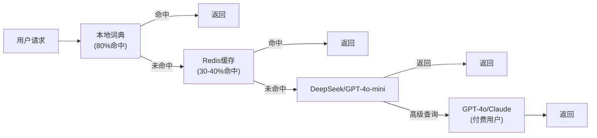

# Readmigo 投资分析报告

**报告日期**: 2026年1月24日
**产品版本**: v1.0.0 (2024年12月21日发布)
**编制方**: 产品技术尽调团队

---

## 一、执行摘要

### 1.1 产品定位

Readmigo 是一款 **AI 原生英语阅读学习平台**，核心理念为"Read any book. AI has your back."——让用户阅读原版英文书籍，AI 提供智能学习辅助，消除语言障碍。

### 1.2 投资亮点

| 亮点 | 说明 |
|-----|------|
| 差异化定位 | 唯一将"真实阅读"与"AI 辅助学习"深度融合的产品 |
| 成本优势 | 多层 AI 架构，单用户 AI 成本仅 $0.08-0.11/月 |
| 技术壁垒 | 原生多端应用 + 智能 AI 路由 + 间隔重复算法 |
| 市场时机 | AI 语言学习赛道融资热度高，Speak 已达独角兽估值 |
| 增长潜力 | 语言学习市场 CAGR 16.15%，2033年达 243.9 亿美元 |

### 1.3 核心数据

---

## 二、产品分析

### 2.1 核心功能矩阵

| 功能层 | 功能列表 | 竞争力 |
|-------|---------|--------|
| **阅读基础** | EPUB 阅读器、主题切换、进度同步、离线下载 | ★★★ |
| **AI 辅助** | 单词解释、句子简化、段落翻译、上下文问答 | ★★★★★ |
| **词汇学习** | 自动收词、SM-2 间隔重复、多种练习模式、导出 Anki | ★★★★ |
| **社交互动** | 名句收藏、明信片分享、作者对话、人物关系图 | ★★★ |
| **游戏化** | 勋章系统、年度报告、阅读统计 | ★★★ |

### 2.2 技术架构优势

**成本控制亮点**:
- 本地词典处理 80% 常规查询，零成本
- Redis 缓存 7 天 TTL，摊薄 AI 调用
- 多 AI 提供商智能路由，自动降级
- 日成本监控告警 ($50/小时, $500/天)

### 2.3 商业模式

| 套餐 | 月费 | 年费 | 核心权益 |
|-----|------|------|---------|
| **Free** | - | - | 10 本书、5 次 AI/天、50 词上限 |
| **Pro** | $7.99 | $49.99 | 50 本书、100 次 AI/天、1000 词、离线阅读 |
| **Premium** | $12.99 | $79.99 | 无限制、GPT-4、语音聊天 |

**转化策略**:
- 7 天免费试用（需绑定支付方式）
- 年付节省 48%，主推年订阅
- 功能门控清晰，免费用户体验核心功能后付费意愿强

---

## 三、市场分析

### 3.1 市场规模

| 市场层级 | 2024年规模 | 2033年预测 | CAGR |
|---------|-----------|-----------|------|
| 语言学习应用全球市场 | $63.4亿 | $243.9亿 | 16.15% |
| 教育应用全球市场 | $62亿 | $416亿 | 21.5% |
| AI 教育市场 | $100亿+ | $1123亿 | 32%+ |
| 中国英语学习市场 | ¥300亿+ | ¥600亿+ | 15%+ |

### 3.2 增长驱动因素

### 3.3 目标用户画像

| 特征 | 描述 |
|-----|------|
| **地理** | 中国（首发）→ 全球英语学习者 |
| **年龄** | 18-45 岁成人学习者 |
| **英语水平** | 初级到高级 (A1-C2) |
| **学习动机** | 职业发展、考试备考、文化兴趣 |
| **付费意愿** | $5-10/月（中等付费能力） |
| **设备偏好** | iOS > Android > Web |

---

## 四、竞争格局

### 4.1 竞品对比矩阵

| 维度 | Readmigo | Duolingo | LingQ | Kindle |
|-----|----------|----------|-------|--------|
| **核心模式** | AI 阅读助手 | 游戏化练习 | 内容库阅读 | 纯阅读 |
| **真实阅读** | ✅ 原版书籍 | ❌ 虚构内容 | ✅ 文章视频 | ✅ 原版书籍 |
| **AI 辅助** | ✅ 多层智能 | ⚠️ 有限 | ⚠️ 基础 | ❌ 无 |
| **词汇系统** | ✅ SM-2 算法 | ✅ 游戏化 | ✅ 基础 | ⚠️ 词典 |
| **用户体验** | ✅ 原生应用 | ✅ 优秀 | ⚠️ 老旧 | ✅ 优秀 |
| **定价** | $49.99/年 | $83.99/年 | $71.88/年 | 按书购买 |

### 4.2 竞争优势

**核心差异化**:
1. **唯一 AI 原生阅读器** - 不是阅读器 + AI 功能，而是 AI 学习引擎 + 阅读外壳
2. **成本领先** - 多层架构使 AI 成本比竞品低 5-10 倍
3. **学习闭环** - 阅读 → 查词 → 复习 → 掌握，完整学习路径

### 4.3 竞品财务参考

| 公司 | 2024年收入 | 估值 | 用户规模 |
|-----|-----------|------|---------|
| Duolingo | $7.48亿 | $120亿+ | 1亿+ MAU |
| Babbel | $2亿+ | $10亿+ | 1000万+ |
| LingQ | 未公开 | 未公开 | 100万+ |
| Speak | 未公开 | $10亿 (独角兽) | 未公开 |

---

## 五、财务模型

### 5.1 收入预测模型

**假设条件**:
- 年用户增长率: 100% (Y1-Y3), 50% (Y4-Y5)
- 付费转化率: 5% (Y1) → 8% (Y5)
- ARPU: $45/年 (考虑月付、年付混合)
- 流失率: 30%/年

| 年份 | 注册用户 | 付费用户 | ARR |
|-----|---------|---------|-----|
| Y1 | 50,000 | 2,500 | $112,500 |
| Y2 | 100,000 | 6,000 | $270,000 |
| Y3 | 200,000 | 14,000 | $630,000 |
| Y4 | 300,000 | 21,000 | $945,000 |
| Y5 | 450,000 | 36,000 | $1,620,000 |

### 5.2 成本结构

| 成本项 | 占比 | 说明 |
|-------|-----|------|
| AI 服务 | 8-12% | 多层架构优化 |
| 服务器 | 5-8% | Fly.io + Vercel + R2 |
| 支付手续费 | 15-30% | Apple 15-30%, Stripe 3% |
| 内容运营 | 5% | 公版书无版权成本 |
| **毛利率** | **45-67%** | 取决于渠道组合 |

### 5.3 单位经济模型

---

## 六、风险评估

### 6.1 风险矩阵

| 风险类型 | 风险描述 | 影响 | 概率 | 应对策略 |
|---------|---------|------|-----|---------|
| **竞争风险** | Duolingo 推出阅读功能 | 高 | 中 | 深耕垂直场景，建立用户粘性 |
| **技术风险** | AI 成本上涨 | 中 | 低 | 多提供商策略，本地词典兜底 |
| **监管风险** | 中国 App Store 政策 | 高 | 中 | 多市场布局，海外优先 |
| **版权风险** | 公版书籍争议 | 低 | 低 | 严格使用 Project Gutenberg 等合规来源 |
| **增长风险** | 获客成本上升 | 中 | 中 | 内容营销 + 口碑传播 |

### 6.2 关键假设与敏感性

| 假设 | 基准值 | 乐观 | 悲观 |
|-----|-------|------|------|
| 付费转化率 | 5% | 8% | 3% |
| 年留存率 | 70% | 80% | 60% |
| ARPU | $45 | $55 | $35 |
| Y5 ARR 影响 | $1.62M | $3.2M | $0.8M |

---

## 七、投资建议

### 7.1 投资亮点总结

### 7.2 估值参考

| 估值方法 | 参考公司 | 倍数 | Readmigo 估值范围 |
|---------|---------|------|------------------|
| **收入倍数** | EdTech SaaS | 8-15x ARR | $1.3M-$24M (Y5) |
| **用户倍数** | 语言学习 App | $50-100/用户 | $2.5M-$45M (Y5) |
| **可比交易** | Speak (独角兽) | 早期溢价 | 取决于增长曲线 |

### 7.3 退出路径

| 路径 | 时间框架 | 潜在买家 |
|-----|---------|---------|
| **战略收购** | 3-5年 | Duolingo、ByteDance、腾讯、Pearson |
| **财务并购** | 5-7年 | PE 基金教育科技组合 |
| **IPO** | 7-10年 | 需达到 $50M+ ARR |

### 7.4 投资建议

| 阶段 | 建议融资额 | 用途 |
|-----|-----------|------|
| **种子轮** | $500K-$1M | 产品打磨、核心团队扩充、冷启动 |
| **Pre-A** | $2M-$5M | 市场验证、增长实验、内容扩展 |
| **A 轮** | $10M-$20M | 规模化增长、国际化扩展 |

---

## 八、附录

### 数据来源

- [Business of Apps - Language Learning Revenue Statistics](https://www.businessofapps.com/data/language-learning-app-market/)
- [Market.us - Language Learning App Market](https://market.us/report/language-learning-app-market/)
- [Straits Research - Language Learning Apps Market](https://straitsresearch.com/report/language-learning-apps-market)
- [Statista - Top Language Learning Apps by Revenue 2024](https://www.statista.com/statistics/1239610/top-language-learning-apps-by-revenue/)
- [IMARC Group - Education Apps Market](https://www.imarcgroup.com/education-apps-market)
- [Precedence Research - AI in Education Market](https://www.precedenceresearch.com/ai-in-education-market)
- [Medium - EdTech Funding Recovery 2024](https://medium.com/e-d-volution/edtech-the-future-of-work-in-2024-funding-recovers-ai-wins-2-2-trends-and-what-to-expect-1173529a84b4)
- [Market Growth Reports - Language Learning Market](https://www.marketgrowthreports.com/market-reports/language-learning-market-114898)
- [中华网 - 2025年儿童阅读APP市场分析](https://mtz.china.com/touzi/2025/1201/205703.html)

---

**报告声明**: 本报告基于公开市场数据和产品技术分析编制，不构成投资建议。投资决策请结合尽调团队实地访谈和财务审计结果。
