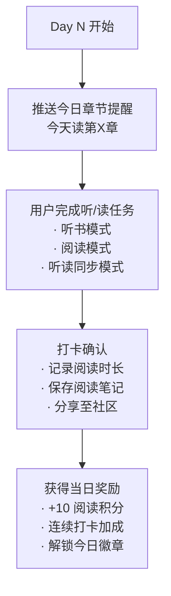

# Readmigo 运营活动设计文档

## Executive Summary

本文档定义了 Readmigo 的四类核心运营活动设计方案，旨在通过游戏化机制提升用户活跃度、留存率和付费转化。

**活动类型概览:**

| 活动类型 | 代表活动 | 核心目标 | 周期 |
|----------|----------|----------|------|
| 听读挑战 | "30天听完一本经典" | 养成习惯 | 30天 |
| 作者专题 | "狄更斯月"、"奥斯汀周" | 深度学习 | 7-30天 |
| 榜单打卡 | "挑战BBC百大英国小说" | 长期目标 | 长期 |
| 节日特辑 | 圣诞季《圣诞颂歌》 | 时效互动 | 1-2周 |

---

## 1. 听读挑战 / Reading Challenge

### 1.1 活动概述

### 1.2 活动书籍推荐

| 难度 | 推荐书籍 | 总时长 | 日均时长 |
|------|----------|--------|----------|
| **入门** | A Christmas Carol 圣诞颂歌 | 3小时 | 6分钟 |
| **入门** | The Call of the Wild 野性的呼唤 | 4小时 | 8分钟 |
| **初级** | The Great Gatsby 了不起的盖茨比 | 5小时 | 10分钟 |
| **初级** | Animal Farm 动物庄园 | 3.5小时 | 7分钟 |
| **中级** | Pride and Prejudice 傲慢与偏见 | 11小时 | 22分钟 |
| **中级** | Jane Eyre 简·爱 | 18小时 | 36分钟 |
| **高级** | Moby Dick 白鲸 | 24小时 | 48分钟 |
| **高级** | Great Expectations 远大前程 | 18小时 | 36分钟 |

### 1.3 活动规则

### 1.4 打卡规则

| 规则项 | 说明 |
|--------|------|
| **每日任务量** | 自动根据书籍总时长/30天计算 |
| **完成判定** | 听/读完当日分配章节的80%以上 |
| **补卡机制** | 允许补前一天的任务（仅限1天） |
| **连续打卡** | 连续7天+10%积分，14天+20%，21天+30% |
| **中断恢复** | 中断超过3天，挑战失败需重新开始 |

### 1.5 奖励体系

### 1.6 UI 设计要点

| 页面 | 核心元素 |
|------|----------|
| **挑战首页** | 书籍卡片、难度标签、参与人数、预计日均时长 |
| **进行中页** | 环形进度条、今日任务、连续天数火焰图标 |
| **打卡页** | 大按钮打卡、阅读时长统计、笔记输入框 |
| **日历视图** | 月历打卡记录、已完成/未完成/今日状态 |
| **完成页** | 成就展示、证书生成、社交分享按钮 |

### 1.7 运营数据指标

| 指标 | 目标值 | 说明 |
|------|--------|------|
| **参与率** | 15%+ | 月活用户中参与挑战的比例 |
| **完成率** | 40%+ | 开始挑战后完成的用户比例 |
| **7日留存** | 60%+ | 参与挑战用户的7日留存 |
| **30日留存** | 45%+ | 参与挑战用户的30日留存 |
| **付费转化** | 8%+ | 挑战用户转化为付费用户 |

---

## 2. 作者专题 / Author Feature

### 2.1 活动概述

### 2.2 推荐作者专题

#### 作者周 (7天) 推荐

| 作者 | 主题 | 推荐作品 | 总时长 |
|------|------|----------|--------|
| **简·奥斯汀** | "奥斯汀周" | Persuasion 劝导 | 8小时 |
| **奥斯卡·王尔德** | "王尔德周" | The Picture of Dorian Gray | 7小时 |
| **杰克·伦敦** | "伦敦周" | The Call of the Wild + White Fang | 8小时 |
| **凯特·肖邦** | "肖邦周" | The Awakening 觉醒 | 5小时 |
| **H.G.威尔斯** | "科幻周" | The Time Machine + The Invisible Man | 8小时 |

#### 作者月 (30天) 推荐

| 作者 | 主题 | 推荐作品 | 总时长 |
|------|------|----------|--------|
| **查尔斯·狄更斯** | "狄更斯月" | A Christmas Carol + Oliver Twist + Great Expectations | 37小时 |
| **简·奥斯汀** | "奥斯汀月" | Pride and Prejudice + Sense and Sensibility + Emma | 38小时 |
| **柯南·道尔** | "福尔摩斯月" | A Study in Scarlet + The Sign of Four + Adventures + Hound | 25小时 |
| **马克·吐温** | "吐温月" | Tom Sawyer + Huckleberry Finn + A Connecticut Yankee | 30小时 |
| **勃朗特姐妹** | "勃朗特月" | Jane Eyre + Wuthering Heights + Agnes Grey | 35小时 |

### 2.3 专题内容结构

### 2.4 背景知识卡片

| 卡片类型 | 内容示例 (狄更斯专题) |
|----------|------------------------|
| **时代背景** | 维多利亚时代的英国社会、工业革命影响 |
| **写作风格** | 社会批判、幽默讽刺、人物刻画技巧 |
| **人物原型** | 作品中人物的现实原型和创作灵感 |
| **历史事件** | 作品涉及的真实历史事件 |
| **文学影响** | 对后世文学的影响、改编作品 |
| **词汇解析** | 时代特有词汇、俚语解释 |

### 2.5 奖励体系

### 2.6 运营节奏

| 周期 | 活动安排 |
|------|----------|
| **每月** | 1个作者月专题 |
| **每周** | 1-2个作者周专题 (与作者月并行) |
| **特殊日期** | 作者诞辰/忌日特别专题 |

#### 年度专题日历示例

| 月份 | 作者月 | 特殊日期 |
|------|--------|----------|
| 1月 | 爱伦·坡月 | 1/19 坡诞辰 |
| 2月 | 狄更斯月 | 2/7 狄更斯诞辰 |
| 3月 | 勃朗特月 | - |
| 4月 | 莎士比亚月 | 4/23 莎士比亚诞辰 |
| 5月 | 柯南·道尔月 | 5/22 道尔诞辰 |
| 6月 | 托马斯·哈代月 | 6/2 哈代诞辰 |
| 7月 | 简·奥斯汀月 | 7/18 奥斯汀忌日 |
| 8月 | H.G.威尔斯月 | - |
| 9月 | 马克·吐温月 | - |
| 10月 | 奥斯卡·王尔德月 | 10/16 王尔德诞辰 |
| 11月 | 陀思妥耶夫斯基月 | 11/11 陀氏诞辰 |
| 12月 | 狄更斯月(圣诞) | 圣诞节特辑 |

---

## 3. 榜单打卡 / Booklist Challenge

### 3.1 活动概述

### 3.2 支持榜单

| 榜单名称 | 书籍总数 | SE可用 | 难度 |
|----------|----------|--------|------|
| **BBC 100 Greatest British Novels** | 100 | ~60 | ⭐⭐⭐ |
| **Modern Library 100 Best Novels** | 100 | ~60 | ⭐⭐⭐⭐ |
| **Guardian 100 Best Novels** | 100 | ~55 | ⭐⭐⭐⭐ |
| **Newbery Medal Winners** | 100+ | ~40 | ⭐⭐ |
| **Pulitzer Prize Fiction** | 100+ | ~30 | ⭐⭐⭐⭐⭐ |

### 3.3 榜单进度系统

### 3.4 榜单打卡规则

| 规则项 | 说明 |
|--------|------|
| **完成判定** | 阅读/听完整本书籍 (进度100%) |
| **时间限制** | 无，用户自由安排节奏 |
| **书籍解锁** | 按难度分阶段解锁，或Pro用户全部解锁 |
| **同时挑战** | 可同时参与多个榜单挑战 |
| **重复计算** | 同一本书在多个榜单中重复出现，完成一次即在所有榜单计入 |

### 3.5 里程碑奖励

### 3.6 社区排行榜

| 排行榜类型 | 排序依据 | 更新频率 |
|------------|----------|----------|
| **总进度榜** | 所有榜单完成书籍总数 | 实时 |
| **单榜排行** | 特定榜单完成数量 | 实时 |
| **月度进步榜** | 本月完成书籍数量 | 每月重置 |
| **速度榜** | 完成榜单用时最短 | 完成时记录 |

### 3.7 UI 设计要点

| 页面 | 核心元素 |
|------|----------|
| **榜单选择页** | 榜单卡片、进度预览、参与人数、平均完成时间 |
| **榜单详情页** | 书籍网格/列表、已读标记、难度标签、筛选排序 |
| **进度总览页** | 多榜单进度对比、可视化图表、推荐下一本 |
| **排行榜页** | 头像+用户名+进度、自己的排名高亮 |
| **成就展示页** | 已获得徽章、待解锁徽章、进度百分比 |

---

## 4. 节日特辑 / Holiday Special

### 4.1 活动概述

### 4.2 年度节日活动日历

| 节日 | 时间 | 活动周期 | 推荐作品 |
|------|------|----------|----------|
| **新年** | 1/1 | 12/26-1/1 (7天) | New Year's Eve (短篇合集) |
| **情人节** | 2/14 | 2/7-2/14 (7天) | Pride and Prejudice, Romeo and Juliet |
| **复活节** | 4月 | 复活节前2周 | Paradise Lost, The Pilgrim's Progress |
| **万圣节** | 10/31 | 10/17-10/31 (14天) | Dracula, Frankenstein, The Raven |
| **感恩节** | 11月 | 感恩节周 | Little Women, O. Henry短篇 |
| **圣诞节** | 12/25 | 12/1-12/25 (25天) | A Christmas Carol, Gift of the Magi |

### 4.3 圣诞特辑详细设计 (示例)

### 4.4 万圣节特辑详细设计 (示例)

### 4.5 节日活动运营要点

| 要点 | 说明 |
|------|------|
| **预热** | 活动开始前3-5天推送预告，介绍活动内容 |
| **限时** | 强调限定奖励的稀缺性，错过不再有 |
| **简单** | 节日活动难度偏低，鼓励更多人参与 |
| **社交** | 引导用户分享节日阅读到社交媒体 |
| **彩蛋** | 隐藏小彩蛋增加趣味性 |

### 4.6 节日特辑奖励体系

---

## 5. 技术实现概要

### 5.1 数据模型

### 5.2 API 端点规划

| 端点 | 方法 | 说明 |
|------|------|------|
| `/campaigns` | GET | 获取活动列表 (可筛选类型/状态) |
| `/campaigns/:id` | GET | 获取活动详情 |
| `/campaigns/:id/join` | POST | 参加活动 |
| `/campaigns/:id/progress` | GET | 获取用户活动进度 |
| `/campaigns/:id/checkin` | POST | 每日打卡 |
| `/users/me/campaigns` | GET | 用户参与的活动列表 |
| `/users/me/rewards` | GET | 用户获得的奖励列表 |
| `/leaderboards/:campaignId` | GET | 活动排行榜 |

### 5.3 推送通知策略

| 通知类型 | 触发时机 | 内容示例 |
|----------|----------|----------|
| **活动预告** | 活动开始前3天 | "圣诞特辑即将开始，准备好与狄更斯共度圣诞了吗？" |
| **活动开始** | 活动开始当天 | "🎄 圣诞特辑正式开启！今天开始阅读《圣诞颂歌》" |
| **每日提醒** | 每天固定时间 | "今天的阅读任务还没完成哦，还差10分钟就能打卡了" |
| **连续打卡** | 7/14/21天时 | "🔥 连续打卡7天！你已获得'坚持者'徽章" |
| **即将断签** | 当天22:00未打卡 | "⚠️ 今天还没打卡，再过2小时就要断签了！" |
| **活动结束** | 活动最后一天 | "🏁 活动明天结束，抓紧完成最后的挑战！" |
| **完成祝贺** | 完成活动时 | "🎉 恭喜完成30天挑战！查看你获得的专属奖励" |

---

## 6. 运营指标与目标

### 6.1 核心KPI

| 指标 | 定义 | 目标值 |
|------|------|--------|
| **活动参与率** | 月活用户参与任意活动的比例 | 25%+ |
| **活动完成率** | 开始活动后完成的用户比例 | 35%+ |
| **活动留存提升** | 活动用户vs非活动用户30日留存差 | +15% |
| **活动付费转化** | 活动用户转化为付费用户比例 | 10%+ |
| **社交分享率** | 完成活动后分享到社交媒体比例 | 20%+ |

### 6.2 各活动类型目标

| 活动类型 | 参与率目标 | 完成率目标 | 主要价值 |
|----------|------------|------------|----------|
| 听读挑战 | 15% | 40% | 养成习惯，提升留存 |
| 作者专题 | 10% | 50% | 深度学习，提升满意度 |
| 榜单打卡 | 20% | 10% (长期) | 长期目标，提升LTV |
| 节日特辑 | 30% | 60% | 短期活跃，社交传播 |

---

## 7. 上线计划

### 7.1 阶段规划

| 阶段 | 内容 | 时间 |
|------|------|------|
| **Phase 1** | 听读挑战基础版 (5本书) | - |
| **Phase 2** | 作者专题 + 榜单打卡 | - |
| **Phase 3** | 节日特辑 + 社区排行 | - |
| **Phase 4** | 完整奖励体系 + 商城 | - |

### 7.2 MVP 功能清单

| 功能 | Phase 1 | Phase 2 | Phase 3 |
|------|---------|---------|---------|
| 活动列表展示 | ✅ | ✅ | ✅ |
| 参与活动 | ✅ | ✅ | ✅ |
| 每日打卡 | ✅ | ✅ | ✅ |
| 进度追踪 | ✅ | ✅ | ✅ |
| 基础徽章 | ✅ | ✅ | ✅ |
| 作者专题 | - | ✅ | ✅ |
| 榜单挑战 | - | ✅ | ✅ |
| 节日限定 | - | - | ✅ |
| 社区排行 | - | - | ✅ |
| 社交分享 | - | - | ✅ |

---

## 参考资源

| 资源 | 说明 |
|------|------|
| [LibriVox 有声书匹配分析](../06-content/sources/librivox/audiobook-matching-analysis.md) | 有声书资源分析 |
| [Standard Ebooks 内容分析](../06-content/sources/standard-ebooks/content-value-analysis.md) | 电子书资源分析 |
| [订阅系统设计](../01-product/subscription-design.md) | 会员体系参考 |
| [产品演进策略](../01-product/product-evolution-strategy.md) | 整体产品规划 |

---

*文档创建日期: 2025-12-30*
*状态: 初稿完成*
