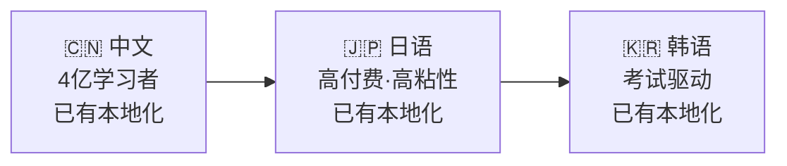
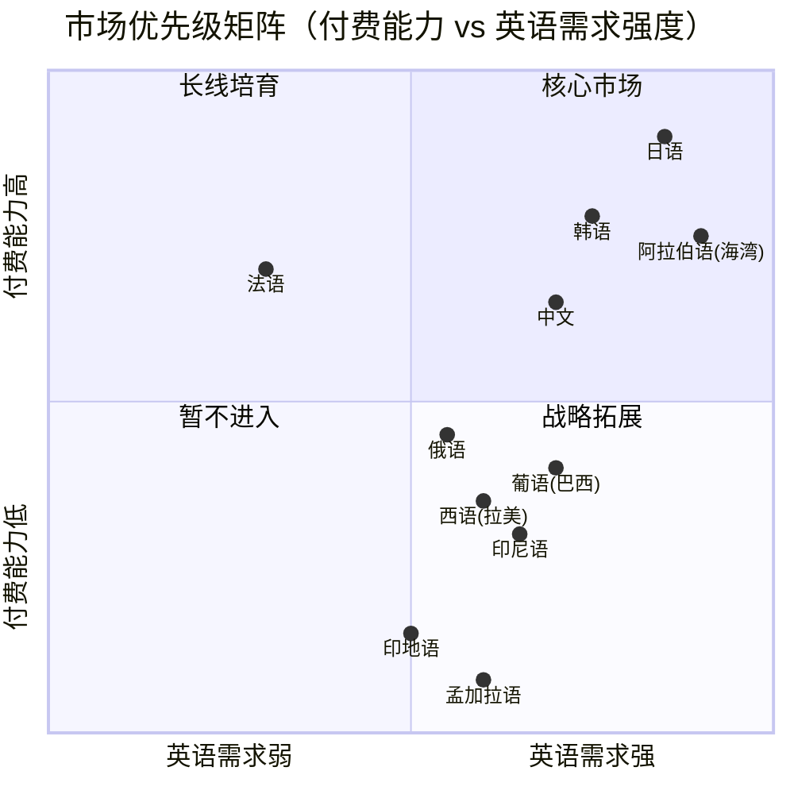

# 全球 Top 10 语言英语学习市场分析

> 视角：产品出海 / 英语学习 App
> 更新日期：2025-02

---

## 一、Top 10 语言总览

按全球总使用人数排序，筛选「重视英语学习」的语言市场：

| 排名 | 语言 | 总使用者 | 母语者 | 主要国家 | EF EPI 评级 | 英语学习者规模 |
|:---:|------|---------|--------|----------|:-----------:|--------------|
| 1 | 英语 | 15.3 亿 | 3.8 亿 | 美/英/澳 | — (母语) | — |
| 2 | 中文（普通话） | 11.8 亿 | 9.4 亿 | 中国大陆/台湾 | 低 (464) | 4 亿+ |
| 3 | 印地语 | 6.1 亿 | 3.4 亿 | 印度 | 中等 (510) | 3 亿+ |
| 4 | 西班牙语 | 5.6 亿 | 4.9 亿 | 拉美/西班牙 | 低-中等 | 1.5 亿+ |
| 5 | 阿拉伯语 | 3.4 亿 | 3.1 亿 | 中东/北非 | 极低 (400-430) | 8000 万+ |
| 6 | 法语 | 3.1 亿 | 0.8 亿 | 法国/非洲法语区 | 高 (法国 560+) | 1 亿+ |
| 7 | 孟加拉语 | 2.8 亿 | 2.3 亿 | 孟加拉国/印度 | 低 (450-480) | 5000 万+ |
| 8 | 葡萄牙语 | 2.7 亿 | 2.3 亿 | 巴西/葡萄牙 | 低 (482) | 7000 万+ |
| 9 | 俄语 | 2.6 亿 | 1.5 亿 | 俄罗斯/独联体 | 中等 (532) | 5000 万+ |
| 10 | 日语 | 1.3 亿 | 1.2 亿 | 日本 | 极低 (446) | 1600 万+ |
| — | 韩语 | 0.8 亿 | 0.8 亿 | 韩国 | 低-中等 (523) | 2000 万+ |
| — | 印尼语 | 2.5 亿 | 0.4 亿 | 印度尼西亚 | 低 (480) | 3000 万+ |

> EF EPI 分数：满分 800。极低 <450 / 低 450-500 / 中等 500-550 / 高 550-600 / 极高 600+
>
> 韩语、印尼语虽不在 Top 10 但对 Readmigo 出海极具价值，一并列入分析

---

## 二、各语言市场：英语学习 App 出海视角

### 2.1 中文（普通话）— 最大单一市场

| 维度 | 分析 |
|------|------|
| **市场规模** | 4 亿英语学习者，App 市场 ~$188M（2025），占亚太 23.9% |
| **学习动机** | 升学刚需（中高考）> 职业晋升（外企/互联网）> 留学备考 > 个人兴趣 |
| **付费意愿** | 中高。教育消费观念强，家长为子女付费意愿尤高 |
| **竞品格局** | 极度激烈。流利说、百词斩、扇贝、有道、Duolingo 均深耕 |
| **App 偏好** | 偏好游戏化 + 考试导向；对 AI 互动接受度高 |
| **Readmigo 机会** | "读英文原著学英语"差异化明显；中文用户对「有声书+阅读」需求验证充分 |
| **进入壁垒** | 需 ICP 备案/版号；支付需对接微信/支付宝；ASO 竞争激烈 |

### 2.2 日语 — 高付费、高粘性

| 维度 | 分析 |
|------|------|
| **市场规模** | 1600 万+学习者，App 市场 ~$146M（2025），占亚太 18.6% |
| **学习动机** | 升学考试（TOEIC/TOEFL）> 职业晋升（外资企业文化）> 自我提升 |
| **付费意愿** | 极高。日本用户 ARPU 全球领先，订阅付费习惯成熟 |
| **竞品格局** | Duolingo 强势（连续2年日本用户学习时长全球第一）；ELSA 积极扩张；本土有 スタディサプリ |
| **App 偏好** | 重视 UI 精致度和用户体验；偏好循序渐进的结构化学习 |
| **Readmigo 机会** | 日本人热爱阅读（年人均读书量高）；英语水平极低 → 辅助阅读工具需求强烈 |
| **进入壁垒** | 本地化质量要求极高；客服需日语；Apple App Store 日本区审核严格 |

### 2.3 韩语 — 考试驱动、快速增长

| 维度 | 分析 |
|------|------|
| **市场规模** | 2000 万+学习者，App 市场 ~$34M（2025），占亚太 4.4% |
| **学习动机** | 升学/就业刚需（TOEIC 成绩决定求职）> 留学 > K-pop 文化输出带动的双向学习 |
| **付费意愿** | 高。教育投资占家庭支出比例全球最高之一 |
| **竞品格局** | Duolingo 增长快；本土有 Cake、Speak（AI口语）；ELSA 已入场 |
| **App 偏好** | 偏好短视频/短内容形式；社交分享动机强 |
| **Readmigo 机会** | 韩国英语水平中低 → 阅读辅助需求大；本地「英文原著阅读」App 空白 |
| **进入壁垒** | 本地化必须到位（韩语）；需对接 Kakao Pay/Naver Pay |

### 2.4 印尼语 — 新兴蓝海、人口红利

| 维度 | 分析 |
|------|------|
| **市场规模** | 3000 万+学习者，Duolingo 下载量亚太第一（2024 H1 350 万+） |
| **学习动机** | 职业晋升（跨国企业/旅游业）> 留学 > 社交媒体/娱乐消费 |
| **付费意愿** | 低-中。人均 GDP 低，但年轻人口比例极高，移动互联网渗透率快速提升 |
| **竞品格局** | Duolingo 主导；ELSA 占 15% 客户份额；本土竞品弱 |
| **App 偏好** | 移动优先；对免费+广告模式接受度高；偏好短时碎片化学习 |
| **Readmigo 机会** | 竞品少、增长快；2.7 亿人口中位年龄 29 岁 → 长期用户池 |
| **进入壁垒** | 定价需适配低购买力；需印尼语本地化；网络基础设施不均 |

### 2.5 西班牙语 — 拉美广域市场

| 维度 | 分析 |
|------|------|
| **市场规模** | 1.5 亿+学习者，拉美 App 市场 ~$166M（2025），巴西+拉美西语区合计潜力巨大 |
| **学习动机** | 职业（北美就业/外贸）> 移民（美国西语裔社区）> 留学 > 旅游 |
| **付费意愿** | 中。巴西私人语言学校注册量 10 年增长 30%，但人均支付能力低于亚洲发达市场 |
| **竞品格局** | Duolingo 大本营（总部语言）；Open English 拉美领先；Platzi 提供免费英语课 |
| **App 偏好** | 社交驱动；视频内容偏好强；WhatsApp 生态重要 |
| **Readmigo 机会** | 拉美英语水平普遍低 → 阅读辅助需求强；西语本地化可覆盖 20+ 国家 |
| **进入壁垒** | 西语变体多（墨西哥/阿根廷/哥伦比亚）；汇率波动大；支付碎片化 |

### 2.6 葡萄牙语 — 巴西单一大市场

| 维度 | 分析 |
|------|------|
| **市场规模** | 7000 万+学习者，巴西占拉美 App 市场 41.2%（~$68M） |
| **学习动机** | 职业晋升（跨国公司/科技业）> 移民 > 学术研究 > 娱乐 |
| **付费意愿** | 中。巴西 GDP 总量大但人均中等；私人教育支出增长稳定 |
| **竞品格局** | Duolingo 渗透率极高；Busuu 有一定份额；本土有 Kultivi（免费模式） |
| **App 偏好** | 移动优先；Instagram/TikTok 营销效果好；游戏化留存高 |
| **Readmigo 机会** | 巴西英语水平低 (EF EPI 482) → 辅助阅读需求明确 |
| **进入壁垒** | 仅需葡语（巴西）本地化即可覆盖 2.1 亿人口；需对接 Pix 支付 |

### 2.7 印地语 — 超大规模但复杂

| 维度 | 分析 |
|------|------|
| **市场规模** | 3 亿+学习者，印度占亚太 App 市场 15.7%（~$123M） |
| **学习动机** | 职业刚需（IT/BPO/服务业）> 社会阶层流动 > 高等教育（英语授课）> 政府考试 |
| **付费意愿** | 低。价格极度敏感，但用户基数补偿客单价；$1-3/月为主流价格带 |
| **竞品格局** | Duolingo 增长迅猛；ELSA 有市场；本土有 Cuemath、Unacademy（泛教育）|
| **App 偏好** | 极度移动优先；对免费模式依赖度高；短视频教学受欢迎 |
| **Readmigo 机会** | 英语虽是官方语言但多数人水平有限 → 阅读辅助有需求 |
| **进入壁垒** | 极端价格竞争；语言碎片化（印地语+地方语言）；低端设备适配 |

### 2.8 阿拉伯语 — 高支付力但文化适配要求高

| 维度 | 分析 |
|------|------|
| **市场规模** | 8000 万+学习者，中东 App 市场占全球 ~5%；海湾国家人均支付力强 |
| **学习动机** | 职业（石油/金融/旅游业通用语）> 留学（英美高校）> 社交媒体消费 |
| **付费意愿** | 两极分化。海湾六国（沙特/阿联酋）付费意愿极高；北非国家较低 |
| **竞品格局** | Duolingo 渗透率中等；Noon Academy（沙特本土）；竞品密度低 |
| **App 偏好** | RTL（从右到左）排版需求；伊斯兰文化适配；偏好语音互动 |
| **Readmigo 机会** | 英语水平极低 (EF EPI 400-430) → 阅读辅助需求极强；竞品空白大 |
| **进入壁垒** | RTL 界面适配成本高；内容审核（宗教/文化敏感）；阿拉伯语本地化复杂 |

### 2.9 俄语 — 中等市场、地缘风险

| 维度 | 分析 |
|------|------|
| **市场规模** | 5000 万+学习者，Duolingo 数据显示俄语用户学习认真度全球 Top 4 |
| **学习动机** | 职业（国际贸易/IT 外包）> 移民 > 学术 > 文化兴趣 |
| **付费意愿** | 中。经济制裁影响支付通道；独联体国家（哈萨克/乌兹别克）增长潜力大 |
| **竞品格局** | Duolingo/Skyeng/Puzzle English（本土）；Skyeng 为俄语区头部在线英语平台 |
| **App 偏好** | PC 和移动并重；偏好有真人教师参与的混合模式 |
| **Readmigo 机会** | 俄语用户阅读习惯好（文学传统深厚）→ 读书学英语模式契合 |
| **进入壁垒** | 支付制裁限制（Apple Pay/Google Pay 受限）；地缘政治风险；需俄语本地化 |

### 2.10 法语 — 双重身份市场

| 维度 | 分析 |
|------|------|
| **市场规模** | 1 亿+学习者，法国本土英语水平中高 (560+)，但非洲法语区需求强烈 |
| **学习动机** | 法国：职业国际化 > 旅游；非洲法语区：经济机会 > 学术 > 移民 |
| **付费意愿** | 法国/比利时高；非洲法语区极低 |
| **竞品格局** | Duolingo 强势；Babbel 在欧洲有优势；非洲市场竞品少 |
| **App 偏好** | 欧洲用户重隐私和品质；非洲用户偏好离线功能和低带宽适配 |
| **Readmigo 机会** | 法国用户已有较高英语水平 → 直接读原著的接受度高 |
| **进入壁垒** | 法语区分法国法语/非洲法语；欧洲 GDPR 合规；非洲支付基础设施弱 |

### 2.11 孟加拉语 — 长期潜力但当前优先级低

| 维度 | 分析 |
|------|------|
| **市场规模** | 5000 万+学习者（孟加拉国 + 印度西孟加拉邦） |
| **学习动机** | 海外就业（中东/东南亚劳务）> 服装出口业 > 高等教育 |
| **付费意愿** | 极低。孟加拉国人均 GDP ~$2,800；移动支付以 bKash 为主 |
| **竞品格局** | 竞品极少，市场空白但商业化困难 |
| **App 偏好** | 极低端设备（Android Go）；2G/3G 网络为主 |
| **Readmigo 机会** | 长期人口红利（1.7 亿人口，中位年龄 27 岁） |
| **进入壁垒** | 极端低端设备适配；网络条件差；盈利模型难以成立 |

---

## 三、英语学习转化率 & 使用动机矩阵

### 3.1 学习动机分布

| 语言市场 | 升学考试 | 职业晋升 | 留学移民 | 文化消费 | 主驱动力 |
|---------|:-------:|:-------:|:-------:|:-------:|---------|
| 中文 | ★★★★★ | ★★★★ | ★★★★ | ★★ | 升学刚需 |
| 日语 | ★★★★★ | ★★★★★ | ★★★ | ★★ | 考试+职业 |
| 韩语 | ★★★★★ | ★★★★★ | ★★★ | ★★ | TOEIC 就业 |
| 印尼语 | ★★★ | ★★★★ | ★★★ | ★★★ | 职业 |
| 西班牙语 | ★★★ | ★★★★ | ★★★★★ | ★★ | 移民+职业 |
| 葡萄牙语 | ★★★ | ★★★★ | ★★★ | ★★ | 职业 |
| 印地语 | ★★★★ | ★★★★★ | ★★★ | ★★ | 职业刚需 |
| 阿拉伯语 | ★★★ | ★★★★★ | ★★★★ | ★★ | 职业+留学 |
| 俄语 | ★★★ | ★★★★ | ★★★★ | ★★★ | 职业+移民 |
| 法语 | ★★★ | ★★★★ | ★★★ | ★★★★ | 职业+文化 |
| 孟加拉语 | ★★ | ★★★★★ | ★★★★ | ★ | 海外就业 |

### 3.2 付费转化率 & App 市场表现

| 语言市场 | App 市场规模 | 付费意愿 | Duolingo 渗透 | 人均 ARPU | 转化潜力 |
|---------|:-----------:|:-------:|:------------:|:---------:|:-------:|
| 中文 | $188M | 中高 | 高 | $3-8/月 | ★★★★ |
| 日语 | $146M | 极高 | 极高 | $8-15/月 | ★★★★★ |
| 韩语 | $34M | 高 | 高 | $5-10/月 | ★★★★ |
| 印尼语 | 增长中 | 低-中 | 极高 | $1-3/月 | ★★★ |
| 西班牙语（拉美） | $166M+ | 中 | 极高 | $3-6/月 | ★★★ |
| 葡萄牙语（巴西） | $68M | 中 | 极高 | $3-5/月 | ★★★ |
| 印地语 | $123M | 低 | 高 | $1-3/月 | ★★ |
| 阿拉伯语（海湾） | 增长中 | 高 | 中 | $5-12/月 | ★★★★ |
| 俄语 | 中等 | 中 | 高 | $3-6/月 | ★★★ |
| 法语（欧洲） | 中等 | 高 | 高 | $5-10/月 | ★★★ |
| 孟加拉语 | 极小 | 极低 | 低 | <$1/月 | ★ |

### 3.3 Readmigo「读英文原著学英语」模式适配度

| 语言市场 | 阅读文化 | 英语水平缺口 | 辅助阅读需求 | 模式适配度 |
|---------|:-------:|:-----------:|:-----------:|:---------:|
| 日语 | ★★★★★ | ★★★★★ | ★★★★★ | 极高 |
| 中文 | ★★★★ | ★★★★ | ★★★★★ | 极高 |
| 韩语 | ★★★★ | ★★★★ | ★★★★ | 高 |
| 俄语 | ★★★★★ | ★★★ | ★★★★ | 高 |
| 法语（欧洲） | ★★★★★ | ★★ | ★★★ | 中高 |
| 葡萄牙语（巴西） | ★★★ | ★★★★ | ★★★★ | 中高 |
| 阿拉伯语（海湾） | ★★★ | ★★★★★ | ★★★★ | 中高 |
| 西班牙语（拉美） | ★★★ | ★★★★ | ★★★★ | 中 |
| 印尼语 | ★★ | ★★★★ | ★★★ | 中 |
| 印地语 | ★★★ | ★★★ | ★★★ | 中低 |
| 孟加拉语 | ★★ | ★★★★ | ★★★ | 低 |

---

## 四、市场优先级矩阵

综合评估维度：市场规模 × 付费能力 × 英语需求强度 × 产品适配度 × 进入难度

### Tier 1 — 核心市场（已布局 / 优先进入）

| 市场 | 优先级理由 | 状态 |
|------|----------|------|
| **中文** | 最大单一市场 + Readmigo 主场 + 本地化已完成 | ✅ 已进入 |
| **日语** | ARPU 最高 + 阅读文化强 + 英语水平低（需求强） + 本地化已完成 | ✅ 已进入 |
| **韩语** | 教育投资高 + TOEIC 刚需 + 本地化已完成 | ✅ 已进入 |

### Tier 2 — 战略市场（2026 年拓展）

| 市场 | 优先级理由 | 关键动作 |
|------|----------|---------|
| **印尼语** | 人口红利 + Duolingo 验证市场 + 竞品少 + 进入成本低 | 印尼语本地化 + 低价策略 |
| **葡萄牙语（巴西）** | 单一语言覆盖 2.1 亿人 + 英语水平低 | 巴西葡语本地化 + Pix 支付 |
| **阿拉伯语（海湾）** | 高付费力 + 竞品空白 + 英语需求极强 | RTL 适配 + 阿语本地化 |

### Tier 3 — 观望市场（2027+）

| 市场 | 理由 | 条件 |
|------|------|------|
| **西班牙语（拉美）** | 广域市场但竞争激烈、付费中等 | 等 Tier 2 模式验证后再进入 |
| **俄语** | 阅读文化好但地缘风险、支付受限 | 观望制裁政策变化 |
| **法语** | 欧洲用户英语已较好，非洲付费力弱 | 可作为欧洲扩展附带覆盖 |
| **印地语** | 规模大但极端价格竞争 | 需验证低价模型可行性 |
| **孟加拉语** | 长期潜力但当前不具商业可行性 | 暂不考虑 |

### 优先级总览

---

## 五、关键洞察

| # | 洞察 |
|---|------|
| 1 | **日本是海外第一优先市场**：ARPU 最高 + 阅读文化深厚 + 英语水平全球最低梯队 + Readmigo 本地化已完成 |
| 2 | **考试驱动型市场（中/日/韩）付费转化最稳定**：用户有明确 deadline 和 ROI 预期，续费率高 |
| 3 | **印尼是 Tier 2 性价比最高的市场**：进入成本低、竞品弱、人口年轻、Duolingo 已验证市场教育 |
| 4 | **阿拉伯语海湾市场被严重低估**：英语需求极强 + 付费力高 + 竞品空白，但 RTL 适配是硬门槛 |
| 5 | **「读原著学英语」模式在高阅读文化市场（日/俄/法/中）天然适配**，在低阅读文化市场需要更多产品教育 |
| 6 | **拉美（西语+葡语）可作为一个整体区域进入**，共享相近的学习动机和文化背景 |

---

## 数据来源

- [EF English Proficiency Index 2025](https://www.ef.com/wwen/epi/)
- [Duolingo 2025 Language Report](https://blog.duolingo.com/2025-duolingo-language-report/)
- [Ethnologue / Wikipedia - Languages by total speakers](https://en.wikipedia.org/wiki/List_of_languages_by_total_number_of_speakers)
- [English Learning App Market 2025-2033](https://www.datainsightsmarket.com/reports/english-learning-app-1415837)
- [Preply Global Language Learning Report](https://preply.com/en/blog/global-language-learning-report/)
- [ELSA Speak Company Profile](https://getlatka.com/companies/elsaspeak.com)
- [Pearson English Proficiency & Career Survey 2024](https://monitor.icef.com/2024/03/survey-findings-underscore-the-link-between-english-proficiency-and-career-success/)
