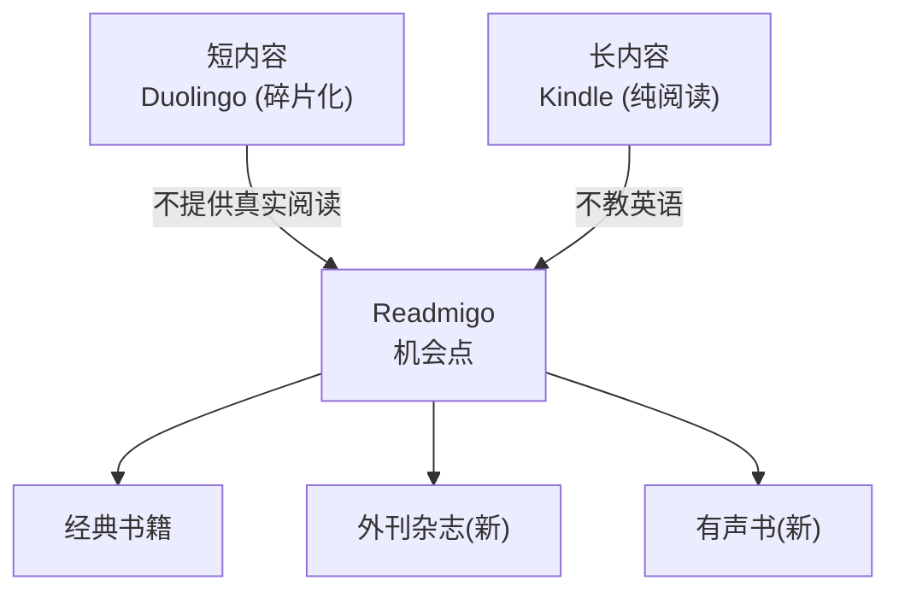

# Readmigo 内容扩展策略分析

> 外刊杂志 & 有声书功能深度评估

---

## 目录

1. [战略背景](#1-战略背景)
2. [外刊杂志板块分析](#2-外刊杂志板块分析)
3. [有声书功能分析](#3-有声书功能分析)
4. [优先级建议](#4-优先级建议)
5. [实施路线图](#5-实施路线图)

---

## 1. 战略背景

### 1.1 市场空白再分析

当前市场格局：



### 1.2 新增用户群体

通过内容扩展可覆盖的新用户群体：

| 新用户群体 | 规模估算 | 核心需求 | 内容偏好 |
|------------|----------|----------|----------|
| **外刊备考者** | 5000 万+ | 托福/雅思/考研阅读 | 经济学人、时代周刊风格文章 |
| **通勤学习者** | 3000 万+ | 碎片时间学习 | 有声内容、短文章 |
| **职场精英** | 2000 万+ | 商业英语、行业资讯 | 商业外刊、TED 风格内容 |
| **听力提升者** | 4000 万+ | 听说能力提升 | 有声书、朗读跟读 |

---

## 2. 外刊杂志板块分析

### 2.1 用户需求验证

#### 目标用户痛点

```
┌─────────────────────────────────────────────────────────────────┐
│                    外刊阅读用户痛点                               │
├─────────────────────────────────────────────────────────────────┤
│                                                                 │
│  备考学生                                                        │
│  ├── "托福阅读文章太难，每篇都要查很多词"                          │
│  ├── "考研英语阅读都是外刊改编，但我不知道去哪里找原文"             │
│  └── "想积累外刊词汇，但自己找文章太麻烦"                          │
│                                                                 │
│  职场人士                                                        │
│  ├── "想读 The Economist 了解商业趋势，但太难了"                   │
│  ├── "订阅了 WSJ 但根本看不完"                                    │
│  └── "想提升商务英语阅读能力，不知道从哪开始"                       │
│                                                                 │
│  英语爱好者                                                       │
│  ├── "想读时事新闻但语言障碍太大"                                  │
│  ├── "书籍太长，想要短一点的阅读材料"                              │
│  └── "想了解国外视角，但看不懂原文"                                │
│                                                                 │
└─────────────────────────────────────────────────────────────────┘
```

#### 市场验证数据

| 指标 | 数据 | 来源 |
|------|------|------|
| 中国考研人数 | 474 万 (2024) | 教育部 |
| 托福/雅思考生 | 300 万+/年 | ETS/BC |
| 外刊类 App 用户 | 500 万+ | 扇贝外刊、流利说等 |
| "外刊精读"搜索量 | 日均 5 万+ | 百度指数 |

### 2.2 内容来源分析

#### 版权风险等级

```
┌─────────────────────────────────────────────────────────────────┐
│                      内容版权风险矩阵                             │
├─────────────────────────────────────────────────────────────────┤
│                                                                 │
│  高风险 ████████████████████████████████████████                │
│  │                                                              │
│  │  • The Economist (经济学人) - 严格版权保护                    │
│  │  • Time Magazine (时代周刊) - 严格版权保护                    │
│  │  • The New York Times - 严格版权保护                         │
│  │  • Wall Street Journal - 严格版权保护                        │
│  │  • The Guardian - 部分开放                                   │
│  │                                                              │
│  中风险 ████████████████████████                                │
│  │                                                              │
│  │  • Medium 文章 - 需作者授权                                   │
│  │  • 学术期刊 - 需出版商授权                                    │
│  │  • 新闻通讯社 - 需授权费                                      │
│  │                                                              │
│  低风险 ████████████                                            │
│  │                                                              │
│  │  • Creative Commons 授权内容                                 │
│  │  • 公版杂志 (1929年前)                                       │
│  │  • 政府出版物 (公共领域)                                      │
│  │  • 用户自行导入                                              │
│  │  • 原创/编辑策划内容                                          │
│  │                                                              │
└─────────────────────────────────────────────────────────────────┘
```

#### 可用内容来源

| 来源类型 | 具体来源 | 版权状态 | 可用性 |
|----------|----------|----------|--------|
| **公共领域** | VOA Special English | 免费 | ✅ 可直接使用 |
| | NPR 文章摘要 | CC 授权 | ✅ 可使用 |
| | Wikipedia 精选文章 | CC BY-SA | ✅ 可使用 |
| | 美国政府出版物 | 公共领域 | ✅ 可使用 |
| **开放授权** | The Conversation | CC BY-ND | ✅ 可注明来源使用 |
| | Aeon Essays | 部分 CC | ⚠️ 需逐篇确认 |
| | Open Access 学术文章 | CC | ✅ 可使用 |
| **用户导入** | 用户自行粘贴/上传 | 用户责任 | ✅ 规避版权 |
| **原创内容** | 编辑团队策划 | 自有版权 | ✅ 完全可控 |
| **授权合作** | 与出版商谈判 | 需付费 | ⚠️ 成本高 |

---

### 2.3 推荐内容源详细分析（10个备选）

> ⚠️ **重要说明**：由于外刊杂志（如经济学人、时代周刊等）存在严格版权保护和侵权风险，我们转向使用公开授权的优质外文内容源。以下10个来源均可合法使用，内容质量高，话题覆盖广泛。

#### 🥇 第一梯队：强烈推荐（可直接商用）

| 排名 | 来源 | 授权类型 | 话题覆盖 | 推荐指数 |
|------|------|----------|----------|----------|
| 1 | **The Conversation** | CC BY-ND | 科技/商业/文化/社会/科学 | ⭐⭐⭐⭐⭐ |
| 2 | **VOA Learning English** | 公共领域 | 新闻/教育/文化/科技 | ⭐⭐⭐⭐⭐ |
| 3 | **ProPublica** | CC (可免费转载) | 调查新闻/社会/政治/商业 | ⭐⭐⭐⭐⭐ |

#### 1. The Conversation（学术评论）

```
┌─────────────────────────────────────────────────────────────────┐
│  The Conversation                                               │
│  https://theconversation.com                                    │
├─────────────────────────────────────────────────────────────────┤
│                                                                 │
│  📜 授权：CC BY-ND 4.0（可免费转载，需注明来源，不可修改）         │
│                                                                 │
│  ✅ 优势：                                                       │
│  • 所有文章由大学教授/研究员撰写，学术质量极高                     │
│  • 话题涵盖：科学、健康、气候、政治、经济、艺术文化                 │
│  • 已被 Washington Post、Time、CNN、Scientific American 转载    │
│  • 月访问量 290 万，通过转载触达 3500 万读者                      │
│  • 文章长度适中（800-1500 词），适合精读                          │
│                                                                 │
│  📊 内容示例：                                                   │
│  • "The Hidden Cost of Free Returns" (商业/环境)                │
│  • "Why Sleep Deprivation Affects Your Mood" (科学/健康)        │
│  • "AI in the Workplace: Promise and Peril" (科技/社会)         │
│                                                                 │
│  🎯 适合用户：备考托福雅思、商务英语、学术阅读提升                  │
│                                                                 │
└─────────────────────────────────────────────────────────────────┘
```

#### 2. VOA Learning English（新闻英语）

```
┌─────────────────────────────────────────────────────────────────┐
│  VOA Learning English                                           │
│  https://learningenglish.voanews.com                            │
├─────────────────────────────────────────────────────────────────┤
│                                                                 │
│  📜 授权：公共领域（完全免费，可用于教育和商业目的）                │
│                                                                 │
│  ✅ 优势：                                                       │
│  • 美国政府资助，内容 100% 公共领域                               │
│  • 专为英语学习者设计，语速慢 1/3                                 │
│  • 配套音频 + 文本，天然适合精读功能                              │
│  • 话题覆盖：时事新闻、科技、健康、教育、文化                      │
│  • 每日更新，内容持续供应                                        │
│                                                                 │
│  📊 内容分级：                                                   │
│  • Beginning Level: 基础词汇 1000-1500                          │
│  • Intermediate Level: 中级词汇 2000-3000                       │
│  • Advanced Level: 高级词汇 4000+                               │
│                                                                 │
│  🎯 适合用户：英语初中级学习者、新闻英语入门                       │
│                                                                 │
└─────────────────────────────────────────────────────────────────┘
```

#### 3. ProPublica（调查新闻）

```
┌─────────────────────────────────────────────────────────────────┐
│  ProPublica                                                     │
│  https://www.propublica.org                                     │
├─────────────────────────────────────────────────────────────────┤
│                                                                 │
│  📜 授权：Creative Commons（可免费转载，需注明来源）              │
│                                                                 │
│  ✅ 优势：                                                       │
│  • 普利策奖获奖调查新闻机构                                       │
│  • "Steal Our Stories" 政策明确允许免费转载                      │
│  • 深度调查报道，媲美经济学人质量                                 │
│  • 话题：商业黑幕、社会问题、政治腐败、环境议题                    │
│  • 被 LA Times、USA Today、Politico 等转载                      │
│                                                                 │
│  📊 内容特点：                                                   │
│  • 长篇深度报道（2000-5000 词）                                  │
│  • 数据驱动的调查分析                                            │
│  • 高级词汇和复杂句式                                            │
│                                                                 │
│  🎯 适合用户：高级英语学习者、新闻专业、GRE/GMAT 备考             │
│                                                                 │
└─────────────────────────────────────────────────────────────────┘
```

#### 🥈 第二梯队：优质推荐（部分限制）

| 排名 | 来源 | 授权类型 | 话题覆盖 | 推荐指数 |
|------|------|----------|----------|----------|
| 4 | **PLOS ONE** | CC BY | 科学/医学/技术 | ⭐⭐⭐⭐ |
| 5 | **Nature Communications** | CC BY | 自然科学/前沿研究 | ⭐⭐⭐⭐ |
| 6 | **Wikinews** | CC BY 2.5+ | 时事新闻 | ⭐⭐⭐⭐ |
| 7 | **TED Talks 文稿** | CC BY-NC-ND | 科技/商业/文化/创意 | ⭐⭐⭐⭐ |

#### 4. PLOS ONE（开放科学期刊）

```
┌─────────────────────────────────────────────────────────────────┐
│  PLOS ONE                                                       │
│  https://journals.plos.org/plosone                              │
├─────────────────────────────────────────────────────────────────┤
│                                                                 │
│  📜 授权：CC BY 4.0（可自由使用、修改、商用，需注明来源）          │
│                                                                 │
│  ✅ 优势：                                                       │
│  • 全球最大开放获取科学期刊                                       │
│  • 同行评审，学术质量有保障                                       │
│  • 涵盖所有科学和医学领域                                        │
│  • 完全开放获取，立即可用                                        │
│                                                                 │
│  📊 适合话题：                                                   │
│  • 生命科学、医学健康                                            │
│  • 环境科学、气候变化                                            │
│  • 心理学、社会科学                                              │
│                                                                 │
│  ⚠️ 注意：学术论文风格，需要编辑精选和适度改写摘要                 │
│                                                                 │
│  🎯 适合用户：科研背景学习者、医学/生物专业、学术英语              │
│                                                                 │
└─────────────────────────────────────────────────────────────────┘
```

#### 5. Nature Communications（开放获取期刊）

```
┌─────────────────────────────────────────────────────────────────┐
│  Nature Communications                                          │
│  https://www.nature.com/ncomms                                  │
├─────────────────────────────────────────────────────────────────┤
│                                                                 │
│  📜 授权：CC BY 4.0 或 CC BY-NC-ND（取决于具体文章）             │
│                                                                 │
│  ✅ 优势：                                                       │
│  • Nature 旗下顶级开放获取期刊                                   │
│  • 前沿科学研究，质量极高                                        │
│  • 文章发表后立即开放获取                                        │
│                                                                 │
│  📊 适合话题：                                                   │
│  • 物理、化学、生物                                              │
│  • 地球科学、材料科学                                            │
│  • 前沿科技突破                                                  │
│                                                                 │
│  ⚠️ 注意：需筛选 CC BY 授权文章                                  │
│                                                                 │
│  🎯 适合用户：理工科学生、科研人员、科学爱好者                     │
│                                                                 │
└─────────────────────────────────────────────────────────────────┘
```

#### 6. Wikinews（公民新闻）

```
┌─────────────────────────────────────────────────────────────────┐
│  Wikinews                                                       │
│  https://en.wikinews.org                                        │
├─────────────────────────────────────────────────────────────────┤
│                                                                 │
│  📜 授权：CC BY 2.5+（2005年9月后）/ 公共领域（2005年9月前）      │
│                                                                 │
│  ✅ 优势：                                                       │
│  • 维基媒体基金会项目，开放可信                                   │
│  • 中立视角新闻报道                                              │
│  • 涵盖全球时事                                                  │
│  • 1,200+ 篇公共领域文章                                         │
│                                                                 │
│  📊 内容特点：                                                   │
│  • 新闻报道风格                                                  │
│  • 时效性内容                                                    │
│  • 社区编辑审核                                                  │
│                                                                 │
│  ⚠️ 注意：更新频率不如主流媒体                                   │
│                                                                 │
│  🎯 适合用户：新闻英语学习、时事阅读                              │
│                                                                 │
└─────────────────────────────────────────────────────────────────┘
```

#### 7. TED Talks 文稿（思想演讲）

```
┌─────────────────────────────────────────────────────────────────┐
│  TED Talks Transcripts                                          │
│  https://www.ted.com/talks                                      │
├─────────────────────────────────────────────────────────────────┤
│                                                                 │
│  📜 授权：CC BY-NC-ND 4.0（非商业用途可转载，不可修改）           │
│                                                                 │
│  ✅ 优势：                                                       │
│  • 全球顶尖思想者演讲                                            │
│  • 配套视频 + 交互式文稿                                         │
│  • 多语言字幕支持                                                │
│  • 话题：科技、商业、设计、科学、全球议题                         │
│  • 演讲风格，口语化表达                                          │
│                                                                 │
│  📊 内容特点：                                                   │
│  • 18分钟左右的结构化演讲                                        │
│  • 故事性强，易于理解                                            │
│  • TED Corpus 搜索引擎可用于教育                                │
│                                                                 │
│  ⚠️ 限制：仅限非商业用途，不可修改内容                           │
│                                                                 │
│  🎯 适合用户：托福口语备考、演讲学习、思想启发                     │
│                                                                 │
└─────────────────────────────────────────────────────────────────┘
```

#### 🥉 第三梯队：补充来源（特定场景）

| 排名 | 来源 | 授权类型 | 话题覆盖 | 推荐指数 |
|------|------|----------|----------|----------|
| 8 | **Medium (CC文章)** | 作者选择CC | 科技/创业/生活/思考 | ⭐⭐⭐ |
| 9 | **MIT OpenCourseWare** | CC BY-NC-SA | 学术/教育 | ⭐⭐⭐ |
| 10 | **Aeon Ideas** | CC BY-ND | 哲学/文化/思想 | ⭐⭐⭐ |

#### 8. Medium CC授权文章

```
┌─────────────────────────────────────────────────────────────────┐
│  Medium (Creative Commons 文章)                                 │
│  https://medium.com                                             │
├─────────────────────────────────────────────────────────────────┤
│                                                                 │
│  📜 授权：由作者自主选择 CC 授权（需筛选）                        │
│                                                                 │
│  ✅ 优势：                                                       │
│  • 平台支持全套 CC 授权选项                                      │
│  • 涵盖科技、创业、生活、设计等多元话题                           │
│  • 高质量原创内容                                                │
│  • 可搜索 CC 授权标记文章                                        │
│                                                                 │
│  📊 内容特点：                                                   │
│  • 博客风格，个人视角                                            │
│  • 长度灵活（500-3000词）                                        │
│  • 时效性和深度兼具                                              │
│                                                                 │
│  ⚠️ 注意：需逐篇确认授权，质量参差                               │
│                                                                 │
│  🎯 适合用户：科技从业者、创业者、通识阅读                        │
│                                                                 │
└─────────────────────────────────────────────────────────────────┘
```

#### 9. MIT OpenCourseWare

```
┌─────────────────────────────────────────────────────────────────┐
│  MIT OpenCourseWare                                             │
│  https://ocw.mit.edu                                            │
├─────────────────────────────────────────────────────────────────┤
│                                                                 │
│  📜 授权：CC BY-NC-SA 4.0                                       │
│                                                                 │
│  ✅ 优势：                                                       │
│  • MIT 顶级课程材料开放获取                                      │
│  • 涵盖理工、商业、人文全领域                                    │
│  • 讲义、阅读材料、课程笔记                                      │
│  • 学术英语典范                                                  │
│                                                                 │
│  📊 适合话题：                                                   │
│  • 计算机科学、工程                                              │
│  • 经济学、管理学                                                │
│  • 物理、数学                                                    │
│                                                                 │
│  ⚠️ 限制：非商业用途，需相同方式分享                             │
│                                                                 │
│  🎯 适合用户：学术英语、专业领域深度阅读                          │
│                                                                 │
└─────────────────────────────────────────────────────────────────┘
```

#### 10. Aeon Ideas（思想短文）

```
┌─────────────────────────────────────────────────────────────────┐
│  Aeon Ideas                                                     │
│  https://aeon.co/ideas                                          │
├─────────────────────────────────────────────────────────────────┤
│                                                                 │
│  📜 授权：CC BY-ND（仅 Ideas 栏目，Essays 需付费授权）            │
│                                                                 │
│  ✅ 优势：                                                       │
│  • 高质量哲学、文化、科学思想文章                                 │
│  • 全球知名学者撰稿                                              │
│  • 深度思考，启发智识                                            │
│                                                                 │
│  📊 内容特点：                                                   │
│  • Ideas 栏目：短篇（800-1200词）                                │
│  • 话题：哲学、心理、文化、历史、科学                            │
│  • 风格优雅，思辨性强                                            │
│                                                                 │
│  ⚠️ 重要：仅 Ideas 栏目可免费转载，Essays 需 $650/篇授权费       │
│                                                                 │
│  🎯 适合用户：人文爱好者、哲学专业、高级阅读                      │
│                                                                 │
└─────────────────────────────────────────────────────────────────┘
```

---

#### 📚 特别推荐：经典经济学公版短文

> 精选经济学经典短文，全部为公共领域作品，无版权风险，适合深度精读。

| 序号 | 中文标题 | 英文标题 | 作者 | 年份 | 难度 | 推荐指数 |
|------|----------|----------|------|------|------|----------|
| 1 | 我，铅笔 | I, Pencil | Leonard E. Read | 1958 | ⭐⭐ | ⭐⭐⭐⭐⭐ |
| 2 | 战俘营里的经济组织 | The Economic Organisation of a P.O.W. Camp | R. A. Radford | 1945 | ⭐⭐⭐ | ⭐⭐⭐⭐⭐ |
| 3 | 看得见的和看不见的 | What Is Seen and What Is Not Seen | Frédéric Bastiat | 1848 | ⭐⭐⭐ | ⭐⭐⭐⭐⭐ |
| 4 | 蜡烛制造商关于禁止太阳光线的陈情书 | The Candlemaker's Petition | Frédéric Bastiat | 1845 | ⭐⭐ | ⭐⭐⭐⭐⭐ |
| 5 | 不确定性，进化与经济理论 | Uncertainty, Evolution and Economic Theory | Armen Alchian | 1950 | ⭐⭐⭐⭐ | ⭐⭐⭐⭐⭐ |

```
┌─────────────────────────────────────────────────────────────────┐
│  经典经济学公版短文                                               │
│  Public Domain Economics Essays                                 │
├─────────────────────────────────────────────────────────────────┤
│                                                                 │
│  📜 授权：全部公共领域 / CC 授权，可自由使用                       │
│                                                                 │
│  ✅ 优势：                                                       │
│  • 零版权风险，可完整收录                                         │
│  • 经济学入门经典，思想深刻                                       │
│  • 篇幅适中（1,500-14,000词），适合精读                           │
│  • 语言优美，修辞技巧丰富                                         │
│  • 核心概念明确，便于提取词汇                                     │
│                                                                 │
│  📖 文章简介：                                                   │
│                                                                 │
│  1️⃣ I, Pencil (我，铅笔) - Leonard E. Read, 1958               │
│     • 以铅笔第一人称视角，揭示市场分工协作的奇妙                    │
│     • 核心概念：自发秩序、分工专业化、知识分散                      │
│     • 来源：FEE (已授权自由传播)                                  │
│                                                                 │
│  2️⃣ The Economic Organisation of a P.O.W. Camp - Radford, 1945 │
│     • 二战战俘营中自发形成的经济体系亲历记录                       │
│     • 核心概念：货币起源、价格机制、套利、格雷欣法则                │
│     • 来源：Economica 学术期刊                                   │
│                                                                 │
│  3️⃣ What Is Seen and What Is Not Seen - Bastiat, 1848          │
│     • "破窗谬论"出处，经济学方法论经典                             │
│     • 核心概念：机会成本、意外后果、看不见的手                      │
│     • 来源：公共领域                                             │
│                                                                 │
│  4️⃣ The Candlemaker's Petition - Bastiat, 1845                 │
│     • 讽刺贸易保护主义的经典之作                                  │
│     • 以蜡烛商请愿禁止阳光为喻，辛辣讽刺                           │
│     • 来源：公共领域                                             │
│                                                                 │
│  5️⃣ Uncertainty, Evolution and Economic Theory - Alchian, 1950 │
│     • 将进化论引入经济学分析的开创性论文                           │
│     • 核心概念：自然选择、利润最大化批判、演化经济学                │
│     • 来源：Journal of Political Economy                        │
│                                                                 │
│  🎯 适合用户：经济学入门、思想启蒙、学术英语                       │
│                                                                 │
│  📚 详细设计文档：features/reading-enhancement/intensive-reading-design.md │
│                                                                 │
└─────────────────────────────────────────────────────────────────┘
```

---

#### 🇨🇳 特别推荐：中国视角英文内容

| 排名 | 来源 | 授权类型 | 话题覆盖 | 推荐指数 |
|------|------|----------|----------|----------|
| 11 | **China Daily** | 需授权合作 | 中国新闻/文化/经济/社会 | ⭐⭐⭐⭐ |

#### 11. China Daily（中国日报英文版）

```
┌─────────────────────────────────────────────────────────────────┐
│  China Daily                                                    │
│  https://www.chinadaily.com.cn                                  │
├─────────────────────────────────────────────────────────────────┤
│                                                                 │
│  📜 授权：需书面授权（建议探索合作模式）                          │
│                                                                 │
│  ✅ 优势：                                                       │
│  • 中国最大英文门户网站                                          │
│  • 中国视角讲述中国故事，独特内容差异化                           │
│  • 专业英语新闻写作，适合学习新闻英语                             │
│  • 话题：中国新闻、经济、文化、社会、国际                         │
│  • 内容贴近中国读者，文化背景熟悉                                 │
│                                                                 │
│  📊 内容特点：                                                   │
│  • 频道覆盖：China、BizChina、World、Opinion、Culture           │
│  • 英语难度适中，适合中级以上学习者                               │
│  • 涵盖 CET-4/6、托福、雅思核心词汇                              │
│  • 时事性强，每日更新                                            │
│                                                                 │
│  📚 教育价值：                                                   │
│  • 国内高校英语专业必修「英文报刊阅读」课程常用素材                │
│  • 提供真实语境下的词汇学习                                      │
│  • 培养跨文化传播能力                                            │
│                                                                 │
│  ⚠️ 版权说明：                                                   │
│  • 内容版权归中国日报所有，未经书面授权不得转载                    │
│  • 建议：探索教育类内容授权合作，或引导用户自行导入                │
│  • 可考虑联系商务合作获取教育授权                                 │
│                                                                 │
│  🎯 适合用户：了解中国时事、新闻英语、跨文化传播                   │
│                                                                 │
└─────────────────────────────────────────────────────────────────┘
```

---

#### 🎓 特别推荐：OpenCourseWare 优质内容

| 排名 | 来源 | 授权类型 | 话题覆盖 | 推荐指数 |
|------|------|----------|----------|----------|
| 12 | **MIT OpenCourseWare** | CC BY-NC-SA | 理工/商业/人文 | ⭐⭐⭐⭐⭐ |
| 13 | **Stanford Online** | 部分开放 | CS/AI/商业 | ⭐⭐⭐⭐ |
| 14 | **Yale Open Courses** | CC BY-NC-SA | 人文/社科/科学 | ⭐⭐⭐⭐ |

#### 12. MIT OpenCourseWare（麻省理工开放课程）

```
┌─────────────────────────────────────────────────────────────────┐
│  MIT OpenCourseWare                                             │
│  https://ocw.mit.edu                                            │
├─────────────────────────────────────────────────────────────────┤
│                                                                 │
│  📜 授权：CC BY-NC-SA 4.0（非商业用途，需相同方式分享）           │
│                                                                 │
│  ✅ 优势：                                                       │
│  • 全球最早、最全面的开放课程项目                                 │
│  • 2,500+ 门课程，涵盖 MIT 全部学科                              │
│  • 讲义、阅读材料、习题、视频完整开放                             │
│  • 学术英语典范，专业术语丰富                                    │
│                                                                 │
│  📊 推荐课程领域：                                               │
│  • 计算机科学 (6.xxx 系列)                                       │
│  • 经济学 (14.xxx 系列)                                          │
│  • 物理学 (8.xxx 系列)                                           │
│  • 管理学 (Sloan School)                                        │
│  • 人文艺术 (21x 系列)                                           │
│                                                                 │
│  📖 精读素材示例：                                               │
│  • 课程讲义 (Lecture Notes)                                     │
│  • 阅读材料 (Readings)                                          │
│  • 案例研究 (Case Studies)                                      │
│                                                                 │
│  🎯 适合用户：学术英语、专业领域深度学习、留学预备                 │
│                                                                 │
└─────────────────────────────────────────────────────────────────┘
```

#### 13. Stanford Online（斯坦福在线）

```
┌─────────────────────────────────────────────────────────────────┐
│  Stanford Online                                                │
│  https://online.stanford.edu                                    │
├─────────────────────────────────────────────────────────────────┤
│                                                                 │
│  📜 授权：部分课程开放（需确认具体课程授权）                       │
│                                                                 │
│  ✅ 优势：                                                       │
│  • 硅谷顶尖学府，CS/AI 领域全球领先                              │
│  • Andrew Ng 机器学习课程全球 480 万+ 学习者                     │
│  • 课程视频、讲义、习题部分开放                                  │
│                                                                 │
│  📊 推荐课程：                                                   │
│  • CS229: Machine Learning (经典 ML 入门)                       │
│  • CS231n: Deep Learning for Computer Vision                   │
│  • CS224n: NLP with Deep Learning                              │
│  • CS221: Artificial Intelligence                               │
│                                                                 │
│  📖 可用素材：                                                   │
│  • 课程讲义 PDF (cs229.stanford.edu)                            │
│  • 课程笔记 (GitHub 社区整理)                                    │
│  • Coursera 免费旁听内容                                        │
│                                                                 │
│  ⚠️ 注意：部分内容仅限注册学生，需筛选公开资源                    │
│                                                                 │
│  🎯 适合用户：CS/AI 专业、技术英语、研究生备考                    │
│                                                                 │
└─────────────────────────────────────────────────────────────────┘
```

#### 14. Yale Open Courses（耶鲁公开课）

```
┌─────────────────────────────────────────────────────────────────┐
│  Yale Open Courses                                              │
│  https://oyc.yale.edu                                           │
├─────────────────────────────────────────────────────────────────┤
│                                                                 │
│  📜 授权：CC BY-NC-SA 3.0                                       │
│                                                                 │
│  ✅ 优势：                                                       │
│  • 人文社科领域顶尖                                              │
│  • 完整课程视频 + 文字稿 + 阅读材料                              │
│  • 教授授课风格清晰，适合英语学习                                 │
│                                                                 │
│  📊 推荐课程：                                                   │
│  • Introduction to Psychology (心理学导论)                      │
│  • Financial Markets (金融市场)                                 │
│  • Philosophy and the Science of Human Nature                  │
│  • Introduction to Ancient Greek History                       │
│  • Listening to Music (音乐欣赏)                                │
│                                                                 │
│  📖 精读素材：                                                   │
│  • 课程文字稿 (Transcripts)                                     │
│  • 阅读清单 (Reading Lists)                                     │
│  • 讨论问题 (Discussion Questions)                              │
│                                                                 │
│  🎯 适合用户：人文社科爱好者、GRE 备考、通识教育                   │
│                                                                 │
└─────────────────────────────────────────────────────────────────┘
```

---

#### 🤖 特别推荐：AI/机器学习领域内容

| 排名 | 来源 | 授权类型 | 话题覆盖 | 推荐指数 |
|------|------|----------|----------|----------|
| 15 | **Distill.pub** | CC BY | AI/ML 可视化解读 | ⭐⭐⭐⭐⭐ |
| 16 | **arXiv (CC论文)** | 部分CC BY | AI/ML 前沿研究 | ⭐⭐⭐⭐ |
| 17 | **fast.ai** | Apache 2.0 | 深度学习实践 | ⭐⭐⭐⭐ |
| 18 | **Papers with Code** | 开放资源 | ML 论文+代码 | ⭐⭐⭐⭐ |

#### 15. Distill.pub（机器学习可视化期刊）

```
┌─────────────────────────────────────────────────────────────────┐
│  Distill.pub                                                    │
│  https://distill.pub                                            │
├─────────────────────────────────────────────────────────────────┤
│                                                                 │
│  📜 授权：CC BY（可自由使用、修改、商用）                         │
│                                                                 │
│  ✅ 优势：                                                       │
│  • 机器学习领域顶级可视化期刊                                    │
│  • 由 OpenAI 支持创立                                           │
│  • 交互式文章，将复杂概念可视化                                  │
│  • 文章质量极高，同行评审                                        │
│  • 55+ 开源项目支持                                              │
│                                                                 │
│  📊 内容特点：                                                   │
│  • 深度解读：Attention、Transformer、GAN 等核心概念             │
│  • 交互式可视化，帮助理解抽象算法                                │
│  • 学术写作 + 技术表达的典范                                     │
│  • 代码开源，可复现                                              │
│                                                                 │
│  📖 经典文章：                                                   │
│  • "Attention and Augmented Recurrent Neural Networks"         │
│  • "Feature Visualization"                                     │
│  • "The Building Blocks of Interpretability"                   │
│                                                                 │
│  🎯 适合用户：AI/ML 从业者、研究生、技术英语学习                   │
│                                                                 │
└─────────────────────────────────────────────────────────────────┘
```

#### 16. arXiv CC 授权论文（AI/ML 预印本）

```
┌─────────────────────────────────────────────────────────────────┐
│  arXiv (CC Licensed Papers)                                     │
│  https://arxiv.org/list/cs.LG/recent                           │
├─────────────────────────────────────────────────────────────────┤
│                                                                 │
│  📜 授权：作者可选 CC BY / CC BY-SA / CC BY-NC 等               │
│                                                                 │
│  ✅ 优势：                                                       │
│  • 全球最大学术预印本平台                                        │
│  • AI/ML 领域最新研究第一时间发布                                │
│  • 部分论文采用 CC BY 授权，可自由使用                           │
│  • 每篇论文页面底部标注授权类型                                  │
│                                                                 │
│  📊 重点领域：                                                   │
│  • cs.LG - Machine Learning                                    │
│  • cs.AI - Artificial Intelligence                             │
│  • cs.CV - Computer Vision                                     │
│  • cs.CL - Computation and Language (NLP)                      │
│  • stat.ML - Statistics Machine Learning                       │
│                                                                 │
│  📖 使用策略：                                                   │
│  • 筛选带有 CC BY 标志的论文                                    │
│  • 提取论文摘要 (Abstract) 作为精读素材                         │
│  • AI 辅助简化复杂论文为易读版本                                 │
│                                                                 │
│  ⚠️ 注意：需确认每篇论文的具体授权类型                           │
│                                                                 │
│  🎯 适合用户：AI 研究者、研究生、学术英语高级学习                  │
│                                                                 │
└─────────────────────────────────────────────────────────────────┘
```

#### 17. fast.ai（实践深度学习）

```
┌─────────────────────────────────────────────────────────────────┐
│  fast.ai                                                        │
│  https://course.fast.ai                                         │
├─────────────────────────────────────────────────────────────────┤
│                                                                 │
│  📜 授权：Apache 2.0 (代码) / 课程内容开放                       │
│                                                                 │
│  ✅ 优势：                                                       │
│  • "Practical Deep Learning for Coders" 全球知名免费课程         │
│  • 由 Jeremy Howard 和 Rachel Thomas 创立                       │
│  • 强调实践，从代码入手理解深度学习                               │
│  • 配套书籍在线免费阅读                                          │
│  • 36+ 小时视频课程                                              │
│                                                                 │
│  📊 课程内容：                                                   │
│  • 计算机视觉                                                    │
│  • 自然语言处理                                                  │
│  • 表格数据分析                                                  │
│  • 协同过滤                                                      │
│                                                                 │
│  📖 精读素材：                                                   │
│  • 课程视频文字稿                                                │
│  • 在线书籍章节                                                  │
│  • Jupyter Notebook 注释                                        │
│                                                                 │
│  🎯 适合用户：AI 初学者、程序员转 AI、技术英语                    │
│                                                                 │
└─────────────────────────────────────────────────────────────────┘
```

#### 18. Papers with Code（论文代码库）

```
┌─────────────────────────────────────────────────────────────────┐
│  Papers with Code                                               │
│  https://paperswithcode.com                                     │
├─────────────────────────────────────────────────────────────────┤
│                                                                 │
│  📜 授权：开放资源（论文授权取决于原始来源）                       │
│                                                                 │
│  ✅ 优势：                                                       │
│  • ML 论文 + 开源代码一站式平台                                  │
│  • 每周热门论文排行                                              │
│  • 基准评测 (Benchmarks) 数据                                   │
│  • 社区驱动，持续更新                                            │
│                                                                 │
│  📊 内容特点：                                                   │
│  • 论文摘要 + 代码链接                                          │
│  • 方法对比 (Methods)                                           │
│  • 数据集介绍 (Datasets)                                        │
│  • 趋势追踪 (Trending)                                          │
│                                                                 │
│  📖 精读应用：                                                   │
│  • 每周精选热门论文摘要                                          │
│  • 追踪 AI 领域最新动态                                         │
│  • 理解前沿技术术语                                              │
│                                                                 │
│  🎯 适合用户：AI 从业者、研究生、技术趋势追踪                     │
│                                                                 │
└─────────────────────────────────────────────────────────────────┘
```

---

#### 🌏 特别推荐：国际多元视角内容

> 以下内容源提供来自日本、韩国、英国、澳大利亚、德国的英文内容，帮助用户获取多元国际视角。

##### 🇯🇵 日本视角

| 排名 | 来源 | 授权类型 | 话题覆盖 | 推荐指数 |
|------|------|----------|----------|----------|
| 19 | **NHK World-Japan** | 需确认 | 日本新闻/文化/社会 | ⭐⭐⭐⭐ |
| 20 | **Japan Times** | 需授权 | 日本新闻/商业/生活 | ⭐⭐⭐ |
| 21 | **Nippon.com** | 需授权 | 日本深度文化解读 | ⭐⭐⭐ |

#### 19. NHK World-Japan（日本国际广播）

```
┌─────────────────────────────────────────────────────────────────┐
│  NHK World-Japan                                                │
│  https://www3.nhk.or.jp/nhkworld                                │
├─────────────────────────────────────────────────────────────────┤
│                                                                 │
│  📜 授权：日本政府资助，需确认具体授权条款                        │
│                                                                 │
│  ✅ 优势：                                                       │
│  • 日本唯一公共广播机构 NHK 的国际频道                           │
│  • 24小时英语新闻，覆盖日本及亚洲时事                            │
│  • 配套播客和视频，适合听力练习                                  │
│  • 日本视角解读国际事务                                          │
│                                                                 │
│  📊 内容特点：                                                   │
│  • 新闻报道风格专业                                              │
│  • 涵盖：政治、经济、科技、文化、社会                            │
│  • 特色节目：日本文化、旅游、美食                                │
│                                                                 │
│  📖 学习素材：                                                   │
│  • English News 播客（每日更新）                                 │
│  • 新闻文章（网站免费阅读）                                      │
│  • 视频节目（配英文字幕）                                        │
│                                                                 │
│  ⚠️ 版权：建议用户导入或确认教育用途授权                         │
│                                                                 │
│  🎯 适合用户：日本文化爱好者、亚洲时事、新闻英语                  │
│                                                                 │
└─────────────────────────────────────────────────────────────────┘
```

#### 20. Japan Times（日本时报）

```
┌─────────────────────────────────────────────────────────────────┐
│  Japan Times                                                    │
│  https://www.japantimes.co.jp                                   │
├─────────────────────────────────────────────────────────────────┤
│                                                                 │
│  📜 授权：需要通过官方渠道申请转载授权                            │
│                                                                 │
│  ✅ 优势：                                                       │
│  • 日本历史最悠久的英文报纸（创立于1897年）                       │
│  • 高质量英语新闻写作                                            │
│  • 深度报道日本政治、经济、社会                                  │
│                                                                 │
│  📊 内容特点：                                                   │
│  • 频道：News、Opinion、Business、Life、Sports                  │
│  • 专业记者团队                                                  │
│  • 国际视野与日本本土结合                                        │
│                                                                 │
│  ⚠️ 版权：有专门的 Republishing 页面，需申请授权                 │
│                                                                 │
│  🎯 适合用户：日本研究、商务英语、高级阅读                        │
│                                                                 │
└─────────────────────────────────────────────────────────────────┘
```

#### 21. Nippon.com（日本深度解读）

```
┌─────────────────────────────────────────────────────────────────┐
│  Nippon.com                                                     │
│  https://www.nippon.com/en                                      │
├─────────────────────────────────────────────────────────────────┤
│                                                                 │
│  📜 授权：需书面授权，可自由链接                                  │
│                                                                 │
│  ✅ 优势：                                                       │
│  • 日本传播基金会运营，专注深度内容                               │
│  • 高质量长文，解读日本社会文化                                  │
│  • 多语言版本（含中文）                                          │
│                                                                 │
│  📊 内容特点：                                                   │
│  • 深度专题文章                                                  │
│  • 日本传统文化、现代社会                                        │
│  • 数据可视化、信息图表                                          │
│                                                                 │
│  ⚠️ 版权：转载需通过联系表单申请                                 │
│                                                                 │
│  🎯 适合用户：日本文化研究、深度阅读、中高级学习者                │
│                                                                 │
└─────────────────────────────────────────────────────────────────┘
```

---

##### 🇰🇷 韩国视角

| 排名 | 来源 | 授权类型 | 话题覆盖 | 推荐指数 |
|------|------|----------|----------|----------|
| 22 | **Korea Herald** | 需确认 | 韩国新闻/文化/K-pop | ⭐⭐⭐⭐ |
| 23 | **Yonhap News** | 需确认 | 韩国通讯社/时事 | ⭐⭐⭐ |
| 24 | **Arirang** | 需确认 | 韩国国际广播 | ⭐⭐⭐ |

#### 22. Korea Herald（韩国先驱报）

```
┌─────────────────────────────────────────────────────────────────┐
│  Korea Herald                                                   │
│  https://www.koreaherald.com                                    │
├─────────────────────────────────────────────────────────────────┤
│                                                                 │
│  📜 授权：需确认官方授权条款                                      │
│                                                                 │
│  ✅ 优势：                                                       │
│  • 韩国最大英文日报                                              │
│  • 亚洲新闻网 (ANN) 唯一韩国成员                                 │
│  • 创立于1953年，历史悠久                                        │
│  • 全面覆盖韩国政经文化                                          │
│                                                                 │
│  📊 内容特点：                                                   │
│  • 频道：National、Business、Life&Culture、Entertainment        │
│  • K-pop、韩剧、韩国文化专题                                     │
│  • 韩国经济、科技报道                                            │
│                                                                 │
│  📖 学习价值：                                                   │
│  • 了解韩国时事与文化                                            │
│  • 新闻英语写作范例                                              │
│  • 亚洲视角国际报道                                              │
│                                                                 │
│  🎯 适合用户：韩国文化爱好者、K-pop粉丝、亚洲时事                 │
│                                                                 │
└─────────────────────────────────────────────────────────────────┘
```

#### 23. Yonhap News Agency（韩联社英文版）

```
┌─────────────────────────────────────────────────────────────────┐
│  Yonhap News Agency                                             │
│  https://en.yna.co.kr                                           │
├─────────────────────────────────────────────────────────────────┤
│                                                                 │
│  📜 授权：需确认官方授权条款                                      │
│                                                                 │
│  ✅ 优势：                                                       │
│  • 韩国唯一官方通讯社                                            │
│  • 与全球90家新闻机构合作                                        │
│  • 7种语言版本                                                   │
│  • 最快速的韩国新闻来源                                          │
│                                                                 │
│  📊 内容特点：                                                   │
│  • 即时新闻、突发事件                                            │
│  • 政治、外交、经济、社会                                        │
│  • 朝韩关系专题报道                                              │
│                                                                 │
│  🎯 适合用户：韩国时事、国际关系、新闻英语                        │
│                                                                 │
└─────────────────────────────────────────────────────────────────┘
```

---

##### 🇬🇧 英国视角

| 排名 | 来源 | 授权类型 | 话题覆盖 | 推荐指数 |
|------|------|----------|----------|----------|
| 24 | **The Conversation UK** | CC BY-ND | 学术评论/社会 | ⭐⭐⭐⭐⭐ |
| 25 | **BBC Learning English** | 版权保护 | 英语学习专用 | ⭐⭐⭐⭐ |
| 26 | **The Guardian** | 版权保护 | 新闻/评论 | ⭐⭐⭐ |

#### 24. The Conversation UK（英国学术评论）

```
┌─────────────────────────────────────────────────────────────────┐
│  The Conversation UK                                            │
│  https://theconversation.com/uk                                 │
├─────────────────────────────────────────────────────────────────┤
│                                                                 │
│  📜 授权：CC BY-ND（可免费转载，需注明来源，不可修改）            │
│                                                                 │
│  ✅ 优势：                                                       │
│  • The Conversation 英国分站                                    │
│  • 英国大学学者撰写                                              │
│  • 英国视角解读全球议题                                          │
│  • 可免费转载！                                                  │
│                                                                 │
│  📊 内容特点：                                                   │
│  • 英国政治、脱欧影响、NHS 医疗                                  │
│  • 英国教育、社会问题                                            │
│  • 气候变化、环境政策                                            │
│                                                                 │
│  📖 使用方式：                                                   │
│  • 直接使用 CC BY-ND 授权内容                                   │
│  • 需注明来源并保留原文链接                                      │
│  • 禁止用于 AI 训练                                             │
│                                                                 │
│  🎯 适合用户：英国文化、学术英语、雅思备考                        │
│                                                                 │
└─────────────────────────────────────────────────────────────────┘
```

#### 25. BBC Learning English（BBC英语学习）

```
┌─────────────────────────────────────────────────────────────────┐
│  BBC Learning English                                           │
│  https://www.bbc.co.uk/learningenglish                          │
├─────────────────────────────────────────────────────────────────┤
│                                                                 │
│  📜 授权：版权保护，需授权转载                                    │
│                                                                 │
│  ✅ 优势：                                                       │
│  • BBC 世界服务旗下英语教学部门                                  │
│  • 全球知名英语学习品牌                                          │
│  • 专业制作的学习内容                                            │
│  • 纯正英式英语发音                                              │
│                                                                 │
│  📊 内容特点：                                                   │
│  • 6 Minute English（6分钟英语）                                 │
│  • The English We Speak（日常口语）                              │
│  • News Review（新闻解读）                                       │
│  • 语法、词汇、发音专题                                          │
│                                                                 │
│  📖 学习素材：                                                   │
│  • 音频 + 文本 + 练习                                           │
│  • 分级内容（初级到高级）                                        │
│  • 视频课程                                                      │
│                                                                 │
│  ⚠️ 版权：内容免费使用，但禁止转载到其他网站                      │
│  💡 建议：引导用户直接访问或使用导入功能                          │
│                                                                 │
│  🎯 适合用户：英语学习者、英式英语、听力训练                      │
│                                                                 │
└─────────────────────────────────────────────────────────────────┘
```

#### 26. The Guardian（卫报）

```
┌─────────────────────────────────────────────────────────────────┐
│  The Guardian                                                   │
│  https://www.theguardian.com                                    │
├─────────────────────────────────────────────────────────────────┤
│                                                                 │
│  📜 授权：版权保护，部分内容可通过合作获取                        │
│                                                                 │
│  ✅ 优势：                                                       │
│  • 英国顶级严肃媒体                                              │
│  • 高质量深度报道和评论                                          │
│  • 无付费墙，免费阅读                                            │
│  • 进步派视角                                                    │
│                                                                 │
│  📊 内容特点：                                                   │
│  • 深度调查报道                                                  │
│  • 国际新闻、政治评论                                            │
│  • 文化、艺术、生活方式                                          │
│  • 气候变化专题报道                                              │
│                                                                 │
│  ⚠️ 版权：需联系授权，或引导用户导入                             │
│                                                                 │
│  🎯 适合用户：英国视角、深度阅读、高级英语                        │
│                                                                 │
└─────────────────────────────────────────────────────────────────┘
```

---

##### 🇦🇺 澳大利亚视角

| 排名 | 来源 | 授权类型 | 话题覆盖 | 推荐指数 |
|------|------|----------|----------|----------|
| 27 | **The Conversation AU** | CC BY-ND | 学术评论/澳洲 | ⭐⭐⭐⭐⭐ |
| 28 | **ABC Australia** | 需授权 | 澳洲新闻/广播 | ⭐⭐⭐ |
| 29 | **SBS News** | 需付费授权 | 多元文化新闻 | ⭐⭐⭐ |

#### 27. The Conversation Australia（澳洲学术评论）

```
┌─────────────────────────────────────────────────────────────────┐
│  The Conversation Australia                                     │
│  https://theconversation.com/au                                 │
├─────────────────────────────────────────────────────────────────┤
│                                                                 │
│  📜 授权：CC BY-ND（可免费转载！）                               │
│                                                                 │
│  ✅ 优势：                                                       │
│  • The Conversation 发源地（2011年澳洲创立）                     │
│  • 澳洲顶尖大学学者撰写                                          │
│  • CC BY-ND 授权，可免费使用                                    │
│  • 月访问量数百万                                                │
│                                                                 │
│  📊 内容特点：                                                   │
│  • 澳洲政治、环境、原住民议题                                    │
│  • 亚太地区分析                                                  │
│  • 气候变化、生态保护                                            │
│  • 教育、健康、科学                                              │
│                                                                 │
│  📖 最佳实践：                                                   │
│  • 与 The Conversation US 内容互补                              │
│  • 澳洲 + 亚太视角                                              │
│  • 南半球独特话题                                                │
│                                                                 │
│  🎯 适合用户：澳洲留学预备、亚太时事、学术阅读                    │
│                                                                 │
└─────────────────────────────────────────────────────────────────┘
```

#### 28. ABC Australia（澳洲广播公司）

```
┌─────────────────────────────────────────────────────────────────┐
│  ABC Australia                                                  │
│  https://www.abc.net.au                                         │
├─────────────────────────────────────────────────────────────────┤
│                                                                 │
│  📜 授权：需通过 ABC Commercial 获取授权                         │
│                                                                 │
│  ✅ 优势：                                                       │
│  • 澳大利亚国家公共广播                                          │
│  • 高质量新闻和深度报道                                          │
│  • 澳洲本土视角                                                  │
│                                                                 │
│  📊 内容特点：                                                   │
│  • 澳洲国内新闻                                                  │
│  • 亚太区域报道                                                  │
│  • 科学、环境专题                                                │
│                                                                 │
│  ⚠️ 版权：需授权，建议用户导入功能                               │
│                                                                 │
│  🎯 适合用户：澳洲文化、澳式英语、亚太新闻                        │
│                                                                 │
└─────────────────────────────────────────────────────────────────┘
```

---

##### 🇩🇪 德国视角

| 排名 | 来源 | 授权类型 | 话题覆盖 | 推荐指数 |
|------|------|----------|----------|----------|
| 29 | **Deutsche Welle (DW)** | 需确认 | 德国/欧洲/国际 | ⭐⭐⭐⭐ |

#### 29. Deutsche Welle（德国之声）

```
┌─────────────────────────────────────────────────────────────────┐
│  Deutsche Welle (DW)                                            │
│  https://www.dw.com/en                                          │
├─────────────────────────────────────────────────────────────────┤
│                                                                 │
│  📜 授权：德国政府资助，需确认具体授权条款                        │
│                                                                 │
│  ✅ 优势：                                                       │
│  • 德国国际广播机构                                              │
│  • 32种语言版本                                                  │
│  • 欧洲视角解读国际事务                                          │
│  • 独立于政府干预                                                │
│                                                                 │
│  📊 内容特点：                                                   │
│  • 德国新闻、欧洲政治                                            │
│  • 欧盟政策、经济分析                                            │
│  • 文化、科技、环境                                              │
│  • 人权、民主议题                                                │
│                                                                 │
│  📖 学习资源：                                                   │
│  • DW Learn German（德语学习）                                  │
│  • 新闻视频（配字幕）                                            │
│  • 播客节目                                                      │
│                                                                 │
│  💡 建议：                                                       │
│  • 用户导入或确认教育授权                                        │
│  • 欧洲视角的独特补充                                            │
│                                                                 │
│  🎯 适合用户：欧洲时事、德国文化、国际政治                        │
│                                                                 │
└─────────────────────────────────────────────────────────────────┘
```

---

#### 💻 特别推荐：技术社区优质内容

| 排名 | 来源 | 授权类型 | 话题覆盖 | 推荐指数 |
|------|------|----------|----------|----------|
| 30 | **GitHub Awesome Lists** | MIT/Apache/CC | 技术文档/教程 | ⭐⭐⭐⭐⭐ |
| 31 | **GitHub 技术博客/README** | 各项目授权 | 开源技术 | ⭐⭐⭐⭐ |

#### 30. GitHub Awesome Lists（精选资源列表）

```
┌─────────────────────────────────────────────────────────────────┐
│  GitHub Awesome Lists                                           │
│  https://github.com/sindresorhus/awesome                        │
├─────────────────────────────────────────────────────────────────┤
│                                                                 │
│  📜 授权：多数采用 CC0 / MIT / Apache 2.0                        │
│                                                                 │
│  ✅ 优势：                                                       │
│  • 社区策划的高质量资源列表                                      │
│  • 涵盖所有技术领域                                              │
│  • 持续更新，社区维护                                            │
│  • 内容精选，质量有保障                                          │
│                                                                 │
│  📊 热门列表：                                                   │
│  • awesome-python / awesome-javascript                         │
│  • awesome-machine-learning / awesome-deep-learning            │
│  • awesome-selfhosted / awesome-docker                         │
│  • awesome-react / awesome-vue                                  │
│  • awesome-interview-questions                                  │
│                                                                 │
│  📖 精读素材：                                                   │
│  • 技术文档 README                                              │
│  • 教程和指南                                                    │
│  • 最佳实践文档                                                  │
│  • 项目介绍和对比                                                │
│                                                                 │
│  💡 使用策略：                                                   │
│  • 筛选 CC0/MIT/CC BY 授权内容                                  │
│  • 提取高质量技术文档                                            │
│  • 适合技术英语学习                                              │
│                                                                 │
│  🎯 适合用户：程序员、技术英语、IT从业者                          │
│                                                                 │
└─────────────────────────────────────────────────────────────────┘
```

#### 31. GitHub 技术博客与文档

```
┌─────────────────────────────────────────────────────────────────┐
│  GitHub Technical Blogs & Documentation                         │
│  https://github.com                                             │
├─────────────────────────────────────────────────────────────────┤
│                                                                 │
│  📜 授权：取决于各项目（需确认具体 LICENSE）                      │
│                                                                 │
│  ✅ 优势：                                                       │
│  • 全球最大开源代码托管平台                                      │
│  • 海量技术文档和 README                                        │
│  • 真实项目的技术写作范例                                        │
│  • 涵盖所有编程语言和技术栈                                      │
│                                                                 │
│  📊 内容类型：                                                   │
│  • 项目 README（介绍、使用说明）                                 │
│  • 技术博客（/blog 目录）                                        │
│  • Wiki 文档                                                     │
│  • 变更日志 (CHANGELOG)                                         │
│  • 贡献指南 (CONTRIBUTING)                                      │
│                                                                 │
│  📖 推荐项目文档：                                               │
│  • React / Vue / Angular 官方文档                               │
│  • TensorFlow / PyTorch 教程                                    │
│  • Kubernetes / Docker 指南                                     │
│                                                                 │
│  ⚠️ 注意：                                                       │
│  • 必须检查各项目的 LICENSE 文件                                 │
│  • 优先选择 MIT/Apache/CC 授权项目                              │
│                                                                 │
│  🎯 适合用户：开发者、技术英语、IT专业学习                        │
│                                                                 │
└─────────────────────────────────────────────────────────────────┘
```

---

#### 🎓 特别推荐：台湾高校公开课

| 排名 | 来源 | 授权类型 | 话题覆盖 | 推荐指数 |
|------|------|----------|----------|----------|
| 32 | **台湾大学公开课 (NTU OCW)** | CC BY-NC-SA | 综合学科 | ⭐⭐⭐⭐ |
| 33 | **交通大学公开课 (NYCU OCW)** | CC BY-NC-SA | 理工/CS | ⭐⭐⭐⭐ |

#### 32. 台湾大学公开课 (NTU OpenCourseWare)

```
┌─────────────────────────────────────────────────────────────────┐
│  台湾大学开放式课程 (NTU OpenCourseWare)                         │
│  https://ocw.aca.ntu.edu.tw                                     │
├─────────────────────────────────────────────────────────────────┤
│                                                                 │
│  📜 授权：CC BY-NC-SA 4.0（非商业用途，需相同方式分享）           │
│                                                                 │
│  ✅ 优势：                                                       │
│  • 台湾顶尖大学开放课程                                          │
│  • 部分课程为全英文授课                                          │
│  • 华人视角的学术英语                                            │
│  • 免费视频 + 讲义 + 教材                                        │
│                                                                 │
│  📊 英文课程推荐：                                               │
│  • Introduction to Phonetics（英语语音学）                      │
│  • Technology Taiwan（科技台湾）                                 │
│  • Languages in Taiwan（台湾语言）                               │
│  • Basic English Writing（英文写作基础）                         │
│                                                                 │
│  📖 精读素材：                                                   │
│  • 课程讲义 PDF                                                  │
│  • 视频文字稿                                                    │
│  • 阅读材料                                                      │
│                                                                 │
│  💡 特色：                                                       │
│  • 结合中西方教育特点                                            │
│  • 适合华语背景学习者                                            │
│  • 学术英语入门友好                                              │
│                                                                 │
│  🎯 适合用户：学术英语入门、台湾研究、华语圈学习者                 │
│                                                                 │
└─────────────────────────────────────────────────────────────────┘
```

#### 33. 交通大学公开课 (NYCU OpenCourseWare)

```
┌─────────────────────────────────────────────────────────────────┐
│  阳明交通大学开放式课程 (NYCU OpenCourseWare)                    │
│  https://ocw.nctu.edu.tw                                        │
├─────────────────────────────────────────────────────────────────┤
│                                                                 │
│  📜 授权：CC BY-NC-SA 4.0 TW（非商业用途，相同方式分享）          │
│                                                                 │
│  ✅ 优势：                                                       │
│  • 台湾理工名校开放课程                                          │
│  • 计算机科学、电子工程强项                                      │
│  • 部分课程英文授课                                              │
│  • 视频可在 CC 规范下使用                                        │
│                                                                 │
│  📊 课程领域：                                                   │
│  • 计算机科学与程序设计                                          │
│  • 电子工程与通信                                                │
│  • 数学与统计                                                    │
│  • 管理与商业                                                    │
│                                                                 │
│  📖 使用条款：                                                   │
│  • 可复制、传播、修改视频                                        │
│  • 仅限非商业用途                                                │
│  • 需注明来源                                                    │
│                                                                 │
│  🎯 适合用户：CS/EE 专业、技术英语、理工科学习                    │
│                                                                 │
└─────────────────────────────────────────────────────────────────┘
```

---

### 2.4 内容源对比总结

```
┌───────────────────────────────────────────────────────────────────────────────────────┐
│                           33 大内容源综合对比                                           │
├───────────────────────────────────────────────────────────────────────────────────────┤
│                                                                                       │
│  【基础内容源 1-10】                                                                   │
│  来源                    授权      商用   更新频率   难度    主要话题                   │
│  ───────────────────────────────────────────────────────────────────────────────────  │
│  1. The Conversation    CC BY-ND   ✅    每日      中-高   综合学术                    │
│  2. VOA Learning Eng    公共领域   ✅    每日      低-中   新闻/教育                   │
│  3. ProPublica          CC         ✅    每周      高      调查新闻                    │
│  4. PLOS ONE            CC BY      ✅    持续      高      科学/医学                   │
│  5. Nature Comms        CC BY/ND   ⚠️    持续      高      自然科学                    │
│  6. Wikinews            CC BY      ✅    不定      中      时事新闻                    │
│  7. TED Talks           CC BY-NC   ❌    每周      中      思想/创意                   │
│  8. Medium CC           作者选择   ⚠️    持续      中      科技/生活                   │
│  9. MIT OCW             CC BY-NC   ❌    课程周期  高      学术/教育                   │
│  10. Aeon Ideas         CC BY-ND   ✅    每周      高      哲学/文化                   │
│                                                                                       │
│  【中国视角 11】                                                                       │
│  ───────────────────────────────────────────────────────────────────────────────────  │
│  11. China Daily        需授权     ⚠️    每日      中      中国新闻/文化                │
│                                                                                       │
│  【OpenCourseWare 12-14】                                                              │
│  ───────────────────────────────────────────────────────────────────────────────────  │
│  12. MIT OCW            CC BY-NC   ❌    课程周期  高      理工/商业/人文               │
│  13. Stanford Online    部分开放   ⚠️    课程周期  高      CS/AI/商业                  │
│  14. Yale Open          CC BY-NC   ❌    课程周期  中-高   人文/社科/科学               │
│                                                                                       │
│  【AI/ML 专题 15-18】                                                                  │
│  ───────────────────────────────────────────────────────────────────────────────────  │
│  15. Distill.pub        CC BY      ✅    不定      高      AI/ML 可视化                │
│  16. arXiv CC           部分CC     ⚠️    每日      极高    AI/ML 前沿                  │
│  17. fast.ai            Apache2.0  ✅    课程周期  中-高   深度学习实践                │
│  18. Papers w/ Code     开放       ⚠️    每日      高      ML 论文+代码                │
│                                                                                       │
│  【🇯🇵 日本视角 19-21】                                                                │
│  ───────────────────────────────────────────────────────────────────────────────────  │
│  19. NHK World-Japan    需确认     ⚠️    每日      中      日本新闻/文化                │
│  20. Japan Times        需授权     ⚠️    每日      中-高   日本新闻/商业                │
│  21. Nippon.com         需授权     ⚠️    每周      中-高   日本文化深度                │
│                                                                                       │
│  【🇰🇷 韩国视角 22-23】                                                                │
│  ───────────────────────────────────────────────────────────────────────────────────  │
│  22. Korea Herald       需确认     ⚠️    每日      中      韩国新闻/K-pop              │
│  23. Yonhap News        需确认     ⚠️    每日      中      韩国通讯社                  │
│                                                                                       │
│  【🇬🇧 英国视角 24-26】                                                                │
│  ───────────────────────────────────────────────────────────────────────────────────  │
│  24. Conversation UK    CC BY-ND   ✅    每日      中-高   英国学术评论                │
│  25. BBC Learning Eng   版权保护   ❌    每日      低-高   英语学习专用                │
│  26. The Guardian       版权保护   ❌    每日      高      英国深度新闻                │
│                                                                                       │
│  【🇦🇺 澳洲视角 27-28】                                                                │
│  ───────────────────────────────────────────────────────────────────────────────────  │
│  27. Conversation AU    CC BY-ND   ✅    每日      中-高   澳洲学术评论                │
│  28. ABC Australia      需授权     ⚠️    每日      中      澳洲新闻/亚太               │
│                                                                                       │
│  【🇩🇪 德国视角 29】                                                                   │
│  ───────────────────────────────────────────────────────────────────────────────────  │
│  29. Deutsche Welle     需确认     ⚠️    每日      中      德国/欧洲/国际              │
│                                                                                       │
│  【💻 技术社区 30-31】                                                                 │
│  ───────────────────────────────────────────────────────────────────────────────────  │
│  30. GitHub Awesome     MIT/CC     ✅    持续      中-高   技术文档/教程               │
│  31. GitHub 文档        各项目     ⚠️    持续      中-高   开源技术                   │
│                                                                                       │
│  【🎓 台湾高校 32-33】                                                                 │
│  ───────────────────────────────────────────────────────────────────────────────────  │
│  32. 台大 OCW           CC BY-NC   ❌    课程周期  中-高   综合学科                   │
│  33. 交大 OCW           CC BY-NC   ❌    课程周期  中-高   理工/CS                    │
│                                                                                       │
│  图例：✅ 可商用  ❌ 仅非商用  ⚠️ 需确认/授权                                           │
│                                                                                       │
└───────────────────────────────────────────────────────────────────────────────────────┘
```

### 2.5 实施建议：精读功能内容策略

#### Phase 1：MVP 内容来源（立即可用）

| 优先级 | 来源 | 每周文章数 | 负责人 |
|--------|------|------------|--------|
| P0 | The Conversation | 10-15 篇 | 自动抓取 + 编辑精选 |
| P0 | VOA Learning English | 10 篇 | 自动同步 |
| P1 | ProPublica | 2-3 篇 | 编辑精选 |

#### Phase 2：扩展内容来源

| 优先级 | 来源 | 每周文章数 | 负责人 |
|--------|------|------------|--------|
| P1 | TED Talks 文稿 | 3-5 篇 | 编辑精选 |
| P2 | PLOS ONE 摘要 | 3-5 篇 | AI 摘要 + 编辑审核 |
| P2 | Aeon Ideas | 2-3 篇 | 编辑精选 |

#### Phase 3：特色内容来源

| 优先级 | 来源 | 每周文章数 | 负责人 |
|--------|------|------------|--------|
| P1 | **China Daily** | 5-10 篇 | 用户导入 / 授权合作 |
| P2 | **MIT/Yale OCW** | 2-3 篇 | 编辑精选课程材料 |
| P2 | **Distill.pub** | 1-2 篇 | AI 领域精读 |
| P3 | **fast.ai** | 1-2 篇 | AI 入门材料 |
| P3 | **arXiv 摘要** | 3-5 篇 | AI 筛选 CC 论文摘要 |

#### 特色内容板块建议

```
┌─────────────────────────────────────────────────────────────────┐
│                     精读内容板块规划                              │
├─────────────────────────────────────────────────────────────────┤
│                                                                 │
│  📰 时事新闻                                                     │
│  ├── The Conversation (国际学术视角)                             │
│  ├── VOA Learning English (新闻英语入门)                         │
│  ├── ProPublica (深度调查)                                       │
│  └── China Daily (中国视角) ⭐ 新增                              │
│                                                                 │
│  🎓 学术精选                                                     │
│  ├── MIT OpenCourseWare (理工/商业)                              │
│  ├── Yale Open Courses (人文/社科)                               │
│  └── Stanford Online (CS/AI) ⭐ 新增                             │
│                                                                 │
│  🤖 AI/技术专栏 ⭐ 新增                                          │
│  ├── Distill.pub (ML 可视化解读)                                 │
│  ├── fast.ai (深度学习实践)                                      │
│  ├── arXiv 精选 (前沿论文摘要)                                   │
│  └── Papers with Code (热门论文追踪)                             │
│                                                                 │
│  💡 思想文化                                                     │
│  ├── TED Talks (演讲精读)                                        │
│  ├── Aeon Ideas (哲学文化)                                       │
│  └── Medium CC 精选 (科技生活)                                   │
│                                                                 │
│  🔬 科学探索                                                     │
│  ├── PLOS ONE (生命科学)                                         │
│  ├── Nature Communications (自然科学)                            │
│  └── Wikinews (科技新闻)                                         │
│                                                                 │
└─────────────────────────────────────────────────────────────────┘
```

#### 内容处理流程

```
┌─────────────────────────────────────────────────────────────────┐
│                     精读内容处理流程                              │
├─────────────────────────────────────────────────────────────────┤
│                                                                 │
│  原始内容                                                        │
│      ↓                                                          │
│  ┌───────────────────────────────────────────────────────────┐ │
│  │  1. 自动抓取（API/RSS）                                    │ │
│  │  • The Conversation API                                   │ │
│  │  • VOA RSS Feed                                           │ │
│  │  • ProPublica RSS                                         │ │
│  └───────────────────────────────────────────────────────────┘ │
│      ↓                                                          │
│  ┌───────────────────────────────────────────────────────────┐ │
│  │  2. AI 预处理                                              │ │
│  │  • 难度评估 (Lexile/CEFR)                                  │ │
│  │  • 关键词汇标注                                            │ │
│  │  • 话题分类                                                │ │
│  │  • 阅读时间估算                                            │ │
│  └───────────────────────────────────────────────────────────┘ │
│      ↓                                                          │
│  ┌───────────────────────────────────────────────────────────┐ │
│  │  3. 编辑审核                                               │ │
│  │  • 内容质量把关                                            │ │
│  │  • 来源引用检查                                            │ │
│  │  • 最终分类确认                                            │ │
│  └───────────────────────────────────────────────────────────┘ │
│      ↓                                                          │
│  ┌───────────────────────────────────────────────────────────┐ │
│  │  4. 精读功能增强                                           │ │
│  │  • 生词高亮                                                │ │
│  │  • 句子解析                                                │ │
│  │  • 中文翻译                                                │ │
│  │  • 阅读理解题                                              │ │
│  └───────────────────────────────────────────────────────────┘ │
│      ↓                                                          │
│  发布到 App                                                      │
│                                                                 │
└─────────────────────────────────────────────────────────────────┘
```

### 2.6 商业可行性分析

#### 方案对比

| 方案 | 描述 | 成本 | 风险 | 可行性 |
|------|------|------|------|--------|
| **A: 纯公版/开放** | 只使用 CC 和公版内容 | 低 | 低 | ⭐⭐⭐⭐⭐ |
| **B: 用户导入** | 用户自行导入文章 | 低 | 低 | ⭐⭐⭐⭐⭐ |
| **C: 编辑精选** | 团队策划+改写 | 中 | 低 | ⭐⭐⭐⭐ |
| **D: 授权合作** | 与出版商合作 | 高 | 中 | ⭐⭐ |
| **E: 直接搬运** | 未授权使用外刊 | 低 | 极高 | ❌ 不可行 |

#### 推荐方案：混合模式

```
┌─────────────────────────────────────────────────────────────────┐
│                     外刊板块内容架构                              │
├─────────────────────────────────────────────────────────────────┤
│                                                                 │
│  ┌─────────────────────────────────────────────────────────┐   │
│  │  第一层：编辑精选 (Editor's Pick)                        │   │
│  │  ───────────────────────────────────────────────────────│   │
│  │  • 编辑团队从公版/CC 来源精选文章                         │   │
│  │  • 按主题分类：科技、商业、文化、社会、科学                 │   │
│  │  • 添加 AI 辅助解读和词汇标注                             │   │
│  │  • 每周更新 10-20 篇                                     │   │
│  │  • 成本：编辑人力 + AI 处理                               │   │
│  └─────────────────────────────────────────────────────────┘   │
│                            ↓                                    │
│  ┌─────────────────────────────────────────────────────────┐   │
│  │  第二层：考试真题来源追溯                                  │   │
│  │  ───────────────────────────────────────────────────────│   │
│  │  • 托福/雅思/考研真题的原文来源分析                        │   │
│  │  • 提供相似风格的 CC 授权替代文章                          │   │
│  │  • 不直接使用考试原文，规避版权                            │   │
│  └─────────────────────────────────────────────────────────┘   │
│                            ↓                                    │
│  ┌─────────────────────────────────────────────────────────┐   │
│  │  第三层：用户导入 (Import Your Articles)                   │   │
│  │  ───────────────────────────────────────────────────────│   │
│  │  • 支持 URL 导入（自动抓取文章内容）                       │   │
│  │  • 支持文本粘贴                                           │   │
│  │  • 支持 PDF/EPUB 导入                                     │   │
│  │  • AI 自动处理：分词、难度评估、词汇标注                    │   │
│  │  • 版权责任由用户承担                                      │   │
│  └─────────────────────────────────────────────────────────┘   │
│                            ↓                                    │
│  ┌─────────────────────────────────────────────────────────┐   │
│  │  第四层：原创策划 (Readmigo Originals)                     │   │
│  │  ───────────────────────────────────────────────────────│   │
│  │  • 团队原创或约稿文章                                      │   │
│  │  • 模仿经济学人/时代周刊风格                               │   │
│  │  • 热点话题深度解读                                        │   │
│  │  • 完全自有版权                                           │   │
│  │  • 长期差异化内容                                          │   │
│  └─────────────────────────────────────────────────────────┘   │
│                                                                 │
└─────────────────────────────────────────────────────────────────┘
```

### 2.7 风险评估

#### 法律风险

| 风险点 | 严重程度 | 发生概率 | 应对措施 |
|--------|----------|----------|----------|
| **版权侵权诉讼** | 极高 | 低（采用合规方案） | 仅使用授权内容 |
| **DMCA 下架** | 高 | 中 | 建立快速响应机制 |
| **App Store 下架** | 极高 | 低 | 内容审核 + 用户协议 |
| **用户导入侵权** | 中 | 中 | 用户协议免责 + 内容不公开 |

#### 商业风险

| 风险点 | 严重程度 | 发生概率 | 应对措施 |
|--------|----------|----------|----------|
| **内容质量不足** | 高 | 中 | 编辑团队把控 + 用户反馈 |
| **更新频率不够** | 中 | 中 | 自动化工具 + 兼职编辑 |
| **与书籍定位冲突** | 低 | 低 | 明确板块区分 |
| **运营成本过高** | 中 | 中 | AI 辅助 + 精简团队 |

### 2.8 产品设计方案

#### 板块命名建议

| 方案 | 名称 | 定位 | 推荐度 |
|------|------|------|--------|
| A | **外刊精读** | 直接明确，备考导向 | ⭐⭐⭐⭐ |
| B | **今日阅读** | 时效性强调 | ⭐⭐⭐ |
| C | **短文精选** | 突出形式差异 | ⭐⭐⭐ |
| D | **洞见 (Insights)** | 高端定位 | ⭐⭐⭐⭐⭐ |
| E | **时文速读** | 中文风格 | ⭐⭐⭐ |

**推荐：「洞见 Insights」** — 高端、差异化、不局限于"外刊"标签

#### UI 入口设计

```
┌─────────────────────────────────────────────────────────────────┐
│                        底部导航栏                                │
├─────────────────────────────────────────────────────────────────┤
│                                                                 │
│    ┌────────┐  ┌────────┐  ┌────────┐  ┌────────┐  ┌────────┐  │
│    │  发现  │  │  书架  │  │ 洞见✨ │  │  城邦  │  │   我   │  │
│    │ 📚    │  │ 📖    │  │ 💡    │  │ 🏛️    │  │ 👤    │  │
│    └────────┘  └────────┘  └────────┘  └────────┘  └────────┘  │
│                               ↑                                 │
│                          新增板块                                │
│                                                                 │
└─────────────────────────────────────────────────────────────────┘
```

#### 文章卡片设计

```
┌─────────────────────────────────────────────────────────────────┐
│                                                                 │
│  ┌───────────────────────────────────────────────────────────┐ │
│  │  ┌────────┐                                               │ │
│  │  │ 封面图 │   The Hidden Cost of Free Returns             │ │
│  │  │        │   ────────────────────────────────            │ │
│  │  │        │   电商退货的隐藏成本                            │ │
│  │  └────────┘                                               │ │
│  │                                                           │ │
│  │  🏷️ 商业 · 环境    ⏱️ 8 min    📊 Level 3               │ │
│  │                                                           │ │
│  │  📖 1,245 词   🆕 32 生词   ⭐ 4.8 (128 评分)             │ │
│  │                                                           │ │
│  │  来源：The Conversation (CC BY-ND)                        │ │
│  └───────────────────────────────────────────────────────────┘ │
│                                                                 │
└─────────────────────────────────────────────────────────────────┘
```

### 2.9 成本估算

| 成本项 | 月成本 | 说明 |
|--------|--------|------|
| **编辑人力** | ¥8,000-15,000 | 1 名兼职编辑，每周精选 15-20 篇 |
| **AI 处理** | ¥500-1,000 | 文章解析、词汇标注、翻译 |
| **内容采购** | ¥0 | 使用公版/CC 内容 |
| **技术开发** | 一次性 ¥30,000-50,000 | 导入功能、阅读器适配 |
| **总计** | **¥8,500-16,000/月** | 启动后 |

### 2.10 结论：外刊板块

| 维度 | 评估 |
|------|------|
| **是否合适** | ✅ 非常合适，填补产品短内容空白 |
| **市场需求** | ✅ 强烈，尤其备考群体 |
| **版权风险** | ⚠️ 可控，需采用合规方案 |
| **商业价值** | ✅ 高，可提升用户粘性和付费转化 |
| **实施难度** | 中等，需要编辑运营投入 |
| **建议** | ✅ **建议实施**，采用混合内容模式 |

---

## 3. 有声书功能分析

### 3.1 战略价值

#### 用户场景拓展

```
┌─────────────────────────────────────────────────────────────────┐
│                     用户使用场景对比                              │
├─────────────────────────────────────────────────────────────────┤
│                                                                 │
│  当前（仅阅读）                    有声书后                       │
│  ─────────────                    ──────────                    │
│                                                                 │
│  ✅ 安静环境                       ✅ 安静环境                    │
│  ✅ 专注时间                       ✅ 专注时间                    │
│  ❌ 通勤地铁                       ✅ 通勤地铁 (听书)             │
│  ❌ 开车                           ✅ 开车 (听书)                 │
│  ❌ 跑步健身                       ✅ 跑步健身 (听书)             │
│  ❌ 做家务                         ✅ 做家务 (听书)               │
│  ❌ 睡前闭眼                       ✅ 睡前闭眼 (听书)             │
│                                                                 │
│  使用时长: 30min/天               使用时长: 60-90min/天          │
│                                                                 │
└─────────────────────────────────────────────────────────────────┘
```

#### 市场验证

| 指标 | 数据 | 来源 |
|------|------|------|
| 全球有声书市场规模 | $5.4B (2024) | Grand View Research |
| 年增长率 | 26.3% CAGR | Statista |
| Audible 订阅用户 | 数百万 | Amazon |
| 中国有声书用户 | 4.2 亿 | 艾媒咨询 |
| 喜马拉雅月活 | 2.9 亿 | 喜马拉雅财报 |

### 3.2 技术方案对比

#### AI TTS vs 真人朗读

| 维度 | AI TTS | 真人朗读 |
|------|--------|----------|
| **成本** | 极低 ($0.001-0.01/1K字符) | 高 ($100-500/小时录制) |
| **质量** | 中-高（2024年已很自然） | 最高 |
| **生产速度** | 即时生成 | 数周-数月 |
| **情感表达** | 有限（在改进） | 丰富 |
| **多语言** | 容易支持 | 需要不同配音员 |
| **可扩展性** | 无限扩展 | 受限于录制产能 |
| **个性化** | 可调语速/音色 | 固定 |

#### AI TTS 服务商对比

| 服务商 | 质量评分 | 价格 (1M字符) | 特点 |
|--------|----------|---------------|------|
| **ElevenLabs** | ⭐⭐⭐⭐⭐ | $30-300 | 最自然，支持克隆 |
| **OpenAI TTS** | ⭐⭐⭐⭐ | $15 | 高质量，6种声音 |
| **Azure TTS** | ⭐⭐⭐⭐ | $4-16 | 企业级，多语言 |
| **Google TTS** | ⭐⭐⭐⭐ | $4-16 | 稳定，多语言 |
| **Amazon Polly** | ⭐⭐⭐ | $4-16 | 成熟，集成简单 |
| **Edge TTS** | ⭐⭐⭐ | 免费 | 微软免费API |
| **讯飞 TTS** | ⭐⭐⭐⭐ | ¥2-20 | 中文优秀 |

#### 推荐方案

```
┌─────────────────────────────────────────────────────────────────┐
│                     有声书技术架构                                │
├─────────────────────────────────────────────────────────────────┤
│                                                                 │
│  ┌───────────────────────────────────────────────────────────┐ │
│  │  第一阶段：AI TTS (MVP)                                    │ │
│  │  ─────────────────────────────────────────────────────────│ │
│  │  • 使用 OpenAI TTS / ElevenLabs                           │ │
│  │  • 按章节生成音频                                          │ │
│  │  • 提供 3-5 种音色选择                                     │ │
│  │  • 支持语速调节 (0.5x - 2x)                                │ │
│  │  • 成本：$0.01/1000 字符 ≈ ¥0.5/本书                      │ │
│  └───────────────────────────────────────────────────────────┘ │
│                            ↓                                    │
│  ┌───────────────────────────────────────────────────────────┐ │
│  │  第二阶段：增强功能                                         │ │
│  │  ─────────────────────────────────────────────────────────│ │
│  │  • 文字-音频同步高亮                                       │ │
│  │  • 点击单词跳转                                            │ │
│  │  • 跟读模式（录音对比）                                     │ │
│  │  • 离线下载                                                │ │
│  └───────────────────────────────────────────────────────────┘ │
│                            ↓                                    │
│  ┌───────────────────────────────────────────────────────────┐ │
│  │  第三阶段：高级功能                                         │ │
│  │  ─────────────────────────────────────────────────────────│ │
│  │  • 热门书籍真人朗读                                        │ │
│  │  • 多角色配音（对话场景）                                   │ │
│  │  • 背景音乐/音效                                           │ │
│  │  • 声音克隆（用户自定义）                                   │ │
│  └───────────────────────────────────────────────────────────┘ │
│                                                                 │
└─────────────────────────────────────────────────────────────────┘
```

### 3.3 产品设计

#### 播放界面设计

```
┌─────────────────────────────────────────────────────────────────┐
│                      有声书播放界面                               │
├─────────────────────────────────────────────────────────────────┤
│                                                                 │
│  ┌───────────────────────────────────────────────────────────┐ │
│  │                                                           │ │
│  │                    ┌──────────────┐                       │ │
│  │                    │              │                       │ │
│  │                    │   书籍封面    │                       │ │
│  │                    │              │                       │ │
│  │                    └──────────────┘                       │ │
│  │                                                           │ │
│  │              Pride and Prejudice                          │ │
│  │                  Jane Austen                              │ │
│  │                                                           │ │
│  │  ─────────────────────────●───────────────────────────── │ │
│  │  12:34                                           45:21    │ │
│  │                                                           │ │
│  │                                                           │ │
│  │       ⏪15s      ▶️ / ⏸️      ⏩15s                       │ │
│  │                                                           │ │
│  │                                                           │ │
│  │  ┌────────────────────────────────────────────────────┐  │ │
│  │  │  "It is a truth universally acknowledged, that     │  │ │
│  │  │   a single man in possession of a good fortune,    │  │ │
│  │  │   must be in want of a wife."                      │  │ │
│  │  │                        ↑                           │  │ │
│  │  │                   当前朗读位置                       │  │ │
│  │  └────────────────────────────────────────────────────┘  │ │
│  │                                                           │ │
│  │   🔊 音量    🎵 音色    ⏱️ 1.0x    📥 下载    💤 定时   │ │
│  │                                                           │ │
│  └───────────────────────────────────────────────────────────┘ │
│                                                                 │
└─────────────────────────────────────────────────────────────────┘
```

#### 核心功能清单

| 功能 | 优先级 | 说明 |
|------|--------|------|
| **基础播放** | P0 | 播放/暂停/进度条 |
| **语速调节** | P0 | 0.5x - 2.0x |
| **音色选择** | P0 | 3-5 种预设音色 |
| **章节切换** | P0 | 目录导航 |
| **文字同步** | P1 | 当前句子高亮 |
| **点击跳转** | P1 | 点击文字跳转音频 |
| **离线下载** | P1 | 单章/全书下载 |
| **定时关闭** | P1 | 15/30/45/60 分钟 |
| **跟读模式** | P2 | 录音 + AI 评分 |
| **书签标记** | P2 | 音频位置书签 |
| **播放列表** | P3 | 多书连续播放 |
| **CarPlay** | P3 | 车载系统集成 |

### 3.4 商业模式

#### 定价策略

| 方案 | 描述 | 优缺点 |
|------|------|--------|
| **A: 免费** | 所有用户免费使用 | ✅ 增加粘性 ❌ 成本压力 |
| **B: Premium 专属** | 仅付费用户可用 | ✅ 提升付费价值 ❌ 限制传播 |
| **C: 按本付费** | 每本 $1-3 解锁有声版 | ✅ 直接收入 ❌ 摩擦大 |
| **D: 混合模式** | 部分免费 + Premium 全量 | ✅ 平衡 ⭐ 推荐 |

#### 推荐方案：混合模式

```
┌─────────────────────────────────────────────────────────────────┐
│                     有声书商业模式                                │
├─────────────────────────────────────────────────────────────────┤
│                                                                 │
│  Free 用户                                                       │
│  ─────────                                                       │
│  • 每本书前 3 章免费试听                                          │
│  • 每天 30 分钟免费收听时长                                       │
│  • 基础音色（2 种）                                               │
│                                                                 │
│  Premium 用户                                                    │
│  ────────────                                                    │
│  • 无限收听所有有声书                                             │
│  • 全部音色选择（5+种）                                           │
│  • 离线下载                                                       │
│  • 跟读模式 + AI 评分                                            │
│  • 语速调节全范围                                                 │
│                                                                 │
│  增值服务 (可选)                                                  │
│  ─────────────                                                   │
│  • 真人朗读版：$2-5/本                                           │
│  • 多角色配音版：$3-8/本                                         │
│                                                                 │
└─────────────────────────────────────────────────────────────────┘
```

### 3.5 成本分析

#### AI TTS 成本测算

| 场景 | 假设 | 月成本 |
|------|------|--------|
| **1K MAU** | 人均听 2 本/月，5 万字/本 | $100 |
| **10K MAU** | 同上 | $1,000 |
| **100K MAU** | 同上 | $10,000 |

#### 成本优化策略

| 策略 | 节省比例 | 实施难度 |
|------|----------|----------|
| **预生成缓存** | 60-80% | 低 |
| **章节级生成** | 20-30% | 低 |
| **低峰时段生成** | 10-20% | 中 |
| **多级音质** | 20-30% | 中 |
| **边缘缓存** | 10-15% | 高 |

### 3.6 风险评估

| 风险点 | 严重程度 | 发生概率 | 应对措施 |
|--------|----------|----------|----------|
| **TTS 质量不达预期** | 中 | 低 | A/B 测试，用户反馈迭代 |
| **成本超支** | 中 | 中 | 预算控制，缓存优化 |
| **服务商 API 变更** | 中 | 低 | 多服务商冗余 |
| **用户接受度低** | 低 | 低 | 充分测试，逐步推出 |
| **存储/带宽成本** | 中 | 中 | CDN 优化，压缩算法 |

### 3.7 结论：有声书功能

| 维度 | 评估 |
|------|------|
| **是否重要** | ✅ 非常重要，拓展使用场景 2-3 倍 |
| **市场需求** | ✅ 强烈，有声书市场高速增长 |
| **技术可行性** | ✅ 高，AI TTS 已成熟 |
| **成本可控性** | ✅ 可控，有多种优化手段 |
| **商业价值** | ✅ 高，提升付费转化和留存 |
| **实施难度** | 中等，需要技术和产品投入 |
| **建议** | ✅ **强烈建议实施**，作为核心功能 |

---

## 4. 优先级建议

### 4.1 功能优先级矩阵

```
                        高价值
                          │
                          │
    ┌─────────────────────┼─────────────────────┐
    │                     │                     │
    │    [有声书-基础]     │    [外刊-编辑精选]   │
    │    ★★★★★           │    ★★★★★           │
    │                     │                     │
    │    • 拓展使用场景    │    • 覆盖备考群体    │
    │    • 提升付费价值    │    • 增加内容多样性  │
    │    • 技术成熟       │    • 运营驱动        │
    │                     │                     │
低复杂度 ──────────────────┼──────────────────── 高复杂度
    │                     │                     │
    │    [用户导入]       │    [有声书-高级]     │
    │    ★★★★            │    ★★★             │
    │                     │                     │
    │    • 规避版权       │    • 真人配音        │
    │    • 用户自主       │    • 多角色          │
    │    • 低成本         │    • 高成本          │
    │                     │                     │
    └─────────────────────┼─────────────────────┘
                          │
                        低价值
```

### 4.2 实施顺序建议

| 顺序 | 功能 | 时间 | 理由 |
|------|------|------|------|
| **1** | 有声书 MVP | 2025 Q2 | 技术成熟，价值明确，提升付费 |
| **2** | 用户文章导入 | 2025 Q2 | 低成本，规避版权，满足刚需 |
| **3** | 外刊精选板块 | 2025 Q3 | 需要编辑运营，备考季前上线 |
| **4** | 有声书增强 | 2025 Q4 | 基于用户反馈迭代 |
| **5** | 原创内容 | 2026+ | 长期差异化，需要团队扩展 |

---

## 5. 实施路线图

### 5.1 时间线

```
2025
────────────────────────────────────────────────────────────────────

Q2 (4-6月)
│
├── [有声书 MVP]
│   ├── AI TTS 集成 (OpenAI/ElevenLabs)
│   ├── 基础播放器 UI
│   ├── 语速/音色选择
│   └── 章节导航
│
└── [用户导入 MVP]
    ├── URL 导入
    ├── 文本粘贴
    └── AI 词汇标注

Q3 (7-9月)
│
├── [有声书增强]
│   ├── 文字-音频同步
│   ├── 离线下载
│   └── 定时关闭
│
└── [外刊精选板块]
    ├── 编辑团队组建
    ├── 内容分类体系
    ├── 每周更新机制
    └── 洞见 Tab 上线

Q4 (10-12月)
│
├── [有声书进阶]
│   ├── 跟读模式
│   ├── AI 发音评分
│   └── CarPlay 支持
│
└── [外刊运营优化]
    ├── 用户反馈迭代
    ├── 考试真题追溯
    └── 个性化推荐

────────────────────────────────────────────────────────────────────
```

### 5.2 资源需求

| 阶段 | 人力 | 预算 | 产出 |
|------|------|------|------|
| **Q2** | 1 iOS + 0.5 后端 | ¥20K | 有声书 MVP + 导入功能 |
| **Q3** | 1 iOS + 0.5 后端 + 1 编辑 | ¥35K | 有声书增强 + 外刊板块 |
| **Q4** | 1 iOS + 0.5 后端 + 1 编辑 | ¥40K | 跟读模式 + 运营优化 |

### 5.3 成功指标

| 功能 | KPI | 目标值 |
|------|-----|--------|
| **有声书** | 有声书使用率 | >30% MAU |
| | 人均收听时长 | >20 min/天 |
| | 付费转化提升 | +20% |
| **外刊板块** | 外刊板块 DAU | >15% 总 DAU |
| | 文章完读率 | >40% |
| | 付费转化提升 | +10% |
| **用户导入** | 导入功能使用率 | >10% MAU |
| | 导入后留存 | +15% D7 留存 |

---

## 附录

### A. 公版/CC 内容资源列表

| 来源 | 内容类型 | 授权 | 链接 |
|------|----------|------|------|
| VOA Learning English | 新闻/教育 | 公共领域 | learningenglish.voanews.com |
| The Conversation | 学术/评论 | CC BY-ND | theconversation.com |
| NASA | 科学/太空 | 公共领域 | nasa.gov |
| Aeon | 哲学/文化 | 部分 CC | aeon.co |
| Open Culture | 综合 | CC | openculture.com |
| Smithsonian | 科学/历史 | 部分开放 | smithsonianmag.com |

### B. AI TTS API 文档

| 服务商 | 文档 |
|--------|------|
| OpenAI | platform.openai.com/docs/guides/text-to-speech |
| ElevenLabs | docs.elevenlabs.io |
| Azure | learn.microsoft.com/azure/cognitive-services/speech-service |

### C. 法律合规清单

- [ ] 用户协议更新（导入内容免责）
- [ ] 隐私政策更新（音频数据存储）
- [ ] CC 内容引用规范
- [ ] DMCA 响应流程
- [ ] 版权监测机制

---

*文档版本: 1.0*
*创建日期: 2025-12-27*
*最后更新: 2025-12-27*
*状态: 初稿完成*
