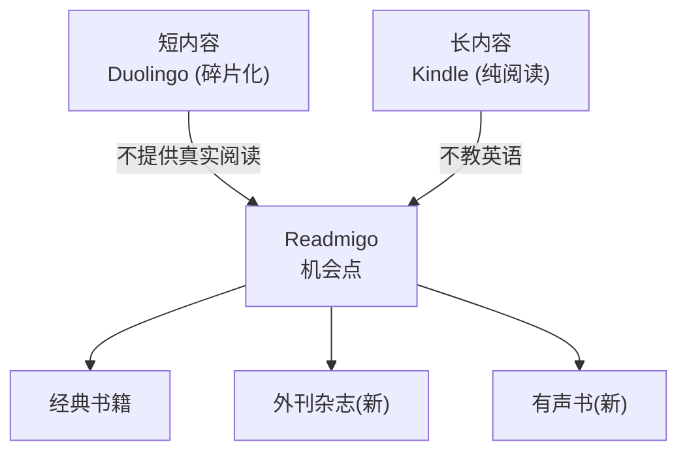

# Readmigo 内容扩展策略分析

> 外刊杂志 & 有声书功能深度评估

---

## 目录

1. [战略背景](#1-战略背景)
2. [外刊杂志板块分析](#2-外刊杂志板块分析)
3. [有声书功能分析](#3-有声书功能分析)
4. [优先级建议](#4-优先级建议)
5. [实施路线图](#5-实施路线图)

---

## 1. 战略背景

### 1.1 市场空白再分析

当前市场格局：

### 1.2 新增用户群体

通过内容扩展可覆盖的新用户群体：

| 新用户群体 | 规模估算 | 核心需求 | 内容偏好 |
|------------|----------|----------|----------|
| **外刊备考者** | 5000 万+ | 托福/雅思/考研阅读 | 经济学人、时代周刊风格文章 |
| **通勤学习者** | 3000 万+ | 碎片时间学习 | 有声内容、短文章 |
| **职场精英** | 2000 万+ | 商业英语、行业资讯 | 商业外刊、TED 风格内容 |
| **听力提升者** | 4000 万+ | 听说能力提升 | 有声书、朗读跟读 |

---

## 2. 外刊杂志板块分析

### 2.1 用户需求验证

#### 目标用户痛点

#### 市场验证数据

| 指标 | 数据 | 来源 |
|------|------|------|
| 中国考研人数 | 474 万 (2024) | 教育部 |
| 托福/雅思考生 | 300 万+/年 | ETS/BC |
| 外刊类 App 用户 | 500 万+ | 扇贝外刊、流利说等 |
| "外刊精读"搜索量 | 日均 5 万+ | 百度指数 |

### 2.2 内容来源分析

#### 版权风险等级

#### 可用内容来源

| 来源类型 | 具体来源 | 版权状态 | 可用性 |
|----------|----------|----------|--------|
| **公共领域** | VOA Special English | 免费 | ✅ 可直接使用 |
| | NPR 文章摘要 | CC 授权 | ✅ 可使用 |
| | Wikipedia 精选文章 | CC BY-SA | ✅ 可使用 |
| | 美国政府出版物 | 公共领域 | ✅ 可使用 |
| **开放授权** | The Conversation | CC BY-ND | ✅ 可注明来源使用 |
| | Aeon Essays | 部分 CC | ⚠️ 需逐篇确认 |
| | Open Access 学术文章 | CC | ✅ 可使用 |
| **用户导入** | 用户自行粘贴/上传 | 用户责任 | ✅ 规避版权 |
| **原创内容** | 编辑团队策划 | 自有版权 | ✅ 完全可控 |
| **授权合作** | 与出版商谈判 | 需付费 | ⚠️ 成本高 |

---

### 2.3 推荐内容源详细分析（10个备选）

> ⚠️ **重要说明**：由于外刊杂志（如经济学人、时代周刊等）存在严格版权保护和侵权风险，我们转向使用公开授权的优质外文内容源。以下10个来源均可合法使用，内容质量高，话题覆盖广泛。

#### 🥇 第一梯队：强烈推荐（可直接商用）

| 排名 | 来源 | 授权类型 | 话题覆盖 | 推荐指数 |
|------|------|----------|----------|----------|
| 1 | **The Conversation** | CC BY-ND | 科技/商业/文化/社会/科学 | ⭐⭐⭐⭐⭐ |
| 2 | **VOA Learning English** | 公共领域 | 新闻/教育/文化/科技 | ⭐⭐⭐⭐⭐ |
| 3 | **ProPublica** | CC (可免费转载) | 调查新闻/社会/政治/商业 | ⭐⭐⭐⭐⭐ |

#### 1. The Conversation（学术评论）

#### 2. VOA Learning English（新闻英语）

#### 3. ProPublica（调查新闻）

#### 🥈 第二梯队：优质推荐（部分限制）

| 排名 | 来源 | 授权类型 | 话题覆盖 | 推荐指数 |
|------|------|----------|----------|----------|
| 4 | **PLOS ONE** | CC BY | 科学/医学/技术 | ⭐⭐⭐⭐ |
| 5 | **Nature Communications** | CC BY | 自然科学/前沿研究 | ⭐⭐⭐⭐ |
| 6 | **Wikinews** | CC BY 2.5+ | 时事新闻 | ⭐⭐⭐⭐ |
| 7 | **TED Talks 文稿** | CC BY-NC-ND | 科技/商业/文化/创意 | ⭐⭐⭐⭐ |

#### 4. PLOS ONE（开放科学期刊）

#### 5. Nature Communications（开放获取期刊）

#### 6. Wikinews（公民新闻）

#### 7. TED Talks 文稿（思想演讲）

#### 🥉 第三梯队：补充来源（特定场景）

| 排名 | 来源 | 授权类型 | 话题覆盖 | 推荐指数 |
|------|------|----------|----------|----------|
| 8 | **Medium (CC文章)** | 作者选择CC | 科技/创业/生活/思考 | ⭐⭐⭐ |
| 9 | **MIT OpenCourseWare** | CC BY-NC-SA | 学术/教育 | ⭐⭐⭐ |
| 10 | **Aeon Ideas** | CC BY-ND | 哲学/文化/思想 | ⭐⭐⭐ |

#### 8. Medium CC授权文章

#### 9. MIT OpenCourseWare

#### 10. Aeon Ideas（思想短文）

---

#### 📚 特别推荐：经典经济学公版短文

> 精选经济学经典短文，全部为公共领域作品，无版权风险，适合深度精读。

| 序号 | 中文标题 | 英文标题 | 作者 | 年份 | 难度 | 推荐指数 |
|------|----------|----------|------|------|------|----------|
| 1 | 我，铅笔 | I, Pencil | Leonard E. Read | 1958 | ⭐⭐ | ⭐⭐⭐⭐⭐ |
| 2 | 战俘营里的经济组织 | The Economic Organisation of a P.O.W. Camp | R. A. Radford | 1945 | ⭐⭐⭐ | ⭐⭐⭐⭐⭐ |
| 3 | 看得见的和看不见的 | What Is Seen and What Is Not Seen | Frédéric Bastiat | 1848 | ⭐⭐⭐ | ⭐⭐⭐⭐⭐ |
| 4 | 蜡烛制造商关于禁止太阳光线的陈情书 | The Candlemaker's Petition | Frédéric Bastiat | 1845 | ⭐⭐ | ⭐⭐⭐⭐⭐ |
| 5 | 不确定性，进化与经济理论 | Uncertainty, Evolution and Economic Theory | Armen Alchian | 1950 | ⭐⭐⭐⭐ | ⭐⭐⭐⭐⭐ |

---

#### 🇨🇳 特别推荐：中国视角英文内容

| 排名 | 来源 | 授权类型 | 话题覆盖 | 推荐指数 |
|------|------|----------|----------|----------|
| 11 | **China Daily** | 需授权合作 | 中国新闻/文化/经济/社会 | ⭐⭐⭐⭐ |

#### 11. China Daily（中国日报英文版）

---

#### 🎓 特别推荐：OpenCourseWare 优质内容

| 排名 | 来源 | 授权类型 | 话题覆盖 | 推荐指数 |
|------|------|----------|----------|----------|
| 12 | **MIT OpenCourseWare** | CC BY-NC-SA | 理工/商业/人文 | ⭐⭐⭐⭐⭐ |
| 13 | **Stanford Online** | 部分开放 | CS/AI/商业 | ⭐⭐⭐⭐ |
| 14 | **Yale Open Courses** | CC BY-NC-SA | 人文/社科/科学 | ⭐⭐⭐⭐ |

#### 12. MIT OpenCourseWare（麻省理工开放课程）

#### 13. Stanford Online（斯坦福在线）

#### 14. Yale Open Courses（耶鲁公开课）

---

#### 🤖 特别推荐：AI/机器学习领域内容

| 排名 | 来源 | 授权类型 | 话题覆盖 | 推荐指数 |
|------|------|----------|----------|----------|
| 15 | **Distill.pub** | CC BY | AI/ML 可视化解读 | ⭐⭐⭐⭐⭐ |
| 16 | **arXiv (CC论文)** | 部分CC BY | AI/ML 前沿研究 | ⭐⭐⭐⭐ |
| 17 | **fast.ai** | Apache 2.0 | 深度学习实践 | ⭐⭐⭐⭐ |
| 18 | **Papers with Code** | 开放资源 | ML 论文+代码 | ⭐⭐⭐⭐ |

#### 15. Distill.pub（机器学习可视化期刊）

#### 16. arXiv CC 授权论文（AI/ML 预印本）

#### 17. fast.ai（实践深度学习）

#### 18. Papers with Code（论文代码库）

---

#### 🌏 特别推荐：国际多元视角内容

> 以下内容源提供来自日本、韩国、英国、澳大利亚、德国的英文内容，帮助用户获取多元国际视角。

##### 🇯🇵 日本视角

| 排名 | 来源 | 授权类型 | 话题覆盖 | 推荐指数 |
|------|------|----------|----------|----------|
| 19 | **NHK World-Japan** | 需确认 | 日本新闻/文化/社会 | ⭐⭐⭐⭐ |
| 20 | **Japan Times** | 需授权 | 日本新闻/商业/生活 | ⭐⭐⭐ |
| 21 | **Nippon.com** | 需授权 | 日本深度文化解读 | ⭐⭐⭐ |

#### 19. NHK World-Japan（日本国际广播）

#### 20. Japan Times（日本时报）

#### 21. Nippon.com（日本深度解读）

---

##### 🇰🇷 韩国视角

| 排名 | 来源 | 授权类型 | 话题覆盖 | 推荐指数 |
|------|------|----------|----------|----------|
| 22 | **Korea Herald** | 需确认 | 韩国新闻/文化/K-pop | ⭐⭐⭐⭐ |
| 23 | **Yonhap News** | 需确认 | 韩国通讯社/时事 | ⭐⭐⭐ |
| 24 | **Arirang** | 需确认 | 韩国国际广播 | ⭐⭐⭐ |

#### 22. Korea Herald（韩国先驱报）

#### 23. Yonhap News Agency（韩联社英文版）

---

##### 🇬🇧 英国视角

| 排名 | 来源 | 授权类型 | 话题覆盖 | 推荐指数 |
|------|------|----------|----------|----------|
| 24 | **The Conversation UK** | CC BY-ND | 学术评论/社会 | ⭐⭐⭐⭐⭐ |
| 25 | **BBC Learning English** | 版权保护 | 英语学习专用 | ⭐⭐⭐⭐ |
| 26 | **The Guardian** | 版权保护 | 新闻/评论 | ⭐⭐⭐ |

#### 24. The Conversation UK（英国学术评论）

#### 25. BBC Learning English（BBC英语学习）

#### 26. The Guardian（卫报）

---

##### 🇦🇺 澳大利亚视角

| 排名 | 来源 | 授权类型 | 话题覆盖 | 推荐指数 |
|------|------|----------|----------|----------|
| 27 | **The Conversation AU** | CC BY-ND | 学术评论/澳洲 | ⭐⭐⭐⭐⭐ |
| 28 | **ABC Australia** | 需授权 | 澳洲新闻/广播 | ⭐⭐⭐ |
| 29 | **SBS News** | 需付费授权 | 多元文化新闻 | ⭐⭐⭐ |

#### 27. The Conversation Australia（澳洲学术评论）

#### 28. ABC Australia（澳洲广播公司）

---

##### 🇩🇪 德国视角

| 排名 | 来源 | 授权类型 | 话题覆盖 | 推荐指数 |
|------|------|----------|----------|----------|
| 29 | **Deutsche Welle (DW)** | 需确认 | 德国/欧洲/国际 | ⭐⭐⭐⭐ |

#### 29. Deutsche Welle（德国之声）

---

#### 💻 特别推荐：技术社区优质内容

| 排名 | 来源 | 授权类型 | 话题覆盖 | 推荐指数 |
|------|------|----------|----------|----------|
| 30 | **GitHub Awesome Lists** | MIT/Apache/CC | 技术文档/教程 | ⭐⭐⭐⭐⭐ |
| 31 | **GitHub 技术博客/README** | 各项目授权 | 开源技术 | ⭐⭐⭐⭐ |

#### 30. GitHub Awesome Lists（精选资源列表）

#### 31. GitHub 技术博客与文档

---

#### 🎓 特别推荐：台湾高校公开课

| 排名 | 来源 | 授权类型 | 话题覆盖 | 推荐指数 |
|------|------|----------|----------|----------|
| 32 | **台湾大学公开课 (NTU OCW)** | CC BY-NC-SA | 综合学科 | ⭐⭐⭐⭐ |
| 33 | **交通大学公开课 (NYCU OCW)** | CC BY-NC-SA | 理工/CS | ⭐⭐⭐⭐ |

#### 32. 台湾大学公开课 (NTU OpenCourseWare)

#### 33. 交通大学公开课 (NYCU OpenCourseWare)

---

### 2.4 内容源对比总结

### 2.5 实施建议：精读功能内容策略

#### Phase 1：MVP 内容来源（立即可用）

| 优先级 | 来源 | 每周文章数 | 负责人 |
|--------|------|------------|--------|
| P0 | The Conversation | 10-15 篇 | 自动抓取 + 编辑精选 |
| P0 | VOA Learning English | 10 篇 | 自动同步 |
| P1 | ProPublica | 2-3 篇 | 编辑精选 |

#### Phase 2：扩展内容来源

| 优先级 | 来源 | 每周文章数 | 负责人 |
|--------|------|------------|--------|
| P1 | TED Talks 文稿 | 3-5 篇 | 编辑精选 |
| P2 | PLOS ONE 摘要 | 3-5 篇 | AI 摘要 + 编辑审核 |
| P2 | Aeon Ideas | 2-3 篇 | 编辑精选 |

#### Phase 3：特色内容来源

| 优先级 | 来源 | 每周文章数 | 负责人 |
|--------|------|------------|--------|
| P1 | **China Daily** | 5-10 篇 | 用户导入 / 授权合作 |
| P2 | **MIT/Yale OCW** | 2-3 篇 | 编辑精选课程材料 |
| P2 | **Distill.pub** | 1-2 篇 | AI 领域精读 |
| P3 | **fast.ai** | 1-2 篇 | AI 入门材料 |
| P3 | **arXiv 摘要** | 3-5 篇 | AI 筛选 CC 论文摘要 |

#### 特色内容板块建议

#### 内容处理流程

### 2.6 商业可行性分析

#### 方案对比

| 方案 | 描述 | 成本 | 风险 | 可行性 |
|------|------|------|------|--------|
| **A: 纯公版/开放** | 只使用 CC 和公版内容 | 低 | 低 | ⭐⭐⭐⭐⭐ |
| **B: 用户导入** | 用户自行导入文章 | 低 | 低 | ⭐⭐⭐⭐⭐ |
| **C: 编辑精选** | 团队策划+改写 | 中 | 低 | ⭐⭐⭐⭐ |
| **D: 授权合作** | 与出版商合作 | 高 | 中 | ⭐⭐ |
| **E: 直接搬运** | 未授权使用外刊 | 低 | 极高 | ❌ 不可行 |

#### 推荐方案：混合模式

### 2.7 风险评估

#### 法律风险

| 风险点 | 严重程度 | 发生概率 | 应对措施 |
|--------|----------|----------|----------|
| **版权侵权诉讼** | 极高 | 低（采用合规方案） | 仅使用授权内容 |
| **DMCA 下架** | 高 | 中 | 建立快速响应机制 |
| **App Store 下架** | 极高 | 低 | 内容审核 + 用户协议 |
| **用户导入侵权** | 中 | 中 | 用户协议免责 + 内容不公开 |

#### 商业风险

| 风险点 | 严重程度 | 发生概率 | 应对措施 |
|--------|----------|----------|----------|
| **内容质量不足** | 高 | 中 | 编辑团队把控 + 用户反馈 |
| **更新频率不够** | 中 | 中 | 自动化工具 + 兼职编辑 |
| **与书籍定位冲突** | 低 | 低 | 明确板块区分 |
| **运营成本过高** | 中 | 中 | AI 辅助 + 精简团队 |

### 2.8 产品设计方案

#### 板块命名建议

| 方案 | 名称 | 定位 | 推荐度 |
|------|------|------|--------|
| A | **外刊精读** | 直接明确，备考导向 | ⭐⭐⭐⭐ |
| B | **今日阅读** | 时效性强调 | ⭐⭐⭐ |
| C | **短文精选** | 突出形式差异 | ⭐⭐⭐ |
| D | **洞见 (Insights)** | 高端定位 | ⭐⭐⭐⭐⭐ |
| E | **时文速读** | 中文风格 | ⭐⭐⭐ |

**推荐：「洞见 Insights」** — 高端、差异化、不局限于"外刊"标签

#### UI 入口设计

#### 文章卡片设计

### 2.9 成本估算

| 成本项 | 月成本 | 说明 |
|--------|--------|------|
| **编辑人力** | ¥8,000-15,000 | 1 名兼职编辑，每周精选 15-20 篇 |
| **AI 处理** | ¥500-1,000 | 文章解析、词汇标注、翻译 |
| **内容采购** | ¥0 | 使用公版/CC 内容 |
| **技术开发** | 一次性 ¥30,000-50,000 | 导入功能、阅读器适配 |
| **总计** | **¥8,500-16,000/月** | 启动后 |

### 2.10 结论：外刊板块

| 维度 | 评估 |
|------|------|
| **是否合适** | ✅ 非常合适，填补产品短内容空白 |
| **市场需求** | ✅ 强烈，尤其备考群体 |
| **版权风险** | ⚠️ 可控，需采用合规方案 |
| **商业价值** | ✅ 高，可提升用户粘性和付费转化 |
| **实施难度** | 中等，需要编辑运营投入 |
| **建议** | ✅ **建议实施**，采用混合内容模式 |

---

## 3. 有声书功能分析

### 3.1 战略价值

#### 用户场景拓展

#### 市场验证

| 指标 | 数据 | 来源 |
|------|------|------|
| 全球有声书市场规模 | $5.4B (2024) | Grand View Research |
| 年增长率 | 26.3% CAGR | Statista |
| Audible 订阅用户 | 数百万 | Amazon |
| 中国有声书用户 | 4.2 亿 | 艾媒咨询 |
| 喜马拉雅月活 | 2.9 亿 | 喜马拉雅财报 |

### 3.2 技术方案对比

#### AI TTS vs 真人朗读

| 维度 | AI TTS | 真人朗读 |
|------|--------|----------|
| **成本** | 极低 ($0.001-0.01/1K字符) | 高 ($100-500/小时录制) |
| **质量** | 中-高（2024年已很自然） | 最高 |
| **生产速度** | 即时生成 | 数周-数月 |
| **情感表达** | 有限（在改进） | 丰富 |
| **多语言** | 容易支持 | 需要不同配音员 |
| **可扩展性** | 无限扩展 | 受限于录制产能 |
| **个性化** | 可调语速/音色 | 固定 |

#### AI TTS 服务商对比

| 服务商 | 质量评分 | 价格 (1M字符) | 特点 |
|--------|----------|---------------|------|
| **ElevenLabs** | ⭐⭐⭐⭐⭐ | $30-300 | 最自然，支持克隆 |
| **OpenAI TTS** | ⭐⭐⭐⭐ | $15 | 高质量，6种声音 |
| **Azure TTS** | ⭐⭐⭐⭐ | $4-16 | 企业级，多语言 |
| **Google TTS** | ⭐⭐⭐⭐ | $4-16 | 稳定，多语言 |
| **Amazon Polly** | ⭐⭐⭐ | $4-16 | 成熟，集成简单 |
| **Edge TTS** | ⭐⭐⭐ | 免费 | 微软免费API |
| **讯飞 TTS** | ⭐⭐⭐⭐ | ¥2-20 | 中文优秀 |

#### 推荐方案

### 3.3 产品设计

#### 播放界面设计

#### 核心功能清单

| 功能 | 优先级 | 说明 |
|------|--------|------|
| **基础播放** | P0 | 播放/暂停/进度条 |
| **语速调节** | P0 | 0.5x - 2.0x |
| **音色选择** | P0 | 3-5 种预设音色 |
| **章节切换** | P0 | 目录导航 |
| **文字同步** | P1 | 当前句子高亮 |
| **点击跳转** | P1 | 点击文字跳转音频 |
| **离线下载** | P1 | 单章/全书下载 |
| **定时关闭** | P1 | 15/30/45/60 分钟 |
| **跟读模式** | P2 | 录音 + AI 评分 |
| **书签标记** | P2 | 音频位置书签 |
| **播放列表** | P3 | 多书连续播放 |
| **CarPlay** | P3 | 车载系统集成 |

### 3.4 商业模式

#### 定价策略

| 方案 | 描述 | 优缺点 |
|------|------|--------|
| **A: 免费** | 所有用户免费使用 | ✅ 增加粘性 ❌ 成本压力 |
| **B: Premium 专属** | 仅付费用户可用 | ✅ 提升付费价值 ❌ 限制传播 |
| **C: 按本付费** | 每本 $1-3 解锁有声版 | ✅ 直接收入 ❌ 摩擦大 |
| **D: 混合模式** | 部分免费 + Premium 全量 | ✅ 平衡 ⭐ 推荐 |

#### 推荐方案：混合模式

### 3.5 成本分析

#### AI TTS 成本测算

| 场景 | 假设 | 月成本 |
|------|------|--------|
| **1K MAU** | 人均听 2 本/月，5 万字/本 | $100 |
| **10K MAU** | 同上 | $1,000 |
| **100K MAU** | 同上 | $10,000 |

#### 成本优化策略

| 策略 | 节省比例 | 实施难度 |
|------|----------|----------|
| **预生成缓存** | 60-80% | 低 |
| **章节级生成** | 20-30% | 低 |
| **低峰时段生成** | 10-20% | 中 |
| **多级音质** | 20-30% | 中 |
| **边缘缓存** | 10-15% | 高 |

### 3.6 风险评估

| 风险点 | 严重程度 | 发生概率 | 应对措施 |
|--------|----------|----------|----------|
| **TTS 质量不达预期** | 中 | 低 | A/B 测试，用户反馈迭代 |
| **成本超支** | 中 | 中 | 预算控制，缓存优化 |
| **服务商 API 变更** | 中 | 低 | 多服务商冗余 |
| **用户接受度低** | 低 | 低 | 充分测试，逐步推出 |
| **存储/带宽成本** | 中 | 中 | CDN 优化，压缩算法 |

### 3.7 结论：有声书功能

| 维度 | 评估 |
|------|------|
| **是否重要** | ✅ 非常重要，拓展使用场景 2-3 倍 |
| **市场需求** | ✅ 强烈，有声书市场高速增长 |
| **技术可行性** | ✅ 高，AI TTS 已成熟 |
| **成本可控性** | ✅ 可控，有多种优化手段 |
| **商业价值** | ✅ 高，提升付费转化和留存 |
| **实施难度** | 中等，需要技术和产品投入 |
| **建议** | ✅ **强烈建议实施**，作为核心功能 |

---

## 4. 优先级建议

### 4.1 功能优先级矩阵

### 4.2 实施顺序建议

| 顺序 | 功能 | 时间 | 理由 |
|------|------|------|------|
| **1** | 有声书 MVP | 2025 Q2 | 技术成熟，价值明确，提升付费 |
| **2** | 用户文章导入 | 2025 Q2 | 低成本，规避版权，满足刚需 |
| **3** | 外刊精选板块 | 2025 Q3 | 需要编辑运营，备考季前上线 |
| **4** | 有声书增强 | 2025 Q4 | 基于用户反馈迭代 |
| **5** | 原创内容 | 2026+ | 长期差异化，需要团队扩展 |

---

## 5. 实施路线图

### 5.1 时间线

### 5.2 资源需求

| 阶段 | 人力 | 预算 | 产出 |
|------|------|------|------|
| **Q2** | 1 iOS + 0.5 后端 | ¥20K | 有声书 MVP + 导入功能 |
| **Q3** | 1 iOS + 0.5 后端 + 1 编辑 | ¥35K | 有声书增强 + 外刊板块 |
| **Q4** | 1 iOS + 0.5 后端 + 1 编辑 | ¥40K | 跟读模式 + 运营优化 |

### 5.3 成功指标

| 功能 | KPI | 目标值 |
|------|-----|--------|
| **有声书** | 有声书使用率 | >30% MAU |
| | 人均收听时长 | >20 min/天 |
| | 付费转化提升 | +20% |
| **外刊板块** | 外刊板块 DAU | >15% 总 DAU |
| | 文章完读率 | >40% |
| | 付费转化提升 | +10% |
| **用户导入** | 导入功能使用率 | >10% MAU |
| | 导入后留存 | +15% D7 留存 |

---

## 附录

### A. 公版/CC 内容资源列表

| 来源 | 内容类型 | 授权 | 链接 |
|------|----------|------|------|
| VOA Learning English | 新闻/教育 | 公共领域 | learningenglish.voanews.com |
| The Conversation | 学术/评论 | CC BY-ND | theconversation.com |
| NASA | 科学/太空 | 公共领域 | nasa.gov |
| Aeon | 哲学/文化 | 部分 CC | aeon.co |
| Open Culture | 综合 | CC | openculture.com |
| Smithsonian | 科学/历史 | 部分开放 | smithsonianmag.com |

### B. AI TTS API 文档

| 服务商 | 文档 |
|--------|------|
| OpenAI | platform.openai.com/docs/guides/text-to-speech |
| ElevenLabs | docs.elevenlabs.io |
| Azure | learn.microsoft.com/azure/cognitive-services/speech-service |

### C. 法律合规清单

- [ ] 用户协议更新（导入内容免责）
- [ ] 隐私政策更新（音频数据存储）
- [ ] CC 内容引用规范
- [ ] DMCA 响应流程
- [ ] 版权监测机制

---

*文档版本: 1.0*
*创建日期: 2025-12-27*
*最后更新: 2025-12-27*
*状态: 初稿完成*
