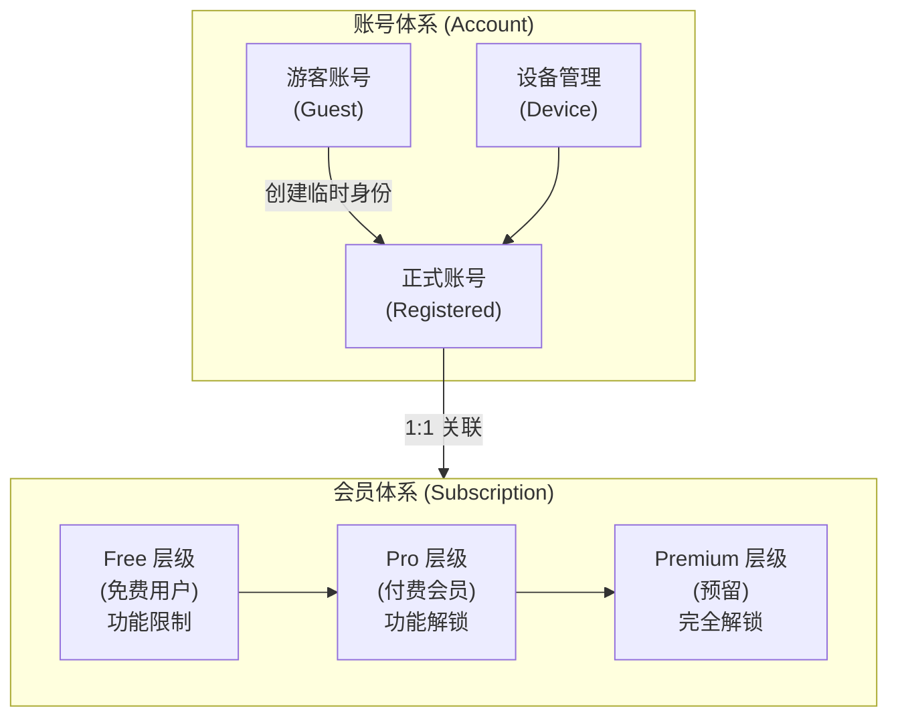
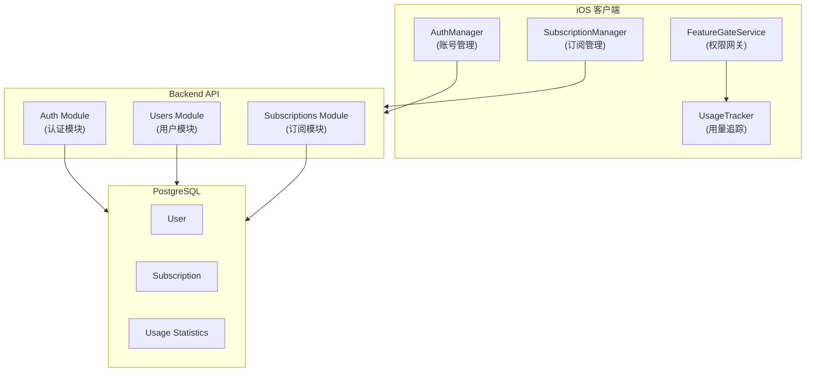
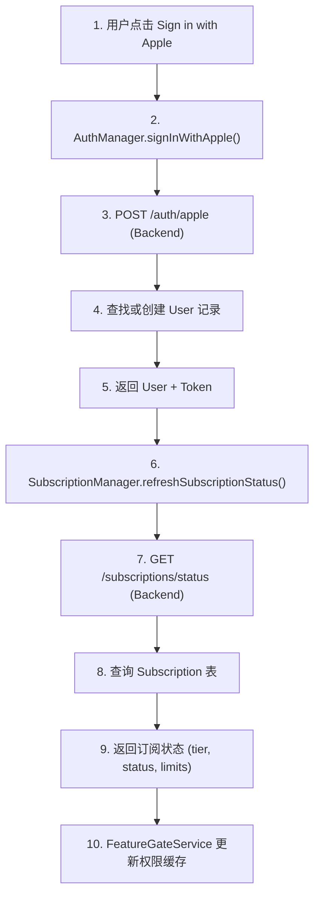
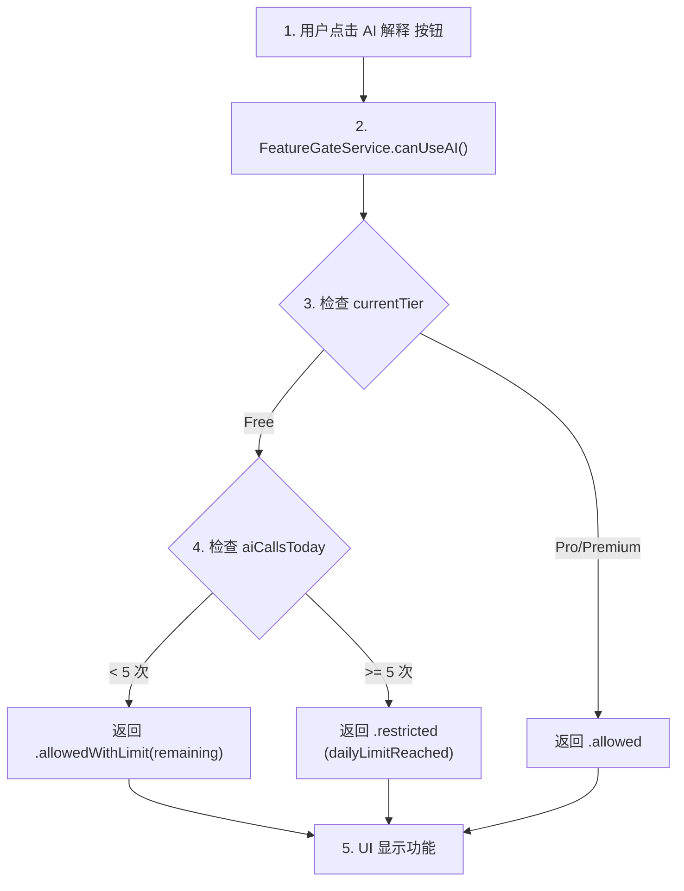
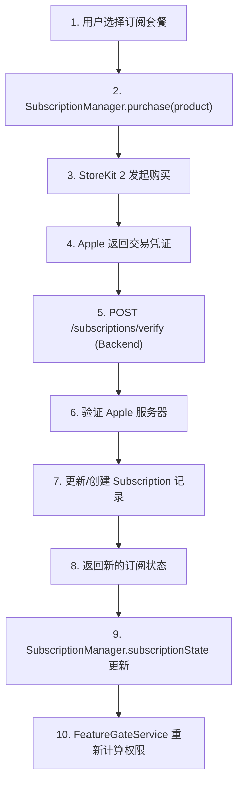
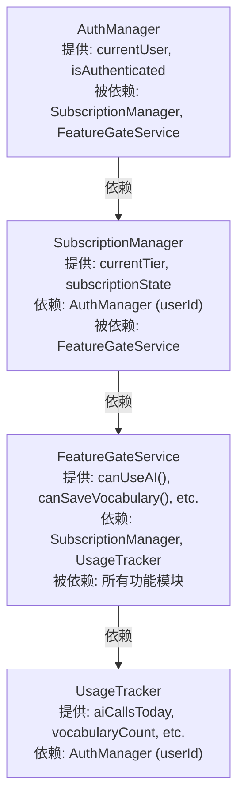

# 账号体系与会员体系关系文档

> **文档状态**: Draft - Pending Review
> **创建日期**: 2025-12-23
> **适用项目**: Readmigo

---

## 一、概述

Readmigo 应用包含两个核心体系：**账号体系（Account System）** 和 **会员体系（Membership/Subscription System）**。两者相互独立又紧密关联，共同支撑用户身份管理和商业变现。

### 核心关系图



---

## 二、责任划分

### 2.1 账号体系职责

| 职责领域 | 具体内容 |
|---------|---------|
| **身份认证** | Apple Sign In、Google SSO、游客模式 |
| **身份存储** | 用户基本信息（邮箱、头像、显示名） |
| **会话管理** | Token 生成、刷新、失效 |
| **设备管理** | 多设备登录、设备绑定 |
| **账号生命周期** | 注册、登录、登出、注销 |
| **数据归属** | 确定用户数据所有权 |

### 2.2 会员体系职责

| 职责领域 | 具体内容 |
|---------|---------|
| **订阅管理** | 订阅创建、续费、取消、过期 |
| **权限控制** | 功能访问权限判定 |
| **使用追踪** | AI 调用次数、词汇数量等用量统计 |
| **支付集成** | App Store IAP、收据验证 |
| **定价策略** | 月费/年费定价、试用期 |
| **功能解锁** | 根据订阅层级开放功能 |

### 2.3 职责边界

```
账号体系的边界:
├── "你是谁" (身份识别)
├── "你从哪来" (登录渠道)
├── "你的基本信息" (Profile)
└── "你是否有权操作" (认证)

会员体系的边界:
├── "你能用什么功能" (权限)
├── "你能用多少" (配额)
├── "你付了多少钱" (订阅)
└── "你还能用多久" (有效期)
```

---

## 三、调用关系

### 3.1 系统架构图



### 3.2 核心调用流程

#### A. 用户登录 → 获取订阅状态



#### B. 功能权限检查



#### C. 订阅购买 → 状态更新



### 3.3 模块依赖关系



---

## 四、功能点清单

### 4.1 账号体系功能点

| 功能分类 | 功能点 | 状态 | 关键文件 |
|---------|-------|-----|---------|
| **登录认证** | Apple Sign In | ✅ 已实现 | `AuthManager.swift:L80-120` |
| | Google Sign In | ✅ 已实现 | `AuthManager.swift:L122-160` |
| | 游客模式 | ✅ 已实现 | `AuthManager.swift:L200-220` |
| **会话管理** | Access Token 生成 | ✅ 已实现 | `auth.service.ts:L60-80` |
| | Refresh Token 刷新 | ✅ 已实现 | `AuthManager.swift:L170-195` |
| | 自动登录 | ✅ 已实现 | `AuthManager.swift:L50-70` |
| **用户资料** | 获取用户信息 | ✅ 已实现 | `users.service.ts:L50-80` |
| | 更新用户资料 | ✅ 已实现 | `AuthManager.swift:L280-310` |
| | 头像管理 | ✅ 已实现 | User Model |
| **账号管理** | 账号删除 | ✅ 已实现 | `AuthManager.swift:L250-275` |
| | 登出 | ✅ 已实现 | `AuthManager.swift:L230-245` |
| **待实现** | 设备管理 | ❌ 待开发 | - |
| | 游客账号升级 | ❌ 待开发 | - |
| | 多身份绑定 | ❌ 待开发 | - |
| | 账号合并 | ❌ 待开发 | - |

### 4.2 会员体系功能点

| 功能分类 | 功能点 | 状态 | 关键文件 |
|---------|-------|-----|---------|
| **订阅管理** | 获取产品列表 | ✅ 已实现 | `SubscriptionManager.swift:L100-130` |
| | 购买订阅 | ✅ 已实现 | `SubscriptionManager.swift:L140-200` |
| | 恢复购买 | ✅ 已实现 | `SubscriptionManager.swift:L210-240` |
| | 订阅状态同步 | ✅ 已实现 | `SubscriptionManager.swift:L250-280` |
| **收据验证** | Apple 收据验证 | ✅ 已实现 | `subscriptions.service.ts:L100-180` |
| | 交易状态更新 | ✅ 已实现 | `subscriptions.service.ts:L190-250` |
| **权限控制** | AI 功能权限 | ✅ 已实现 | `FeatureGateService.swift:L80-110` |
| | 词汇保存权限 | ✅ 已实现 | `FeatureGateService.swift:L115-145` |
| | 离线阅读权限 | ✅ 已实现 | `FeatureGateService.swift:L150-180` |
| | 语音聊天权限 | ✅ 已实现 | `FeatureGateService.swift:L185-215` |
| **用量追踪** | AI 调用次数 | ✅ 已实现 | `UsageTracker.swift:L50-80` |
| | 词汇数量统计 | ✅ 已实现 | `UsageTracker.swift:L85-100` |
| | 语音聊天时长 | ✅ 已实现 | `UsageTracker.swift:L105-125` |
| **UI 组件** | 订阅状态页 | ✅ 已实现 | `SubscriptionStatusView.swift` |
| | 升级提示弹窗 | ✅ 已实现 | `PaywallView.swift` |
| **待实现** | Webhook 处理 | ❌ 待开发 | - |
| | 订阅分析报表 | ❌ 待开发 | - |

---

## 五、各自重点业务

### 5.1 账号体系重点业务

#### 优先级 P0 (核心)
1. **身份认证流程**
   - Apple/Google 第三方登录的稳定性
   - Token 安全存储（Keychain）
   - 自动刷新机制

2. **用户数据归属**
   - 确保用户数据与账号正确关联
   - 游客数据的临时存储与迁移

#### 优先级 P1 (重要)
3. **游客账号升级**
   - 游客 → 正式账号的无缝过渡
   - 数据完整迁移

4. **多设备同步**
   - 同一账号多设备登录
   - 登录状态一致性

#### 优先级 P2 (增强)
5. **账号安全**
   - 异常登录检测
   - 敏感操作二次验证

### 5.2 会员体系重点业务

#### 优先级 P0 (核心)
1. **订阅购买流程**
   - StoreKit 2 集成稳定性
   - 收据验证准确性
   - 支付失败恢复

2. **权限判定**
   - 实时权限状态检查
   - 功能访问控制

#### 优先级 P1 (重要)
3. **用量统计**
   - 准确的使用次数追踪
   - 配额重置机制（每日/每月）

4. **订阅状态同步**
   - App Store 与后端状态一致
   - 订阅过期自动降级

#### 优先级 P2 (增强)
5. **商业分析**
   - 转化率追踪
   - 流失分析
   - LTV 计算

---

## 六、数据模型关系

### 6.1 核心表结构

```sql
-- 账号体系核心表
User {
    id: UUID (PK)
    email: String?
    appleId: String?        -- Apple 身份标识
    googleId: String?       -- Google 身份标识
    displayName: String?
    avatarUrl: String?
    englishLevel: Enum
    dailyGoalMinutes: Int
    createdAt: DateTime
    updatedAt: DateTime
    lastActiveAt: DateTime?
}

-- 会员体系核心表
Subscription {
    id: UUID (PK)
    userId: UUID (FK -> User, UNIQUE)  -- 1:1 关系
    planType: Enum (FREE, PRO, PREMIUM)
    status: Enum (ACTIVE, EXPIRED, CANCELLED, GRACE_PERIOD)
    originalTransactionId: String?     -- Apple IAP 交易ID
    latestReceiptData: String?
    startedAt: DateTime
    expiresAt: DateTime?
    cancelledAt: DateTime?
}
```

### 6.2 关联关系

```
User (1) ─────────────── (1) Subscription
  │                              │
  │ 1:N                          │
  ▼                              ▼
UserBook, UserVocabulary    Usage Statistics
ReadingSession, etc.        (aiCallsToday, etc.)
```

---

## 七、限制对照表

| 功能 | Free 用户 | Pro 用户 | Premium (预留) |
|-----|----------|---------|---------------|
| 书籍访问 | 10 本 | 200+ 全部 | 无限制 |
| AI 解释次数 | 5 次/天 | 无限制 | 无限制 |
| 词汇保存 | 50 个 | 无限制 | 无限制 |
| 离线下载 | 不支持 | 10 本 | 无限制 |
| 间隔重复复习 | 不支持 | ✅ | ✅ |
| 语音聊天 | 不支持 | 30 分钟/月 | 无限制 |
| 阅读统计 | 不支持 | ✅ | ✅ |
| 词汇导出 | 不支持 | ✅ | ✅ |

---

## 八、API 接口汇总

### 8.1 账号体系 API

| 方法 | 路径 | 描述 | 认证要求 |
|-----|------|-----|---------|
| POST | `/auth/apple` | Apple 登录 | 无 |
| POST | `/auth/google` | Google 登录 | 无 |
| POST | `/auth/refresh` | 刷新令牌 | Refresh Token |
| GET | `/users/me` | 获取当前用户 | Access Token |
| PATCH | `/users/me` | 更新用户资料 | Access Token |
| DELETE | `/users/me` | 删除账号 | Access Token |

### 8.2 会员体系 API

| 方法 | 路径 | 描述 | 认证要求 |
|-----|------|-----|---------|
| GET | `/subscriptions/status` | 获取订阅状态 | Access Token |
| POST | `/subscriptions/verify` | 验证 App Store 收据 | Access Token |
| POST | `/subscriptions/restore` | 恢复购买 | Access Token |
| GET | `/usage/current` | 获取当前用量 | Access Token |
| POST | `/usage/ai` | 记录 AI 使用 | Access Token |

---

## 九、关键文件索引

### 后端
- `/apps/backend/src/modules/auth/auth.service.ts` - 认证服务
- `/apps/backend/src/modules/users/users.service.ts` - 用户服务
- `/apps/backend/src/modules/subscriptions/subscriptions.service.ts` - 订阅服务
- `/packages/database/prisma/schema.prisma` - 数据库模型

### iOS 客户端
- `/ios/Readmigo/Features/Auth/AuthManager.swift` - 账号管理器
- `/ios/Readmigo/Features/Subscriptions/SubscriptionManager.swift` - 订阅管理器
- `/ios/Readmigo/Features/Subscriptions/FeatureGateService.swift` - 权限网关
- `/ios/Readmigo/Features/Subscriptions/UsageTracker.swift` - 用量追踪
- `/ios/Readmigo/Core/Models/Subscription.swift` - 订阅数据模型

### 设计文档
- `/docs/07-modules/account/system-design.md` - 账号体系设计文档
- `/docs/01-product/subscription-design.md` - 订阅产品设计文档

---

## 十、待办事项

### 账号体系
- [ ] 实现 Device 表和设备管理功能
- [ ] 实现 Identity 表支持多身份绑定
- [ ] 实现游客账号升级流程
- [ ] 实现账号合并功能

### 会员体系
- [ ] 实现 App Store Server Notifications (Webhook)
- [ ] 实现订阅到期提醒
- [ ] 实现 Grace Period 处理
- [ ] 添加订阅分析 Dashboard

---

*文档结束*
