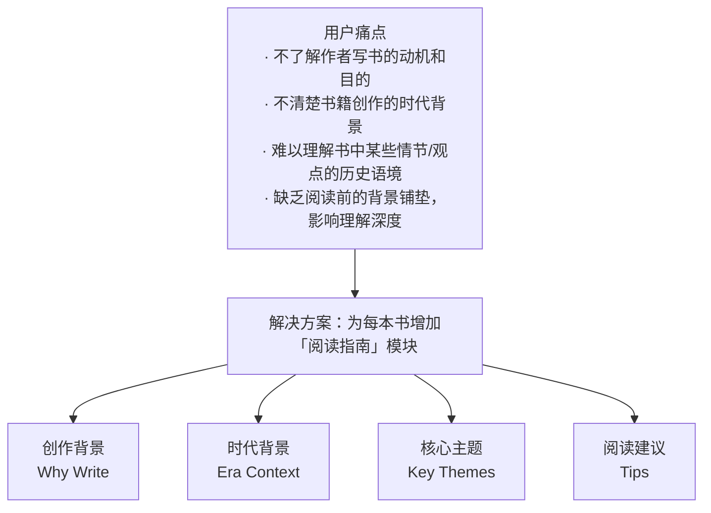
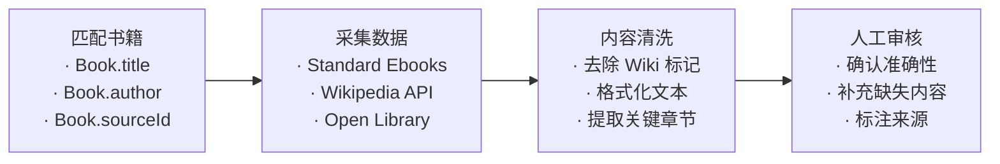

# 书籍背景模块设计

> Book Context Module | 帮助读者理解书籍的来龙去脉

---

## 一、功能概述

### 1.1 功能目标

| 目标 | 描述 |
|------|------|
| **降低阅读门槛** | 帮助读者快速了解书籍背景，减少理解障碍 |
| **提升阅读深度** | 通过背景知识增强读者对文本的理解 |
| **增加阅读兴趣** | 通过有趣的背景故事激发阅读欲望 |
| **教育价值** | 在阅读文学作品的同时学习历史文化知识 |

### 1.2 适用范围

| 书籍类型 | 优先级 | 说明 |
|----------|:------:|------|
| 经典文学 (isClassic=true) | 高 | 时代背景对理解至关重要 |
| 历史小说 | 高 | 需要历史背景铺垫 |
| 古籍 (dynasty 非空) | 高 | 需要朝代和文化背景 |
| 哲学/社会类 | 中 | 思想背景有助理解 |
| 现代小说 | 低 | 可选提供 |

---

## 二、模块内容结构

### 2.1 字段详细定义

| 字段 | 类型 | 必需 | 说明 | 示例 |
|------|------|:----:|------|------|
| **creationBackground** | Text | ✅ | 创作背景 | "托尔斯泰在1863年开始创作《战争与和平》，当时俄国社会正处于农奴制改革后的动荡期..." |
| **historicalContext** | Text | ✅ | 时代背景 | "故事发生在1805-1812年拿破仑战争期间，这是欧洲历史上最动荡的时期之一..." |
| **keyThemes** | String[] | ⭕ | 核心主题标签 | ["战争与和平", "贵族社会", "命运与自由意志"] |
| **keyThemesDescription** | Text | ⭕ | 主题详细说明 | "本书探讨了战争对人性的影响..." |
| **readingTips** | Text | ⭕ | 阅读建议 | "建议先了解拿破仑战争的基本脉络..." |
| **relatedWorks** | String[] | ⭕ | 延伸阅读 | ["《安娜·卡列尼娜》", "《复活》"] |
| **generatedAt** | DateTime | ✅ | 生成时间 | 用于追踪内容更新 |
| **source** | Enum | ✅ | 内容来源 | AI_GENERATED, MANUAL, WIKIPEDIA |

### 2.2 多语言支持

---

## 三、数据库设计

### 3.1 Prisma Schema

### 3.2 与现有 Book 模型的关系

---

## 四、API 设计

### 4.1 端点定义

| 方法 | 端点 | 说明 | 认证 |
|------|------|------|:----:|
| GET | `/books/:id/context` | 获取书籍背景 | ⭕ |
| POST | `/books/:id/context` | 创建/生成书籍背景 | ✅ Admin |
| PATCH | `/books/:id/context` | 更新书籍背景 | ✅ Admin |
| DELETE | `/books/:id/context` | 删除书籍背景 | ✅ Admin |
| POST | `/books/:id/context/generate` | AI 生成书籍背景 | ✅ Admin |

### 4.2 响应结构

### 4.3 书籍详情 API 扩展

---

## 五、UI 设计

### 5.1 书籍详情页结构 (内嵌阅读指南)

阅读指南直接内嵌在书籍详情页中，无需跳转单独页面。

### 5.2 BookContextSection 组件设计

### 5.3 视觉样式

| 元素 | 样式 |
| ---- | ---- |
| Section 标题 | 与现有 Section 保持一致 (如 "章节列表") |
| 卡片背景 | 浅色卡片背景，圆角 12pt |
| 子标题 | 加粗，主色调 |
| 正文 | 次级颜色，行高 1.5 |
| 主题标签 | 胶囊形状，背景色填充 |
| 展开按钮 | 文字按钮，右对齐 |

---

## 六、权威数据源

优先使用权威公开渠道获取内容，避免 AI 生成。

### 6.1 数据源优先级

### 6.2 英文书籍数据源

#### Standard Ebooks (首选)

| 属性 | 说明 |
| ---- | ---- |
| 数据类型 | `se:long-description` 字段 |
| 内容质量 | 人工编写，百科全书风格，包含出版历史和背景 |
| 许可证 | CC0 公共领域 |
| 覆盖范围 | ~700 本经典英文书籍 |
| API | 无官方 API，需爬取或使用 GitHub 仓库 |
| 示例 | "War and Peace...follows five aristocratic families...Tolstoy began writing in 1863..." |

**提取方式：**

#### Wikipedia (主要来源)

| 属性 | 说明 |
| ---- | ---- |
| 数据类型 | 文章特定章节 |
| 关键章节 | `Composition` (创作过程)、`Historical context` (历史背景)、`Themes` (主题) |
| 许可证 | CC BY-SA 4.0 |
| 覆盖范围 | 大多数知名书籍都有 Wikipedia 条目 |
| API | MediaWiki API (`action=parse&prop=sections,text`) |

**Wikipedia 书籍文章典型章节：**

| 章节名 | 对应字段 | 示例内容 |
| ------ | -------- | -------- |
| Composition / Writing | creationBackground | "Tolstoy began writing in 1863, the year he married..." |
| Historical context | historicalContext | "Set during the Napoleonic Wars, 1805-1812..." |
| Themes | keyThemes | "War, peace, fate, free will, aristocracy..." |
| Reception / Legacy | (可选) | 评价和影响 |

#### Open Library

| 属性 | 说明 |
| ---- | ---- |
| 数据类型 | Work 级别的 `description` 字段 |
| API | `https://openlibrary.org/works/{work_id}.json` |
| 许可证 | 公共领域 |
| 限制 | 描述质量参差不齐，部分书籍缺失 |

#### Wikidata

| 属性 | 说明 |
| ---- | ---- |
| 数据类型 | 结构化属性 |
| 关键属性 | `P50` (作者)、`P577` (出版日期)、`P571` (创作日期)、`P921` (主题) |
| API | `wbgetentities` |
| 用途 | 获取结构化数据后，链接到 Wikipedia 获取详细内容 |

### 6.3 中文书籍数据源

#### 中文维基百科

| 属性 | 说明 |
| ---- | ---- |
| API | `https://zh.wikipedia.org/w/api.php` |
| 关键章节 | `创作背景`、`历史背景`、`主题思想` |
| 许可证 | CC BY-SA 4.0 |
| 覆盖范围 | 经典中文文学、翻译作品 |

#### 维基文库 (Wikisource)

| 属性 | 说明 |
| ---- | ---- |
| 数据类型 | 古籍原文中的序言、跋文 |
| 适用 | 古典文学 (《红楼梦》《三国演义》等) |
| 许可证 | 公共领域 |

#### 书籍原文提取

| 来源 | 内容 |
| ---- | ---- |
| 作者自序 | 创作动机、写作过程 |
| 译者序 | 翻译背景、原作介绍 |
| 编者注 | 版本说明、历史考证 |

### 6.4 数据采集流程

### 6.5 数据匹配策略

| 书籍来源 | 匹配方式 | 备注 |
| -------- | -------- | ---- |
| Standard Ebooks | `Book.sourceId` 直接匹配 | SE 书籍有唯一标识 |
| Gutenberg | 通过 `title + author` 搜索 Wikipedia | 需模糊匹配 |
| 中文书籍 | 中文书名搜索中文维基百科 | 注意简繁转换 |

### 6.6 字段映射

| 目标字段 | Standard Ebooks | Wikipedia | Open Library |
| -------- | --------------- | --------- | ------------ |
| creationBackground | `se:long-description` (部分) | `Composition` 章节 | - |
| historicalContext | `se:long-description` (部分) | `Historical context` 章节 | - |
| keyThemes | - | `Themes` 章节 | `subjects` |
| readingTips | - | - | - (需人工) |

### 6.7 许可证合规

| 数据源 | 许可证 | 使用要求 |
| ------ | ------ | -------- |
| Standard Ebooks | CC0 | 无限制，可直接使用 |
| Wikipedia | CC BY-SA 4.0 | 需标注来源，衍生作品需相同许可 |
| Open Library | 公共领域 | 无限制 |
| Wikidata | CC0 | 无限制 |

**合规方案：**
- 在 `BookContext.source` 字段记录数据来源
- 对于 Wikipedia 内容，在 UI 显示 "资料来源: Wikipedia" 链接
- 数据库存储原始来源 URL

### 6.8 覆盖率估算

| 书籍类型 | 预计覆盖率 | 主要数据源 |
| -------- | ---------- | ---------- |
| Standard Ebooks 书籍 | 100% | SE long-description |
| 英文经典文学 | 90%+ | Wikipedia |
| 中文经典文学 | 80%+ | 中文维基百科 |
| 古籍 | 70%+ | 维基文库 + 中文维基 |
| 现代作品 | 50% | Wikipedia (视知名度) |

---

## 七、实现计划

### 7.1 阶段划分

### 7.2 技术依赖

| 组件 | 技术 | 说明 |
|------|------|------|
| 数据库 | Prisma + PostgreSQL | 新增 2 个表 |
| API | NestJS | 新增 BookContext 模块 |
| AI 生成 | Claude API | 内容批量生成 |
| iOS | SwiftUI | 新增 View 组件 |
| Android | Compose | 对应实现 |

---

## 八、成功指标

| 指标 | 目标 | 说明 |
|------|------|------|
| 覆盖率 | 100% 经典书籍 | 所有 isClassic=true 的书籍都有背景信息 |
| 内容质量 | 人工审核通过率 > 90% | AI 生成内容需人工审核 |
| 用户参与 | 阅读指南点击率 > 30% | 查看书籍详情的用户中 |
| 阅读转化 | 提升开始阅读率 5% | 对比有/无背景信息的书籍 |

---

## 九、相关文档

| 文档 | 描述 |
|------|------|
| [release-history.md](../releases/release-history.md) | 版本发布历史 |
| [P004-fullstack-release.md](../pipeline/P004-fullstack-release.md) | 发版流水线 |
| Prisma Schema | 数据库模型定义 |
