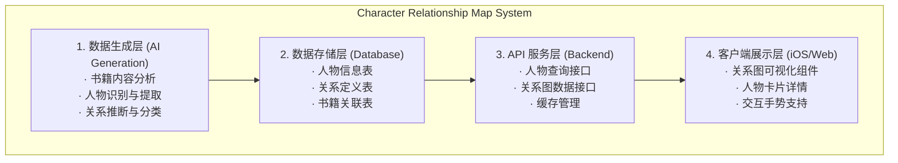
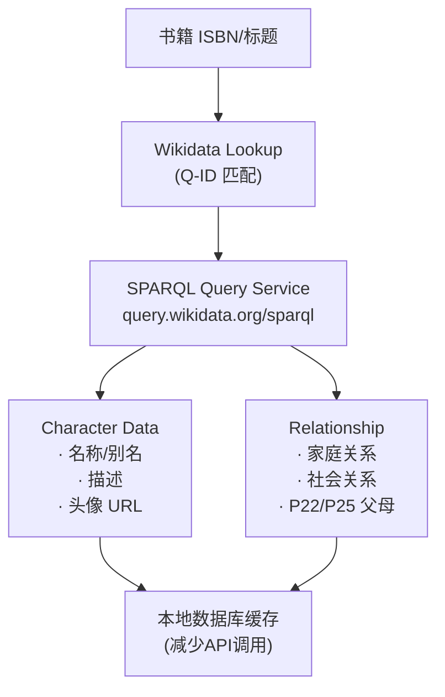

# Readmigo 人物关系图功能设计文档

> Version: 1.0.0
> Status: Draft
> Author: System Architect
> Date: 2025-12-27

---

## 1. 概述

### 1.1 功能目标

为每本书提供**可视化的人物关系图**，帮助读者：
- 快速理解书中人物之间的复杂关系
- 在阅读过程中随时查阅人物信息
- 避免因人物众多而产生的阅读困惑
- 增强对故事情节的理解和记忆

### 1.2 核心价值

| 价值点 | 说明 |
|--------|------|
| **阅读辅助** | 帮助读者厘清复杂的人物关系网络 |
| **记忆强化** | 通过可视化方式加深人物印象 |
| **沉浸体验** | 随时可查，不打断阅读节奏 |
| **AI 驱动** | 自动生成，持续优化 |

---

## 2. 功能架构

### 2.1 系统架构图

### 2.2 关系类型定义

---

## 3. 数据模型设计

### 3.1 Prisma Schema

### 3.2 关系图数据结构

---

## 4. API 设计

### 4.1 接口定义

### 4.2 服务实现

---

## 5. iOS 客户端实现

### 5.1 数据模型

### 5.2 关系图视图组件

### 5.3 人物详情卡片

---

## 6. AI 数据生成

### 6.1 人物提取 Prompt

### 6.2 数据生成服务

---

## 7. 实施计划

### Phase 1: 数据层 (第1周)
- [ ] 数据库 Schema 设计与迁移
- [ ] 基础 API 实现
- [ ] 人物和关系的 CRUD 操作

### Phase 2: AI 生成 (第2周)
- [ ] 人物提取 Prompt 优化
- [ ] AI 服务集成
- [ ] 批量数据生成任务

### Phase 3: 客户端展示 (第3周)
- [ ] 关系图可视化组件
- [ ] 人物详情卡片
- [ ] 手势交互支持

### Phase 4: 优化完善 (第4周)
- [ ] 布局算法优化
- [ ] 性能优化（大量节点）
- [ ] 剧透控制功能

---

## 8. 待确认事项

1. **头像生成**: 是否需要为人物生成 AI 头像？
2. **多语言**: 是否支持中英文双语人物名？
3. **用户编辑**: 是否允许用户编辑/补充人物信息？
4. **阅读进度联动**: 是否根据阅读进度逐步显示人物？
5. **分享功能**: 是否支持分享人物关系图？

---

**Document Status**: Draft
**Next Steps**: 请 review 后提出修改意见

---

## 9. 非 AI 实现方案

> 本节探讨在完全不使用 AI 的情况下如何实现人物关系图功能

### 9.1 方案概览

| 方案 | 成本 | 数据质量 | 覆盖范围 | 可扩展性 | 推荐度 |
|------|------|----------|----------|----------|--------|
| **Wikidata/DBpedia** | 低 | 高（经人工审核） | 中（仅知名书籍） | 高 | ⭐⭐⭐⭐ |
| **BookNLP (NLP工具)** | 中 | 中 | 高（任意书籍） | 中 | ⭐⭐⭐ |
| **人工编辑策划** | 高 | 最高 | 低 | 低 | ⭐⭐ |
| **众包社区** | 中 | 中-高 | 中 | 中 | ⭐⭐⭐ |
| **混合方案** | 中-高 | 高 | 高 | 高 | ⭐⭐⭐⭐⭐ |

---

### 9.2 方案一：Wikidata/DBpedia 结构化数据

#### 9.2.1 原理说明

Wikidata 和 DBpedia 是两个大规模的开放知识图谱，包含了大量书籍和虚构人物的结构化数据：

- **Wikidata P674 属性（characters）**：表示"出现在该作品中的角色"
- **Wikidata P1441 属性（present in work）**：反向属性，表示"该角色出现在哪些作品中"
- **DBpedia**：从 Wikipedia 信息框自动提取的结构化数据，包含超过 23,000 本书籍

#### 9.2.2 数据可用性

#### 9.2.3 SPARQL 查询示例

#### 9.2.4 实现架构

#### 9.2.5 代码实现

#### 9.2.6 优缺点分析

| 优点 | 缺点 |
|------|------|
| ✅ 数据质量高，经人工审核 | ❌ 仅覆盖知名书籍 |
| ✅ 完全免费，开放数据 | ❌ 中文网文/小众书籍无数据 |
| ✅ 结构化关系数据丰富 | ❌ 更新可能滞后 |
| ✅ 支持多语言 | ❌ 需要 ISBN/标题精确匹配 |
| ✅ SPARQL 查询灵活 | ❌ API 调用有频率限制 |

---

### 9.3 方案二：BookNLP（传统 NLP 工具）

#### 9.3.1 工具介绍

[BookNLP](https://github.com/booknlp/booknlp) 是专为书籍长文本设计的 NLP 流水线，由 David Bamman 开发，不使用大语言模型，而是基于传统机器学习方法：

- **命名实体识别 (NER)**：识别人名、地名、组织名等
- **共指消解 (Coreference Resolution)**：将 "Tom"、"Tom Sawyer"、"Mr. Sawyer" 关联为同一人物
- **引语归属 (Quote Attribution)**：识别对话属于哪个角色
- **角色性别推断**：基于代词使用推断角色性别

#### 9.3.2 技术原理

#### 9.3.3 输出数据格式

#### 9.3.4 集成实现

#### 9.3.5 关系提取（需要额外处理）

BookNLP 本身不直接输出人物关系，需要通过以下方式推断：

#### 9.3.6 优缺点分析

| 优点 | 缺点 |
|------|------|
| ✅ 可处理任意书籍文本 | ❌ 仅支持英文（有法语版本） |
| ✅ 不依赖外部 API | ❌ 关系推断不直接，需要额外处理 |
| ✅ 开源免费 | ❌ 需要服务器运行 Python |
| ✅ 共指消解效果好 | ❌ 处理速度较慢（一本书约 5-10 分钟） |
| ✅ 可本地部署 | ❌ 准确率约 88-90%，有误识别 |

---

### 9.4 方案三：人工编辑策划

#### 9.4.1 工作流程

#### 9.4.2 后台管理界面设计

#### 9.4.3 成本估算

| 项目 | 时间/本书 | 成本/本书 |
|------|----------|----------|
| 简单书籍（<10人物） | 0.5-1 小时 | ¥50-100 |
| 中等书籍（10-30人物） | 2-4 小时 | ¥200-400 |
| 复杂书籍（>30人物） | 6-10 小时 | ¥600-1000 |

#### 9.4.4 优缺点分析

| 优点 | 缺点 |
|------|------|
| ✅ 数据质量最高 | ❌ 成本高，难以规模化 |
| ✅ 可处理任何语言/类型书籍 | ❌ 速度慢 |
| ✅ 关系标注精准 | ❌ 需要专业编辑团队 |
| ✅ 可控制剧透级别 | ❌ 人力资源有限 |

---

### 9.5 方案四：众包社区

#### 9.5.1 借鉴案例

- **Wookieepedia**：星球大战粉丝维基，包含详细角色关系
- **Fandom Wikis**：各类作品的粉丝维基
- **豆瓣读书**：用户评论中包含角色讨论

#### 9.5.2 实现方式

#### 9.5.3 数据模型扩展

---

### 9.6 推荐方案：混合策略

#### 9.6.1 分层数据来源

#### 9.6.2 数据融合服务

#### 9.6.3 数据源标识

---

### 9.7 各方案对比总结

| 维度 | Wikidata | BookNLP | 人工编辑 | 众包 | 混合方案 |
|------|----------|---------|----------|------|----------|
| **覆盖范围** | 知名书籍 | 英文书籍 | 精选书籍 | 长尾书籍 | 全部书籍 |
| **数据质量** | 高 | 中 | 最高 | 中-高 | 高 |
| **关系完整度** | 中 | 低 | 高 | 中 | 高 |
| **中文支持** | 部分 | ❌ | ✅ | ✅ | ✅ |
| **成本** | 低 | 中 | 高 | 中 | 中 |
| **可扩展性** | 高 | 中 | 低 | 高 | 高 |
| **维护成本** | 低 | 中 | 高 | 中 | 中 |

---

### 9.8 实施建议

#### Phase 1: MVP（快速上线）
1. 集成 Wikidata API，覆盖经典/知名书籍
2. 人工编辑 Top 50 热门书籍
3. 支持用户反馈"数据不准确"

#### Phase 2: 扩展覆盖
1. 部署 BookNLP 服务处理英文书籍
2. 开放用户贡献功能
3. 建立审核流程

#### Phase 3: 持续优化
1. 根据用户贡献改进数据
2. 考虑接入 AI 辅助（可选）
3. 探索与出版社合作获取官方数据

---

### 9.9 相关资源链接

- [Wikidata SPARQL 教程](https://www.wikidata.org/wiki/Wikidata:SPARQL_tutorial)
- [Wikidata P674 (characters) 属性](https://www.wikidata.org/wiki/Property:P674)
- [BookNLP GitHub](https://github.com/booknlp/booknlp)
- [CMU Book Summary Dataset](https://www.cs.cmu.edu/~dbamman/booksummaries.html)
- [HTRC BookNLP Dataset](https://wiki.htrc.illinois.edu/display/COM/HTRC+BookNLP+Dataset+for+English-Language+Fiction)
- [Stanford NER](https://nlp.stanford.edu/software/CRF-NER.html)
- [DBpedia](http://dbpedia.org/)

---

## 实施进度

| 版本 | 状态 | 完成度 | 更新日期 | 说明 |
|------|------|--------|----------|------|
| v1.0 | 📝 设计中 | 0% | 2025-12-27 | 设计文档完成 |
