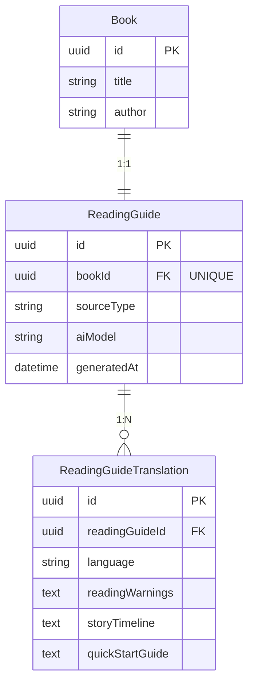

# 阅读指南系统设计文档

> 模块名称: Reading Guide Module
> 状态: ✅ 已实现 (待数据填充)
> 优先级: P1

---

## 1. 功能概述

阅读指南为跨文化阅读者提供针对每本书的个性化阅读建议，帮助读者快速进入阅读状态、了解故事脉络、避开文化理解障碍。

### 1.1 核心功能

| 功能 | 说明 | 状态 |
|------|------|------|
| 阅读注意事项 | 跨文化阅读难点提醒 (如法语词汇、战争描写等) | ✅ 已实现 |
| 故事线 | 剧情梗概和故事脉络 | ✅ 已实现 |
| 快速进入阅读 | 降低认知门槛的建议 (如背景知识补充) | ✅ 已实现 |
| 多语言支持 | 支持 en / zh-Hans / zh-Hant | ✅ 已实现 |
| AI 生成标识 | 显示内容来源 (AI 生成 / 人工编写) | ✅ 已实现 |

### 1.2 目标用户

- 非母语阅读者 (ESL 学习者)
- 对西方文化背景不熟悉的读者
- 希望快速了解书籍内容的读者

---

## 2. 数据模型

### 2.1 实体关系图

### 2.2 ReadingGuide 字段说明

| 字段 | 类型 | 说明 |
|------|------|------|
| id | UUID | 主键 |
| bookId | UUID | 关联书籍 (一对一, 唯一) |
| sourceType | ENUM | AI_GENERATED / MANUAL |
| aiModel | VARCHAR(50) | AI 模型名称 (如 claude-3-5-sonnet) |
| generatedAt | TIMESTAMP | 生成时间 |
| createdAt | TIMESTAMP | 创建时间 |
| updatedAt | TIMESTAMP | 更新时间 |

### 2.3 ReadingGuideTranslation 字段说明

| 字段 | 类型 | 说明 |
|------|------|------|
| id | UUID | 主键 |
| readingGuideId | UUID | 关联阅读指南 |
| language | VARCHAR(10) | 语言代码 (en, zh-Hans, zh-Hant) |
| readingWarnings | TEXT | 阅读注意事项 |
| storyTimeline | TEXT | 故事线/剧情梗概 |
| quickStartGuide | TEXT | 快速进入阅读建议 |

**唯一约束**: (readingGuideId, language)

---

## 3. API 设计

### 3.1 获取阅读指南

**请求头**

| Header | 说明 | 示例 |
|--------|------|------|
| Accept-Language | 首选语言 | zh-Hans, zh-Hant, en |

**响应字段**

| 字段 | 类型 | 说明 |
|------|------|------|
| id | string | 阅读指南 ID |
| bookId | string | 书籍 ID |
| sourceType | string | AI_GENERATED / MANUAL |
| aiModel | string? | AI 模型名称 |
| generatedAt | string | ISO 时间戳 |
| readingWarnings | string? | 阅读注意事项 (已本地化) |
| storyTimeline | string? | 故事线 (已本地化) |
| quickStartGuide | string? | 快速进入阅读 (已本地化) |
| locale | string? | 当前返回的语言 |
| availableTranslations | string[] | 可用翻译列表 |

**响应示例场景**

| 场景 | 状态码 | 返回值 |
|------|--------|--------|
| 有数据 | 200 | 完整对象 |
| 无数据 | 200 | null |
| 书籍不存在 | 404 | 错误信息 |

---

## 4. UI 设计

### 4.1 页面位置

### 4.2 组件结构

### 4.3 交互行为

| 操作 | 行为 |
|------|------|
| 初始状态 | 所有卡片默认展开 |
| 点击卡片标题 | 切换展开/折叠状态 |
| 折叠状态 | 仅显示标题 + ▼ 图标 |
| 展开状态 | 显示标题 + ▲ 图标 + 完整内容 |
| 无数据时 | 整个区域不显示 |
| 加载中 | 显示加载指示器 |

### 4.4 图标对照

| 区域 | SF Symbol |
|------|-----------|
| 阅读指南标题 | book.and.wrench |
| 阅读注意事项 | exclamationmark.triangle |
| 故事线 | text.book.closed |
| 快速进入阅读 | bolt.fill |
| AI 生成标识 | sparkles |
| 展开 | chevron.up |
| 折叠 | chevron.down |

---

## 5. 本地化

### 5.1 UI 字符串

| Key | English | 简体中文 | 繁體中文 |
|-----|---------|----------|----------|
| readingGuide.title | Reading Guide | 阅读指南 | 閱讀指南 |
| readingGuide.loading | Loading reading guide... | 加载阅读指南中... | 載入閱讀指南中... |
| readingGuide.warnings | Reading Notes | 阅读注意事项 | 閱讀注意事項 |
| readingGuide.storyTimeline | Story Timeline | 故事线 | 故事線 |
| readingGuide.quickStart | Quick Start | 快速进入阅读 | 快速進入閱讀 |
| readingGuide.aiGenerated | AI Generated | AI 生成 | AI 生成 |

---

## 6. 文件清单

### 6.1 后端

| 文件路径 | 说明 |
|----------|------|
| packages/database/prisma/schema.prisma | 数据模型定义 |
| apps/backend/src/modules/books/dto/index.ts | DTO 定义 |
| apps/backend/src/modules/books/books.service.ts | 服务层逻辑 |
| apps/backend/src/modules/books/books.controller.ts | API 端点 |

### 6.2 iOS

| 文件路径 | 说明 |
|----------|------|
| ios/Readmigo/Core/Models/Book.swift | ReadingGuide 数据模型 |
| ios/Readmigo/Core/Network/APIEndpoints.swift | API 端点定义 |
| ios/Readmigo/Features/Library/Components/ReadingGuideSection.swift | UI 组件 |
| ios/Readmigo/Features/Library/BookDetailView.swift | 页面集成 |
| ios/Readmigo/Localizable.xcstrings | 本地化字符串 |

---

## 7. 待办事项

| 任务 | 优先级 | 状态 |
|------|--------|------|
| 为 200+ 本书生成阅读指南内容 | P1 | 🔲 待开始 |
| Android 端实现 | P2 | 🔲 待开始 |
| 用户反馈机制 (内容有误) | P3 | 🔲 待开始 |

---

## 8. 更新日志

| 日期 | 版本 | 说明 |
|------|------|------|
| 2025-01-06 | v1.0 | 初始实现 (数据库 + 后端 + iOS) |
