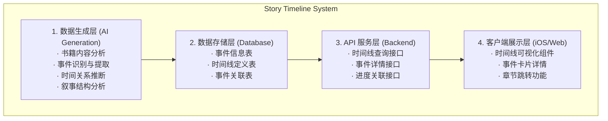

# Readmigo 故事时间线功能设计文档

> Version: 1.0.0
> Status: Draft
> Author: System Architect
> Date: 2025-12-27

---

## 1. 概述

### 1.1 功能目标

为每本书提供**可视化的故事时间线**，帮助读者：
- 清晰了解故事的时间脉络和事件发展
- 回顾已读情节，快速定位关键事件
- 理解复杂的叙事结构（倒叙、插叙等）
- 把握故事的节奏和高潮分布

### 1.2 核心价值

| 价值点 | 说明 |
|--------|------|
| **情节梳理** | 帮助读者理清复杂的故事线 |
| **记忆辅助** | 方便回顾和定位关键情节 |
| **阅读导航** | 快速跳转到感兴趣的事件 |
| **理解深化** | 揭示叙事结构和时间关系 |

---

## 2. 功能架构

### 2.1 系统架构图



### 2.2 事件类型定义

```
┌─────────────────────────────────────────────────────────────────────────┐
│                          Event Types                                     │
├─────────────────────────────────────────────────────────────────────────┤
│                                                                          │
│  ┌─────────────┐  ┌─────────────┐  ┌─────────────┐  ┌─────────────┐    │
│  │   MAJOR     │  │   TURNING   │  │  CHARACTER  │  │   WORLD     │    │
│  │   重大事件   │  │   转折点    │  │   人物事件   │  │   背景事件   │    │
│  │             │  │             │  │             │  │             │    │
│  │  • 核心情节 │  │  • 剧情反转 │  │  • 人物登场 │  │  • 历史背景 │    │
│  │  • 主线推进 │  │  • 重要抉择 │  │  • 人物退场 │  │  • 世界设定 │    │
│  │  • 高潮场景 │  │  • 命运转变 │  │  • 性格变化 │  │  • 时代背景 │    │
│  │  • 结局事件 │  │  • 真相揭露 │  │  • 关系变化 │  │  • 地理信息 │    │
│  └─────────────┘  └─────────────┘  └─────────────┘  └─────────────┘    │
│                                                                          │
│  ┌─────────────┐  ┌─────────────┐  ┌─────────────┐  ┌─────────────┐    │
│  │   CONFLICT  │  │  DISCOVERY  │  │   SUBPLOT   │  │  FORESHADOW │    │
│  │   冲突事件   │  │   发现揭示   │  │   支线情节   │  │   伏笔暗示   │    │
│  │             │  │             │  │             │  │             │    │
│  │  • 人物冲突 │  │  • 秘密揭露 │  │  • 副线发展 │  │  • 预示未来 │    │
│  │  • 势力对抗 │  │  • 线索发现 │  │  • 插曲事件 │  │  • 象征暗示 │    │
│  │  • 内心挣扎 │  │  • 身份揭晓 │  │  • 背景补充 │  │  • 回响呼应 │    │
│  │  • 危机事件 │  │  • 真相大白 │  │  • 平行事件 │  │  • 线索铺垫 │    │
│  └─────────────┘  └─────────────┘  └─────────────┘  └─────────────┘    │
│                                                                          │
└─────────────────────────────────────────────────────────────────────────┘
```

### 2.3 时间维度

```
┌─────────────────────────────────────────────────────────────────────────┐
│                       Time Dimensions                                    │
├─────────────────────────────────────────────────────────────────────────┤
│                                                                          │
│  ┌─────────────────────────────────────────────────────────────────┐    │
│  │                    故事内时间 (Story Time)                        │    │
│  │    故事世界中事件发生的时间顺序                                    │    │
│  │    例：公元1920年 → 1921年 → 1922年                               │    │
│  └─────────────────────────────────────────────────────────────────┘    │
│                                                                          │
│  ┌─────────────────────────────────────────────────────────────────┐    │
│  │                    叙事时间 (Narrative Time)                      │    │
│  │    作者讲述事件的顺序（可能有倒叙、插叙）                          │    │
│  │    例：第1章(现在) → 第2章(回忆) → 第3章(现在)                    │    │
│  └─────────────────────────────────────────────────────────────────┘    │
│                                                                          │
│  ┌─────────────────────────────────────────────────────────────────┐    │
│  │                    阅读时间 (Reading Time)                        │    │
│  │    读者阅读的进度，用于控制剧透显示                                │    │
│  │    例：已读到第15章，只显示前15章的事件                           │    │
│  └─────────────────────────────────────────────────────────────────┘    │
│                                                                          │
└─────────────────────────────────────────────────────────────────────────┘
```

---

## 3. 数据模型设计

### 3.1 Prisma Schema

```prisma
// packages/database/prisma/schema.prisma

// 故事事件表
model StoryEvent {
  id                String              @id @default(uuid())

  // 关联书籍
  bookId            String
  book              Book                @relation(fields: [bookId], references: [id], onDelete: Cascade)

  // 基本信息
  title             String              // 事件标题
  description       String              // 事件描述
  type              EventType           // 事件类型
  importance        EventImportance     // 重要程度

  // 时间信息
  storyTime         String?             // 故事内时间（文本描述）
  storyTimeOrder    Int                 // 故事时间排序
  narrativeOrder    Int                 // 叙事顺序（章节出现顺序）

  // 章节关联
  chapterNumber     Int                 // 所在章节号
  chapterTitle      String?             // 章节标题
  pageStart         Int?                // 开始页码
  pageEnd           Int?                // 结束页码

  // 相关人物
  involvedCharacters String[]           // 涉及的人物ID列表

  // 位置信息
  location          String?             // 发生地点

  // 剧透控制
  spoilerLevel      Int                 @default(0)  // 剧透等级 0-3

  // 视觉元素
  iconType          String?             // 图标类型
  color             String?             // 主题色

  // 元数据
  metadata          Json?

  // 时间戳
  createdAt         DateTime            @default(now())
  updatedAt         DateTime            @updatedAt

  // 事件关联
  causedBy          EventConnection[]   @relation("CausedEvents")
  causes            EventConnection[]   @relation("CausingEvents")

  @@index([bookId])
  @@index([type])
  @@index([storyTimeOrder])
  @@index([narrativeOrder])
  @@index([chapterNumber])
}

// 事件关联表（因果关系、呼应关系等）
model EventConnection {
  id                String              @id @default(uuid())

  // 关联事件
  fromEventId       String
  fromEvent         StoryEvent          @relation("CausingEvents", fields: [fromEventId], references: [id], onDelete: Cascade)

  toEventId         String
  toEvent           StoryEvent          @relation("CausedEvents", fields: [toEventId], references: [id], onDelete: Cascade)

  // 关联类型
  connectionType    EventConnectionType

  // 描述
  description       String?

  createdAt         DateTime            @default(now())

  @@unique([fromEventId, toEventId, connectionType])
  @@index([fromEventId])
  @@index([toEventId])
}

// 时间线配置表
model TimelineConfig {
  id                String              @id @default(uuid())

  bookId            String              @unique
  book              Book                @relation(fields: [bookId], references: [id], onDelete: Cascade)

  // 时间线元数据
  totalEvents       Int                 @default(0)
  timeSpan          String?             // 故事跨度描述
  hasFlashback      Boolean             @default(false)  // 是否有倒叙
  hasParallelPlot   Boolean             @default(false)  // 是否有平行情节

  // 显示配置
  defaultView       TimelineView        @default(STORY_TIME)
  showCharacterIcons Boolean            @default(true)

  // 生成状态
  generationStatus  GenerationStatus    @default(PENDING)
  lastGeneratedAt   DateTime?

  createdAt         DateTime            @default(now())
  updatedAt         DateTime            @updatedAt
}

// 枚举定义
enum EventType {
  MAJOR             // 重大事件
  TURNING_POINT     // 转折点
  CHARACTER         // 人物事件
  WORLD_BUILDING    // 世界背景
  CONFLICT          // 冲突事件
  DISCOVERY         // 发现揭示
  SUBPLOT           // 支线情节
  FORESHADOW        // 伏笔暗示
}

enum EventImportance {
  CRITICAL          // 关键（必须了解）
  HIGH              // 重要
  MEDIUM            // 中等
  LOW               // 次要
}

enum EventConnectionType {
  CAUSES            // 因果关系：A导致B
  FORESHADOWS       // 伏笔关系：A预示B
  PARALLELS         // 平行关系：A与B平行
  CONTRASTS         // 对比关系：A与B对比
  REFERENCES        // 引用关系：B引用A
}

enum TimelineView {
  STORY_TIME        // 故事时间顺序
  NARRATIVE_ORDER   // 叙事顺序
  CHARACTER_FOCUS   // 人物视角
}

enum GenerationStatus {
  PENDING           // 待生成
  GENERATING        // 生成中
  COMPLETED         // 已完成
  FAILED            // 失败
}
```

### 3.2 时间线数据结构

```typescript
// TimelineData.ts - 时间线数据结构

interface StoryEvent {
  id: string;
  title: string;
  description: string;
  type: EventType;
  importance: EventImportance;

  // 时间信息
  storyTime?: string;
  storyTimeOrder: number;
  narrativeOrder: number;

  // 章节信息
  chapterNumber: number;
  chapterTitle?: string;

  // 关联
  involvedCharacters: string[];
  location?: string;

  // 视觉
  iconType?: string;
  color?: string;

  // 剧透
  spoilerLevel: number;
}

interface EventConnection {
  fromEventId: string;
  toEventId: string;
  type: EventConnectionType;
  description?: string;
}

interface Timeline {
  bookId: string;
  events: StoryEvent[];
  connections: EventConnection[];
  config: {
    timeSpan?: string;
    hasFlashback: boolean;
    hasParallelPlot: boolean;
  };
  metadata: {
    totalEvents: number;
    criticalEvents: number;
    lastUpdated: string;
  };
}

// 时间线视图数据
interface TimelineViewData {
  // 按故事时间排序的事件
  storyTimeView: TimelineSection[];
  // 按叙事顺序排序的事件
  narrativeView: TimelineSection[];
  // 按人物分组的事件
  characterView: CharacterTimeline[];
}

interface TimelineSection {
  label: string;          // 时间段标签（如"第一年"、"童年"）
  events: StoryEvent[];
}

interface CharacterTimeline {
  characterId: string;
  characterName: string;
  events: StoryEvent[];
}
```

---

## 4. API 设计

### 4.1 接口定义

```typescript
// Timeline API Endpoints

// GET /api/v1/books/:bookId/timeline
// 获取书籍时间线
interface GetTimelineRequest {
  bookId: string;
  view?: TimelineView;        // 视图类型
  spoilerLevel?: number;      // 剧透控制
  readProgress?: number;      // 阅读进度（章节号）
  characterId?: string;       // 筛选特定人物相关事件
  eventTypes?: EventType[];   // 筛选事件类型
}

interface GetTimelineResponse {
  timeline: Timeline;
  viewData: TimelineViewData;
  filters: {
    types: EventType[];
    characters: { id: string; name: string }[];
    importance: EventImportance[];
  };
}

// GET /api/v1/books/:bookId/timeline/events/:eventId
// 获取事件详情
interface GetEventDetailResponse {
  event: StoryEvent;
  characters: BookCharacter[];
  connections: {
    event: StoryEvent;
    connectionType: EventConnectionType;
    direction: 'from' | 'to';
  }[];
  context: {
    previousEvent?: StoryEvent;
    nextEvent?: StoryEvent;
  };
}

// GET /api/v1/books/:bookId/timeline/chapter/:chapterNumber
// 获取章节事件
interface GetChapterEventsResponse {
  chapterNumber: number;
  chapterTitle?: string;
  events: StoryEvent[];
}

// POST /api/v1/books/:bookId/timeline/generate
// 触发时间线生成
interface GenerateTimelineRequest {
  bookId: string;
  forceRegenerate?: boolean;
}

interface GenerateTimelineResponse {
  status: GenerationStatus;
  taskId: string;
}
```

### 4.2 服务实现

```typescript
// TimelineService.ts

@Injectable()
export class TimelineService {
  constructor(
    private prisma: PrismaService,
    private cacheService: CacheService,
    private characterService: CharacterService,
  ) {}

  // 获取书籍时间线
  async getTimeline(
    bookId: string,
    options: {
      view?: TimelineView;
      spoilerLevel?: number;
      readProgress?: number;
      characterId?: string;
      eventTypes?: EventType[];
    } = {},
  ): Promise<TimelineViewData> {
    const { view = 'STORY_TIME', spoilerLevel = 3, readProgress, characterId, eventTypes } = options;

    // 构建查询条件
    const where: any = {
      bookId,
      spoilerLevel: { lte: spoilerLevel },
    };

    if (readProgress) {
      where.chapterNumber = { lte: readProgress };
    }

    if (characterId) {
      where.involvedCharacters = { has: characterId };
    }

    if (eventTypes?.length) {
      where.type = { in: eventTypes };
    }

    // 获取事件
    const events = await this.prisma.storyEvent.findMany({
      where,
      orderBy: view === 'NARRATIVE_ORDER'
        ? { narrativeOrder: 'asc' }
        : { storyTimeOrder: 'asc' },
    });

    // 获取事件关联
    const eventIds = events.map(e => e.id);
    const connections = await this.prisma.eventConnection.findMany({
      where: {
        OR: [
          { fromEventId: { in: eventIds } },
          { toEventId: { in: eventIds } },
        ],
      },
    });

    // 构建视图数据
    return this.buildViewData(events, connections, view);
  }

  // 构建视图数据
  private buildViewData(
    events: StoryEvent[],
    connections: EventConnection[],
    view: TimelineView,
  ): TimelineViewData {
    // 按故事时间分组
    const storyTimeView = this.groupByStoryTime(events);

    // 按叙事顺序分组（按章节）
    const narrativeView = this.groupByChapter(events);

    // 按人物分组
    const characterView = this.groupByCharacter(events);

    return {
      storyTimeView,
      narrativeView,
      characterView,
    };
  }

  // 按故事时间分组
  private groupByStoryTime(events: StoryEvent[]): TimelineSection[] {
    const sorted = [...events].sort((a, b) => a.storyTimeOrder - b.storyTimeOrder);

    // 智能分组逻辑
    const sections: TimelineSection[] = [];
    let currentSection: TimelineSection | null = null;

    for (const event of sorted) {
      const timeLabel = this.getTimeLabel(event);

      if (!currentSection || currentSection.label !== timeLabel) {
        currentSection = { label: timeLabel, events: [] };
        sections.push(currentSection);
      }

      currentSection.events.push(event);
    }

    return sections;
  }

  // 按章节分组
  private groupByChapter(events: StoryEvent[]): TimelineSection[] {
    const grouped = new Map<number, StoryEvent[]>();

    for (const event of events) {
      const chapter = event.chapterNumber;
      if (!grouped.has(chapter)) {
        grouped.set(chapter, []);
      }
      grouped.get(chapter)!.push(event);
    }

    return Array.from(grouped.entries())
      .sort(([a], [b]) => a - b)
      .map(([chapter, events]) => ({
        label: events[0].chapterTitle || `第${chapter}章`,
        events: events.sort((a, b) => a.narrativeOrder - b.narrativeOrder),
      }));
  }

  // 按人物分组
  private groupByCharacter(events: StoryEvent[]): CharacterTimeline[] {
    const characterEvents = new Map<string, StoryEvent[]>();

    for (const event of events) {
      for (const charId of event.involvedCharacters) {
        if (!characterEvents.has(charId)) {
          characterEvents.set(charId, []);
        }
        characterEvents.get(charId)!.push(event);
      }
    }

    return Array.from(characterEvents.entries()).map(([charId, events]) => ({
      characterId: charId,
      characterName: '', // 需要从人物服务获取
      events: events.sort((a, b) => a.storyTimeOrder - b.storyTimeOrder),
    }));
  }

  // 获取时间标签
  private getTimeLabel(event: StoryEvent): string {
    if (event.storyTime) {
      return event.storyTime;
    }
    // 根据 storyTimeOrder 生成标签
    const order = event.storyTimeOrder;
    if (order < 100) return '序幕';
    if (order < 300) return '开端';
    if (order < 600) return '发展';
    if (order < 800) return '高潮';
    return '结局';
  }

  // 获取事件详情
  async getEventDetail(eventId: string): Promise<{
    event: StoryEvent;
    characters: BookCharacter[];
    connections: any[];
    context: any;
  }> {
    const event = await this.prisma.storyEvent.findUnique({
      where: { id: eventId },
    });

    if (!event) {
      throw new NotFoundException('Event not found');
    }

    // 获取相关人物
    const characters = await this.prisma.bookCharacter.findMany({
      where: { id: { in: event.involvedCharacters } },
    });

    // 获取关联事件
    const connections = await this.prisma.eventConnection.findMany({
      where: {
        OR: [
          { fromEventId: eventId },
          { toEventId: eventId },
        ],
      },
      include: {
        fromEvent: true,
        toEvent: true,
      },
    });

    // 获取上下文（前后事件）
    const [previousEvent, nextEvent] = await Promise.all([
      this.prisma.storyEvent.findFirst({
        where: {
          bookId: event.bookId,
          narrativeOrder: { lt: event.narrativeOrder },
        },
        orderBy: { narrativeOrder: 'desc' },
      }),
      this.prisma.storyEvent.findFirst({
        where: {
          bookId: event.bookId,
          narrativeOrder: { gt: event.narrativeOrder },
        },
        orderBy: { narrativeOrder: 'asc' },
      }),
    ]);

    return {
      event,
      characters,
      connections: connections.map(c => ({
        event: c.fromEventId === eventId ? c.toEvent : c.fromEvent,
        connectionType: c.connectionType,
        direction: c.fromEventId === eventId ? 'to' : 'from',
      })),
      context: { previousEvent, nextEvent },
    };
  }
}
```

---

## 5. iOS 客户端实现

### 5.1 数据模型

```swift
// TimelineModels.swift

import Foundation
import SwiftUI

struct StoryEvent: Identifiable, Codable {
    let id: String
    let title: String
    let description: String
    let type: EventType
    let importance: EventImportance

    let storyTime: String?
    let storyTimeOrder: Int
    let narrativeOrder: Int

    let chapterNumber: Int
    let chapterTitle: String?

    let involvedCharacters: [String]
    let location: String?

    let iconType: String?
    let color: String?
    let spoilerLevel: Int
}

struct TimelineSection: Identifiable {
    let id = UUID()
    let label: String
    let events: [StoryEvent]
}

enum EventType: String, Codable, CaseIterable {
    case major = "MAJOR"
    case turningPoint = "TURNING_POINT"
    case character = "CHARACTER"
    case worldBuilding = "WORLD_BUILDING"
    case conflict = "CONFLICT"
    case discovery = "DISCOVERY"
    case subplot = "SUBPLOT"
    case foreshadow = "FORESHADOW"

    var displayName: String {
        switch self {
        case .major: return "重大事件"
        case .turningPoint: return "转折点"
        case .character: return "人物事件"
        case .worldBuilding: return "世界背景"
        case .conflict: return "冲突"
        case .discovery: return "发现"
        case .subplot: return "支线"
        case .foreshadow: return "伏笔"
        }
    }

    var icon: String {
        switch self {
        case .major: return "star.fill"
        case .turningPoint: return "arrow.triangle.turn.up.right.diamond.fill"
        case .character: return "person.fill"
        case .worldBuilding: return "globe"
        case .conflict: return "bolt.fill"
        case .discovery: return "lightbulb.fill"
        case .subplot: return "arrow.triangle.branch"
        case .foreshadow: return "eye.fill"
        }
    }

    var color: Color {
        switch self {
        case .major: return .yellow
        case .turningPoint: return .red
        case .character: return .blue
        case .worldBuilding: return .green
        case .conflict: return .orange
        case .discovery: return .purple
        case .subplot: return .gray
        case .foreshadow: return .cyan
        }
    }
}

enum EventImportance: String, Codable, CaseIterable {
    case critical = "CRITICAL"
    case high = "HIGH"
    case medium = "MEDIUM"
    case low = "LOW"

    var dotSize: CGFloat {
        switch self {
        case .critical: return 16
        case .high: return 12
        case .medium: return 10
        case .low: return 8
        }
    }
}

enum TimelineView: String, CaseIterable {
    case storyTime = "STORY_TIME"
    case narrativeOrder = "NARRATIVE_ORDER"
    case characterFocus = "CHARACTER_FOCUS"

    var displayName: String {
        switch self {
        case .storyTime: return "故事时间"
        case .narrativeOrder: return "叙事顺序"
        case .characterFocus: return "人物视角"
        }
    }
}
```

### 5.2 时间线视图组件

```swift
// StoryTimelineView.swift

import SwiftUI

struct StoryTimelineView: View {
    let bookId: String
    @StateObject private var viewModel = TimelineViewModel()
    @State private var selectedView: TimelineView = .storyTime
    @State private var selectedEvent: StoryEvent?
    @State private var showFilters = false

    var body: some View {
        ZStack {
            // 背景
            Color(.systemBackground)
                .ignoresSafeArea()

            if viewModel.isLoading {
                ProgressView("加载时间线...")
            } else {
                VStack(spacing: 0) {
                    // 视图切换
                    ViewSwitcher(selectedView: $selectedView)
                        .padding(.horizontal)
                        .padding(.top, 8)

                    // 时间线内容
                    ScrollView {
                        LazyVStack(spacing: 0) {
                            ForEach(currentSections) { section in
                                TimelineSectionView(
                                    section: section,
                                    selectedEvent: $selectedEvent
                                )
                            }
                        }
                        .padding()
                    }
                }
            }
        }
        .navigationTitle("故事时间线")
        .navigationBarTitleDisplayMode(.inline)
        .toolbar {
            ToolbarItem(placement: .navigationBarTrailing) {
                Button {
                    showFilters.toggle()
                } label: {
                    Image(systemName: "line.3.horizontal.decrease.circle")
                }
            }
        }
        .sheet(item: $selectedEvent) { event in
            EventDetailSheet(event: event, bookId: bookId)
        }
        .sheet(isPresented: $showFilters) {
            TimelineFilterSheet(viewModel: viewModel)
        }
        .onAppear {
            viewModel.loadTimeline(bookId: bookId)
        }
    }

    private var currentSections: [TimelineSection] {
        switch selectedView {
        case .storyTime:
            return viewModel.storyTimeSections
        case .narrativeOrder:
            return viewModel.narrativeSections
        case .characterFocus:
            return viewModel.characterSections
        }
    }
}

// 视图切换器
struct ViewSwitcher: View {
    @Binding var selectedView: TimelineView

    var body: some View {
        Picker("视图", selection: $selectedView) {
            ForEach(TimelineView.allCases, id: \.self) { view in
                Text(view.displayName).tag(view)
            }
        }
        .pickerStyle(.segmented)
    }
}

// 时间线区段视图
struct TimelineSectionView: View {
    let section: TimelineSection
    @Binding var selectedEvent: StoryEvent?

    var body: some View {
        VStack(alignment: .leading, spacing: 0) {
            // 区段标题
            HStack {
                Text(section.label)
                    .font(.headline)
                    .foregroundColor(.primary)

                Spacer()

                Text("\(section.events.count)个事件")
                    .font(.caption)
                    .foregroundColor(.secondary)
            }
            .padding(.vertical, 12)

            // 事件列表
            ForEach(section.events) { event in
                TimelineEventRow(
                    event: event,
                    isLast: event.id == section.events.last?.id
                )
                .onTapGesture {
                    selectedEvent = event
                }
            }
        }
    }
}

// 时间线事件行
struct TimelineEventRow: View {
    let event: StoryEvent
    let isLast: Bool

    var body: some View {
        HStack(alignment: .top, spacing: 16) {
            // 时间线轴
            VStack(spacing: 0) {
                // 事件点
                ZStack {
                    Circle()
                        .fill(event.type.color.opacity(0.2))
                        .frame(width: event.importance.dotSize + 8,
                               height: event.importance.dotSize + 8)

                    Circle()
                        .fill(event.type.color)
                        .frame(width: event.importance.dotSize,
                               height: event.importance.dotSize)

                    Image(systemName: event.type.icon)
                        .font(.system(size: event.importance.dotSize * 0.5))
                        .foregroundColor(.white)
                }

                // 连接线
                if !isLast {
                    Rectangle()
                        .fill(Color.gray.opacity(0.3))
                        .frame(width: 2)
                        .frame(maxHeight: .infinity)
                }
            }
            .frame(width: 30)

            // 事件内容
            VStack(alignment: .leading, spacing: 6) {
                // 类型标签
                HStack(spacing: 8) {
                    EventTypeTag(type: event.type)

                    if event.importance == .critical {
                        Text("关键")
                            .font(.caption2)
                            .fontWeight(.bold)
                            .foregroundColor(.white)
                            .padding(.horizontal, 6)
                            .padding(.vertical, 2)
                            .background(Color.red)
                            .cornerRadius(4)
                    }

                    Spacer()

                    // 章节信息
                    Text("第\(event.chapterNumber)章")
                        .font(.caption)
                        .foregroundColor(.secondary)
                }

                // 标题
                Text(event.title)
                    .font(.subheadline)
                    .fontWeight(.medium)
                    .lineLimit(2)

                // 描述
                Text(event.description)
                    .font(.caption)
                    .foregroundColor(.secondary)
                    .lineLimit(3)

                // 故事时间
                if let storyTime = event.storyTime {
                    HStack(spacing: 4) {
                        Image(systemName: "clock")
                            .font(.caption2)
                        Text(storyTime)
                            .font(.caption2)
                    }
                    .foregroundColor(.secondary)
                }

                // 地点
                if let location = event.location {
                    HStack(spacing: 4) {
                        Image(systemName: "mappin")
                            .font(.caption2)
                        Text(location)
                            .font(.caption2)
                    }
                    .foregroundColor(.secondary)
                }
            }
            .padding(.vertical, 8)
        }
    }
}

// 事件类型标签
struct EventTypeTag: View {
    let type: EventType

    var body: some View {
        HStack(spacing: 4) {
            Image(systemName: type.icon)
                .font(.caption2)
            Text(type.displayName)
                .font(.caption2)
        }
        .foregroundColor(type.color)
        .padding(.horizontal, 8)
        .padding(.vertical, 4)
        .background(type.color.opacity(0.15))
        .cornerRadius(4)
    }
}
```

### 5.3 事件详情卡片

```swift
// EventDetailSheet.swift

import SwiftUI

struct EventDetailSheet: View {
    let event: StoryEvent
    let bookId: String
    @StateObject private var viewModel = EventDetailViewModel()
    @Environment(\.dismiss) private var dismiss

    var body: some View {
        NavigationView {
            ScrollView {
                VStack(alignment: .leading, spacing: 20) {
                    // 头部信息
                    EventHeader(event: event)

                    Divider()

                    // 事件描述
                    SectionCard(title: "事件详情") {
                        Text(event.description)
                            .font(.body)
                    }

                    // 相关人物
                    if !viewModel.characters.isEmpty {
                        SectionCard(title: "相关人物") {
                            ScrollView(.horizontal, showsIndicators: false) {
                                HStack(spacing: 12) {
                                    ForEach(viewModel.characters) { character in
                                        CharacterChip(character: character)
                                    }
                                }
                            }
                        }
                    }

                    // 关联事件
                    if !viewModel.connections.isEmpty {
                        SectionCard(title: "关联事件") {
                            VStack(spacing: 12) {
                                ForEach(viewModel.connections, id: \.event.id) { connection in
                                    ConnectionRow(connection: connection)
                                }
                            }
                        }
                    }

                    // 跳转阅读
                    NavigateToChapterButton(
                        chapterNumber: event.chapterNumber,
                        bookId: bookId
                    )
                }
                .padding()
            }
            .navigationTitle("事件详情")
            .navigationBarTitleDisplayMode(.inline)
            .toolbar {
                ToolbarItem(placement: .navigationBarTrailing) {
                    Button("关闭") { dismiss() }
                }
            }
        }
        .onAppear {
            viewModel.loadEventDetail(eventId: event.id, bookId: bookId)
        }
    }
}

struct EventHeader: View {
    let event: StoryEvent

    var body: some View {
        VStack(alignment: .leading, spacing: 12) {
            // 类型和重要性
            HStack {
                EventTypeTag(type: event.type)
                ImportanceTag(importance: event.importance)
                Spacer()
            }

            // 标题
            Text(event.title)
                .font(.title2)
                .fontWeight(.bold)

            // 元信息
            HStack(spacing: 16) {
                if let storyTime = event.storyTime {
                    Label(storyTime, systemImage: "clock")
                }

                Label("第\(event.chapterNumber)章", systemImage: "book")

                if let location = event.location {
                    Label(location, systemImage: "mappin")
                }
            }
            .font(.caption)
            .foregroundColor(.secondary)
        }
    }
}

struct ImportanceTag: View {
    let importance: EventImportance

    var body: some View {
        Text(importanceText)
            .font(.caption2)
            .foregroundColor(importanceColor)
            .padding(.horizontal, 8)
            .padding(.vertical, 4)
            .background(importanceColor.opacity(0.15))
            .cornerRadius(4)
    }

    private var importanceText: String {
        switch importance {
        case .critical: return "关键事件"
        case .high: return "重要"
        case .medium: return "一般"
        case .low: return "次要"
        }
    }

    private var importanceColor: Color {
        switch importance {
        case .critical: return .red
        case .high: return .orange
        case .medium: return .blue
        case .low: return .gray
        }
    }
}

struct ConnectionRow: View {
    let connection: EventConnection

    var body: some View {
        HStack {
            // 关联类型图标
            Image(systemName: connectionIcon)
                .foregroundColor(connectionColor)
                .frame(width: 24)

            VStack(alignment: .leading, spacing: 4) {
                Text(connection.event.title)
                    .font(.subheadline)

                Text(connectionLabel)
                    .font(.caption)
                    .foregroundColor(.secondary)
            }

            Spacer()

            Image(systemName: "chevron.right")
                .font(.caption)
                .foregroundColor(.secondary)
        }
        .padding(.vertical, 4)
    }

    private var connectionIcon: String {
        switch connection.connectionType {
        case .causes: return "arrow.right"
        case .foreshadows: return "eye"
        case .parallels: return "arrow.left.arrow.right"
        case .contrasts: return "arrow.up.arrow.down"
        case .references: return "quote.bubble"
        }
    }

    private var connectionColor: Color {
        switch connection.connectionType {
        case .causes: return .blue
        case .foreshadows: return .purple
        case .parallels: return .green
        case .contrasts: return .orange
        case .references: return .gray
        }
    }

    private var connectionLabel: String {
        let prefix = connection.direction == .from ? "导致" : "源于"
        switch connection.connectionType {
        case .causes: return prefix
        case .foreshadows: return connection.direction == .from ? "预示" : "被预示于"
        case .parallels: return "平行事件"
        case .contrasts: return "对比事件"
        case .references: return connection.direction == .from ? "引用" : "被引用于"
        }
    }
}

struct NavigateToChapterButton: View {
    let chapterNumber: Int
    let bookId: String

    var body: some View {
        Button {
            // 跳转到对应章节
            NotificationCenter.default.post(
                name: .navigateToChapter,
                object: nil,
                userInfo: [
                    "bookId": bookId,
                    "chapterNumber": chapterNumber
                ]
            )
        } label: {
            HStack {
                Image(systemName: "book.pages")
                Text("跳转到第\(chapterNumber)章阅读")
            }
            .frame(maxWidth: .infinity)
            .padding()
            .background(Color.accentColor)
            .foregroundColor(.white)
            .cornerRadius(12)
        }
    }
}

extension Notification.Name {
    static let navigateToChapter = Notification.Name("navigateToChapter")
}
```

---

## 6. AI 数据生成

### 6.1 事件提取 Prompt

```typescript
// EventExtractionPrompt.ts

const EXTRACTION_PROMPT = `
你是一个专业的文学分析助手。请分析以下书籍内容，提取故事时间线上的关键事件。

## 任务要求

1. **事件识别**
   - 识别所有重要的故事事件
   - 标记事件类型（重大事件/转折点/人物事件等）
   - 评估事件重要性（关键/重要/一般/次要）
   - 记录事件发生的故事时间

2. **时间分析**
   - 确定事件在故事世界中的时间顺序
   - 标记叙事顺序（在文本中出现的顺序）
   - 识别倒叙、插叙等非线性叙事

3. **关联识别**
   - 识别事件之间的因果关系
   - 发现伏笔与呼应
   - 标记平行或对比的事件

4. **剧透控制**
   - 为每个事件标记剧透级别
   - 0: 故事开始即知
   - 1: 轻微剧透
   - 2: 中度剧透
   - 3: 重大剧透

## 输出格式

\`\`\`json
{
  "events": [
    {
      "title": "事件标题（简洁有力）",
      "description": "事件描述（100字以内）",
      "type": "MAJOR|TURNING_POINT|CHARACTER|WORLD_BUILDING|CONFLICT|DISCOVERY|SUBPLOT|FORESHADOW",
      "importance": "CRITICAL|HIGH|MEDIUM|LOW",
      "storyTime": "故事内时间描述（如：1921年春天、三年后）",
      "storyTimeOrder": 数字（用于排序，越小越早）,
      "narrativeOrder": 数字（在文本中出现的顺序）,
      "chapterNumber": 章节号,
      "involvedCharacters": ["人物名称"],
      "location": "发生地点",
      "spoilerLevel": 0-3
    }
  ],
  "connections": [
    {
      "fromEventTitle": "事件A标题",
      "toEventTitle": "事件B标题",
      "type": "CAUSES|FORESHADOWS|PARALLELS|CONTRASTS|REFERENCES",
      "description": "关联描述"
    }
  ],
  "metadata": {
    "timeSpan": "故事时间跨度描述",
    "hasFlashback": true|false,
    "hasParallelPlot": true|false
  }
}
\`\`\`

## 书籍内容

{{BOOK_CONTENT}}
`;
```

### 6.2 数据生成服务

```typescript
// TimelineGenerationService.ts

@Injectable()
export class TimelineGenerationService {
  constructor(
    private prisma: PrismaService,
    private aiService: AIService,
    private queueService: QueueService,
  ) {}

  // 生成时间线
  async generateTimeline(bookId: string): Promise<string> {
    // 更新状态为生成中
    await this.prisma.timelineConfig.upsert({
      where: { bookId },
      update: { generationStatus: 'GENERATING' },
      create: {
        bookId,
        generationStatus: 'GENERATING',
      },
    });

    // 加入任务队列
    const taskId = await this.queueService.add('timeline-generation', {
      bookId,
    });

    return taskId;
  }

  // 实际生成逻辑（由队列消费者调用）
  async processGeneration(bookId: string): Promise<void> {
    try {
      // 获取书籍章节
      const book = await this.prisma.book.findUnique({
        where: { id: bookId },
        include: { chapters: { orderBy: { number: 'asc' } } },
      });

      if (!book) throw new Error('Book not found');

      const allEvents: any[] = [];
      const allConnections: any[] = [];

      // 分章节分析
      for (const chapter of book.chapters) {
        const result = await this.aiService.analyze(
          EXTRACTION_PROMPT.replace('{{BOOK_CONTENT}}', chapter.content),
        );

        // 处理事件
        for (const event of result.events) {
          event.chapterNumber = chapter.number;
          event.chapterTitle = chapter.title;
          allEvents.push(event);
        }

        // 收集关联
        allConnections.push(...result.connections);
      }

      // 全局分析 - 跨章节关联
      const globalConnections = await this.analyzeGlobalConnections(allEvents);
      allConnections.push(...globalConnections);

      // 保存到数据库
      await this.saveTimelineData(bookId, allEvents, allConnections);

      // 更新配置
      await this.prisma.timelineConfig.update({
        where: { bookId },
        data: {
          generationStatus: 'COMPLETED',
          lastGeneratedAt: new Date(),
          totalEvents: allEvents.length,
        },
      });
    } catch (error) {
      // 更新失败状态
      await this.prisma.timelineConfig.update({
        where: { bookId },
        data: { generationStatus: 'FAILED' },
      });
      throw error;
    }
  }

  // 分析跨章节关联
  private async analyzeGlobalConnections(events: any[]): Promise<any[]> {
    const prompt = `
      分析以下事件列表，找出跨章节的关联（因果、伏笔、平行、对比等）：

      ${JSON.stringify(events.map(e => ({ title: e.title, chapter: e.chapterNumber })))}

      输出格式：
      [{ "from": "事件标题", "to": "事件标题", "type": "关联类型", "description": "描述" }]
    `;

    const result = await this.aiService.analyze(prompt);
    return result;
  }

  // 保存时间线数据
  private async saveTimelineData(
    bookId: string,
    events: any[],
    connections: any[],
  ): Promise<void> {
    await this.prisma.$transaction(async (tx) => {
      // 清除旧数据
      await tx.eventConnection.deleteMany({
        where: { fromEvent: { bookId } },
      });
      await tx.storyEvent.deleteMany({
        where: { bookId },
      });

      // 保存事件
      const eventIdMap = new Map<string, string>();
      for (const event of events) {
        const created = await tx.storyEvent.create({
          data: {
            bookId,
            title: event.title,
            description: event.description,
            type: event.type,
            importance: event.importance,
            storyTime: event.storyTime,
            storyTimeOrder: event.storyTimeOrder,
            narrativeOrder: event.narrativeOrder,
            chapterNumber: event.chapterNumber,
            chapterTitle: event.chapterTitle,
            involvedCharacters: event.involvedCharacters || [],
            location: event.location,
            spoilerLevel: event.spoilerLevel,
          },
        });
        eventIdMap.set(event.title, created.id);
      }

      // 保存关联
      for (const conn of connections) {
        const fromId = eventIdMap.get(conn.fromEventTitle || conn.from);
        const toId = eventIdMap.get(conn.toEventTitle || conn.to);

        if (fromId && toId) {
          await tx.eventConnection.create({
            data: {
              fromEventId: fromId,
              toEventId: toId,
              connectionType: conn.type,
              description: conn.description,
            },
          });
        }
      }
    });
  }
}
```

---

## 7. 实施计划

### Phase 1: 数据层 (第1周)
- [ ] 数据库 Schema 设计与迁移
- [ ] 基础 API 实现
- [ ] 事件和关联的 CRUD 操作

### Phase 2: AI 生成 (第2周)
- [ ] 事件提取 Prompt 优化
- [ ] AI 服务集成
- [ ] 批量数据生成任务

### Phase 3: 客户端展示 (第3周)
- [ ] 时间线可视化组件
- [ ] 事件详情卡片
- [ ] 多视图切换

### Phase 4: 优化完善 (第4周)
- [ ] 阅读进度联动
- [ ] 章节跳转功能
- [ ] 性能优化

---

## 8. 待确认事项

1. **时间精度**: 故事时间的表示精度（年/月/日/具体时刻）？
2. **多线叙事**: 如何处理多视角、多线程的复杂叙事？
3. **用户标记**: 是否允许用户自行标记重要事件？
4. **阅读同步**: 时间线是否与阅读进度实时同步？
5. **导出功能**: 是否支持导出时间线图片？

---

**Document Status**: Draft
**Next Steps**: 请 review 后提出修改意见

---

## 实施进度

| 版本 | 状态 | 完成度 | 更新日期 | 说明 |
|------|------|--------|----------|------|
| v1.0 | 📝 设计中 | 0% | 2025-12-27 | 设计文档完成 |
