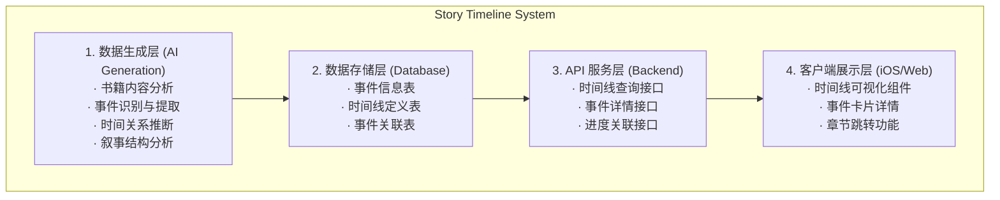

# Readmigo 故事时间线功能设计文档

> Version: 1.0.0
> Status: Draft
> Author: System Architect
> Date: 2025-12-27

---

## 1. 概述

### 1.1 功能目标

为每本书提供**可视化的故事时间线**，帮助读者：
- 清晰了解故事的时间脉络和事件发展
- 回顾已读情节，快速定位关键事件
- 理解复杂的叙事结构（倒叙、插叙等）
- 把握故事的节奏和高潮分布

### 1.2 核心价值

| 价值点 | 说明 |
|--------|------|
| **情节梳理** | 帮助读者理清复杂的故事线 |
| **记忆辅助** | 方便回顾和定位关键情节 |
| **阅读导航** | 快速跳转到感兴趣的事件 |
| **理解深化** | 揭示叙事结构和时间关系 |

---

## 2. 功能架构

### 2.1 系统架构图

### 2.2 事件类型定义

### 2.3 时间维度

---

## 3. 数据模型设计

### 3.1 Prisma Schema

### 3.2 时间线数据结构

---

## 4. API 设计

### 4.1 接口定义

### 4.2 服务实现

---

## 5. iOS 客户端实现

### 5.1 数据模型

### 5.2 时间线视图组件

### 5.3 事件详情卡片

---

## 6. AI 数据生成

### 6.1 事件提取 Prompt

### 6.2 数据生成服务

---

## 7. 实施计划

### Phase 1: 数据层 (第1周)
- [ ] 数据库 Schema 设计与迁移
- [ ] 基础 API 实现
- [ ] 事件和关联的 CRUD 操作

### Phase 2: AI 生成 (第2周)
- [ ] 事件提取 Prompt 优化
- [ ] AI 服务集成
- [ ] 批量数据生成任务

### Phase 3: 客户端展示 (第3周)
- [ ] 时间线可视化组件
- [ ] 事件详情卡片
- [ ] 多视图切换

### Phase 4: 优化完善 (第4周)
- [ ] 阅读进度联动
- [ ] 章节跳转功能
- [ ] 性能优化

---

## 8. 待确认事项

1. **时间精度**: 故事时间的表示精度（年/月/日/具体时刻）？
2. **多线叙事**: 如何处理多视角、多线程的复杂叙事？
3. **用户标记**: 是否允许用户自行标记重要事件？
4. **阅读同步**: 时间线是否与阅读进度实时同步？
5. **导出功能**: 是否支持导出时间线图片？

---

**Document Status**: Draft
**Next Steps**: 请 review 后提出修改意见

---

## 实施进度

| 版本 | 状态 | 完成度 | 更新日期 | 说明 |
|------|------|--------|----------|------|
| v1.0 | 📝 设计中 | 0% | 2025-12-27 | 设计文档完成 |
