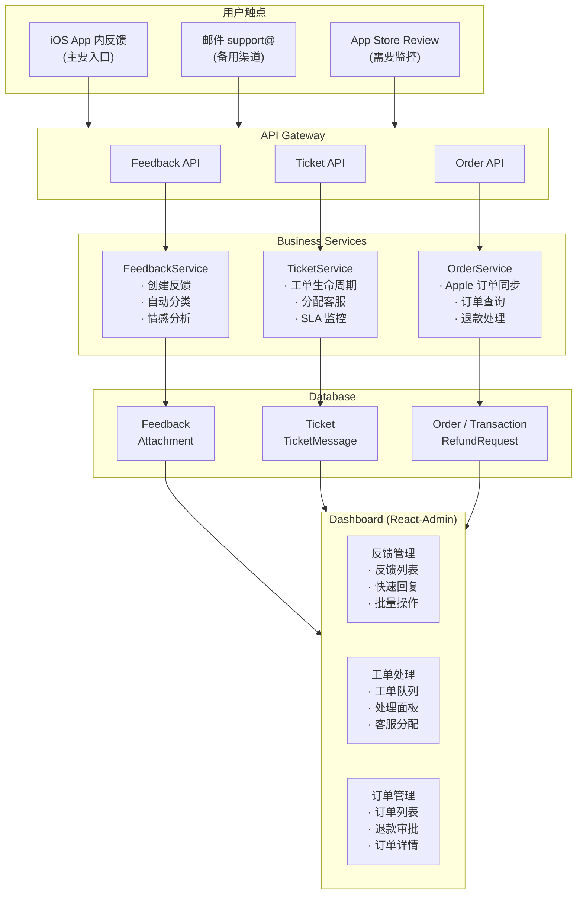

# Readmigo 客服系统与订单管理设计

> 版本: 2.0
> 最后更新: 2025-12-27
> 状态: ✅ 设计完成 | 进度: 90%

## 目录

1. [系统概述](#1-系统概述)
2. [客户端反馈功能](#2-客户端反馈功能)
3. [工单系统设计](#3-工单系统设计)
4. [订单系统设计](#4-订单系统设计)
5. [Dashboard 客服管理](#5-dashboard-客服管理)
6. [API 接口设计](#6-api-接口设计)
7. [数据模型设计](#7-数据模型设计)
8. [通知与沟通](#8-通知与沟通)
9. [运营与分析](#9-运营与分析)
10. [实施计划](#10-实施计划)
11. [实施进度](#11-实施进度)

**附录**:
- [附录 A：常见问题自动回复库](#附录-a常见问题自动回复库)
- [附录 B：客户满意度调查（CSAT）设计](#附录-b客户满意度调查csat设计)
- [附录 C：邮件模板示例](#附录-c邮件模板示例)
- [附录 D：技术依赖](#附录-d技术依赖)

---

## 1. 系统概述

### 1.1 系统架构

### 1.2 核心功能模块

| 模块 | 描述 | 优先级 |
|------|------|--------|
| **用户反馈** | 客户端内提交反馈、问题报告 | P0 |
| **工单系统** | 反馈转工单、分配、跟踪、解决 | P0 |
| **订单管理** | 查看订单、处理退款、订单历史 | P0 |
| **客服仪表盘** | 统一管理界面、数据分析 | P1 |
| **自动化** | 自动分类、智能回复建议 | P2 |

---

## 2. 客户端反馈功能

### 2.1 反馈入口设计

### 2.2 反馈类型分类

### 2.3 反馈表单 UI 设计

### 2.4 反馈 ViewModel

### 2.5 快速反馈（上下文相关）

---

## 3. 工单系统设计

### 3.1 工单生命周期

### 3.2 工单状态定义

### 3.3 工单分配策略

### 3.4 自动回复与智能建议

---

## 4. 订单系统设计

### 4.1 订单数据来源

### 4.2 订单状态

### 4.3 订单服务

### 4.4 退款处理流程

---

## 5. Dashboard 客服管理

### 5.1 Dashboard 页面结构

### 5.2 工单列表页

### 5.3 工单详情页

### 5.4 订单管理页

### 5.5 客服人员权限

---

## 6. API 接口设计

### 6.1 反馈 API

### 6.2 工单 API

### 6.3 订单 API

---

## 7. 数据模型设计

### 7.1 完整数据模型

---

## 8. 通知与沟通

### 8.1 通知渠道

### 8.2 邮件模板示例

---

## 9. 运营与分析

### 9.1 关键指标

### 9.2 Dashboard 报表

---

## 10. 实施计划

### Phase 1: 基础反馈系统

**目标**: 用户可以在 App 内提交反馈，后台可以查看

**任务清单**:

#### 1.1 数据库设计
- [ ] 创建 Feedback 模型
- [ ] 创建 FeedbackAttachment 模型
- [ ] 添加相关枚举（FeedbackCategory, FeedbackStatus）
- [ ] 运行数据库迁移

#### 1.2 后端 API
- [ ] 创建 FeedbackModule
- [ ] 实现 FeedbackService
  - [ ] `createFeedback()` - 创建反馈
  - [ ] `uploadAttachment()` - 上传附件到 R2
  - [ ] `getUserFeedbackHistory()` - 获取用户反馈历史
- [ ] 实现 FeedbackController
  - [ ] `POST /api/feedback` - 提交反馈
  - [ ] `POST /api/feedback/attachments` - 上传附件
  - [ ] `GET /api/feedback/history` - 获取历史
- [ ] 实现 Admin FeedbackController
  - [ ] `GET /api/admin/feedback` - 反馈列表
  - [ ] `GET /api/admin/feedback/:id` - 反馈详情
  - [ ] `PATCH /api/admin/feedback/:id` - 更新状态

#### 1.3 iOS 客户端
- [ ] 创建 FeedbackView（反馈表单）
- [ ] 创建 FeedbackViewModel
- [ ] 创建 FeedbackService
- [ ] 实现诊断信息收集（DiagnosticInfo）
- [ ] 实现图片选择和上传
- [ ] 添加反馈入口（设置页、阅读器、错误弹窗）
- [ ] 添加 QuickFeedbackSheet（快速反馈）

#### 1.4 Dashboard 管理
- [ ] 创建反馈列表页 `/feedback`
- [ ] 创建反馈详情页 `/feedback/:id`
- [ ] 实现筛选和搜索
- [ ] 实现状态更新操作

#### 1.5 邮件通知
- [ ] 配置邮件服务（SendGrid/Resend）
- [ ] 创建邮件模板：反馈已收到
- [ ] 实现自动发送确认邮件

**验收标准**:
- [ ] 用户可以在 App 内选择类型、填写描述、上传截图提交反馈
- [ ] 反馈自动收集设备和 App 信息
- [ ] 提交后用户收到确认邮件
- [ ] 管理员可以在后台查看所有反馈
- [ ] 管理员可以标记反馈状态

---

### Phase 2: 工单系统

**目标**: 将反馈转为工单，实现工单全生命周期管理

**任务清单**:

#### 2.1 数据库设计
- [ ] 创建 Ticket 模型
- [ ] 创建 TicketMessage 模型
- [ ] 创建 TicketHistory 模型
- [ ] 创建 TicketAttachment 模型
- [ ] 添加相关枚举
- [ ] 运行数据库迁移

#### 2.2 后端服务
- [ ] 创建 TicketModule
- [ ] 实现 TicketService
  - [ ] `createTicket()` - 创建工单
  - [ ] `convertFromFeedback()` - 从反馈转工单
  - [ ] `updateTicket()` - 更新工单
  - [ ] `addMessage()` - 添加消息/回复
  - [ ] `assignTicket()` - 分配工单
  - [ ] `escalateTicket()` - 升级工单
  - [ ] `mergeTickets()` - 合并工单
  - [ ] `getTicketStats()` - 统计数据
- [ ] 实现 TicketNumberGenerator（工单号生成）
- [ ] 实现 TicketHistoryService（操作日志）
- [ ] 实现 Admin TicketController

#### 2.3 工单分配
- [ ] 实现 TicketAssignmentService
  - [ ] `autoAssign()` - 自动分配
  - [ ] `getCategoryQueue()` - 分类队列
  - [ ] `selectAgent()` - 选择客服（负载均衡）
  - [ ] `calculateScore()` - 评分算法

#### 2.4 SLA 监控
- [ ] 实现 SLAService
  - [ ] `calculateDueDates()` - 计算 SLA 截止时间
  - [ ] `checkSLABreaches()` - 检查 SLA 违规
  - [ ] `sendSLAWarnings()` - 发送预警
- [ ] 创建定时任务：每 5 分钟检查 SLA
- [ ] 实现自动升级逻辑

#### 2.5 Dashboard 工单管理
- [ ] 创建工单列表页 `/tickets`
  - [ ] 实现多维度筛选
  - [ ] 实现批量操作
  - [ ] 显示 SLA 状态
- [ ] 创建工单详情页 `/tickets/:id`
  - [ ] 工单信息展示
  - [ ] 对话记录
  - [ ] 回复表单（支持快捷回复、内部备注）
  - [ ] 操作面板（状态、优先级、分配）
  - [ ] 用户信息卡片
  - [ ] 工单历史

#### 2.6 邮件通知
- [ ] 创建邮件模板：客服已回复
- [ ] 创建邮件模板：工单已解决
- [ ] 实现回复通知自动发送

**验收标准**:
- [ ] 可以将反馈一键转为工单
- [ ] 工单自动分配给合适的客服
- [ ] 客服可以回复工单，用户收到邮件通知
- [ ] SLA 监控正常工作，超时工单自动预警
- [ ] 支持工单升级、合并操作

---

### Phase 3: 订单管理系统

**目标**: 客服可以查看和管理用户订单，处理退款

**任务清单**:

#### 3.1 数据库设计
- [ ] 创建/更新 Order 模型（如已有则扩展）
- [ ] 创建 Transaction 模型
- [ ] 创建 RefundRequest 模型
- [ ] 添加相关枚举
- [ ] 运行数据库迁移

#### 3.2 后端服务
- [ ] 创建/扩展 OrderModule
- [ ] 实现 OrderService
  - [ ] `syncFromApple()` - Apple 订单同步
  - [ ] `getUserOrders()` - 用户订单列表
  - [ ] `getOrderDetail()` - 订单详情
  - [ ] `createTransaction()` - 创建交易记录
- [ ] 实现 RefundService
  - [ ] `createRefundRequest()` - 创建退款请求
  - [ ] `initiateAppleRefund()` - 发起 Apple 退款
  - [ ] `issueCredit()` - 发放积分补偿
  - [ ] `extendSubscription()` - 延长订阅
- [ ] 扩展 Apple Webhook 处理（REFUND 事件）

#### 3.3 Dashboard 订单管理
- [ ] 创建订单列表页 `/orders`
- [ ] 创建订单详情页 `/orders/:id`
  - [ ] 订单基本信息
  - [ ] Apple 交易信息
  - [ ] 交易历史时间线
  - [ ] 退款记录
  - [ ] 操作按钮（退款、延期、创建工单）
- [ ] 创建退款对话框组件
- [ ] 创建延长订阅对话框组件
- [ ] 创建退款请求列表页 `/refund-requests`

#### 3.4 用户订单关联
- [ ] 工单详情页显示用户订单
- [ ] 用户详情页显示订单历史

**验收标准**:
- [ ] 客服可以查看用户所有订单和交易历史
- [ ] 客服可以发起退款请求（Apple 退款/积分补偿/延期）
- [ ] 退款状态自动同步
- [ ] 工单中可以快速关联查看相关订单

---

### Phase 4: 增强功能

**目标**: 提升客服效率和用户满意度

**任务清单**:

#### 4.1 自动回复系统
- [ ] 创建 AutoReplyService
- [ ] 实现关键词匹配算法
- [ ] 创建常见问题回复模板库（20+ 模板）
- [ ] 实现自动回复触发逻辑
- [ ] 实现自动关闭定时器

#### 4.2 AI 回复建议
- [ ] 实现 AISuggestionService
- [ ] 接入 Claude API 生成回复建议
- [ ] 工单详情页显示 AI 建议
- [ ] 支持一键采用 AI 建议

#### 4.3 快捷回复模板
- [ ] 创建 ReplyTemplate 模型
- [ ] 实现模板 CRUD API
- [ ] Dashboard 模板管理页面
- [ ] 工单回复时显示模板列表
- [ ] 支持变量替换（用户名、订单号等）

#### 4.4 客服权限管理
- [ ] 扩展 Admin 模型（添加客服字段）
- [ ] 实现客服角色权限（Agent/Lead/Admin）
- [ ] Dashboard 客服人员管理页面
- [ ] 实现权限检查中间件

#### 4.5 报表统计
- [ ] 实现 SupportStatsService
- [ ] 创建客服概览仪表盘
- [ ] 实现工单趋势图表
- [ ] 实现分类分布图表
- [ ] 实现客服工作量报表
- [ ] 实现 SLA 达成率报表

**验收标准**:
- [ ] 常见问题自动回复，减少客服工作量
- [ ] AI 可以生成合理的回复建议
- [ ] 快捷模板提升回复效率
- [ ] 不同角色有不同权限
- [ ] 管理员可以查看完整的运营报表

---

### Phase 5: 持续优化

**目标**: 持续提升服务质量和用户体验

**任务清单**:

#### 5.1 客户满意度调查（CSAT）
- [ ] 工单解决后发送满意度调查邮件
- [ ] 创建满意度评价页面（1-5星 + 评论）
- [ ] Dashboard 满意度统计和趋势
- [ ] 低分工单自动标记跟进

#### 5.2 知识库集成
- [ ] 设计知识库数据模型
- [ ] 创建知识库文章管理
- [ ] 提交反馈时推荐相关文章
- [ ] AI 回复建议引用知识库

#### 5.3 多渠道整合
- [ ] 邮件工单创建（解析 support@ 邮件）
- [ ] App Store 评论监控和回复
- [ ] 统一收件箱视图

#### 5.4 自动化工作流
- [ ] 创建工作流引擎
- [ ] 支持自定义触发条件和动作
- [ ] 预设常用工作流模板
- [ ] Dashboard 工作流管理

#### 5.5 性能优化
- [ ] 工单列表分页优化
- [ ] 添加 Redis 缓存
- [ ] 消息实时推送（WebSocket）
- [ ] 移动端客服 App（可选）

**验收标准**:
- [ ] CSAT 系统正常运行，收集到满意度数据
- [ ] 知识库帮助用户自助解决问题
- [ ] 支持邮件创建工单
- [ ] 自动化工作流减少重复操作

---

## 11. 实施进度

### 当前状态

| 阶段 | 状态 | 进度 | 说明 |
|------|------|------|------|
| Phase 1: 基础反馈系统 | 📝 | 0% | 设计完成，待开发 |
| Phase 2: 工单系统 | 📝 | 0% | 设计完成，待开发 |
| Phase 3: 订单管理系统 | 📝 | 0% | 设计完成，待开发 |
| Phase 4: 增强功能 | 📝 | 0% | 设计完成，待开发 |
| Phase 5: 持续优化 | 📝 | 0% | 设计完成，待开发 |

### 总体进度

- **设计文档**: ✅ 100% 完成
- **数据模型**: 📝 0% - 待实施
- **后端 API**: 📝 0% - 待实施
- **iOS 客户端**: 📝 0% - 待实施
- **Dashboard**: 📝 0% - 待实施
- **测试**: 📝 0% - 待实施

### 里程碑

| 里程碑 | 目标日期 | 实际日期 | 状态 |
|--------|----------|----------|------|
| 设计文档完成 | - | 2025-12-27 | ✅ |
| Phase 1 完成 | TBD | - | 📝 |
| Phase 2 完成 | TBD | - | 📝 |
| Phase 3 完成 | TBD | - | 📝 |
| Phase 4 完成 | TBD | - | 📝 |
| 生产环境上线 | TBD | - | 📝 |

---

## 附录 A：常见问题自动回复库

---

## 附录 B：客户满意度调查（CSAT）设计

### B.1 调查触发时机

### B.2 调查表单设计

### B.3 数据模型

### B.4 报表指标

---

## 附录 C：邮件模板示例

### C.1 反馈确认邮件

### C.2 满意度调查邮件

---

## 附录 D：技术依赖

### D.1 后端依赖

### D.2 iOS 依赖

### D.3 Dashboard 依赖

---

*文档版本: 2.0 | 最后更新: 2025-12-27 | 状态: ✅ 设计完成*
