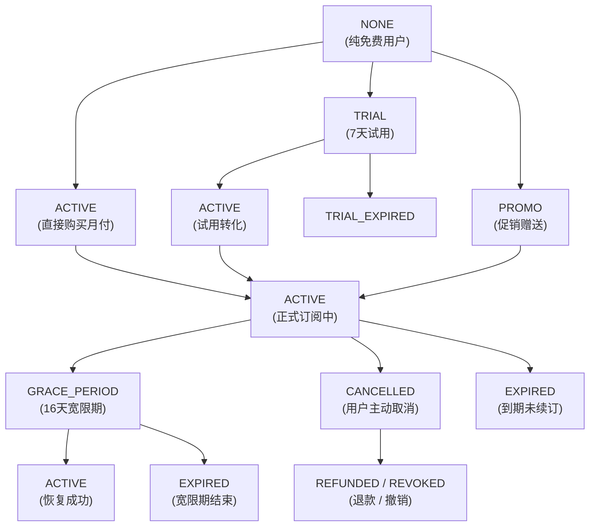
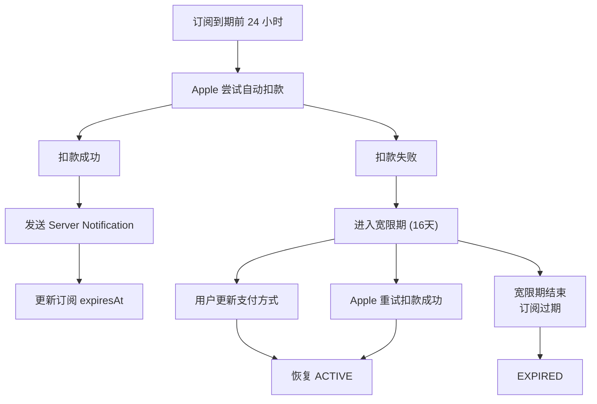
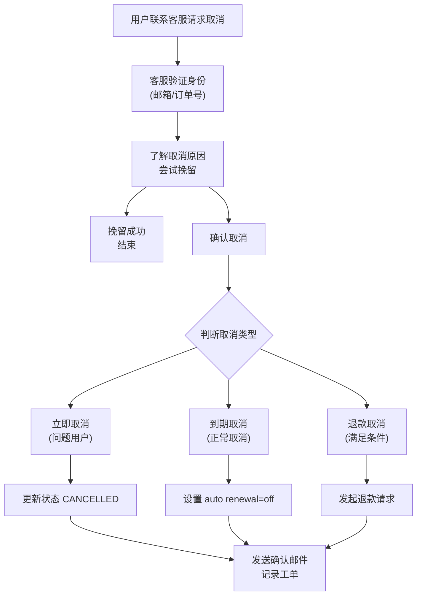

# Readmigo 会员体系完整设计

> 版本: 1.2
> 最后更新: 2024-12-24
> 状态: ✅ 已完成 - 全栈实现 (后端 Guards + iOS FeatureGate + Trial + Admin APIs)

## 目录

1. [概述](#1-概述)
2. [订阅状态机设计](#2-订阅状态机设计)
3. [试用期处理](#3-试用期处理)
4. [订阅生命周期管理](#4-订阅生命周期管理)
5. [客服取消与退款](#5-客服取消与退款)
6. [全栈权限控制架构](#6-全栈权限控制架构)
7. [数据模型设计](#7-数据模型设计)
8. [API 设计](#8-api-设计)
9. [行业最佳实践参考](#9-行业最佳实践参考)

---

## 1. 概述

### 1.1 会员层级定义

| 层级 | 定价 | 定位 |
|------|------|------|
| **Free** | $0 | 体验用户，有功能限制 |
| **Pro** | $7.99/月 或 $49.99/年 | 核心付费用户 |
| **Premium** | $12.99/月 或 $79.99/年 | 高级用户（预留） |

### 1.2 订阅来源

---

## 2. 订阅状态机设计

### 2.1 状态定义

### 2.2 状态流转图

### 2.3 状态转换规则表

| 当前状态 | 触发事件 | 目标状态 | 说明 |
|---------|---------|---------|------|
| NONE | 开始试用 | TRIAL | 仅年付提供试用 |
| NONE | 直接购买 | ACTIVE | 月付无试用 |
| NONE | 获得促销 | PROMO | 运营活动赠送 |
| TRIAL | 试用到期+转化 | ACTIVE | 自动扣款成功 |
| TRIAL | 试用到期+取消 | TRIAL_EXPIRED | 用户取消试用 |
| TRIAL | 提前购买 | ACTIVE | 试用期内主动购买 |
| ACTIVE | 自动续订成功 | ACTIVE | 保持有效 |
| ACTIVE | 支付失败 | GRACE_PERIOD | 进入16天宽限期 |
| ACTIVE | 用户取消续订 | CANCELLED | 仍可用至期末 |
| ACTIVE | 请求退款 | REFUNDED | 立即失效 |
| GRACE_PERIOD | 支付恢复 | ACTIVE | 恢复订阅 |
| GRACE_PERIOD | 宽限期结束 | EXPIRED | 订阅终止 |
| CANCELLED | 到期日到达 | EXPIRED | 正式过期 |
| CANCELLED | 重新订阅 | ACTIVE | 恢复订阅 |
| EXPIRED | 重新订阅 | ACTIVE/TRIAL | 允许重新订阅 |

---

## 3. 试用期处理

### 3.1 试用期规则

### 3.2 试用资格判断

### 3.3 试用期提醒策略

### 3.4 试用期 UI 处理

---

## 4. 订阅生命周期管理

### 4.1 自动续订流程

### 4.2 Apple Server-to-Server Notifications (V2)

### 4.3 到期处理策略

### 4.4 续订激励策略

---

## 5. 客服取消与退款

### 5.1 取消订阅的类型

### 5.2 客服取消流程

### 5.3 退款政策

### 5.4 退款处理服务

### 5.5 取消原因追踪

---

## 6. 全栈权限控制架构

### 6.1 权限检查架构

### 6.2 功能权限矩阵

### 6.3 后端 Guard 实现

### 6.4 iOS 客户端权限检查

### 6.5 Dashboard 权限管理

### 6.6 权限变更事件追踪

---

## 7. 数据模型设计

### 7.1 完整 Subscription 模型

### 7.2 使用量追踪设计

---

## 8. API 设计

### 8.1 订阅 API

### 8.2 Dashboard 管理 API

---

## 9. 行业最佳实践参考

### 9.1 参考的商业产品

| 产品 | 借鉴点 |
|------|--------|
| **Spotify** | 清晰的功能对比表、无缝的升级体验、家庭计划 |
| **Netflix** | 多层级定价、设备数量差异化、离线下载限制 |
| **Duolingo** | 每日限制的 Paywall 设计、连续学习激励 |
| **Notion** | 协作功能差异化、慷慨的免费层级 |
| **Headspace** | 试用期体验完整、取消前的挽留弹窗 |

### 9.2 关键最佳实践

#### 透明定价

#### Paywall 设计

#### 取消流程

#### 宽限期处理

### 9.3 合规要求

---

## 10. 实施计划

### 10.1 第一阶段：核心订阅流程 ✅ (已完成 - 2024-12)
- [x] 完善订阅状态机实现 ✅
- [x] 实现 Apple Server Notification V2 处理 ✅
- [x] 完善试用期逻辑 (TrialService) ✅
- [x] Dashboard 订阅管理基础功能 (AdminSubscriptionController) ✅

### 10.2 第二阶段：权限控制 ✅ (已完成 - 2024-12)
- [x] 实现后端 SubscriptionGuard ✅
- [x] 实现使用量追踪和限制 (UsageLimitService + UsageLimitGuard) ✅
- [x] 实现 @RequireTier() 和 @TrackUsage() 装饰器 ✅
- [x] 应用 Guards 到 AI 模块 ✅
- [x] 应用 Guards 到词汇模块 ✅
- [x] 应用 Guards 到语音聊天模块 ✅
- [x] 应用 Guards 到视频聊天模块 ✅
- [x] iOS 客户端 FeatureGate 实现 ✅
- [x] 功能 Paywall 设计 ✅

**已实现的后端权限控制:**

### 10.3 第三阶段：客服支持
- [ ] Dashboard 订阅管理高级功能
- [ ] 退款处理流程
- [ ] 订阅事件历史查看
- [ ] 客服工单与订阅关联

### 10.4 第四阶段：运营优化
- [ ] 订阅分析报表
- [ ] 促销码系统
- [ ] A/B 测试 Paywall
- [ ] 自动挽回策略

---

## 附录 A：错误码定义

---

## 附录 B：监控指标

---

*文档结束 - 请 Review 后反馈修改意见*
