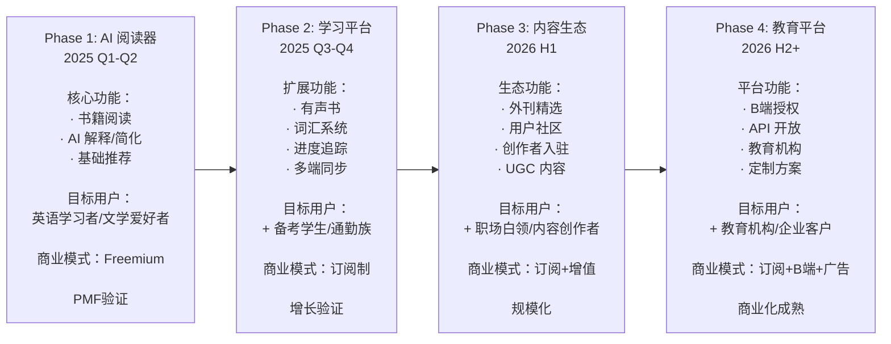

# Readmigo 产品形态演进策略

> 基于用户画像、市场阶段的最佳产品形态规划

---

## 1. 核心洞察

### 1.1 市场空白的本质

### 1.2 用户群体价值分层

| 用户群体 | 规模 | 付费意愿 | 使用频率 | 战略价值 | 进入优先级 |
|----------|------|----------|----------|----------|------------|
| **备考学生** | 3000万+ | ⭐⭐⭐⭐⭐ | 高频（日均1h+） | 高付费、高传播 | **P0 首发** |
| **英语学习者** | 10亿+ | ⭐⭐⭐ | 中频 | 规模最大 | **P0 首发** |
| **职场白领** | 2000万+ | ⭐⭐⭐⭐ | 中频 | 高ARPU | **P1 扩展** |
| **文学爱好者** | 5000万+ | ⭐⭐⭐⭐ | 低频但深度 | 口碑传播 | **P1 扩展** |
| **古典研究者** | 2000万+ | ⭐⭐⭐⭐⭐ | 专业使用 | 差异化标签 | **P2 深耕** |

### 1.3 用户使用场景分布

---

## 2. 产品形态演进路线

### 2.1 演进总览

---

## 3. Phase 1: AI 阅读器 (2025 Q1-Q2)

### 3.1 产品定位

**一句话定位：** "让你读懂任何英文书的 AI 阅读器"

**核心价值：**
- 不是翻译工具 → 是理解辅助
- 不是词典查询 → 是智能解释
- 不是被动阅读 → 是主动学习

### 3.2 目标用户聚焦

### 3.3 核心功能设计

| 功能模块 | 具体功能 | 用户价值 | 优先级 |
|----------|----------|----------|--------|
| **AI 阅读辅助** | 选词解释、句子简化、段落总结 | 核心价值，降低阅读门槛 | P0 |
| **智能推荐** | 水平测评 + 书籍匹配 | 解决"不知道读什么" | P0 |
| **阅读体验** | 流畅翻页、主题切换、字体调节 | 基础体验 | P0 |
| **进度同步** | 阅读位置、书签 | 多设备使用 | P1 |
| **基础词汇** | 生词标记、简单记录 | 学习痕迹 | P1 |

### 3.4 内容策略

### 3.5 产品形态示意

### 3.6 成功指标

| 指标 | 目标值 | 说明 |
|------|--------|------|
| 种子用户 | 5,000 | 来自创始人社群 |
| D7 留存 | >30% | 验证产品价值 |
| AI 使用率 | >60% | 核心功能被使用 |
| NPS | >40 | 用户推荐意愿 |
| 完读率 | >20% | 至少完整读完一本 |

---

## 4. Phase 2: 学习平台 (2025 Q3-Q4)

### 4.1 产品定位升级

**定位演进：** "AI 阅读器" → "AI 英语阅读学习平台"

**新增价值：**
- 不只是读 → 还能听
- 不只是理解 → 还能记住
- 不只是书籍 → 还有短文

### 4.2 目标用户扩展

### 4.3 核心功能扩展

| 新功能模块 | 具体功能 | 目标用户 | 商业价值 |
|------------|----------|----------|----------|
| **有声书** | AI TTS、语速调节、文字同步 | 通勤族 | 使用时长翻倍 |
| **词汇系统** | 间隔重复、复习卡片、词汇统计 | 备考生 | 提升付费转化 |
| **外刊精选** | 编辑精选、用户导入、主题分类 | 备考生+白领 | 新用户群体 |
| **学习追踪** | 阅读统计、成长报告、目标设定 | 全部用户 | 增加粘性 |
| **多端同步** | iOS + Android + Web | 全部用户 | 扩大覆盖 |

### 4.4 内容形态扩展

### 4.5 产品形态示意

### 4.6 商业模式升级

### 4.7 成功指标

| 指标 | 目标值 | 说明 |
|------|--------|------|
| MAU | 50,000+ | 月活用户 |
| 付费用户 | 2,500+ | 5% 转化率 |
| MRR | $10,000+ | 月经常性收入 |
| 有声书使用率 | >30% | 新功能验证 |
| 外刊板块 DAU | >15% | 新用户群体 |
| D30 留存 | >15% | 用户粘性 |

---

## 5. Phase 3: 内容生态 (2026 H1)

### 5.1 产品定位再升级

**定位演进：** "学习平台" → "英语阅读内容生态"

**新增价值：**
- 不只是工具 → 还是社区
- 不只是消费 → 还能创作
- 不只是个人 → 还有社交

### 5.2 目标用户完整覆盖

### 5.3 核心功能扩展

| 新功能模块 | 具体功能 | 目标用户 | 商业价值 |
|------------|----------|----------|----------|
| **城邦社区** | 金句分享、评论互动、作者关注 | 全部用户 | 增加粘性和传播 |
| **AI 作者对话** | 与"作者"聊书、问答互动 | 文学爱好者 | 差异化体验 |
| **书单功能** | 创建/分享书单、跟随学习 | KOL/创作者 | UGC 内容 |
| **跟读模式** | 录音对比、AI 评分、发音改进 | 听力学习者 | 新学习维度 |
| **原创内容** | Readmigo Originals | 全部用户 | 内容护城河 |

### 5.4 内容形态完整

### 5.5 产品形态示意

### 5.6 成功指标

| 指标 | 目标值 | 说明 |
|------|--------|------|
| MAU | 300,000+ | 月活用户 |
| 付费用户 | 20,000+ | 订阅用户 |
| ARR | $800,000+ | 年经常性收入 |
| 社区 DAU | >20% | 社区活跃度 |
| UGC 内容 | 10,000+/月 | 用户创作内容 |
| 病毒系数 | >1.2 | 自然增长 |

---

## 6. 用户场景与产品功能映射

### 6.1 用户一天的使用场景

### 6.2 功能-用户-场景矩阵

| 功能 | 英语学习者 | 备考学生 | 职场白领 | 文学爱好者 | 最佳场景 |
|------|------------|----------|----------|------------|----------|
| **书籍阅读** | ⭐⭐⭐⭐ | ⭐⭐⭐ | ⭐⭐⭐ | ⭐⭐⭐⭐⭐ | 睡前/周末 |
| **AI 解释** | ⭐⭐⭐⭐⭐ | ⭐⭐⭐⭐⭐ | ⭐⭐⭐⭐ | ⭐⭐⭐⭐ | 阅读中 |
| **有声书** | ⭐⭐⭐⭐ | ⭐⭐⭐ | ⭐⭐⭐⭐⭐ | ⭐⭐⭐ | 通勤/运动 |
| **外刊精选** | ⭐⭐⭐ | ⭐⭐⭐⭐⭐ | ⭐⭐⭐⭐ | ⭐⭐ | 午休/碎片 |
| **词汇系统** | ⭐⭐⭐⭐⭐ | ⭐⭐⭐⭐⭐ | ⭐⭐⭐ | ⭐⭐⭐ | 碎片时间 |
| **跟读模式** | ⭐⭐⭐⭐ | ⭐⭐⭐⭐ | ⭐⭐⭐ | ⭐⭐ | 独处时间 |
| **城邦社区** | ⭐⭐⭐ | ⭐⭐ | ⭐⭐⭐ | ⭐⭐⭐⭐ | 碎片时间 |
| **AI 对话** | ⭐⭐⭐ | ⭐⭐ | ⭐⭐⭐ | ⭐⭐⭐⭐⭐ | 深度阅读 |

---

## 7. 推广阶段与产品形态对应

### 7.1 推广阶段产品匹配

### 7.2 不同市场的产品形态适配

| 市场 | 主要用户 | 产品侧重 | 内容侧重 | 营销卖点 |
|------|----------|----------|----------|----------|
| **中国** | 备考生+学习者 | 外刊+词汇+有声 | 考研/托福/雅思相关 | "考试阅读提分" |
| **日本** | 职场人士 | 有声书+商务英语 | 商业文章+TED | "通勤时间学习" |
| **韩国** | 学生群体 | 词汇系统+学习追踪 | TOEIC 相关 | "系统化学习" |
| **东南亚** | 年轻白领 | 有声书+社区 | 流行文化内容 | "轻松学英语" |

---

## 8. 产品形态决策框架

### 8.1 功能优先级决策矩阵

### 8.2 最佳产品形态总结

| 阶段 | 产品形态 | 核心功能 | 目标用户 | 商业目标 |
|------|----------|----------|----------|----------|
| **Q1-Q2** | AI 阅读器 | 阅读+AI解释+推荐 | 学习者+文学爱好者 | PMF 验证 |
| **Q2-Q3** | 学习平台 | +有声书+词汇+外刊 | +备考生+通勤族 | 付费增长 |
| **Q4-Y2** | 内容生态 | +社区+创作者+B端 | 全用户群体 | 规模化 |

---

## 9. 关键结论

### 9.1 产品形态演进逻辑

### 9.2 最终产品愿景

**2026年末的 Readmigo：**

> 全球领先的 AI 英语阅读学习平台，让每一个非英语母语者都能轻松享受英文原著的乐趣，在阅读中自然习得语言。

---

*文档版本: 1.0*
*创建日期: 2025-12-27*
*最后更新: 2025-12-27*
*状态: 初稿完成*
