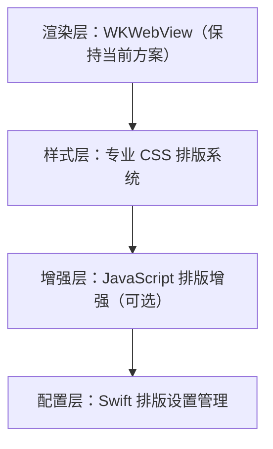

# 专业排版技术调研报告

## 概述

本文档对电子书阅读器的专业排版技术进行深入调研，旨在将 Readmigo 的排版能力从"CSS 基础"（50%）提升至商业级标准（95%+）。

**当前状态：** CSS 基础排版
**目标状态：** 专业排版引擎
**对标产品：** Apple Books、Amazon Kindle、微信读书、多看阅读

---

## 一、当前排版实现分析

### 1.1 现有功能

```css
/* 当前 ReaderContentView.swift 中的 CSS */
body {
    font-family: -apple-system, Georgia, serif;
    font-size: 14-24px;           /* 可调节 */
    line-height: 1.4-1.7;         /* 可调节 */
    text-align: justify;          /* 两端对齐 */
    -webkit-font-smoothing: antialiased;
}
```

### 1.2 已有设置项（未完全应用）

| 设置项 | 状态 | 说明 |
|--------|------|------|
| 字号调节 | ✅ 已实现 | 4档可调 |
| 行高调节 | ✅ 已实现 | 随字号变化 |
| 两端对齐 | ⚠️ 部分 | 设置存在但未动态应用 |
| 连字符 | ⚠️ 部分 | AppStorage 存在但未应用 |
| 主题切换 | ✅ 已实现 | 3种主题 |

### 1.3 差距分析

| 能力 | 当前 | 商业级标准 | 差距 |
|------|------|-----------|------|
| 连字符断词 | ❌ | 智能断词 | 高 |
| 字间距微调 | ❌ | 自适应 | 中 |
| 孤行寡行控制 | ❌ | 自动避免 | 中 |
| 首字下沉 | ❌ | 可选 | 低 |
| 字体特性 | ❌ | OpenType | 高 |
| 中英混排 | ❌ | 专业间距 | 高 |
| 标点挤压 | ❌ | 智能处理 | 中 |
| 分页优化 | ❌ | 避免断页 | 高 |

---

## 二、专业排版核心技术

### 2.1 连字符断词（Hyphenation）

连字符断词是专业排版的基础，可显著提升两端对齐时的文字分布均匀度。

#### 2.1.1 CSS 原生支持

```css
/* 基础连字符支持 */
p {
    -webkit-hyphens: auto;
    hyphens: auto;

    /* 连字符相关控制 */
    -webkit-hyphenate-limit-before: 3;  /* 断词前最少字符 */
    -webkit-hyphenate-limit-after: 2;   /* 断词后最少字符 */
    -webkit-hyphenate-limit-lines: 2;   /* 连续行最多断词数 */

    /* 语言指定（关键！） */
    lang: en;
}

/* 不断词的元素 */
.no-break {
    hyphens: none;
}

/* 手动断词控制 */
.manual-hyphen {
    hyphens: manual;
}
```

#### 2.1.2 JavaScript 断词库（Hypher/Hyphenopoly）

对于需要精确控制的场景，可使用 JavaScript 断词库：

```javascript
// 使用 Hyphenopoly（推荐，支持多语言）
const Hyphenopoly = {
    require: {
        "en-us": "FORCEHYPHENOPOLY",
        "zh-hans": "FORCEHYPHENOPOLY"
    },
    setup: {
        selectors: {
            "p": {},
            "h1, h2, h3": { minWordLength: 8 }
        },
        exceptions: {
            "global": ["read-migo", "e-book"]
        }
    }
};

// 初始化后自动处理断词
Hyphenopoly.config({
    "require": ["en-us"],
    "paths": {
        "patterndir": "/hyphenation/patterns/",
        "maindir": "/hyphenation/"
    },
    "setup": {
        "selectors": {
            "article p": {}
        }
    }
});
```

#### 2.1.3 断词规则配置

```swift
struct HyphenationSettings: Codable {
    var isEnabled: Bool = true
    var language: String = "en-US"

    var minWordLength: Int = 5      // 最短断词单词长度
    var minLeftChars: Int = 3       // 断点左侧最少字符
    var minRightChars: Int = 2      // 断点右侧最少字符
    var maxConsecutiveLines: Int = 2 // 连续断词行数上限

    // 例外词列表
    var exceptions: [String] = []

    var cssValue: String {
        isEnabled ? "auto" : "none"
    }
}
```

---

### 2.2 文字间距与字距调整（Letter Spacing & Kerning）

#### 2.2.1 基础间距控制

```css
/* 字符间距 */
p {
    letter-spacing: 0.02em;        /* 微调字符间距 */
    word-spacing: 0.05em;          /* 单词间距 */
}

/* 不同场景的间距 */
h1, h2, h3 {
    letter-spacing: -0.02em;       /* 标题紧凑 */
}

.small-caps {
    letter-spacing: 0.1em;         /* 小型大写字母需要更大间距 */
}
```

#### 2.2.2 OpenType 字体特性

```css
/* 启用 OpenType 字体特性 */
p {
    /* 字距微调（Kerning） */
    font-kerning: auto;

    /* 连字（Ligatures） */
    font-variant-ligatures: common-ligatures;

    /* 数字样式 */
    font-variant-numeric: oldstyle-nums proportional-nums;

    /* 小型大写 */
    font-variant-caps: small-caps;

    /* 上下文替代 */
    font-feature-settings:
        "kern" 1,       /* 字距调整 */
        "liga" 1,       /* 标准连字 */
        "calt" 1,       /* 上下文替代 */
        "onum" 1,       /* 老式数字 */
        "pnum" 1;       /* 比例数字 */
}

/* 等宽数字（用于表格） */
.tabular-numbers {
    font-variant-numeric: tabular-nums lining-nums;
}
```

#### 2.2.3 动态间距调整

```javascript
// 两端对齐时的智能间距调整
function optimizeJustification(element) {
    const lines = getTextLines(element);

    lines.forEach(line => {
        const wordCount = line.words.length;
        const availableSpace = line.availableWidth - line.textWidth;

        // 计算最优间距分配
        if (availableSpace > 0 && wordCount > 1) {
            const optimalWordSpacing = availableSpace / (wordCount - 1);
            const maxWordSpacing = 0.5 * parseFloat(getComputedStyle(element).fontSize);

            if (optimalWordSpacing > maxWordSpacing) {
                // 间距过大时，分配给字符间距
                const excessSpace = optimalWordSpacing - maxWordSpacing;
                const charCount = line.text.length;
                const letterSpacing = excessSpace * (wordCount - 1) / charCount;

                line.style.wordSpacing = maxWordSpacing + 'px';
                line.style.letterSpacing = letterSpacing + 'px';
            }
        }
    });
}
```

---

### 2.3 孤行与寡行控制（Orphans & Widows）

孤行（Orphan）：段落开头仅一行出现在页面底部
寡行（Widow）：段落结尾仅一行出现在页面顶部

#### 2.3.1 CSS 控制

```css
/* 分页时的孤行寡行控制 */
p {
    orphans: 2;        /* 段落开头至少保留2行在页面底部 */
    widows: 2;         /* 段落结尾至少保留2行在页面顶部 */
}

/* 避免在特定元素后分页 */
h1, h2, h3, h4, h5, h6 {
    page-break-after: avoid;
    break-after: avoid;
}

/* 避免在特定元素前分页 */
figure, table, blockquote {
    page-break-inside: avoid;
    break-inside: avoid;
}
```

#### 2.3.2 JavaScript 增强控制

```javascript
// 孤行寡行检测与修复
function checkAndFixOrphansWidows(container, options = {}) {
    const minOrphans = options.orphans || 2;
    const minWidows = options.widows || 2;
    const pageHeight = options.pageHeight || window.innerHeight;

    const paragraphs = container.querySelectorAll('p');

    paragraphs.forEach(p => {
        const lines = measureLines(p);
        const rect = p.getBoundingClientRect();

        // 检测孤行：段落开始在页面底部且只有一行
        const pageBottom = pageHeight - (rect.top % pageHeight);
        const firstLineHeight = lines[0]?.height || 0;

        if (pageBottom < firstLineHeight * minOrphans && lines.length > minOrphans) {
            // 强制段落移到下一页
            p.style.breakBefore = 'page';
        }

        // 检测寡行：段落最后几行在新页面顶部
        const lastLinesHeight = lines.slice(-minWidows).reduce((sum, l) => sum + l.height, 0);
        const paragraphEnd = rect.bottom % pageHeight;

        if (paragraphEnd < lastLinesHeight && paragraphEnd > 0) {
            // 尝试调整行高或字间距来避免
            adjustToAvoidWidow(p, lines, minWidows);
        }
    });
}

function adjustToAvoidWidow(paragraph, lines, minWidows) {
    // 策略1：微调字间距
    const currentSpacing = parseFloat(getComputedStyle(paragraph).letterSpacing) || 0;
    paragraph.style.letterSpacing = (currentSpacing - 0.01) + 'em';

    // 策略2：微调行高
    // 策略3：断词调整
}
```

---

### 2.4 首字下沉（Drop Caps）

#### 2.4.1 CSS 实现

```css
/* 首字下沉 */
.drop-cap::first-letter {
    float: left;
    font-size: 3.5em;
    line-height: 0.8;
    padding-right: 0.1em;
    padding-top: 0.1em;
    font-weight: bold;
    color: inherit;
}

/* 装饰性首字 */
.drop-cap-decorated::first-letter {
    float: left;
    font-size: 4em;
    line-height: 0.75;
    margin-right: 0.1em;
    background: linear-gradient(135deg, var(--accent-color), var(--text-color));
    -webkit-background-clip: text;
    -webkit-text-fill-color: transparent;
    font-family: "Georgia", serif;
}

/* 章节首字下沉 */
.chapter-start > p:first-of-type::first-letter {
    initial-letter: 3;  /* 现代 CSS：占据3行 */
    -webkit-initial-letter: 3;
    margin-right: 0.5em;
}
```

#### 2.4.2 配置选项

```swift
struct DropCapSettings: Codable {
    var isEnabled: Bool = false
    var size: DropCapSize = .medium
    var style: DropCapStyle = .simple
    var applyTo: DropCapScope = .chapterStart

    enum DropCapSize: String, Codable, CaseIterable {
        case small = "2"      // 2行高
        case medium = "3"     // 3行高
        case large = "4"      // 4行高
    }

    enum DropCapStyle: String, Codable, CaseIterable {
        case simple           // 简单放大
        case decorated        // 装饰性
        case outlined         // 描边
        case colored          // 彩色
    }

    enum DropCapScope: String, Codable {
        case chapterStart     // 仅章节开头
        case everyParagraph   // 每个段落
        case none             // 不使用
    }
}
```

---

### 2.5 首行缩进

#### 2.5.1 CSS 实现

```css
/* 首行缩进 */
p {
    text-indent: 2em;
}

/* 不缩进的情况 */
p:first-of-type,           /* 章节第一段 */
blockquote + p,            /* 引用后的段落 */
h1 + p, h2 + p, h3 + p,    /* 标题后的段落 */
.no-indent {
    text-indent: 0;
}

/* 中文排版：首行缩进2个字符 */
[lang="zh"] p {
    text-indent: 2em;
}

/* 西文排版：可选首行缩进或段间距 */
[lang="en"] p {
    text-indent: 0;
    margin-bottom: 1em;
}

/* 混合模式：有缩进时减少段间距 */
.indent-mode p {
    text-indent: 1.5em;
    margin-bottom: 0.5em;
}
```

#### 2.5.2 配置系统

```swift
enum IndentStyle: String, Codable, CaseIterable {
    case none
    case small = "1em"
    case medium = "1.5em"
    case large = "2em"
    case chinese = "2em"  // 中文标准两字符

    var displayName: String {
        switch self {
        case .none: return "无缩进"
        case .small: return "小缩进"
        case .medium: return "中缩进"
        case .large: return "大缩进"
        case .chinese: return "中文标准"
        }
    }
}
```

---

### 2.6 中英文混排

中英文混排是 CJK（中日韩）电子书的核心难题。

#### 2.6.1 基础间距处理

```css
/* 中英文混排间距 */
body {
    /* 中英文之间自动添加间距 */
    text-autospace: ideograph-alpha ideograph-numeric;
    -webkit-text-autospace: ideograph-alpha ideograph-numeric;
}

/* 备选方案：手动控制 */
.cjk-spacing {
    /* 中文字符 */
    --cjk-spacing: 0;

    /* 中英文之间 */
    --mixed-spacing: 0.25em;
}
```

#### 2.6.2 JavaScript 自动间距

```javascript
// 中英文自动添加间距
function addCJKSpacing(element) {
    const text = element.innerHTML;

    // 匹配中英文交界处
    const patterns = [
        // 中文后接英文/数字
        /([\u4e00-\u9fa5])([A-Za-z0-9])/g,
        // 英文/数字后接中文
        /([A-Za-z0-9])([\u4e00-\u9fa5])/g,
    ];

    let result = text;
    patterns.forEach(pattern => {
        result = result.replace(pattern, '$1<span class="cjk-space"></span>$2');
    });

    element.innerHTML = result;
}

// CSS 配合
// .cjk-space {
//     display: inline;
//     margin: 0 0.15em;
// }
```

#### 2.6.3 标点处理

```css
/* 中文标点挤压 */
body {
    /* 标点压缩 */
    text-spacing-trim: space-first space-all;
}

/* 连续标点挤压 */
.punct-squeeze {
    /* 行首标点向左挤压 */
    hanging-punctuation: first last;
    -webkit-hanging-punctuation: first last;
}

/* 手动标点控制类 */
.punct-full { width: 1em; }     /* 全角标点 */
.punct-half { width: 0.5em; }   /* 半角标点 */
.punct-narrow { width: 0.25em; } /* 窄标点 */
```

#### 2.6.4 JavaScript 标点优化

```javascript
// 中文标点优化处理
const punctuationRules = {
    // 行首禁则（不能出现在行首的标点）
    lineStartForbidden: /[,，.。!！?？;；:：、)）\]」』》"']/,

    // 行尾禁则（不能出现在行尾的标点）
    lineEndForbidden: /[(（\[「『《"']/,

    // 可挤压标点
    squeezable: /[,，.。、;；:：!！?？]/
};

function optimizePunctuation(element) {
    const lines = getTextLines(element);

    lines.forEach((line, index) => {
        // 检查行首禁则
        if (punctuationRules.lineStartForbidden.test(line.text[0])) {
            // 将标点移到上一行末尾
            // 或者调整上一行以容纳更多字符
        }

        // 检查行尾禁则
        const lastChar = line.text[line.text.length - 1];
        if (punctuationRules.lineEndForbidden.test(lastChar)) {
            // 将下一个字符也移到当前行
        }

        // 连续标点挤压
        if (hasContinuousPunctuation(line.text)) {
            squeezePunctuation(line);
        }
    });
}
```

---

### 2.7 行高与垂直节奏

#### 2.7.1 基线网格系统

```css
/* 建立基线网格 */
:root {
    --base-font-size: 17px;
    --base-line-height: 1.6;
    --baseline: calc(var(--base-font-size) * var(--base-line-height));
}

body {
    font-size: var(--base-font-size);
    line-height: var(--base-line-height);
}

/* 所有元素对齐到基线网格 */
p, li, blockquote {
    margin-bottom: var(--baseline);
}

h1 {
    font-size: 2em;
    line-height: calc(var(--baseline) * 2 / 2em);
    margin-top: calc(var(--baseline) * 2);
    margin-bottom: var(--baseline);
}

h2 {
    font-size: 1.5em;
    line-height: calc(var(--baseline) * 1.5 / 1.5em);
    margin-top: calc(var(--baseline) * 1.5);
    margin-bottom: var(--baseline);
}
```

#### 2.7.2 动态行高调整

```swift
struct LineHeightSettings: Codable {
    var baseLineHeight: Double = 1.6
    var paragraphSpacing: Double = 1.0  // 以行高为单位

    // 不同内容类型的行高
    var headingLineHeight: Double = 1.2
    var blockquoteLineHeight: Double = 1.5
    var codeLineHeight: Double = 1.4

    // 根据字号调整（大字号需要更紧凑的行高）
    func adjustedLineHeight(for fontSize: Int) -> Double {
        switch fontSize {
        case 14...16: return baseLineHeight
        case 17...20: return baseLineHeight - 0.05
        case 21...24: return baseLineHeight - 0.1
        default: return baseLineHeight
        }
    }
}
```

---

### 2.8 分栏排版

#### 2.8.1 CSS 多栏布局

```css
/* 多栏布局 */
.two-column {
    column-count: 2;
    column-gap: 2em;
    column-rule: 1px solid #ddd;
}

/* 响应式分栏 */
@media (min-width: 768px) {
    .auto-column {
        column-width: 320px;  /* 最小列宽 */
        column-gap: 2em;
    }
}

/* 避免栏内断开 */
.no-break-column {
    break-inside: avoid;
    page-break-inside: avoid;
}

/* 标题跨栏 */
h1.span-all {
    column-span: all;
}
```

---

## 三、专业字体系统

### 3.1 字体栈设计

```css
/* 专业字体栈 */
:root {
    /* 英文衬线字体 */
    --font-serif: "Literata", "Charter", "Georgia",
                  "Cambria", "Times New Roman", serif;

    /* 英文无衬线字体 */
    --font-sans: "Lato", "Source Sans Pro",
                 -apple-system, BlinkMacSystemFont,
                 "Segoe UI", "Roboto", sans-serif;

    /* 中文字体 */
    --font-cjk: "Noto Serif SC", "Source Han Serif SC",
                "Songti SC", "STSong", serif;

    /* 代码字体 */
    --font-mono: "JetBrains Mono", "Fira Code",
                 "SF Mono", "Monaco", monospace;
}

/* 阅读主字体 */
body {
    font-family: var(--font-serif);
}

/* 中文内容 */
[lang="zh"],
[lang="zh-CN"],
[lang="zh-Hans"] {
    font-family: var(--font-cjk), var(--font-serif);
}
```

### 3.2 自定义字体加载

```swift
struct CustomFont: Codable, Identifiable {
    let id: String
    let name: String
    let displayName: String
    let fileName: String
    let fileExtension: String  // ttf, otf, woff2
    let category: FontCategory

    enum FontCategory: String, Codable {
        case serif
        case sansSerif
        case display
        case handwriting
        case monospace
    }

    var cssURL: String {
        "fonts/\(fileName).\(fileExtension)"
    }
}

// 字体管理器
class FontManager: ObservableObject {
    @Published var systemFonts: [CustomFont] = []
    @Published var userFonts: [CustomFont] = []
    @Published var selectedFont: CustomFont?

    // 内置专业阅读字体
    static let bundledFonts: [CustomFont] = [
        CustomFont(id: "literata", name: "Literata",
                   displayName: "Literata", fileName: "Literata-Regular",
                   fileExtension: "ttf", category: .serif),
        CustomFont(id: "source-serif", name: "Source Serif Pro",
                   displayName: "思源宋体", fileName: "SourceSerifPro-Regular",
                   fileExtension: "otf", category: .serif),
        // ... 更多字体
    ]

    func loadUserFont(from url: URL) async throws -> CustomFont {
        // 验证字体文件
        // 复制到 App 字体目录
        // 注册字体
    }
}
```

### 3.3 CSS 字体加载

```css
/* 自定义字体加载 */
@font-face {
    font-family: 'Literata';
    src: url('fonts/Literata-Regular.woff2') format('woff2'),
         url('fonts/Literata-Regular.woff') format('woff');
    font-weight: 400;
    font-style: normal;
    font-display: swap;
}

@font-face {
    font-family: 'Literata';
    src: url('fonts/Literata-Italic.woff2') format('woff2');
    font-weight: 400;
    font-style: italic;
    font-display: swap;
}

@font-face {
    font-family: 'Literata';
    src: url('fonts/Literata-Bold.woff2') format('woff2');
    font-weight: 700;
    font-style: normal;
    font-display: swap;
}
```

---

## 四、完整 CSS 排版系统

### 4.1 专业排版样式表

```css
/* ========================================
   Professional Typography System
   ======================================== */

:root {
    /* 基础变量 */
    --font-size-base: 17px;
    --line-height-base: 1.65;
    --paragraph-indent: 2em;
    --paragraph-spacing: 0.8em;

    /* 字体栈 */
    --font-body: "Literata", "Georgia", serif;
    --font-heading: -apple-system, "SF Pro Display", sans-serif;
    --font-cjk: "Noto Serif SC", "Songti SC", serif;

    /* 颜色 */
    --text-color: #1a1a1a;
    --text-secondary: #666666;
    --background: #fefefe;
    --highlight: rgba(255, 230, 0, 0.4);
}

/* ========================================
   基础排版
   ======================================== */

html {
    font-size: var(--font-size-base);
    -webkit-text-size-adjust: 100%;
    text-size-adjust: 100%;
}

body {
    font-family: var(--font-body);
    font-size: 1rem;
    line-height: var(--line-height-base);
    color: var(--text-color);
    background-color: var(--background);

    /* 字体渲染优化 */
    -webkit-font-smoothing: antialiased;
    -moz-osx-font-smoothing: grayscale;
    text-rendering: optimizeLegibility;

    /* OpenType 特性 */
    font-kerning: normal;
    font-variant-ligatures: common-ligatures contextual;
    font-feature-settings: "kern" 1, "liga" 1, "calt" 1;

    /* 断词 */
    -webkit-hyphens: auto;
    hyphens: auto;
    -webkit-hyphenate-limit-before: 3;
    -webkit-hyphenate-limit-after: 2;
    -webkit-hyphenate-limit-lines: 2;

    /* 避免孤行寡行 */
    orphans: 2;
    widows: 2;
}

/* ========================================
   段落样式
   ======================================== */

p {
    margin: 0 0 var(--paragraph-spacing) 0;
    text-align: justify;
    text-justify: inter-character;

    /* 悬挂标点 */
    hanging-punctuation: first last allow-end;
    -webkit-hanging-punctuation: first last allow-end;
}

/* 首行缩进模式 */
.indent-mode p {
    text-indent: var(--paragraph-indent);
    margin-bottom: calc(var(--paragraph-spacing) * 0.5);
}

/* 段落间距模式 */
.spacing-mode p {
    text-indent: 0;
    margin-bottom: var(--paragraph-spacing);
}

/* 首段不缩进 */
.indent-mode h1 + p,
.indent-mode h2 + p,
.indent-mode h3 + p,
.indent-mode .chapter-start > p:first-of-type,
.indent-mode blockquote + p {
    text-indent: 0;
}

/* ========================================
   标题样式
   ======================================== */

h1, h2, h3, h4, h5, h6 {
    font-family: var(--font-heading);
    font-weight: 600;
    line-height: 1.25;
    margin-top: 1.5em;
    margin-bottom: 0.5em;
    letter-spacing: -0.02em;

    /* 避免标题后分页 */
    page-break-after: avoid;
    break-after: avoid;
}

h1 { font-size: 1.75em; margin-top: 0; }
h2 { font-size: 1.4em; }
h3 { font-size: 1.2em; }
h4 { font-size: 1.1em; }

/* 章节标题居中 */
h1.chapter-title {
    text-align: center;
    margin-bottom: 2em;
    font-size: 1.5em;
}

/* ========================================
   首字下沉
   ======================================== */

.drop-cap > p:first-of-type::first-letter,
p.drop-cap::first-letter {
    float: left;
    font-size: 3.2em;
    line-height: 0.85;
    padding-right: 0.08em;
    padding-top: 0.05em;
    font-weight: 600;
}

/* ========================================
   引用样式
   ======================================== */

blockquote {
    margin: 1.5em 0;
    padding: 0.5em 1.5em;
    border-left: 3px solid var(--text-secondary);
    font-style: italic;
    color: var(--text-secondary);
}

blockquote p {
    text-indent: 0;
    margin-bottom: 0.5em;
}

blockquote p:last-child {
    margin-bottom: 0;
}

/* ========================================
   中英文混排
   ======================================== */

[lang="zh"],
[lang="zh-CN"],
[lang="zh-Hans"] {
    font-family: var(--font-cjk), var(--font-body);

    /* 中英文自动间距 */
    text-autospace: ideograph-alpha ideograph-numeric;
    -webkit-text-autospace: ideograph-alpha ideograph-numeric;

    /* 中文禁用连字符 */
    hyphens: none;

    /* 行首行尾禁则 */
    line-break: strict;
    word-break: normal;
}

/* 中英文间距占位符 */
.cjk-latin-space {
    margin: 0 0.12em;
}

/* ========================================
   列表样式
   ======================================== */

ul, ol {
    margin: 1em 0;
    padding-left: 2em;
}

li {
    margin-bottom: 0.3em;
}

/* ========================================
   图片样式
   ======================================== */

figure {
    margin: 1.5em 0;
    text-align: center;
    break-inside: avoid;
    page-break-inside: avoid;
}

figure img {
    max-width: 100%;
    height: auto;
}

figcaption {
    margin-top: 0.5em;
    font-size: 0.875em;
    color: var(--text-secondary);
    font-style: italic;
}

/* ========================================
   表格样式
   ======================================== */

table {
    width: 100%;
    margin: 1.5em 0;
    border-collapse: collapse;
    font-variant-numeric: tabular-nums lining-nums;
}

th, td {
    padding: 0.5em 0.75em;
    text-align: left;
    border-bottom: 1px solid #e0e0e0;
}

th {
    font-weight: 600;
    background-color: #f5f5f5;
}

/* ========================================
   代码样式
   ======================================== */

code, pre {
    font-family: "JetBrains Mono", "SF Mono", monospace;
    font-size: 0.9em;
    font-variant-ligatures: none;
}

code {
    background-color: #f5f5f5;
    padding: 0.15em 0.3em;
    border-radius: 3px;
}

pre {
    margin: 1.5em 0;
    padding: 1em;
    background-color: #f5f5f5;
    overflow-x: auto;
    line-height: 1.4;
}

pre code {
    background: none;
    padding: 0;
}

/* ========================================
   分页控制
   ======================================== */

.page-break-before {
    page-break-before: always;
    break-before: page;
}

.page-break-after {
    page-break-after: always;
    break-after: page;
}

.avoid-break {
    page-break-inside: avoid;
    break-inside: avoid;
}

/* ========================================
   选择样式
   ======================================== */

::selection {
    background-color: var(--highlight);
}

/* ========================================
   响应式调整
   ======================================== */

@media (max-width: 480px) {
    :root {
        --font-size-base: 16px;
        --line-height-base: 1.6;
        --paragraph-indent: 1.5em;
    }
}

@media (min-width: 768px) {
    :root {
        --font-size-base: 18px;
        --line-height-base: 1.7;
    }
}
```

---

## 五、实现优先级

### P0 - 必须实现（影响阅读体验）

| 功能 | 复杂度 | 工时 | 说明 |
|------|--------|------|------|
| 连字符断词 | 低 | 2h | CSS 原生 + 语言属性 |
| 字体渲染优化 | 低 | 1h | CSS font-smoothing |
| OpenType 特性 | 低 | 1h | kerning, ligatures |
| 首行缩进控制 | 低 | 2h | 设置项 + CSS |
| 孤行寡行控制 | 低 | 1h | CSS orphans/widows |

### P1 - 推荐实现（提升专业度）

| 功能 | 复杂度 | 工时 | 说明 |
|------|--------|------|------|
| 中英文自动间距 | 中 | 4h | JS 处理 + CSS |
| 自定义字体 | 中 | 8h | 字体管理 + 加载 |
| 行高微调 | 低 | 2h | 扩展设置 |
| 段落间距模式 | 低 | 2h | 缩进/间距切换 |
| 首字下沉 | 低 | 2h | CSS + 设置 |

### P2 - 可选实现（锦上添花）

| 功能 | 复杂度 | 工时 | 说明 |
|------|--------|------|------|
| 标点挤压 | 高 | 8h | JS 标点处理 |
| 智能分页 | 高 | 16h | 避免断词断句 |
| 基线网格 | 中 | 4h | 垂直节奏 |
| 多栏布局 | 中 | 4h | iPad 横屏 |

---

## 六、商业阅读器对标

### 6.1 Apple Books

| 特性 | 实现方式 | 优点 |
|------|---------|------|
| 字体 | 系统字体 + 内置专业字体 | 质量高 |
| 断词 | 系统级连字符引擎 | 准确 |
| 排版 | TextKit 原生 + CSS 辅助 | 性能好 |
| 中文 | 系统级 CJK 支持 | 完善 |

### 6.2 Amazon Kindle

| 特性 | 实现方式 | 优点 |
|------|---------|------|
| 字体 | Bookerly 专属字体 | 可读性极佳 |
| 断词 | 内置断词引擎 | 多语言支持 |
| 排版 | 自研引擎 | 高度优化 |
| 页边距 | 严格控制 | 一致性 |

### 6.3 微信读书

| 特性 | 实现方式 | 优点 |
|------|---------|------|
| 中文排版 | 专业中文排版引擎 | 优秀 |
| 标点处理 | 智能标点压缩 | 美观 |
| 字体 | 方正定制字体 | 质量高 |
| 竖排 | 完整竖排支持 | 传统美学 |

---

## 七、技术选型建议

### 7.1 推荐方案



### 7.2 不建议的方案

| 方案 | 原因 |
|------|------|
| 自研原生引擎 | 开发成本极高，ROI 低 |
| TextKit 2 完全重写 | 学习曲线陡峭，维护成本高 |
| 第三方阅读 SDK | 定制性差，依赖风险 |

### 7.3 渐进增强策略

```
阶段1：CSS 专业化（1-2周）
  └── 应用完整的专业 CSS 排版系统
  └── 启用 OpenType 特性
  └── 实现连字符断词

阶段2：设置完善（1周）
  └── 完善排版设置 UI
  └── 实现首行缩进/段间距切换
  └── 添加首字下沉选项

阶段3：中文优化（1-2周）
  └── 中英文自动间距
  └── 标点处理优化
  └── 添加中文专业字体

阶段4：高级特性（可选）
  └── 自定义字体上传
  └── 智能分页
  └── 多栏布局
```

---

## 八、快速实现清单

### 8.1 立即可做（修改 ReaderContentView.swift）

```swift
// 在 generateHTML() 中更新 CSS
private func generateHTML() -> String {
    // ... 现有代码 ...

    let enhancedCSS = """
        body {
            /* 现有样式... */

            /* 新增专业排版 */
            font-kerning: normal;
            font-variant-ligatures: common-ligatures;
            -webkit-font-smoothing: antialiased;
            text-rendering: optimizeLegibility;

            /* 连字符 */
            -webkit-hyphens: auto;
            hyphens: auto;
            -webkit-hyphenate-limit-before: 3;
            -webkit-hyphenate-limit-after: 2;

            /* 孤行寡行 */
            orphans: 2;
            widows: 2;
        }

        p {
            hanging-punctuation: first last;
            text-align: justify;
        }

        /* 首段不缩进 */
        h1 + p, h2 + p, h3 + p {
            text-indent: 0;
        }
    """
}
```

### 8.2 需要更新 ReaderSettingsView

```swift
// 扩展设置选项
struct TypographySettings: Codable {
    var hyphenation: Bool = true
    var textAlign: TextAlign = .justify
    var indentStyle: IndentStyle = .medium
    var paragraphStyle: ParagraphStyle = .indent
    var dropCap: Bool = false
    var lineHeightMultiplier: Double = 1.0
}

enum TextAlign: String, Codable, CaseIterable {
    case left, justify, right
}

enum IndentStyle: String, Codable, CaseIterable {
    case none, small, medium, large
}

enum ParagraphStyle: String, Codable, CaseIterable {
    case indent   // 首行缩进
    case spacing  // 段间距
}
```

---

## 九、总结

### 9.1 核心结论

1. **CSS 原生能力已足够**：现代 CSS 提供了完善的排版控制能力
2. **渐进增强最优**：保持 WKWebView 架构，逐步增强 CSS
3. **配置优先**：提供丰富的排版设置选项
4. **中文特殊处理**：中英混排需要专门优化

### 9.2 预期成果

| 指标 | 当前 | 优化后 |
|------|------|--------|
| 排版完成度 | 50% | 90%+ |
| 专业字体支持 | 无 | 有 |
| 连字符断词 | 无 | 有 |
| 中英混排质量 | 差 | 优 |
| 用户可配置项 | 4项 | 12项+ |

### 9.3 下一步行动

1. 将专业 CSS 集成到 `ReaderContentView.swift`
2. 扩展 `ReaderSettingsView` 排版选项
3. 测试不同书籍的排版效果
4. 收集用户反馈优化细节

---

## 参考资料

- [CSS Text Module Level 3](https://www.w3.org/TR/css-text-3/)
- [CSS Fonts Module Level 4](https://www.w3.org/TR/css-fonts-4/)
- [Practical Typography](https://practicaltypography.com/)
- [The Elements of Typographic Style Applied to the Web](http://webtypography.net/)
- [EPUB 3 CSS Profile](https://www.w3.org/publishing/epub32/epub-contentdocs.html#sec-css)
- [中文排版需求](https://www.w3.org/TR/clreq/)
