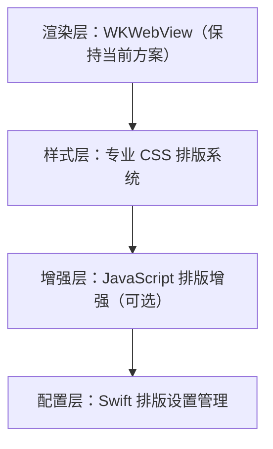

# 专业排版技术调研报告

## 概述

本文档对电子书阅读器的专业排版技术进行深入调研，旨在将 Readmigo 的排版能力从"CSS 基础"（50%）提升至商业级标准（95%+）。

**当前状态：** CSS 基础排版
**目标状态：** 专业排版引擎
**对标产品：** Apple Books、Amazon Kindle、微信读书、多看阅读

---

## 一、当前排版实现分析

### 1.1 现有功能

### 1.2 已有设置项（未完全应用）

| 设置项 | 状态 | 说明 |
|--------|------|------|
| 字号调节 | ✅ 已实现 | 4档可调 |
| 行高调节 | ✅ 已实现 | 随字号变化 |
| 两端对齐 | ⚠️ 部分 | 设置存在但未动态应用 |
| 连字符 | ⚠️ 部分 | AppStorage 存在但未应用 |
| 主题切换 | ✅ 已实现 | 3种主题 |

### 1.3 差距分析

| 能力 | 当前 | 商业级标准 | 差距 |
|------|------|-----------|------|
| 连字符断词 | ❌ | 智能断词 | 高 |
| 字间距微调 | ❌ | 自适应 | 中 |
| 孤行寡行控制 | ❌ | 自动避免 | 中 |
| 首字下沉 | ❌ | 可选 | 低 |
| 字体特性 | ❌ | OpenType | 高 |
| 中英混排 | ❌ | 专业间距 | 高 |
| 标点挤压 | ❌ | 智能处理 | 中 |
| 分页优化 | ❌ | 避免断页 | 高 |

---

## 二、专业排版核心技术

### 2.1 连字符断词（Hyphenation）

连字符断词是专业排版的基础，可显著提升两端对齐时的文字分布均匀度。

#### 2.1.1 CSS 原生支持

#### 2.1.2 JavaScript 断词库（Hypher/Hyphenopoly）

对于需要精确控制的场景，可使用 JavaScript 断词库：

#### 2.1.3 断词规则配置

---

### 2.2 文字间距与字距调整（Letter Spacing & Kerning）

#### 2.2.1 基础间距控制

#### 2.2.2 OpenType 字体特性

#### 2.2.3 动态间距调整

---

### 2.3 孤行与寡行控制（Orphans & Widows）

孤行（Orphan）：段落开头仅一行出现在页面底部
寡行（Widow）：段落结尾仅一行出现在页面顶部

#### 2.3.1 CSS 控制

#### 2.3.2 JavaScript 增强控制

---

### 2.4 首字下沉（Drop Caps）

#### 2.4.1 CSS 实现

#### 2.4.2 配置选项

---

### 2.5 首行缩进

#### 2.5.1 CSS 实现

#### 2.5.2 配置系统

---

### 2.6 中英文混排

中英文混排是 CJK（中日韩）电子书的核心难题。

#### 2.6.1 基础间距处理

#### 2.6.2 JavaScript 自动间距

#### 2.6.3 标点处理

#### 2.6.4 JavaScript 标点优化

---

### 2.7 行高与垂直节奏

#### 2.7.1 基线网格系统

#### 2.7.2 动态行高调整

---

### 2.8 分栏排版

#### 2.8.1 CSS 多栏布局

---

## 三、专业字体系统

### 3.1 字体栈设计

### 3.2 自定义字体加载

### 3.3 CSS 字体加载

---

## 四、完整 CSS 排版系统

### 4.1 专业排版样式表

---

## 五、实现优先级

### P0 - 必须实现（影响阅读体验）

| 功能 | 复杂度 | 工时 | 说明 |
|------|--------|------|------|
| 连字符断词 | 低 | 2h | CSS 原生 + 语言属性 |
| 字体渲染优化 | 低 | 1h | CSS font-smoothing |
| OpenType 特性 | 低 | 1h | kerning, ligatures |
| 首行缩进控制 | 低 | 2h | 设置项 + CSS |
| 孤行寡行控制 | 低 | 1h | CSS orphans/widows |

### P1 - 推荐实现（提升专业度）

| 功能 | 复杂度 | 工时 | 说明 |
|------|--------|------|------|
| 中英文自动间距 | 中 | 4h | JS 处理 + CSS |
| 自定义字体 | 中 | 8h | 字体管理 + 加载 |
| 行高微调 | 低 | 2h | 扩展设置 |
| 段落间距模式 | 低 | 2h | 缩进/间距切换 |
| 首字下沉 | 低 | 2h | CSS + 设置 |

### P2 - 可选实现（锦上添花）

| 功能 | 复杂度 | 工时 | 说明 |
|------|--------|------|------|
| 标点挤压 | 高 | 8h | JS 标点处理 |
| 智能分页 | 高 | 16h | 避免断词断句 |
| 基线网格 | 中 | 4h | 垂直节奏 |
| 多栏布局 | 中 | 4h | iPad 横屏 |

---

## 六、商业阅读器对标

### 6.1 Apple Books

| 特性 | 实现方式 | 优点 |
|------|---------|------|
| 字体 | 系统字体 + 内置专业字体 | 质量高 |
| 断词 | 系统级连字符引擎 | 准确 |
| 排版 | TextKit 原生 + CSS 辅助 | 性能好 |
| 中文 | 系统级 CJK 支持 | 完善 |

### 6.2 Amazon Kindle

| 特性 | 实现方式 | 优点 |
|------|---------|------|
| 字体 | Bookerly 专属字体 | 可读性极佳 |
| 断词 | 内置断词引擎 | 多语言支持 |
| 排版 | 自研引擎 | 高度优化 |
| 页边距 | 严格控制 | 一致性 |

### 6.3 微信读书

| 特性 | 实现方式 | 优点 |
|------|---------|------|
| 中文排版 | 专业中文排版引擎 | 优秀 |
| 标点处理 | 智能标点压缩 | 美观 |
| 字体 | 方正定制字体 | 质量高 |
| 竖排 | 完整竖排支持 | 传统美学 |

---

## 七、技术选型建议

### 7.1 推荐方案

### 7.2 不建议的方案

| 方案 | 原因 |
|------|------|
| 自研原生引擎 | 开发成本极高，ROI 低 |
| TextKit 2 完全重写 | 学习曲线陡峭，维护成本高 |
| 第三方阅读 SDK | 定制性差，依赖风险 |

### 7.3 渐进增强策略

---

## 八、快速实现清单

### 8.1 立即可做（修改 ReaderContentView.swift）

### 8.2 需要更新 ReaderSettingsView

---

## 九、总结

### 9.1 核心结论

1. **CSS 原生能力已足够**：现代 CSS 提供了完善的排版控制能力
2. **渐进增强最优**：保持 WKWebView 架构，逐步增强 CSS
3. **配置优先**：提供丰富的排版设置选项
4. **中文特殊处理**：中英混排需要专门优化

### 9.2 预期成果

| 指标 | 当前 | 优化后 |
|------|------|--------|
| 排版完成度 | 50% | 90%+ |
| 专业字体支持 | 无 | 有 |
| 连字符断词 | 无 | 有 |
| 中英混排质量 | 差 | 优 |
| 用户可配置项 | 4项 | 12项+ |

### 9.3 下一步行动

1. 将专业 CSS 集成到 `ReaderContentView.swift`
2. 扩展 `ReaderSettingsView` 排版选项
3. 测试不同书籍的排版效果
4. 收集用户反馈优化细节

---

## 参考资料

- [CSS Text Module Level 3](https://www.w3.org/TR/css-text-3/)
- [CSS Fonts Module Level 4](https://www.w3.org/TR/css-fonts-4/)
- [Practical Typography](https://practicaltypography.com/)
- [The Elements of Typographic Style Applied to the Web](http://webtypography.net/)
- [EPUB 3 CSS Profile](https://www.w3.org/publishing/epub32/epub-contentdocs.html#sec-css)
- [中文排版需求](https://www.w3.org/TR/clreq/)
