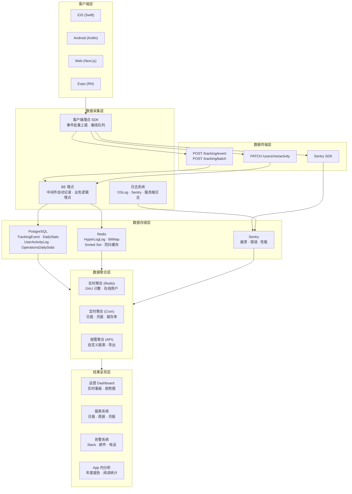
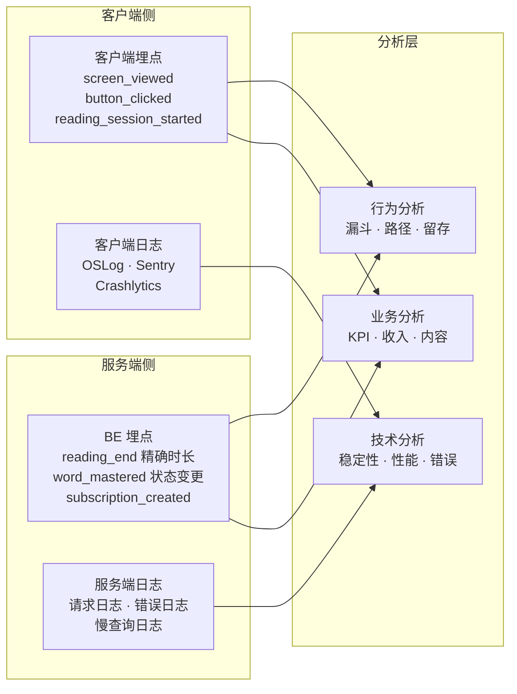
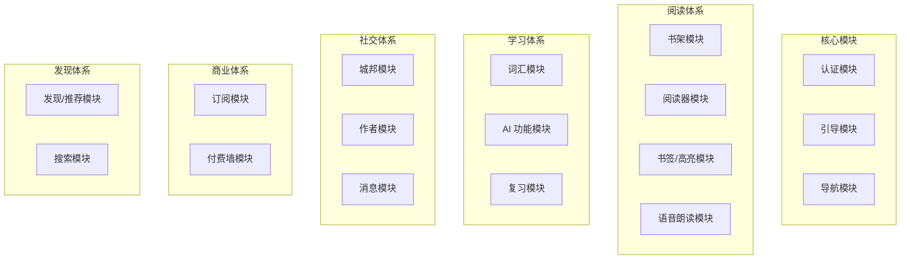
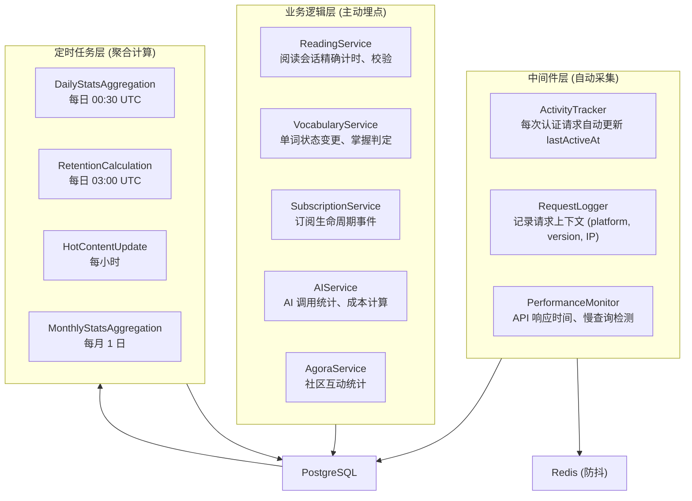
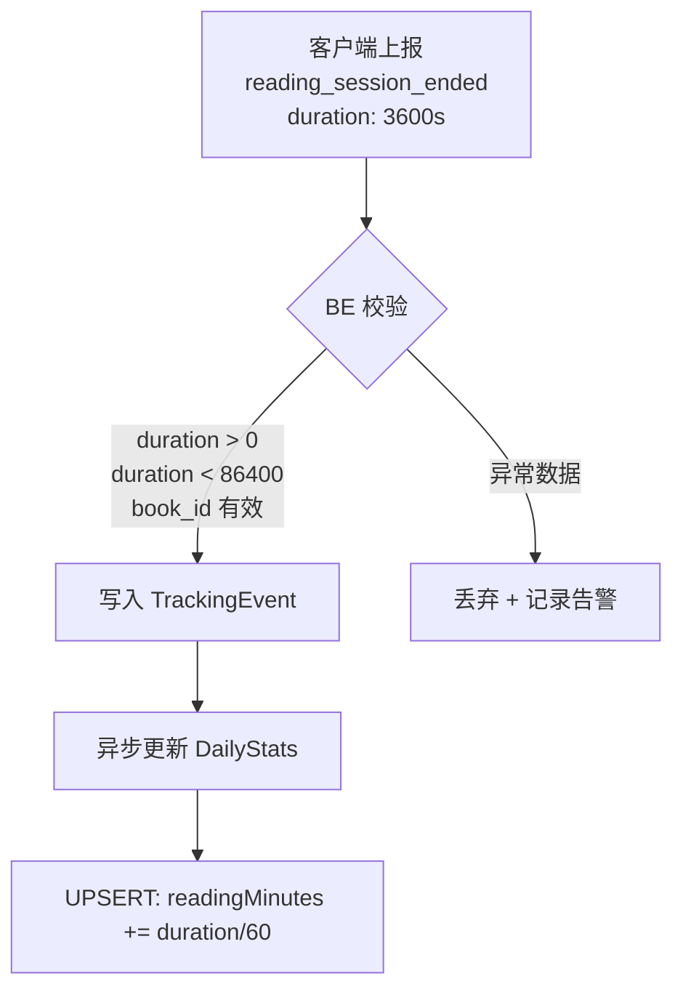
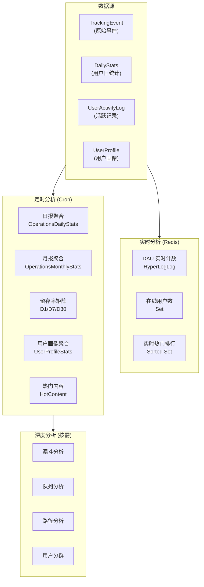
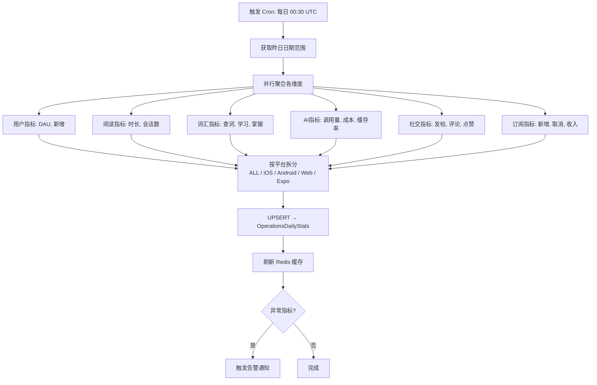

# 埋点与数据追踪系统设计

> 客户端埋点 · BE 埋点 · 日志系统 · 数据分析 · 结果呈现

---

## 1. 总体设计

### 1.1 系统全景



### 1.2 设计原则

| 原则 | 说明 |
|------|------|
| 隐私优先 | 最小化收集，匿名化处理，遵循 GDPR/CCPA/ATT |
| 静默失败 | 数据上报失败不影响用户体验 |
| 分层采集 | 客户端采集交互行为，BE 采集业务逻辑，日志采集异常信息 |
| 实时 + 离线 | 在线实时上报，离线本地队列，恢复后补传 |
| 聚合优先 | 原始事件保留 90 天，聚合数据长期保留 |

### 1.3 数据流分层

```
┌─────────────────────────────────────────────────────────────────────────────┐
│                           数据流分层架构                                      │
├─────────────────────────────────────────────────────────────────────────────┤
│                                                                             │
│  L1 - 原始事件层                                                             │
│  ═══════════════                                                            │
│  · 客户端埋点事件 (TrackingEvent)        保留 90 天                          │
│  · BE 自动记录事件                       保留 90 天                          │
│  · 客户端日志 (Sentry breadcrumbs)       保留 30 天                          │
│                                                                             │
│  L2 - 聚合统计层                                                             │
│  ═══════════════                                                            │
│  · DailyStats (用户维度)                 保留 3 年                           │
│  · OperationsDailyStats (平台维度)       保留 3 年                           │
│  · OperationsMonthlyStats                保留永久                           │
│                                                                             │
│  L3 - 分析结果层                                                             │
│  ═══════════════                                                            │
│  · 留存率矩阵                            保留永久                           │
│  · 用户画像统计                          保留永久                           │
│  · 年度报告                              保留永久                           │
│                                                                             │
└─────────────────────────────────────────────────────────────────────────────┘
```

---

## 2. 三种数据采集方式对比

### 2.1 对比总览

| 维度 | 客户端埋点 | 日志系统 | BE API 分析 |
|------|-----------|---------|-------------|
| **采集位置** | 客户端 (iOS/Android/Web) | 客户端 + 服务端 | 服务端 |
| **触发方式** | 用户交互 / 页面生命周期 | 代码执行路径 | API 请求处理 |
| **数据类型** | 行为事件、交互轨迹 | 异常、性能、调试信息 | 业务数据、请求上下文 |
| **实时性** | 准实时 (批量上报，延迟 ≤30s) | 实时 (Sentry) / 延迟 (本地) | 实时 (请求即记录) |
| **数据量** | 中等 (有采样和批量) | 大 (全量记录) | 大 (每次请求) |
| **用户感知** | 无感知 | 无感知 | 无感知 |
| **离线支持** | 支持 (本地队列) | 部分支持 | 不支持 (需网络) |
| **隐私影响** | 高 (需用户同意) | 低 (功能性数据) | 低 (服务端数据) |

### 2.2 适用场景矩阵

```
┌─────────────────────────────────────────────────────────────────────────────┐
│                      三种采集方式适用场景                                      │
├─────────────────────────────────────────────────────────────────────────────┤
│                                                                             │
│  客户端埋点 ──── 回答 "用户做了什么"                                          │
│  ═══════════                                                                │
│  ✅ 用户行为分析        页面浏览、按钮点击、手势操作                          │
│  ✅ 转化漏斗分析        注册漏斗、订阅漏斗、阅读漏斗                          │
│  ✅ 功能使用率          AI 查词、高亮、书签、TTS 使用频率                      │
│  ✅ 用户路径分析        页面跳转路径、功能发现路径                            │
│  ✅ A/B 测试数据        实验组行为差异                                       │
│  ✅ 停留时长            页面/功能停留时间                                    │
│                                                                             │
│  日志系统 ──── 回答 "系统发生了什么"                                          │
│  ═══════════                                                                │
│  ✅ 崩溃诊断            崩溃堆栈、设备信息、操作路径                          │
│  ✅ 错误追踪            API 错误、解析失败、渲染异常                          │
│  ✅ 性能监控            启动时间、帧率、内存占用                              │
│  ✅ 调试排查            用户操作回溯 (breadcrumbs)                           │
│  ✅ 网络诊断            请求耗时、失败率、超时分布                            │
│  ❌ 不适合              用户行为分析、业务指标统计                            │
│                                                                             │
│  BE API 分析 ──── 回答 "业务产生了什么结果"                                   │
│  ═══════════                                                                │
│  ✅ 精确业务数据        阅读时长、学习单词数、完读率                          │
│  ✅ 交易数据            订阅、支付、续费                                     │
│  ✅ 内容分析            热门书籍、阅读排行、推荐效果                          │
│  ✅ 服务端性能          API 响应时间、数据库查询耗时                          │
│  ✅ 安全审计            登录记录、权限变更、异常访问                          │
│  ✅ 数据一致性          服务端记录确保数据准确不可篡改                        │
│  ❌ 不适合              客户端交互细节、UI 层行为                             │
│                                                                             │
└─────────────────────────────────────────────────────────────────────────────┘
```

### 2.3 协同工作模型



### 2.4 同一事件的多层采集示例

以 "用户完成阅读" 为例，三种方式分别采集：

| 层级 | 采集内容 | 用途 |
|------|---------|------|
| **客户端埋点** | reading_session_ended：book_id, chapter, duration_seconds, pages_read | 用户行为分析、阅读漏斗 |
| **日志** | [Reading] Session ended, memory: 85MB, FPS avg: 58 | 性能监控、问题排查 |
| **BE API** | POST /reading/progress → 服务端验证并持久化：精确阅读时长、校验数据合理性、更新 DailyStats | 业务指标（保证数据准确） |

**关键差异**：客户端埋点可能因网络问题丢失或被篡改，BE 数据是业务真相源 (Source of Truth)。

---

## 3. 具体模块埋点清单

### 3.1 模块总览



### 3.2 认证模块

| 事件 | 采集方 | 触发时机 | 关键属性 |
|------|--------|---------|---------|
| app_launched | 客户端 | 应用启动 | launch_type (cold/warm), duration_ms |
| onboarding_started | 客户端 | 进入引导 | entry_source |
| onboarding_step_viewed | 客户端 | 引导步骤浏览 | step_index, step_name |
| onboarding_completed | 客户端 | 完成引导 | total_duration_s, steps_completed |
| user_signed_up | BE | 注册成功 | method (apple/google/email), platform |
| user_logged_in | BE | 登录成功 | method, platform, device_model |
| user_logged_out | BE | 登出 | reason (manual/token_expired) |
| guest_session_started | BE | 游客会话开始 | device_id, platform |

### 3.3 书架模块

| 事件 | 采集方 | 触发时机 | 关键属性 |
|------|--------|---------|---------|
| library_viewed | 客户端 | 进入书架页 | view_mode (grid/list/shelf), book_count |
| book_added_to_library | BE | 添加到书架 | book_id, source (explore/search/share) |
| book_removed_from_library | BE | 从书架移除 | book_id, reading_progress |
| book_import_started | 客户端 | 开始导入 | file_type (epub/pdf/txt), source (files/icloud/airdrop) |
| book_import_completed | BE | 导入完成 | file_type, file_size, duration_ms |
| library_sorted | 客户端 | 排序操作 | sort_by (recent/title/author/progress) |
| library_filtered | 客户端 | 筛选操作 | filter_type (reading_status/tag) |

### 3.4 阅读器模块

| 事件 | 采集方 | 触发时机 | 关键属性 |
|------|--------|---------|---------|
| reading_session_started | 客户端+BE | 开始阅读 | book_id, chapter_index, reading_mode |
| reading_session_ended | 客户端+BE | 结束阅读 | book_id, duration_s, pages_read, words_read |
| page_turned | 客户端 | 翻页 | book_id, page_index, direction (forward/back) |
| chapter_completed | BE | 完成章节 | book_id, chapter_index, duration_s |
| book_completed | BE | 完成全书 | book_id, total_duration_s, total_sessions |
| bookmark_added | 客户端+BE | 添加书签 | book_id, position, chapter_index |
| highlight_created | 客户端+BE | 创建高亮 | book_id, text_length, color |
| annotation_added | 客户端+BE | 添加批注 | book_id, annotation_length |
| reading_settings_changed | 客户端 | 修改阅读设置 | setting_type (font/size/theme/spacing) |
| bilingual_toggled | 客户端 | 切换双语 | enabled, book_id |
| auto_page_turn_toggled | 客户端 | 切换自动翻页 | enabled, interval_s |

### 3.5 语音朗读 (TTS) 模块

| 事件 | 采集方 | 触发时机 | 关键属性 |
|------|--------|---------|---------|
| tts_started | 客户端 | 开始朗读 | book_id, engine (system/cloud/librivox), voice_id |
| tts_stopped | 客户端 | 停止朗读 | book_id, duration_s, chapters_played |
| tts_speed_changed | 客户端 | 调整语速 | speed_value, book_id |
| tts_voice_changed | 客户端 | 切换声音 | voice_id, engine |
| tts_mode_switched | 客户端 | 切换朗读模式 | mode (read_aloud/listen_only/follow_along) |
| audiobook_downloaded | BE | 有声书下载 | book_id, file_size, duration_ms |

### 3.6 词汇学习模块

| 事件 | 采集方 | 触发时机 | 关键属性 |
|------|--------|---------|---------|
| word_looked_up | 客户端+BE | 查词 | word, book_id, context, source (reader/search) |
| word_saved | BE | 保存生词 | word, book_id, source |
| word_reviewed | BE | 复习单词 | word, result (correct/incorrect), mastery_level |
| word_mastered | BE | 掌握单词 | word, total_reviews, days_to_master |
| review_session_started | 客户端 | 开始复习 | word_count, review_type |
| review_session_completed | BE | 完成复习 | words_reviewed, correct_count, duration_s |
| daily_goal_achieved | BE | 达成每日目标 | goal_type (reading/vocabulary), streak_days |

### 3.7 AI 功能模块

| 事件 | 采集方 | 触发时机 | 关键属性 |
|------|--------|---------|---------|
| ai_explain_used | 客户端+BE | 使用 AI 解释 | text_type (word/sentence/paragraph), book_id |
| ai_translate_used | 客户端+BE | 使用 AI 翻译 | text_length, target_lang, book_id |
| ai_simplify_used | 客户端+BE | 使用 AI 简化 | text_length, book_id |
| ai_chat_started | 客户端 | 开始 AI 对话 | book_id, chat_type (general/author) |
| ai_chat_message_sent | BE | 发送聊天消息 | book_id, message_length, provider |
| ai_summary_requested | BE | 请求摘要 | book_id, chapter_index, provider |
| ai_response_received | BE | AI 响应 | provider, model, latency_ms, token_count, cost |
| ai_cache_hit | BE | AI 缓存命中 | query_type, saved_cost |

### 3.8 订阅模块

| 事件 | 采集方 | 触发时机 | 关键属性 |
|------|--------|---------|---------|
| paywall_viewed | 客户端 | 查看付费墙 | trigger (feature/limit/manual), source_screen |
| paywall_dismissed | 客户端 | 关闭付费墙 | duration_viewed_s, scroll_depth |
| subscription_started | BE | 开始订阅 | plan_type (pro/premium), price, currency, trial |
| subscription_renewed | BE | 续订成功 | plan_type, period_count |
| subscription_cancelled | BE | 取消订阅 | plan_type, reason, subscription_duration_days |
| trial_started | BE | 开始试用 | plan_type, trial_length_days |
| trial_converted | BE | 试用转正 | plan_type, trial_length_days |
| trial_expired | BE | 试用过期 | plan_type |
| iap_purchase_failed | 客户端 | 购买失败 | error_type, product_id |

### 3.9 发现与搜索模块

| 事件 | 采集方 | 触发时机 | 关键属性 |
|------|--------|---------|---------|
| explore_viewed | 客户端 | 进入发现页 | tab (recommended/popular/new/categories) |
| recommendation_clicked | 客户端 | 点击推荐 | book_id, recommendation_type, position |
| search_performed | 客户端+BE | 执行搜索 | query, result_count, search_type (book/author) |
| search_result_clicked | 客户端 | 点击搜索结果 | book_id, query, result_position |
| category_viewed | 客户端 | 查看分类 | category_id, category_name |
| book_detail_viewed | 客户端 | 查看书籍详情 | book_id, source (explore/search/library/share) |

### 3.10 社区 (城邦) 模块

| 事件 | 采集方 | 触发时机 | 关键属性 |
|------|--------|---------|---------|
| agora_viewed | 客户端 | 进入城邦 | tab (feed/following/trending) |
| post_created | BE | 发布帖子 | post_type, content_length, has_image |
| post_liked | BE | 点赞 | post_id |
| post_commented | BE | 评论 | post_id, comment_length |
| post_shared | 客户端 | 分享 | post_id, share_channel |
| author_profile_viewed | 客户端 | 查看作者主页 | author_id |
| author_chat_started | 客户端 | 开始作者聊天 | author_id |

### 3.11 导航与通用事件

| 事件 | 采集方 | 触发时机 | 关键属性 |
|------|--------|---------|---------|
| screen_viewed | 客户端 | 页面浏览 | screen_name, source_screen |
| tab_switched | 客户端 | 切换 Tab | from_tab, to_tab |
| notification_received | 客户端 | 收到通知 | notification_type |
| notification_opened | 客户端 | 打开通知 | notification_type, delay_s |
| share_clicked | 客户端 | 点击分享 | content_type, share_channel |
| settings_changed | 客户端 | 修改设置 | setting_key, old_value, new_value |
| deep_link_opened | 客户端 | 打开深链接 | link_type, source |

---

## 4. 客户端埋点采集

### 4.1 SDK 架构

```
┌─────────────────────────────────────────────────────────────────────────────┐
│                      客户端埋点 SDK 架构 (iOS)                                │
├─────────────────────────────────────────────────────────────────────────────┤
│                                                                             │
│  应用层 (SwiftUI Views)                                                     │
│  ═══════════════════════                                                    │
│  · ViewModifier 自动采集 (页面浏览、停留时长)                                │
│  · 手动埋点 (按钮点击、业务事件)                                             │
│                                                                             │
│       │                                                                     │
│       ▼                                                                     │
│                                                                             │
│  事件管理层 (AnalyticsManager)                                               │
│  ═══════════════════════════════                                            │
│  ┌──────────────┐  ┌──────────────┐  ┌──────────────┐                      │
│  │  事件验证     │  │  属性补充     │  │  用户标识     │                      │
│  │  ──────────  │  │  ──────────  │  │  ──────────  │                      │
│  │  格式校验    │  │  通用属性注入 │  │  user_id     │                      │
│  │  必填字段    │  │  timestamp   │  │  anonymous_id│                      │
│  │  数据脱敏    │  │  session_id  │  │  device_id   │                      │
│  │              │  │  platform    │  │              │                      │
│  │              │  │  app_version │  │              │                      │
│  └──────────────┘  └──────────────┘  └──────────────┘                      │
│                                                                             │
│       │                                                                     │
│       ▼                                                                     │
│                                                                             │
│  传输层 (EventTransporter)                                                   │
│  ═══════════════════════════                                                │
│  ┌──────────────┐  ┌──────────────┐  ┌──────────────┐                      │
│  │  本地队列     │  │  批量策略     │  │  离线缓存     │                      │
│  │  ──────────  │  │  ──────────  │  │  ──────────  │                      │
│  │  内存队列    │  │  ≥10 条触发  │  │  SQLite 持久化│                      │
│  │  FIFO 顺序   │  │  ≥30s 触发   │  │  恢复后补传   │                      │
│  │  最大 1000   │  │  后台立即发  │  │  最大 10000   │                      │
│  └──────────────┘  └──────────────┘  └──────────────┘                      │
│                                                                             │
│       │                                                                     │
│       ▼                                                                     │
│                                                                             │
│  网络层                                                                     │
│  ═══════                                                                    │
│  POST /tracking/batch → 服务端                                              │
│                                                                             │
└─────────────────────────────────────────────────────────────────────────────┘
```

### 4.2 事件通用属性

每个客户端埋点事件自动附带以下属性：

| 属性 | 类型 | 来源 | 说明 |
|------|------|------|------|
| timestamp | DateTime | 自动 | 事件发生时间 (客户端本地) |
| user_id | String? | 自动 | 用户 ID (登录后) |
| anonymous_id | String | 自动 | 匿名 ID (登录前) |
| session_id | String | 自动 | 会话 ID |
| platform | String | 自动 | ios / android / web / expo-ios / expo-android |
| app_version | String | 自动 | 应用版本号 |
| os_version | String | 自动 | 操作系统版本 |
| device_model | String | 自动 | 设备型号 |
| language | String | 自动 | 用户语言 |
| subscription_tier | String | 自动 | FREE / PRO / PREMIUM |

### 4.3 批量上报策略

```
┌─────────────────────────────────────────────────────────────────────────────┐
│                      批量上报触发条件                                         │
├─────────────────────────────────────────────────────────────────────────────┤
│                                                                             │
│  触发条件 (满足任一即上报)                                                    │
│  ═══════════════════════                                                    │
│                                                                             │
│  ┌─── 数量触发 ───┐  ┌─── 时间触发 ───┐  ┌─── 生命周期触发 ──┐             │
│  │                 │  │                │  │                    │             │
│  │  队列 ≥ 10 条   │  │  距上次 ≥ 30s  │  │  App 进入后台      │             │
│  │                 │  │                │  │  App 即将终止      │             │
│  └─────────────────┘  └────────────────┘  └────────────────────┘             │
│                                                                             │
│  ┌─── 网络恢复触发 ──┐                                                      │
│  │                    │                                                      │
│  │  从离线恢复在线     │                                                      │
│  │  补传离线期间事件   │                                                      │
│  └────────────────────┘                                                      │
│                                                                             │
│  上报失败处理                                                                │
│  ═══════════                                                                │
│  · 网络失败 → 保留队列，下次重试                                             │
│  · 服务端 5xx → 指数退避重试 (最多 3 次)                                     │
│  · 服务端 4xx → 丢弃该批次，记录错误日志                                     │
│  · 队列超过 10000 → 丢弃最旧事件                                            │
│                                                                             │
└─────────────────────────────────────────────────────────────────────────────┘
```

### 4.4 页面自动追踪 (iOS)

```
┌─────────────────────────────────────────────────────────────────────────────┐
│                      iOS 页面自动追踪机制                                     │
├─────────────────────────────────────────────────────────────────────────────┤
│                                                                             │
│  实现方式: SwiftUI ViewModifier                                              │
│  ═════════════════════════════                                              │
│                                                                             │
│  View                                                                       │
│   │                                                                         │
│   ├── onAppear                                                              │
│   │    ├── 记录 screen_viewed 事件                                          │
│   │    ├── 记录进入时间戳                                                    │
│   │    └── 更新 NavigationTracker 页面栈                                     │
│   │                                                                         │
│   └── onDisappear                                                           │
│        ├── 计算停留时长                                                      │
│        ├── 记录 screen_exited 事件 (含 duration)                             │
│        └── 更新 NavigationTracker 页面栈                                     │
│                                                                             │
│  自动采集的页面                                                              │
│  ═══════════════                                                            │
│  Home · Library · Discover · Vocabulary · Profile · BookDetail              │
│  Reader · Review · Settings · Subscription · Paywall                        │
│  Login · Register · Onboarding · Agora · AuthorProfile                     │
│  Messages · AnnualReport · Badges · Search                                  │
│                                                                             │
└─────────────────────────────────────────────────────────────────────────────┘
```

### 4.5 隐私合规

| 合规要求 | 实现方式 |
|---------|---------|
| ATT (iOS 14.5+) | 弹窗请求追踪授权，拒绝后仅使用匿名 ID |
| GDPR (欧盟) | 明确同意机制，数据可移植，被遗忘权 |
| CCPA (加州) | 数据销售选择退出，数据访问请求 |
| 用户控制 | 设置页面提供追踪开关，可关闭分析追踪 |
| 数据脱敏 | 敏感信息 (token, password) 不写入事件 |
| App Privacy Report | 声明数据收集类型和用途 |

---

## 5. BE 埋点

### 5.1 BE 埋点架构



### 5.2 中间件自动采集

```
┌─────────────────────────────────────────────────────────────────────────────┐
│                      BE 中间件自动采集                                        │
├─────────────────────────────────────────────────────────────────────────────┤
│                                                                             │
│  ActivityTracker 中间件                                                      │
│  ══════════════════════                                                     │
│  触发: 每次认证请求                                                          │
│  逻辑:                                                                      │
│   1. 从 JWT 获取 userId                                                     │
│   2. 检查 Redis 防抖 (5分钟内不重复写入)                                     │
│   3. 更新 users.lastActiveAt                                                │
│   4. 写入/更新 UserActivityLog                                              │
│  用途: DAU/MAU 精确计算                                                      │
│                                                                             │
│  RequestLogger 中间件                                                        │
│  ═══════════════════                                                        │
│  触发: 每次 API 请求                                                         │
│  记录:                                                                      │
│   · X-Client-Platform (客户端类型)                                           │
│   · X-Client-Version (版本号)                                               │
│   · X-Device-Model (设备型号)                                               │
│   · Accept-Language (语言偏好)                                              │
│   · IP 地址 → GeoIP 地区推断                                                │
│  用途: 客户端分布、地区分布                                                  │
│                                                                             │
│  PerformanceMonitor 中间件                                                   │
│  ════════════════════════                                                   │
│  触发: 每次 API 请求                                                         │
│  记录:                                                                      │
│   · 请求处理时间                                                             │
│   · 数据库查询耗时                                                          │
│   · 响应状态码                                                              │
│  告警: 响应 > 1s 记录慢请求日志                                              │
│                                                                             │
└─────────────────────────────────────────────────────────────────────────────┘
```

### 5.3 业务逻辑埋点

| 服务 | 埋点事件 | 触发条件 | 记录数据 |
|------|---------|---------|---------|
| **ReadingService** | reading_end | 阅读会话结束 | 校验后的精确阅读时长、页数、进度 |
| | chapter_complete | 章节进度=100% | book_id, chapter_index, 累计时长 |
| | book_complete | 全书进度=100% | book_id, 总阅读时长, 总会话数 |
| **VocabularyService** | word_add | 保存新词 | word, book_id, 用户总词汇量 |
| | word_master | 掌握程度达标 | word, 复习次数, 学习天数 |
| **SubscriptionService** | subscription_created | IAP 验证成功 | plan_type, price, currency, receipt |
| | subscription_renewed | 续费回调 | plan_type, period |
| | subscription_cancelled | 取消回调 | plan_type, reason, 订阅时长 |
| **AIService** | ai_request | AI 调用 | provider, model, token_count, cost, latency_ms |
| | ai_cache_hit | 缓存命中 | query_type, 节省成本 |
| **AgoraService** | post_created | 发帖 | content_type, content_length |
| | interaction | 点赞/评论 | interaction_type, target_id |

### 5.4 BE 埋点 vs 客户端埋点对比

| 维度 | BE 埋点 | 客户端埋点 |
|------|--------|-----------|
| **数据可靠性** | 高 (服务端记录，不可篡改) | 中 (可能丢失、被拦截) |
| **时间精度** | 高 (服务端统一时钟) | 中 (依赖客户端时钟) |
| **交互细节** | 低 (只知道 API 调用) | 高 (知道用户操作路径) |
| **覆盖范围** | 仅 API 交互 | UI 交互 + API 交互 |
| **实现成本** | 低 (中间件 + Service 内) | 中 (需要 SDK + 各页面集成) |
| **性能影响** | 极低 (异步写入) | 低 (本地队列 + 批量上报) |

### 5.5 数据校验流程



---

## 6. 数据分析

### 6.1 分析架构



### 6.2 KPI 指标体系

```
┌─────────────────────────────────────────────────────────────────────────────┐
│                          KPI 指标体系                                        │
├─────────────────────────────────────────────────────────────────────────────┤
│                                                                             │
│  用户增长指标                    参与度指标                                   │
│  ════════════                   ═══════════                                 │
│  · DAU (日活跃用户)             · 人均阅读时长 (分钟/日)                      │
│  · WAU (周活跃用户)             · 人均学习单词数 (词/日)                      │
│  · MAU (月活跃用户)             · 人均会话次数 (次/日)                        │
│  · Stickiness (DAU/MAU)        · 平均会话时长                               │
│  · 新增用户数                   · 功能使用率 (AI/TTS/社区)                    │
│  · D1/D7/D30 留存率            · 完读率 (完成/开始)                          │
│                                                                             │
│  商业指标                       内容指标                                     │
│  ═══════════                   ═══════════                                  │
│  · 付费转化率                   · 热门书籍 TOP 10                            │
│  · 试用转正率                   · 热门金句 TOP 10                            │
│  · MRR (月度经常性收入)         · 书籍完读率排行                              │
│  · ARR (年度经常性收入)         · 分类阅读分布                               │
│  · ARPU (每用户平均收入)        · 难度级别分布                               │
│  · LTV (用户生命周期价值)       · 内容新增量                                 │
│  · 流失率                       · AI 使用量 (及成本)                         │
│                                                                             │
│  技术指标                       社区指标                                     │
│  ═══════════                   ═══════════                                  │
│  · 崩溃率 (目标 < 0.1%)        · 城邦发帖数                                 │
│  · API 成功率 (目标 > 99%)      · 城邦评论数                                 │
│  · 冷启动时间 (目标 < 2s)       · 城邦点赞数                                 │
│  · API 响应时间 (目标 < 300ms)  · 互动率                                    │
│  · FPS (目标 > 55)             · 活跃创作者数                               │
│                                                                             │
└─────────────────────────────────────────────────────────────────────────────┘
```

### 6.3 漏斗分析

```mermaid
graph TD
    subgraph Registration["注册漏斗"]
        R1["app_launched (100%)"] --> R2["onboarding_started (70%)"]
        R2 --> R3["onboarding_completed (50%)"]
        R3 --> R4["user_signed_up (30%)"]
        R4 --> R5["first_book_read (20%)"]
    end

    subgraph Subscription["订阅漏斗"]
        S1["paywall_viewed (100%)"] --> S2["trial_started (25%)"]
        S2 --> S3["trial_active_day7 (60%)"]
        S3 --> S4["trial_converted (40%)"]
    end

    subgraph Reading["阅读漏斗"]
        B1["book_detail_viewed (100%)"] --> B2["book_added_to_library (55%)"]
        B2 --> B3["reading_session_started (40%)"]
        B3 --> B4["chapter_completed (25%)"]
        B4 --> B5["book_completed (8%)"]
    end
```



### 6.4 留存分析

| 留存类型 | 计算方式 | 数据源 |
|---------|---------|--------|
| D1 次日留存 | 第 N 天注册用户中，第 N+1 天活跃的比例 | UserActivityLog |
| D7 七日留存 | 第 N 天注册用户中，第 N+7 天活跃的比例 | UserActivityLog |
| D30 月留存 | 第 N 天注册用户中，第 N+30 天活跃的比例 | UserActivityLog |
| 周留存 | 第 N 周注册用户中，第 N+1 周活跃的比例 | UserActivityLog |

留存率矩阵示例：

```
┌───────────────────────────────────────────────────────────────────────────┐
│  注册日期     │ 新增  │ D1    │ D3    │ D7    │ D14   │ D30   │ D60    │
│───────────────┼───────┼───────┼───────┼───────┼───────┼───────┼────────│
│  2026-02-01   │  312  │ 52.3% │ 41.5% │ 35.2% │ 28.1% │ 22.4% │ 15.3% │
│  2026-02-02   │  256  │ 48.1% │ 38.2% │ 32.8% │ 26.5% │  --   │  --   │
│  2026-02-03   │  234  │ 45.2% │ 36.1% │  --   │  --   │  --   │  --   │
└───────────────────────────────────────────────────────────────────────────┘
```

### 6.5 定时聚合任务

| 任务 | Cron 表达式 | 输入 | 输出 |
|------|-------------|------|------|
| 日报聚合 | `30 0 * * *` | TrackingEvent + UserActivityLog | OperationsDailyStats |
| 留存计算 | `0 3 * * *` | UserActivityLog + Users | 留存率矩阵 |
| 热门排行 | `0 * * * *` | TrackingEvent (阅读/浏览) | HotContent |
| 月报聚合 | `0 2 1 * *` | OperationsDailyStats | OperationsMonthlyStats |
| 用户画像 | `0 4 * * *` | UserProfile | UserProfileStats |

### 6.6 聚合流程



---

## 7. 结果呈现

### 7.1 呈现渠道

```
┌─────────────────────────────────────────────────────────────────────────────┐
│                        结果呈现渠道                                           │
├─────────────────────────────────────────────────────────────────────────────┤
│                                                                             │
│  ┌──────────────────────────┐  目标受众: 运营团队                            │
│  │  1. 运营 Dashboard        │  更新频率: 实时 / 5分钟                       │
│  │     dashboard.readmigo.app│  内容: 核心KPI · 趋势图 · 排行榜             │
│  └──────────────────────────┘                                               │
│                                                                             │
│  ┌──────────────────────────┐  目标受众: 运营/管理层                         │
│  │  2. 报表系统              │  更新频率: 日报/周报/月报                      │
│  │     CSV · Excel · PDF     │  内容: 详细数据 · 同环比 · 趋势分析           │
│  └──────────────────────────┘                                               │
│                                                                             │
│  ┌──────────────────────────┐  目标受众: 技术团队                            │
│  │  3. 告警系统              │  更新频率: 实时                               │
│  │     Slack · 邮件 · 电话   │  内容: 异常指标 · 崩溃率 · API 故障           │
│  └──────────────────────────┘                                               │
│                                                                             │
│  ┌──────────────────────────┐  目标受众: 终端用户                            │
│  │  4. App 内数据展示        │  更新频率: 实时/每日                           │
│  │     阅读统计 · 年度报告   │  内容: 个人阅读数据 · 学习进度 · 成就          │
│  └──────────────────────────┘                                               │
│                                                                             │
│  ┌──────────────────────────┐  目标受众: 技术团队                            │
│  │  5. 专业工具              │  更新频率: 实时                               │
│  │     Sentry · App Store    │  内容: 崩溃详情 · 渠道数据                    │
│  └──────────────────────────┘                                               │
│                                                                             │
└─────────────────────────────────────────────────────────────────────────────┘
```

### 7.2 运营 Dashboard 看板

```
┌─────────────────────────────────────────────────────────────────────────────┐
│  Readmigo 运营数据看板                        [今日] [本周] [本月] [自定义]   │
├─────────────────────────────────────────────────────────────────────────────┤
│                                                                             │
│  核心指标                                              更新时间: 10:32:15   │
│  ───────────────────────────────────────────────────────────────────────── │
│                                                                             │
│  ┌───────────────┐ ┌───────────────┐ ┌───────────────┐ ┌───────────────┐  │
│  │     DAU       │ │     MAU       │ │    新增用户    │ │   活跃率      │  │
│  │    8,432      │ │   45,678      │ │     234       │ │   18.5%       │  │
│  │   ↑ 12.3%     │ │   ↑ 8.2%      │ │   ↓ 3.1%      │ │   ↑ 0.8%      │  │
│  └───────────────┘ └───────────────┘ └───────────────┘ └───────────────┘  │
│                                                                             │
│  ┌───────────────┐ ┌───────────────┐ ┌───────────────┐ ┌───────────────┐  │
│  │   阅读时长     │ │   查词次数     │ │   AI 调用     │ │    收入       │  │
│  │   3.2h/人     │ │   12,456      │ │   45,678      │ │  $1,234       │  │
│  │   ↑ 0.3h      │ │   ↑ 15.2%     │ │   ↓ 5.3%      │ │   ↑ 22.1%     │  │
│  └───────────────┘ └───────────────┘ └───────────────┘ └───────────────┘  │
│                                                                             │
│  ───────────────────────────────────────────────────────────────────────── │
│                                                                             │
│  客户端分布                              DAU 趋势 (30天)                     │
│                                                                             │
│  ┌─────────────────────────┐            ┌────────────────────────────────┐ │
│  │  iOS    ████████████ 45%│            │     ╱──────────────           │ │
│  │  Android████████    35% │            │    ╱                          │ │
│  │  Web    ████        15% │            │   ╱               ── DAU     │ │
│  │  Expo   ██           5% │            │  ╱                ·· 新增    │ │
│  └─────────────────────────┘            └────────────────────────────────┘ │
│                                                                             │
│  ───────────────────────────────────────────────────────────────────────── │
│                                                                             │
│  热门书籍 TOP 5                          热门金句 TOP 5                      │
│                                                                             │
│  ┌─────────────────────────────────┐    ┌─────────────────────────────────┐│
│  │ # │ 书名              │ 阅读量  │    │ # │ 金句              │ 浏览量  ││
│  │───┼───────────────────┼─────────│    │───┼───────────────────┼─────────││
│  │ 1 │ Pride & Prejudice │ 12,345  │    │ 1 │ "To be or not..." │  5,678 ││
│  │ 2 │ Great Expectations│  8,901  │    │ 2 │ "In the begin..." │  4,567 ││
│  │ 3 │ Jane Eyre         │  7,654  │    │ 3 │ "It was the..."   │  3,456 ││
│  │ 4 │ 1984              │  6,543  │    │ 4 │ "All happy..."    │  2,345 ││
│  │ 5 │ The Great Gatsby  │  5,432  │    │ 5 │ "Call me Ish..."  │  1,890 ││
│  └─────────────────────────────────┘    └─────────────────────────────────┘│
│                                                                             │
└─────────────────────────────────────────────────────────────────────────────┘
```

### 7.3 告警规则

| 指标 | 告警条件 | 级别 | 通知方式 |
|------|---------|------|---------|
| DAU 下降 | 环比下降 > 20% | P1 警告 | Slack + 邮件 |
| DAU 暴跌 | 环比下降 > 50% | P0 严重 | Slack + 邮件 + 电话 |
| 崩溃率 | > 1% | P0 严重 | Slack 即时 |
| 崩溃率 | > 0.5% | P1 警告 | Slack + 邮件 |
| API 成功率 | < 99% | P0 严重 | Slack 即时 |
| API 响应时间 | P95 > 1s | P1 警告 | Slack |
| AI 日成本 | > $500 | P1 警告 | Slack + 邮件 |
| 次日留存 | < 30% | P2 关注 | 邮件 |
| 订阅成功率 | 下降 > 10% | P0 严重 | Slack + 邮件 |

### 7.4 报表系统

```
┌─────────────────────────────────────────────────────────────────────────────┐
│                         报表类型与内容                                        │
├─────────────────────────────────────────────────────────────────────────────┤
│                                                                             │
│  日报 (每日 06:00 UTC 自动生成)                                              │
│  ══════════════════════════════                                             │
│  · 昨日核心指标 (DAU, 新增, 阅读时长, AI 调用, 收入)                         │
│  · 同比/环比变化                                                             │
│  · 异常指标标红                                                              │
│  · 热门内容 TOP 10                                                          │
│                                                                             │
│  周报 (每周一自动生成)                                                        │
│  ═══════════════════════                                                    │
│  · 周汇总指标                                                                │
│  · 留存率趋势                                                                │
│  · 客户端分布变化                                                            │
│  · 内容排行变化                                                              │
│  · 关键事件回顾                                                              │
│                                                                             │
│  月报 (每月 1 日自动生成)                                                     │
│  ══════════════════════════                                                 │
│  · MAU 及增长趋势                                                            │
│  · 用户画像分布 (性别/年龄/地区)                                             │
│  · 订阅分析 (转化率/续费率/流失率)                                           │
│  · 收入分析 (MRR/ARPU/LTV)                                                 │
│  · 内容分析 (分类分布/难度分布)                                              │
│                                                                             │
│  导出格式: CSV · Excel · PDF                                                │
│                                                                             │
└─────────────────────────────────────────────────────────────────────────────┘
```

### 7.5 App 内数据展示

| 展示位置 | 内容 | 数据源 |
|---------|------|--------|
| 首页阅读卡片 | 今日阅读时长、连续天数 | DailyStats |
| 词汇页统计 | 已学词汇数、掌握率、待复习 | VocabularyService |
| 个人主页 | 累计阅读时长、完成书籍、学习单词 | DailyStats 聚合 |
| 年度报告 | 年度阅读总结、排行、里程碑 | YearlyStats 聚合 |
| 成就徽章 | 阅读里程碑、学习里程碑 | BadgeService |

---

## 8. 相关文档

| 文档 | 说明 |
|------|------|
| [数据分析与追踪](../04-development/shared/analytics.md) | 跨平台事件定义、属性、用户分群 |
| [行为追踪模块](../04-development/backend/modules/tracking.md) | 后端 TrackingEvent 数据模型、API、聚合流程 |
| [iOS 监控体系](../04-development/platforms/ios/monitoring.md) | Crashlytics、MetricKit、Sentry、行为埋点 |
| [运营数据统计系统设计](../04-development/platforms/dashboard/operations-analytics-design.md) | Dashboard 数据模型、API、界面设计 |
| [运营数据收集实现方案](../07-modules/operations/data-collection-implementation-plan.md) | lastActiveAt 和用户画像数据采集实现 |
| [iOS 日志增强设计](../04-development/platforms/ios/logging-enhancement-design.md) | iOS 页面追踪、性能监控、日志格式化 |

---

*最后更新: 2026-02-08*
