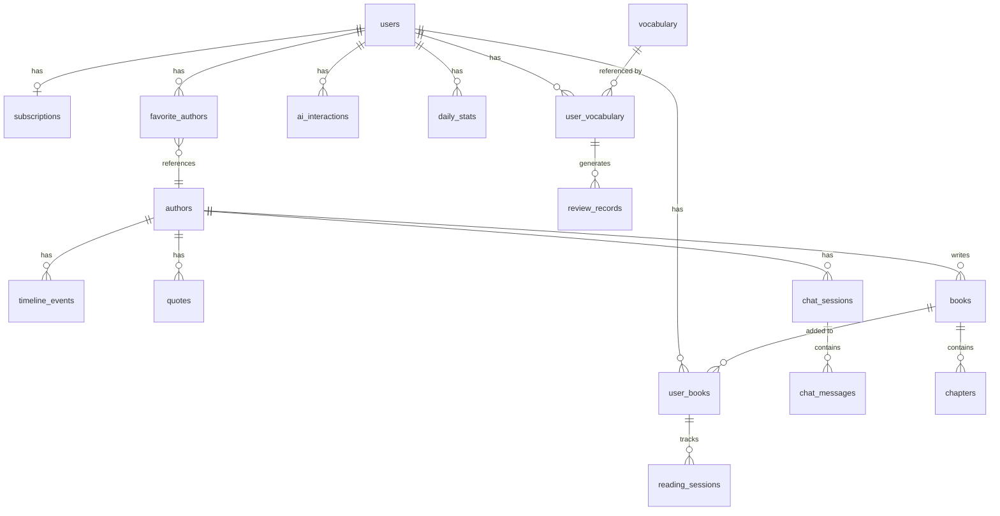

# 数据库设计

> PostgreSQL (Neon) + Prisma ORM | 60+ 数据模型

---

## 数据库概览

| 项目 | 说明 |
|------|------|
| 数据库 | PostgreSQL 15+ (Neon 托管) |
| ORM | Prisma 5.x |
| 模型数量 | 60+ |
| 命名规范 | snake_case (表名和字段名) |
| 时间字段 | TIMESTAMP WITH TIME ZONE (UTC) |
| 主键 | UUID |

---

## 核心数据模型

### 用户相关

| 表名 | 说明 | 关键字段 |
|------|------|---------|
| users | 用户账户 | id, email, name, avatar_url, apple_id, google_id |
| subscriptions | 订阅信息 | user_id, plan, status, expires_at |
| devices | 设备追踪 | user_id, device_type, device_token |
| daily_stats | 每日统计 | user_id, date, reading_minutes, words_learned |

### 内容相关

| 表名 | 说明 | 关键字段 |
|------|------|---------|
| books | 书籍 | id, title, author_id, epub_url, cover_url, source, difficulty_score |
| chapters | 章节 | id, book_id, order, title, html_content_url |
| authors | 作者 | id, name, bio, photo_url, birth_year, death_year |
| chapter_translations | 章节翻译 | chapter_id, locale, content_url |

### 阅读相关

| 表名 | 说明 | 关键字段 |
|------|------|---------|
| user_books | 用户书架 | user_id, book_id, status, progress |
| reading_sessions | 阅读会话 | user_id, book_id, chapter_id, started_at, ended_at |
| bookmarks | 书签 | user_id, book_id, chapter_id, position |

### 学习相关

| 表名 | 说明 | 关键字段 |
|------|------|---------|
| vocabulary | 词汇库 | word, phonetic, definition, cefr_level |
| user_vocabulary | 用户词汇 | user_id, vocabulary_id, ef, interval, next_review_at |
| review_records | 复习记录 | user_vocabulary_id, quality, reviewed_at |

### AI 相关

| 表名 | 说明 | 关键字段 |
|------|------|---------|
| ai_interactions | AI 交互记录 | user_id, type, prompt, response, provider |
| chat_sessions | 聊天会话 | user_id, author_id, title |
| chat_messages | 聊天消息 | session_id, role, content |

### 社区相关

| 表名 | 说明 | 关键字段 |
|------|------|---------|
| agora_posts | 社区帖子 | user_id, book_id, content, type |
| agora_comments | 评论 | post_id, user_id, content |
| agora_likes | 点赞 | post_id, user_id |
| postcards | 明信片 | user_id, book_id, template, image_url |

### 作者相关

| 表名 | 说明 | 关键字段 |
|------|------|---------|
| favorite_authors | 收藏作者 | user_id, author_id |
| timeline_events | 作者时间线 | author_id, year, title, description |
| quotes | 名言金句 | author_id, book_id, content, chapter_id |

---

## 数据模型关系图

---

## 存储策略

| 数据类型 | 存储位置 | 说明 |
|---------|---------|------|
| 结构化数据 | PostgreSQL (Neon) | 用户、书籍、阅读记录等 |
| 章节 HTML | Cloudflare R2 | 大文本内容，CDN 加速 |
| EPUB 文件 | Cloudflare R2 | 书籍原始文件 |
| 封面图片 | Cloudflare R2 | 原图 + 缩略图 |
| 翻译 JSON | Cloudflare R2 | 段落翻译数据 |
| 缓存数据 | Redis (Upstash) | AI 响应、会话、热门搜索 |

---
