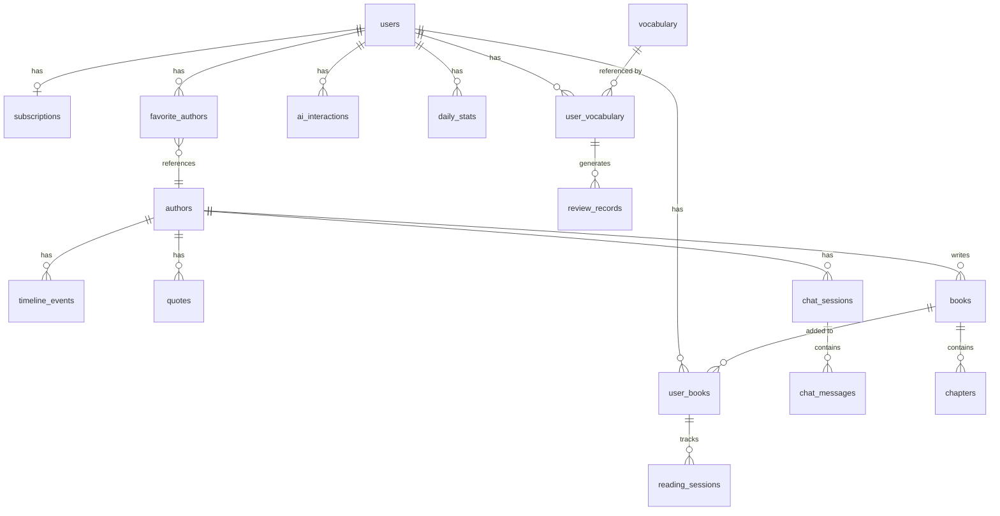

# 数据库设计

### 6.1 数据库选型

```
┌─────────────────────────────────────────────────────────────────────────┐
│                        Database Selection                               │
├─────────────────────────────────────────────────────────────────────────┤
│                                                                         │
│  PostgreSQL (主数据库)                                                  │
│  ════════════════════                                                   │
│  适用：用户数据、书籍元数据、学习记录等结构化数据                       │
│  原因：                                                                 │
│  • 强一致性，ACID事务                                                   │
│  • JSON支持好，适合半结构化数据                                         │
│  • 全文搜索支持                                                         │
│  • 成熟稳定，生态丰富                                                   │
│                                                                         │
│  Redis (缓存 + 会话)                                                    │
│  ════════════════════                                                   │
│  适用：                                                                 │
│  • Session存储                                                          │
│  • AI响应缓存                                                           │
│  • 速率限制计数                                                         │
│  • 实时排行榜                                                           │
│                                                                         │
│  S3兼容存储 (文件存储)                                                  │
│  ════════════════════════                                               │
│  适用：                                                                 │
│  • EPUB文件                                                             │
│  • 封面图片                                                             │
│  • 用户上传文件                                                         │
│  选择：AWS S3 / Cloudflare R2 / MinIO                                   │
│                                                                         │
│  未来扩展 - Vector DB                                                   │
│  ════════════════════════                                               │
│  适用：                                                                 │
│  • 语义搜索（找相似书籍）                                               │
│  • RAG增强问答                                                          │
│  选择：pgvector (PostgreSQL扩展) 或 Pinecone                            │
│                                                                         │
└─────────────────────────────────────────────────────────────────────────┘
```

### 6.2 核心表设计

```sql
-- ============================================================
-- 用户相关表
-- ============================================================

-- 用户表
CREATE TABLE users (
    id              UUID PRIMARY KEY DEFAULT gen_random_uuid(),
    email           VARCHAR(255) UNIQUE,
    apple_id        VARCHAR(255) UNIQUE,
    google_id       VARCHAR(255) UNIQUE,

    -- 用户画像
    display_name    VARCHAR(100),
    avatar_url      VARCHAR(500),
    native_language VARCHAR(10) DEFAULT 'zh-CN',
    english_level   VARCHAR(20) DEFAULT 'intermediate', -- beginner/intermediate/advanced

    -- 学习目标
    daily_goal_minutes  INTEGER DEFAULT 15,
    learning_purpose    VARCHAR(50), -- exam/work/hobby/literature

    -- 统计数据
    total_reading_minutes   INTEGER DEFAULT 0,
    total_words_learned     INTEGER DEFAULT 0,
    current_streak_days     INTEGER DEFAULT 0,
    longest_streak_days     INTEGER DEFAULT 0,

    -- 时间戳
    created_at      TIMESTAMP WITH TIME ZONE DEFAULT NOW(),
    updated_at      TIMESTAMP WITH TIME ZONE DEFAULT NOW(),
    last_active_at  TIMESTAMP WITH TIME ZONE
);

-- 用户订阅表
CREATE TABLE subscriptions (
    id                  UUID PRIMARY KEY DEFAULT gen_random_uuid(),
    user_id             UUID NOT NULL REFERENCES users(id),

    -- 订阅信息
    plan_type           VARCHAR(20) NOT NULL, -- free/monthly/yearly
    status              VARCHAR(20) NOT NULL, -- active/cancelled/expired

    -- Apple IAP
    apple_transaction_id    VARCHAR(255),
    apple_original_transaction_id VARCHAR(255),

    -- 时间
    started_at          TIMESTAMP WITH TIME ZONE,
    expires_at          TIMESTAMP WITH TIME ZONE,
    cancelled_at        TIMESTAMP WITH TIME ZONE,

    created_at          TIMESTAMP WITH TIME ZONE DEFAULT NOW(),
    updated_at          TIMESTAMP WITH TIME ZONE DEFAULT NOW()
);

CREATE INDEX idx_subscriptions_user ON subscriptions(user_id);
CREATE INDEX idx_subscriptions_status ON subscriptions(status, expires_at);

-- ============================================================
-- 书籍相关表
-- ============================================================

-- 书籍表
CREATE TABLE books (
    id              UUID PRIMARY KEY DEFAULT gen_random_uuid(),

    -- 基本信息
    title           VARCHAR(500) NOT NULL,
    author          VARCHAR(255),                -- 兼容旧数据
    author_id       UUID REFERENCES authors(id), -- 关联作者实体
    author_birth_year   INTEGER,
    author_death_year   INTEGER,

    -- 分类
    language        VARCHAR(10) DEFAULT 'en',
    subjects        TEXT[],              -- ['Fiction', 'Gothic Fiction']
    bookshelves     TEXT[],              -- ['Best Sellers', 'Classics']

    -- 内容信息
    description     TEXT,
    word_count      INTEGER,
    chapter_count   INTEGER,

    -- 难度信息
    difficulty_score    DECIMAL(4,2),    -- 1.00 - 5.00
    flesch_score        DECIMAL(5,2),    -- Flesch Reading Ease
    avg_sentence_length DECIMAL(5,2),

    -- 文件信息
    epub_url        VARCHAR(500),
    cover_url       VARCHAR(500),

    -- 来源信息
    source          VARCHAR(50),         -- standard_ebooks/gutenberg/user_upload
    source_id       VARCHAR(100),        -- 原始来源ID

    -- 统计
    download_count  INTEGER DEFAULT 0,
    rating_avg      DECIMAL(3,2),
    rating_count    INTEGER DEFAULT 0,

    -- AI增强信息 (JSON)
    ai_metadata     JSONB,               -- {summary, themes, keywords, etc}

    -- 时间戳
    published_year  INTEGER,
    created_at      TIMESTAMP WITH TIME ZONE DEFAULT NOW(),
    updated_at      TIMESTAMP WITH TIME ZONE DEFAULT NOW()
);

CREATE INDEX idx_books_difficulty ON books(difficulty_score);
CREATE INDEX idx_books_source ON books(source, source_id);
CREATE INDEX idx_books_subjects ON books USING GIN(subjects);

-- ============================================================
-- 作者相关表 (核心实体)
-- ============================================================

-- 作者表
CREATE TABLE authors (
    id              UUID PRIMARY KEY DEFAULT gen_random_uuid(),

    -- 基本信息
    name            VARCHAR(255) NOT NULL,
    name_zh         VARCHAR(255),                    -- 中文名
    birth_year      INTEGER,
    death_year      INTEGER,
    nationality     VARCHAR(100),
    birth_place     VARCHAR(255),

    -- 头像和媒体
    portrait_url    VARCHAR(500),                    -- 肖像图片
    avatar_color    VARCHAR(7),                      -- 默认头像背景色

    -- 传记
    bio_short       TEXT,                            -- 短传记 (4行)
    bio_full        TEXT,                            -- 完整传记
    signature_quote TEXT,                            -- 代表名言

    -- 分类和标签
    genres          TEXT[],                          -- 文学类型
    literary_movement VARCHAR(100),                  -- 文学流派
    era             VARCHAR(50),                     -- 时代: classical/romantic/victorian/modern/contemporary

    -- 写作风格 (JSON)
    writing_styles  JSONB,                           -- [{title, description, icon}]

    -- AI人格设定
    ai_persona      JSONB,                           -- {systemPrompt, traits, speakingStyle, knowledge}
    voice_id        VARCHAR(100),                    -- TTS声音ID
    voice_style     JSONB,                           -- {gender, accent, age, tone}

    -- 统计
    book_count      INTEGER DEFAULT 0,
    quote_count     INTEGER DEFAULT 0,
    follower_count  INTEGER DEFAULT 0,

    -- 来源信息
    wikipedia_url   VARCHAR(500),
    wikidata_id     VARCHAR(50),
    gutenberg_id    VARCHAR(50),

    -- 时间戳
    created_at      TIMESTAMP WITH TIME ZONE DEFAULT NOW(),
    updated_at      TIMESTAMP WITH TIME ZONE DEFAULT NOW()
);

CREATE INDEX idx_authors_name ON authors(name);
CREATE INDEX idx_authors_era ON authors(era);
CREATE INDEX idx_authors_genres ON authors USING GIN(genres);

-- 作者时间线事件表
CREATE TABLE author_timeline_events (
    id              UUID PRIMARY KEY DEFAULT gen_random_uuid(),
    author_id       UUID NOT NULL REFERENCES authors(id) ON DELETE CASCADE,

    -- 事件信息
    year            INTEGER NOT NULL,
    title           VARCHAR(500) NOT NULL,
    description     TEXT,
    event_type      VARCHAR(50) NOT NULL,            -- birth/death/publication/award/milestone

    -- 关联书籍 (如果是出版事件)
    related_book_id UUID REFERENCES books(id),

    created_at      TIMESTAMP WITH TIME ZONE DEFAULT NOW()
);

CREATE INDEX idx_author_timeline_author ON author_timeline_events(author_id, year);

-- 作者名言表
CREATE TABLE author_quotes (
    id              UUID PRIMARY KEY DEFAULT gen_random_uuid(),
    author_id       UUID NOT NULL REFERENCES authors(id) ON DELETE CASCADE,

    -- 名言信息
    quote_text      TEXT NOT NULL,
    source_book_id  UUID REFERENCES books(id),
    source_text     VARCHAR(255),                    -- 出处描述

    -- 统计
    like_count      INTEGER DEFAULT 0,
    share_count     INTEGER DEFAULT 0,

    created_at      TIMESTAMP WITH TIME ZONE DEFAULT NOW()
);

CREATE INDEX idx_author_quotes_author ON author_quotes(author_id);

-- 用户收藏作者表
CREATE TABLE user_favorite_authors (
    id              UUID PRIMARY KEY DEFAULT gen_random_uuid(),
    user_id         UUID NOT NULL REFERENCES users(id),
    author_id       UUID NOT NULL REFERENCES authors(id),

    created_at      TIMESTAMP WITH TIME ZONE DEFAULT NOW(),

    UNIQUE(user_id, author_id)
);

CREATE INDEX idx_user_favorite_authors_user ON user_favorite_authors(user_id);

-- ============================================================
-- AI对话相关表
-- ============================================================

-- AI作者对话会话表
CREATE TABLE author_chat_sessions (
    id              UUID PRIMARY KEY DEFAULT gen_random_uuid(),
    user_id         UUID NOT NULL REFERENCES users(id),
    author_id       UUID NOT NULL REFERENCES authors(id),

    -- 会话信息
    mode            VARCHAR(20) DEFAULT 'text',      -- text/voice/video
    title           VARCHAR(255),                    -- 会话标题

    -- 统计
    message_count   INTEGER DEFAULT 0,
    total_tokens    INTEGER DEFAULT 0,

    -- 时间戳
    created_at      TIMESTAMP WITH TIME ZONE DEFAULT NOW(),
    updated_at      TIMESTAMP WITH TIME ZONE DEFAULT NOW()
);

CREATE INDEX idx_author_chat_sessions_user ON author_chat_sessions(user_id, updated_at DESC);

-- AI作者对话消息表
CREATE TABLE author_chat_messages (
    id              UUID PRIMARY KEY DEFAULT gen_random_uuid(),
    session_id      UUID NOT NULL REFERENCES author_chat_sessions(id) ON DELETE CASCADE,

    -- 消息信息
    role            VARCHAR(20) NOT NULL,            -- user/author
    content         TEXT NOT NULL,

    -- 媒体 (语音/视频)
    audio_url       VARCHAR(500),
    video_url       VARCHAR(500),

    -- AI成本追踪
    input_tokens    INTEGER,
    output_tokens   INTEGER,
    model_used      VARCHAR(50),

    created_at      TIMESTAMP WITH TIME ZONE DEFAULT NOW()
);

CREATE INDEX idx_author_chat_messages_session ON author_chat_messages(session_id, created_at);

-- 章节表
CREATE TABLE chapters (
    id              UUID PRIMARY KEY DEFAULT gen_random_uuid(),
    book_id         UUID NOT NULL REFERENCES books(id) ON DELETE CASCADE,

    -- 章节信息
    chapter_number  INTEGER NOT NULL,
    title           VARCHAR(500),

    -- 内容信息
    word_count      INTEGER,
    difficulty_score DECIMAL(4,2),

    -- AI增强 (预生成)
    summary         TEXT,
    key_vocabulary  JSONB,               -- [{word, definition, importance}]

    -- 内容定位
    spine_position  INTEGER,             -- EPUB spine位置

    created_at      TIMESTAMP WITH TIME ZONE DEFAULT NOW()
);

CREATE INDEX idx_chapters_book ON chapters(book_id, chapter_number);

-- ============================================================
-- 阅读相关表
-- ============================================================

-- 用户书架 (用户与书籍的关系)
CREATE TABLE user_books (
    id              UUID PRIMARY KEY DEFAULT gen_random_uuid(),
    user_id         UUID NOT NULL REFERENCES users(id),
    book_id         UUID NOT NULL REFERENCES books(id),

    -- 状态
    status          VARCHAR(20) DEFAULT 'want_to_read', -- want_to_read/reading/finished/abandoned

    -- 进度
    current_chapter INTEGER DEFAULT 0,
    current_position VARCHAR(100),       -- EPUB CFI位置
    progress_percent DECIMAL(5,2) DEFAULT 0,

    -- 统计
    reading_time_minutes INTEGER DEFAULT 0,
    started_at      TIMESTAMP WITH TIME ZONE,
    finished_at     TIMESTAMP WITH TIME ZONE,

    -- 评价
    rating          INTEGER,             -- 1-5
    review          TEXT,

    created_at      TIMESTAMP WITH TIME ZONE DEFAULT NOW(),
    updated_at      TIMESTAMP WITH TIME ZONE DEFAULT NOW(),

    UNIQUE(user_id, book_id)
);

CREATE INDEX idx_user_books_user ON user_books(user_id, status);
CREATE INDEX idx_user_books_updated ON user_books(user_id, updated_at DESC);

-- 阅读会话记录
CREATE TABLE reading_sessions (
    id              UUID PRIMARY KEY DEFAULT gen_random_uuid(),
    user_id         UUID NOT NULL REFERENCES users(id),
    book_id         UUID NOT NULL REFERENCES books(id),

    -- 会话信息
    started_at      TIMESTAMP WITH TIME ZONE NOT NULL,
    ended_at        TIMESTAMP WITH TIME ZONE,
    duration_seconds INTEGER,

    -- 进度变化
    start_position  VARCHAR(100),
    end_position    VARCHAR(100),
    pages_read      INTEGER,

    -- 行为统计
    words_looked_up INTEGER DEFAULT 0,
    ai_interactions INTEGER DEFAULT 0,

    created_at      TIMESTAMP WITH TIME ZONE DEFAULT NOW()
);

CREATE INDEX idx_reading_sessions_user ON reading_sessions(user_id, started_at DESC);

-- ============================================================
-- 词汇学习相关表
-- ============================================================

-- 词汇表 (全局词库)
CREATE TABLE vocabulary (
    id              UUID PRIMARY KEY DEFAULT gen_random_uuid(),

    word            VARCHAR(100) NOT NULL UNIQUE,

    -- 基础信息
    phonetic_us     VARCHAR(100),
    phonetic_uk     VARCHAR(100),

    -- 释义 (JSON数组，支持多词性)
    definitions     JSONB NOT NULL,      -- [{pos, meaning, examples}]

    -- 词频和难度
    frequency_rank  INTEGER,             -- 词频排名
    difficulty      DECIMAL(3,2),        -- 1.00-5.00

    -- 来源
    source          VARCHAR(50),         -- local_dict/ai_generated

    created_at      TIMESTAMP WITH TIME ZONE DEFAULT NOW()
);

CREATE INDEX idx_vocabulary_word ON vocabulary(word);
CREATE INDEX idx_vocabulary_frequency ON vocabulary(frequency_rank);

-- 用户词汇 (用户的生词本)
CREATE TABLE user_vocabulary (
    id              UUID PRIMARY KEY DEFAULT gen_random_uuid(),
    user_id         UUID NOT NULL REFERENCES users(id),
    word_id         UUID NOT NULL REFERENCES vocabulary(id),

    -- 学习来源
    source_book_id  UUID REFERENCES books(id),
    source_context  TEXT,                -- 原文上下文

    -- 学习状态
    status          VARCHAR(20) DEFAULT 'new', -- new/learning/mastered

    -- 间隔重复参数
    ease_factor     DECIMAL(4,2) DEFAULT 2.50,
    interval_days   INTEGER DEFAULT 1,
    repetitions     INTEGER DEFAULT 0,
    next_review_at  TIMESTAMP WITH TIME ZONE,

    -- 统计
    times_reviewed  INTEGER DEFAULT 0,
    times_correct   INTEGER DEFAULT 0,
    times_wrong     INTEGER DEFAULT 0,

    created_at      TIMESTAMP WITH TIME ZONE DEFAULT NOW(),
    updated_at      TIMESTAMP WITH TIME ZONE DEFAULT NOW(),

    UNIQUE(user_id, word_id)
);

CREATE INDEX idx_user_vocabulary_user ON user_vocabulary(user_id, status);
CREATE INDEX idx_user_vocabulary_review ON user_vocabulary(user_id, next_review_at);

-- 复习记录
CREATE TABLE review_records (
    id              UUID PRIMARY KEY DEFAULT gen_random_uuid(),
    user_id         UUID NOT NULL REFERENCES users(id),
    user_word_id    UUID NOT NULL REFERENCES user_vocabulary(id),

    -- 复习结果
    rating          INTEGER NOT NULL,    -- 0-5 (SM-2评分)
    response_time_ms INTEGER,            -- 响应时间

    -- 前后状态
    interval_before INTEGER,
    interval_after  INTEGER,
    ease_before     DECIMAL(4,2),
    ease_after      DECIMAL(4,2),

    created_at      TIMESTAMP WITH TIME ZONE DEFAULT NOW()
);

CREATE INDEX idx_review_records_user ON review_records(user_id, created_at DESC);

-- ============================================================
-- AI交互相关表
-- ============================================================

-- AI交互记录
CREATE TABLE ai_interactions (
    id              UUID PRIMARY KEY DEFAULT gen_random_uuid(),
    user_id         UUID NOT NULL REFERENCES users(id),

    -- 请求信息
    interaction_type VARCHAR(50) NOT NULL, -- word_explain/sentence_simplify/qa/etc
    input_text      TEXT NOT NULL,
    context_text    TEXT,
    book_id         UUID REFERENCES books(id),

    -- AI响应
    model_used      VARCHAR(50),         -- deepseek/gpt-4o-mini/claude
    response_text   TEXT,

    -- 成本追踪
    input_tokens    INTEGER,
    output_tokens   INTEGER,
    cost_usd        DECIMAL(10,6),

    -- 性能
    latency_ms      INTEGER,
    cache_hit       BOOLEAN DEFAULT FALSE,

    -- 用户反馈
    user_rating     INTEGER,             -- 1-5, 用户评价AI回答质量

    created_at      TIMESTAMP WITH TIME ZONE DEFAULT NOW()
);

CREATE INDEX idx_ai_interactions_user ON ai_interactions(user_id, created_at DESC);
CREATE INDEX idx_ai_interactions_type ON ai_interactions(interaction_type, created_at);
CREATE INDEX idx_ai_interactions_cost ON ai_interactions(created_at, cost_usd);

-- ============================================================
-- 分析相关表
-- ============================================================

-- 每日学习统计
CREATE TABLE daily_stats (
    id              UUID PRIMARY KEY DEFAULT gen_random_uuid(),
    user_id         UUID NOT NULL REFERENCES users(id),
    date            DATE NOT NULL,

    -- 阅读统计
    reading_minutes INTEGER DEFAULT 0,
    pages_read      INTEGER DEFAULT 0,
    books_finished  INTEGER DEFAULT 0,

    -- 词汇统计
    words_learned   INTEGER DEFAULT 0,
    words_reviewed  INTEGER DEFAULT 0,
    review_accuracy DECIMAL(5,2),

    -- AI使用统计
    ai_interactions INTEGER DEFAULT 0,

    created_at      TIMESTAMP WITH TIME ZONE DEFAULT NOW(),
    updated_at      TIMESTAMP WITH TIME ZONE DEFAULT NOW(),

    UNIQUE(user_id, date)
);

CREATE INDEX idx_daily_stats_user ON daily_stats(user_id, date DESC);
```

### 6.3 数据模型关系图



---

