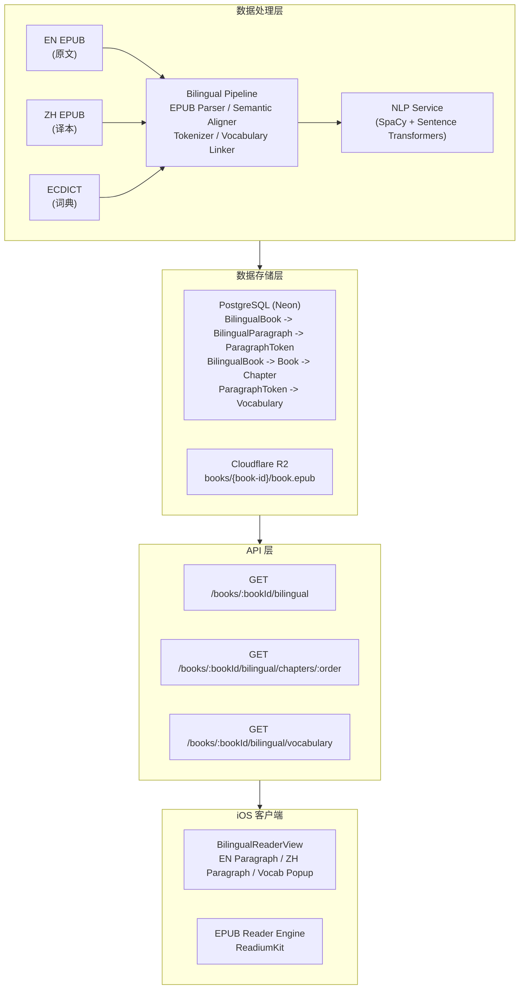
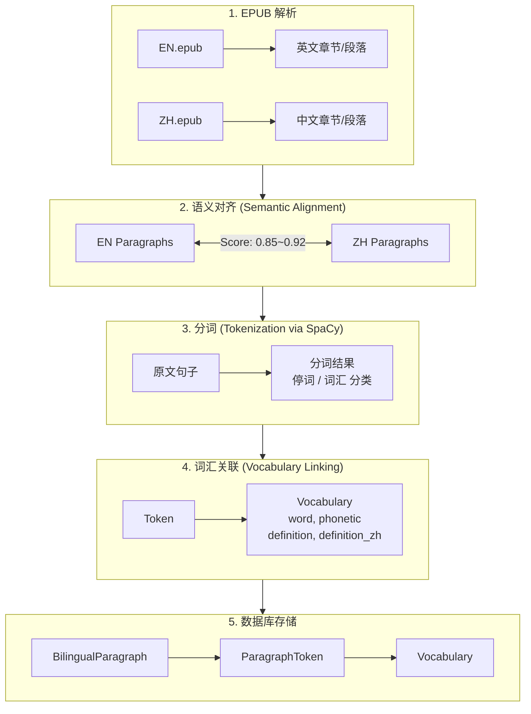
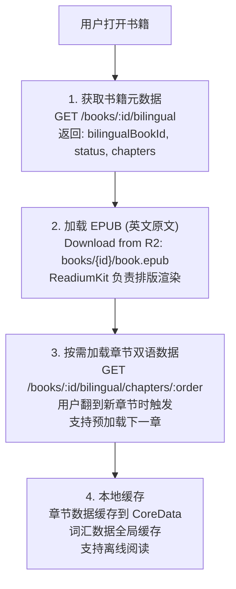
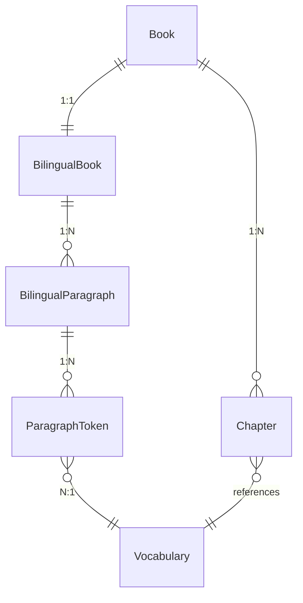

## 概述

本文档全面描述 ReadMigo 双语阅读系统的技术架构、数据流、客户端集成方案及规模化分析。

---

### 1.1 整体架构

### 1.2 数据流

- 对齐算法: paraphrase-multilingual-MiniLM-L12-v2
- 对齐方法: 余弦相似度 + 贪心匹配

---

### 2.1 数据获取策略

---

### 3.1 数据模型关系

### 3.2 表结构

| 表名 | 主要字段 | 说明 |
|------|----------|------|
| BilingualBook | id, englishBookId, status, dataVersion | 双语书籍元数据 |
| BilingualParagraph | id, bilingualBookId, chapterId, originalText, translatedText, alignmentScore | 对齐的段落 |
| ParagraphToken | id, paragraphId, text, lemma, pos, isStopWord, vocabularyId | 分词结果 |
| Vocabulary | id, word, phonetic, definition, definitionZh, frequencyRank | 词汇表 |

### 3.3 数据示例

**BilingualParagraph 示例:**

| 字段 | 值 |
|------|-----|
| id | `bp_001` |
| bilingualBookId | `bb_monte_cristo` |
| chapterId | `ch_002` |
| chapterOrder | 2 |
| paragraphOrder | 1 |
| originalText | `On the 24th of February, 1815, the look-out of Notre-Dame de la Garde signalled the three-master, the Pharaon, from Smyrna, Trieste, and Naples.` |
| translatedText | `1815年2月24日，圣母山上的瞭望台发出信号，三桅帆船法老号从士麦拿、的里雅斯特和那不勒斯驶来。` |
| alignmentScore | 0.72 |
| alignmentMethod | `semantic` |

**ParagraphToken 示例:**

| 字段 | 值 |
|------|-----|
| id | `pt_001` |
| paragraphId | `bp_001` |
| tokenOrder | 10 |
| text | `look-out` |
| startOffset | 42 |
| endOffset | 50 |
| tokenType | `WORD` |
| lemma | `look-out` |
| pos | `NOUN` |
| isStopWord | false |
| vocabularyId | `vocab_lookout` |

**Vocabulary 示例:**

| 字段 | 值 |
|------|-----|
| id | `vocab_lookout` |
| word | `look-out` |
| phonetic | `/ˈlʊk.aʊt/` |
| partOfSpeech | `n.` |
| definition | `a place from which to watch for danger` |
| definitionZh | `瞭望台，观察哨` |
| frequencyRank | 15234 |
| cefrLevel | `B2` |
| source | `ecdict` |

---

### 4.1 单书数据量 (以《基督山伯爵》为例)

| 数据项 | 数量 | 平均大小 | 总大小 |
|--------|------|----------|--------|
| 章节数 | 117 | - | - |
| BilingualParagraph | 14,679 | 500 bytes | 7.3 MB |
| ParagraphToken | 588,600 | 80 bytes | 47.1 MB |
| Vocabulary (关联) | ~8,500 | 300 bytes | 2.5 MB |
| **数据库总计** | - | - | **~57 MB** |

### 4.2 处理时间

| 阶段 | 时间 |
|------|------|
| EPUB 解析 | 5 秒 |
| 语义对齐 | 20 分钟 |
| 分词 (SpaCy) | 25 分钟 |
| 词汇关联 | 5 分钟 |
| 数据库写入 (批量优化后) | 10 分钟 |
| **总计** | **~60 分钟** |

### 4.3 API 响应大小

| 接口 | 响应大小 (Gzip) |
|------|-----------------|
| GET /bilingual (元数据) | ~2 KB |
| GET /chapters/:order | 50-150 KB |
| GET /vocabulary?chapters=1,2,3 | 30-80 KB |

---

### 5.1 可行性评估

| 维度 | 分析 | 可行性 |
|------|------|--------|
| **中文译本获取** | 公版书中文译本覆盖率约 30-40% | 部分可行 |
| **处理时间** | 单书 60 分钟 × 100,000 = 6,944 天 (串行) | 需并行 |
| **存储成本** | 57 MB × 100,000 = 5.7 TB | 可控 |
| **API 性能** | 按章节懒加载，单次请求 <200KB | 可行 |

### 5.2 中文译本来源分析

| 来源 | 覆盖率 | 质量 | 版权风险 |
|------|--------|------|----------|
| 好读 (haodoo.net) | ~800 本 | 高 | 需验证 |
| Gutenberg 中文版 | ~50 本 | 高 | 无风险 |
| AI 翻译 | 100% | 中等 | 无风险 |
| 人工翻译采购 | 可选 | 最高 | 需授权 |

**推荐策略:**

### 5.3 存储成本预估

| 规模 | 数据库存储 | Neon 成本 | R2 成本 |
|------|------------|-----------|---------|
| 1,000 本 | 57 GB | $25/月 | ~$5/月 |
| 10,000 本 | 570 GB | $150/月 | ~$50/月 |
| 100,000 本 | 5.7 TB | $800/月 | ~$500/月 |

### 5.4 处理性能优化

| 优化项 | 效果 |
|--------|------|
| 并行处理 (3 Worker) | 处理时间 ÷ 3 |
| 批量写入 (BatchWriter) | 数据库写入提速 10x |
| 嵌入向量缓存 | 语义对齐提速 2x |
| 共享词汇表 | 减少词汇处理 50% |

**处理时间估算 (并行优化后):**

| 规模 | 串行时间 | 并行时间 (3 Worker) |
|------|----------|---------------------|
| 241 本 (当前) | 10 天 | 3.5 天 |
| 1,000 本 | 42 天 | 14 天 |
| 10,000 本 | 417 天 | 139 天 |
| 100,000 本 | 11.4 年 | 3.8 年 |

**大规模处理建议:**
- 增加 Worker 数量 (10-20 并行)
- 使用云函数按需扩展
- 分批处理，每批 1,000 本

### 5.5 API 性能

| 指标 | 当前设计 | 10 万本时预估 |
|------|----------|---------------|
| 数据库查询 | 按章节索引 | 无变化 |
| 缓存命中 | Redis 缓存热门书 | 95% 命中 |
| 冷启动延迟 | 50-100ms | 100-200ms |
| 词汇表大小 | 340 万词 | 340 万词 (共享) |

### 5.6 成本总结

| 成本项 | 10 万本一次性 | 10 万本月度 |
|--------|---------------|-------------|
| 处理计算 | ~$500 (云服务器) | - |
| AI 翻译 | ~$50,000 | - |
| 数据库存储 | - | $800/月 |
| R2 存储 | - | $500/月 |
| API 流量 | - | $200/月 |
| **总计** | **~$50,500** | **~$1,500/月** |

---

## 六、技术栈清单

| 组件 | 技术选型 | 说明 |
|------|----------|------|
| EPUB 解析 | epub.js (Node) | 提取章节/段落 |
| 语义对齐 | sentence-transformers | paraphrase-multilingual-MiniLM-L12-v2 |
| 分词 | SpaCy | en_core_web_sm 模型 |
| 词汇表 | ECDICT | 340 万词条 |
| 数据库 | PostgreSQL (Neon) | 云托管 |
| 文件存储 | Cloudflare R2 | EPUB 原文 |
| API 框架 | NestJS | TypeScript |
| iOS 客户端 | SwiftUI + ReadiumKit | 原生开发 |

---

## 七、相关文档

| 文档 | 说明 |
|------|------|
| [双语阅读数据预处理分析](../pipeline/bilingual-data-preprocessing.md) | 数据结构设计 |
| [双语段落语义对齐实战指南](../pipeline/bilingual-semantic-alignment.md) | 对齐算法实现 |
| [双语批量处理执行计划](../pipeline/bilingual-batch-processing.md) | 批处理方案 |
| [系统架构](./system-architecture.md) | 整体系统架构 |
| [数据库设计](../api/database-design.md) | 数据模型 |
