# 双语阅读系统架构

## 概述

本文档全面描述 ReadMigo 双语阅读系统的技术架构、数据流、客户端集成方案及规模化分析。

---

## 一、系统架构

### 1.1 整体架构

```mermaid
graph TB
    subgraph Processing["数据处理层"]
        EN["EN EPUB<br>(原文)"]
        ZH["ZH EPUB<br>(译本)"]
        ECDICT["ECDICT<br>(词典)"]
        BP["Bilingual Pipeline<br>EPUB Parser / Semantic Aligner<br>Tokenizer / Vocabulary Linker"]
        NLP["NLP Service<br>(SpaCy + Sentence Transformers)"]

        EN & ZH --> BP
        ECDICT --> BP
        BP --> NLP
    end

    subgraph Storage["数据存储层"]
        PG["PostgreSQL (Neon)<br>BilingualBook -> BilingualParagraph -> ParagraphToken<br>BilingualBook -> Book -> Chapter<br>ParagraphToken -> Vocabulary"]
        R2S["Cloudflare R2<br>books/{book-id}/book.epub"]
    end

    subgraph APILayer["API 层"]
        API1["GET /books/:bookId/bilingual"]
        API2["GET /books/:bookId/bilingual/chapters/:order"]
        API3["GET /books/:bookId/bilingual/vocabulary"]
    end

    subgraph iOS["iOS 客户端"]
        Reader["BilingualReaderView<br>EN Paragraph / ZH Paragraph / Vocab Popup"]
        Engine["EPUB Reader Engine<br>ReadiumKit"]
    end

    Processing --> Storage --> APILayer --> iOS
```



### 1.2 数据流

```mermaid
graph TB
    subgraph Step1["1. EPUB 解析"]
        EN_EPUB["EN.epub"] --> EN_P["英文章节/段落"]
        ZH_EPUB["ZH.epub"] --> ZH_P["中文章节/段落"]
    end

    subgraph Step2["2. 语义对齐 (Semantic Alignment)"]
        EN_P2["EN Paragraphs"] <-->|"Score: 0.85~0.92"| ZH_P2["ZH Paragraphs"]
    end

    subgraph Step3["3. 分词 (Tokenization via SpaCy)"]
        Text["原文句子"] --> Tokens["分词结果<br>停词 / 词汇 分类"]
    end

    subgraph Step4["4. 词汇关联 (Vocabulary Linking)"]
        Token["Token"] --> Vocab["Vocabulary<br>word, phonetic<br>definition, definition_zh"]
    end

    subgraph Step5["5. 数据库存储"]
        BP["BilingualParagraph"] --> PT["ParagraphToken"] --> V["Vocabulary"]
    end

    Step1 --> Step2 --> Step3 --> Step4 --> Step5
```



- 对齐算法: paraphrase-multilingual-MiniLM-L12-v2
- 对齐方法: 余弦相似度 + 贪心匹配

---

## 二、iOS 客户端集成

### 2.1 数据获取策略

```mermaid
graph TB
    Open["用户打开书籍"]
    Open --> Meta["1. 获取书籍元数据<br>GET /books/:id/bilingual<br>返回: bilingualBookId, status, chapters"]
    Meta --> EPUB["2. 加载 EPUB (英文原文)<br>Download from R2: books/{id}/book.epub<br>ReadiumKit 负责排版渲染"]
    EPUB --> Chapter["3. 按需加载章节双语数据<br>GET /books/:id/bilingual/chapters/:order<br>用户翻到新章节时触发<br>支持预加载下一章"]
    Chapter --> Cache["4. 本地缓存<br>章节数据缓存到 CoreData<br>词汇数据全局缓存<br>支持离线阅读"]
```



### 2.2 API 响应数据结构

```
GET /books/:bookId/bilingual/chapters/:order 响应:

{
  "chapter": {
    "order": 2,
    "title": "Chapter II",
    "originalTitle": "Father and Son"
  },
  "paragraphs": [
    {
      "paragraphOrder": 1,
      "originalText": "On the 24th of February, 1815...",
      "translatedText": "1815年2月24日...",
      "tokens": [
        {
          "text": "On",
          "tokenOrder": 1,
          "tokenType": "WORD",
          "isStopWord": true,
          "vocabularyId": null
        },
        {
          "text": "the",
          "tokenOrder": 2,
          "tokenType": "WORD",
          "isStopWord": true,
          "vocabularyId": null
        },
        {
          "text": "February",
          "tokenOrder": 5,
          "tokenType": "WORD",
          "isStopWord": false,
          "vocabularyId": "vocab-123"
        }
      ]
    }
  ],
  "vocabularyMap": {
    "vocab-123": {
      "word": "February",
      "phonetic": "/ˈfebrueri/",
      "definition": "the second month of the year",
      "definitionZh": "二月"
    }
  }
}
```

### 2.3 与 EPUB 原文配合

```
┌────────────────────────────────────────────────────────────────┐
│                  EPUB + 双语数据协作                            │
└────────────────────────────────────────────────────────────────┘

┌─────────────────────────────────────────────────────────────┐
│                      阅读器界面                              │
├──────────────────────────┬──────────────────────────────────┤
│                          │                                  │
│    英文原文 (EPUB)       │     中文译文 (API)               │
│    ─────────────────     │     ─────────────────            │
│                          │                                  │
│    Rendered by           │     Rendered by                  │
│    ReadiumKit            │     SwiftUI                      │
│                          │                                  │
│    On the 24th of        │     1815年2月24日，              │
│    [February], 1815,     │     圣母山上的瞭望台             │
│    the [look-out] of     │     发出信号...                  │
│    Notre-Dame de la      │                                  │
│    Garde [signalled]...  │                                  │
│         ↓                │                                  │
│    点击单词弹出释义       │                                  │
│                          │                                  │
├──────────────────────────┴──────────────────────────────────┤
│                       词汇释义面板                           │
│  ┌────────────────────────────────────────────────────────┐ │
│  │  look-out  /ˈlʊk.aʊt/                           🔊     │ │
│  │  n. 瞭望台，观察哨                                      │ │
│  │  n. 瞭望员，放哨的人                                    │ │
│  └────────────────────────────────────────────────────────┘ │
└─────────────────────────────────────────────────────────────┘

协作方式:
├── EPUB 提供: 原文排版、翻页、进度定位
├── API 提供: 翻译、分词、词汇数据
└── 同步机制: 通过章节 order 匹配 EPUB 章节与 API 数据
```

### 2.4 翻译交互支持

```
┌────────────────────────────────────────────────────────────────┐
│                      用户交互流程                               │
└────────────────────────────────────────────────────────────────┘

1. 段落级翻译显示
   ┌────────────────────────────────────────────┐
   │ 显示模式:                                   │
   │ ├── 仅英文 (默认)                           │
   │ ├── 英中对照 (左右/上下)                    │
   │ └── 仅中文                                  │
   └────────────────────────────────────────────┘

2. 点词查义
   ┌────────────────────────────────────────────┐
   │ 用户点击单词 "signalled"                    │
   │           │                                │
   │           ▼                                │
   │ ┌──────────────────────────────────────┐  │
   │ │ signalled → signal (词元还原)        │  │
   │ │                                      │  │
   │ │ signal /ˈsɪɡ.nəl/              🔊   │  │
   │ │ v. 发信号，示意                      │  │
   │ │ n. 信号，暗号                        │  │
   │ │                                      │  │
   │ │ [添加到生词本] [复制]                │  │
   │ └──────────────────────────────────────┘  │
   └────────────────────────────────────────────┘

3. 生词本收藏
   ┌────────────────────────────────────────────┐
   │ 收藏单词时保存:                             │
   │ ├── 单词原形 (lemma)                       │
   │ ├── 原文上下文                             │
   │ ├── 所在书籍/章节                          │
   │ └── 收藏时间                               │
   └────────────────────────────────────────────┘
```

---

## 三、数据库存储

### 3.1 数据模型关系


### 3.2 表结构

| 表名 | 主要字段 | 说明 |
|------|----------|------|
| BilingualBook | id, englishBookId, status, dataVersion | 双语书籍元数据 |
| BilingualParagraph | id, bilingualBookId, chapterId, originalText, translatedText, alignmentScore | 对齐的段落 |
| ParagraphToken | id, paragraphId, text, lemma, pos, isStopWord, vocabularyId | 分词结果 |
| Vocabulary | id, word, phonetic, definition, definitionZh, frequencyRank | 词汇表 |

### 3.3 数据示例

**BilingualParagraph 示例:**

| 字段 | 值 |
|------|-----|
| id | `bp_001` |
| bilingualBookId | `bb_monte_cristo` |
| chapterId | `ch_002` |
| chapterOrder | 2 |
| paragraphOrder | 1 |
| originalText | `On the 24th of February, 1815, the look-out of Notre-Dame de la Garde signalled the three-master, the Pharaon, from Smyrna, Trieste, and Naples.` |
| translatedText | `1815年2月24日，圣母山上的瞭望台发出信号，三桅帆船法老号从士麦拿、的里雅斯特和那不勒斯驶来。` |
| alignmentScore | 0.72 |
| alignmentMethod | `semantic` |

**ParagraphToken 示例:**

| 字段 | 值 |
|------|-----|
| id | `pt_001` |
| paragraphId | `bp_001` |
| tokenOrder | 10 |
| text | `look-out` |
| startOffset | 42 |
| endOffset | 50 |
| tokenType | `WORD` |
| lemma | `look-out` |
| pos | `NOUN` |
| isStopWord | false |
| vocabularyId | `vocab_lookout` |

**Vocabulary 示例:**

| 字段 | 值 |
|------|-----|
| id | `vocab_lookout` |
| word | `look-out` |
| phonetic | `/ˈlʊk.aʊt/` |
| partOfSpeech | `n.` |
| definition | `a place from which to watch for danger` |
| definitionZh | `瞭望台，观察哨` |
| frequencyRank | 15234 |
| cefrLevel | `B2` |
| source | `ecdict` |

---

## 四、存储空间分析

### 4.1 单书数据量 (以《基督山伯爵》为例)

| 数据项 | 数量 | 平均大小 | 总大小 |
|--------|------|----------|--------|
| 章节数 | 117 | - | - |
| BilingualParagraph | 14,679 | 500 bytes | 7.3 MB |
| ParagraphToken | 588,600 | 80 bytes | 47.1 MB |
| Vocabulary (关联) | ~8,500 | 300 bytes | 2.5 MB |
| **数据库总计** | - | - | **~57 MB** |

### 4.2 处理时间

| 阶段 | 时间 |
|------|------|
| EPUB 解析 | 5 秒 |
| 语义对齐 | 20 分钟 |
| 分词 (SpaCy) | 25 分钟 |
| 词汇关联 | 5 分钟 |
| 数据库写入 (批量优化后) | 10 分钟 |
| **总计** | **~60 分钟** |

### 4.3 API 响应大小

| 接口 | 响应大小 (Gzip) |
|------|-----------------|
| GET /bilingual (元数据) | ~2 KB |
| GET /chapters/:order | 50-150 KB |
| GET /vocabulary?chapters=1,2,3 | 30-80 KB |

---

## 五、10 万本书规模分析

### 5.1 可行性评估

| 维度 | 分析 | 可行性 |
|------|------|--------|
| **中文译本获取** | 公版书中文译本覆盖率约 30-40% | 部分可行 |
| **处理时间** | 单书 60 分钟 × 100,000 = 6,944 天 (串行) | 需并行 |
| **存储成本** | 57 MB × 100,000 = 5.7 TB | 可控 |
| **API 性能** | 按章节懒加载，单次请求 <200KB | 可行 |

### 5.2 中文译本来源分析

| 来源 | 覆盖率 | 质量 | 版权风险 |
|------|--------|------|----------|
| 好读 (haodoo.net) | ~800 本 | 高 | 需验证 |
| Gutenberg 中文版 | ~50 本 | 高 | 无风险 |
| AI 翻译 | 100% | 中等 | 无风险 |
| 人工翻译采购 | 可选 | 最高 | 需授权 |

**推荐策略:**

```
┌────────────────────────────────────────────────────────────────┐
│                   中文来源分层策略                              │
└────────────────────────────────────────────────────────────────┘

优先级 1: 好读/Gutenberg 现有译本
├── 覆盖: ~850 本
├── 特点: 翻译质量高、经过校对
└── 处理: 繁简转换 + 质量检查

优先级 2: AI 翻译 (DeepL/GPT-4)
├── 覆盖: 剩余所有
├── 特点: 成本可控、速度快
├── 处理: 自动翻译 + 人工抽检
└── 成本: ~$0.50/本 (约 50 万字)

优先级 3: 不提供双语
├── 标记为 "仅英文"
└── 用户可使用即时翻译功能
```

### 5.3 存储成本预估

| 规模 | 数据库存储 | Neon 成本 | R2 成本 |
|------|------------|-----------|---------|
| 1,000 本 | 57 GB | $25/月 | ~$5/月 |
| 10,000 本 | 570 GB | $150/月 | ~$50/月 |
| 100,000 本 | 5.7 TB | $800/月 | ~$500/月 |

### 5.4 处理性能优化

| 优化项 | 效果 |
|--------|------|
| 并行处理 (3 Worker) | 处理时间 ÷ 3 |
| 批量写入 (BatchWriter) | 数据库写入提速 10x |
| 嵌入向量缓存 | 语义对齐提速 2x |
| 共享词汇表 | 减少词汇处理 50% |

**处理时间估算 (并行优化后):**

| 规模 | 串行时间 | 并行时间 (3 Worker) |
|------|----------|---------------------|
| 241 本 (当前) | 10 天 | 3.5 天 |
| 1,000 本 | 42 天 | 14 天 |
| 10,000 本 | 417 天 | 139 天 |
| 100,000 本 | 11.4 年 | 3.8 年 |

**大规模处理建议:**
- 增加 Worker 数量 (10-20 并行)
- 使用云函数按需扩展
- 分批处理，每批 1,000 本

### 5.5 API 性能

| 指标 | 当前设计 | 10 万本时预估 |
|------|----------|---------------|
| 数据库查询 | 按章节索引 | 无变化 |
| 缓存命中 | Redis 缓存热门书 | 95% 命中 |
| 冷启动延迟 | 50-100ms | 100-200ms |
| 词汇表大小 | 340 万词 | 340 万词 (共享) |

### 5.6 成本总结

| 成本项 | 10 万本一次性 | 10 万本月度 |
|--------|---------------|-------------|
| 处理计算 | ~$500 (云服务器) | - |
| AI 翻译 | ~$50,000 | - |
| 数据库存储 | - | $800/月 |
| R2 存储 | - | $500/月 |
| API 流量 | - | $200/月 |
| **总计** | **~$50,500** | **~$1,500/月** |

---

## 六、技术栈清单

| 组件 | 技术选型 | 说明 |
|------|----------|------|
| EPUB 解析 | epub.js (Node) | 提取章节/段落 |
| 语义对齐 | sentence-transformers | paraphrase-multilingual-MiniLM-L12-v2 |
| 分词 | SpaCy | en_core_web_sm 模型 |
| 词汇表 | ECDICT | 340 万词条 |
| 数据库 | PostgreSQL (Neon) | 云托管 |
| 文件存储 | Cloudflare R2 | EPUB 原文 |
| API 框架 | NestJS | TypeScript |
| iOS 客户端 | SwiftUI + ReadiumKit | 原生开发 |

---

## 七、相关文档

| 文档 | 说明 |
|------|------|
| [双语阅读数据预处理分析](../pipeline/bilingual-data-preprocessing.md) | 数据结构设计 |
| [双语段落语义对齐实战指南](../pipeline/bilingual-semantic-alignment.md) | 对齐算法实现 |
| [双语批量处理执行计划](../pipeline/bilingual-batch-processing.md) | 批处理方案 |
| [系统架构](./system-architecture.md) | 整体系统架构 |
| [数据库设计](../api/database-design.md) | 数据模型 |
