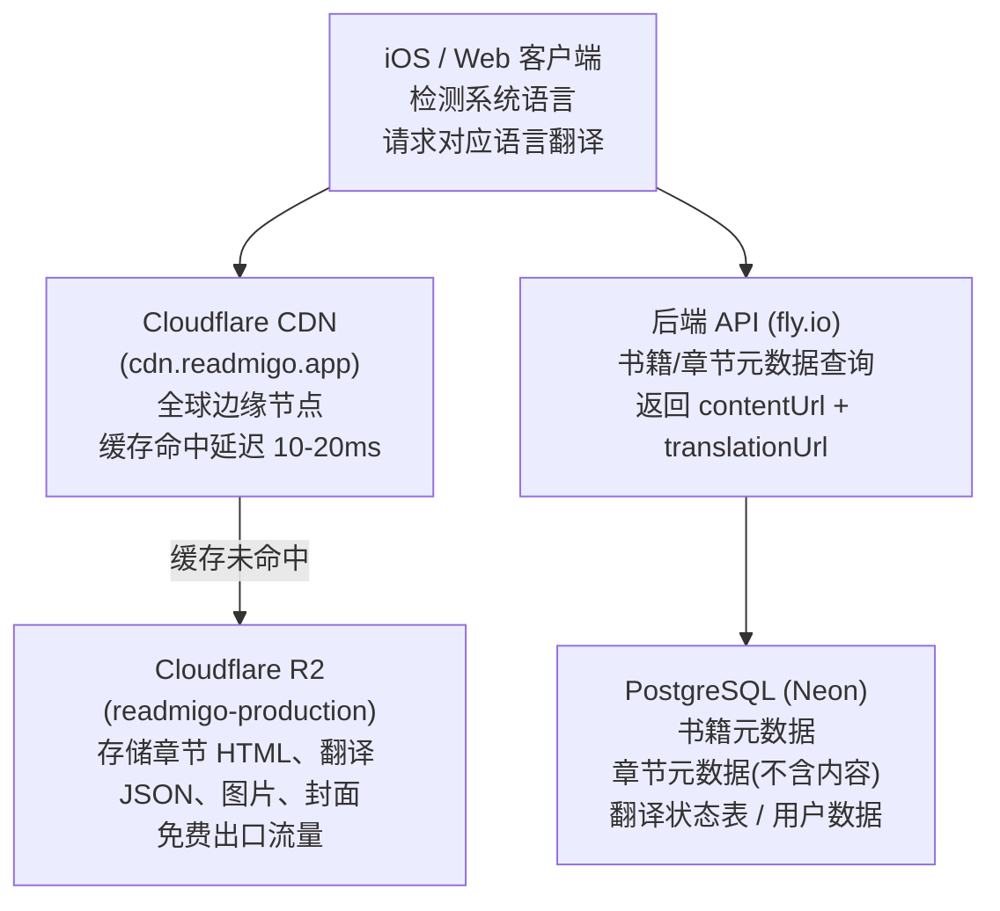
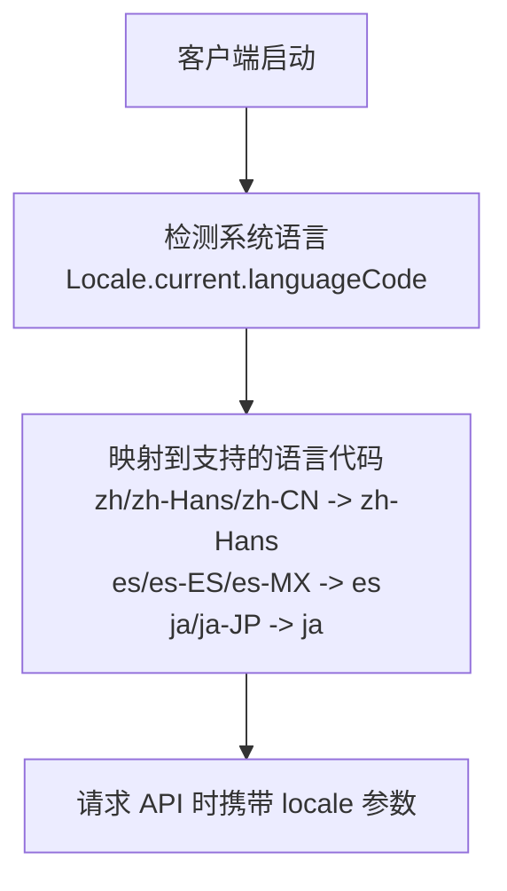

### 1.1 业务目标

| 指标 | 目标值 |
|-----|-------|
| 用户规模 | 100 万 |
| DAU | 10 万 |
| 书籍数量 | 10 万本 |
| 心流模式 | 支持多语言段落同步显示 |

### 1.2 当前问题

| 问题 | 影响 |
|-----|------|
| 章节内容存储在数据库 | 大文本影响性能，存储成本高 |
| 封面路径不统一 | 部分在旧 bucket，部分在新路径 |
| 无 CDN 缓存 | 全球用户访问延迟高 |
| 不支持多语言结构 | 心流模式需要重构 |

---

### 2.1 存储规模

| 项目 | 计算 | 结果 |
|-----|------|------|
| 章节总数 | 10万书 × 30章 | 300 万章 |
| HTML 存储 | 300万 × 10KB | 30 GB |
| 单语言翻译 | 300万 × 8KB | 24 GB |
| 多语言翻译（渐进） | 见 2.3 | 54-120 GB |
| 图片存储 | 10万书 × 20张 × 50KB | 100 GB |

### 2.2 流量规模

| 项目 | 计算 | 结果 |
|-----|------|------|
| 日请求量 | 10万DAU × 5章 | 50 万次/天 |
| 心流模式请求 | 50万 × 30% × 2 | 30 万次/天 |
| 峰值 QPS | 80万 ÷ 86400 × 10 | ~90 QPS |
| 日流量 | 80万 × 12KB | 9.6 GB/天 |
| 月流量 | 9.6GB × 30 | 288 GB/月 |

### 2.3 多语言存储（渐进式）

| 阶段 | 中文 | 西/葡/法 | 日/韩 | 其他 | 总存储 |
|-----|------|---------|-------|------|-------|
| Phase 1 | 100% | 0% | 0% | 0% | 54GB |
| Phase 2 | 100% | 30% | 20% | 0% | 75GB |
| Phase 3 | 100% | 50% | 50% | 30% | 120GB |

---

### 3.1 性能对比

| 维度 | 数据库存储 | R2 + CDN |
|-----|-----------|----------|
| 首次请求 | 50-200ms | 50-100ms |
| 缓存命中 | N/A | **10-20ms** |
| 峰值响应 | 随负载劣化 | 稳定 |
| 数据库连接 | 消耗连接池 | 不占用 |
| 全球访问 | 跨区延迟高 | 边缘加速 |

### 3.2 费用对比（月）

| 项目 | 数据库方案 | R2 方案 |
|-----|-----------|---------|
| 存储 120GB | ~$30 | $1.80 |
| 流量 288GB | 计算时间 | $0（免费） |
| 请求 2400万 | 增加负载 | ~$8.6 |
| 数据库升配 | +$20~30 | $0 |
| **月总计** | **$50~60** | **~$10** |

### 3.3 综合评分

| 维度 | 数据库 | R2 + CDN |
|-----|-------|----------|
| 性能 | ⭐⭐ | ⭐⭐⭐⭐⭐ |
| 费用 | ⭐⭐ | ⭐⭐⭐⭐⭐ |
| 用户体验 | ⭐⭐⭐ | ⭐⭐⭐⭐⭐ |
| 扩展性 | ⭐⭐ | ⭐⭐⭐⭐⭐ |
| 多语言支持 | ⭐⭐ | ⭐⭐⭐⭐⭐ |

---

### 4.1 架构图

---

### 5.1 目标语言（Top 10）

| 优先级 | 语言 | 代码 | 用户规模 |
|-------|------|------|---------|
| 1 | 简体中文 | zh-Hans | 10亿+ |
| 2 | 西班牙语 | es | 5.5亿 |
| 3 | 印地语 | hi | 6亿 |
| 4 | 阿拉伯语 | ar | 4亿 |
| 5 | 葡萄牙语 | pt | 2.5亿 |
| 6 | 俄语 | ru | 2.5亿 |
| 7 | 日语 | ja | 1.2亿 |
| 8 | 法语 | fr | 3亿 |
| 9 | 德语 | de | 1亿 |
| 10 | 韩语 | ko | 8000万 |

### 5.2 语言自动检测

### 5.3 语言代码映射

| 系统语言 | 映射到 |
|---------|-------|
| zh, zh-Hans, zh-CN | zh-Hans |
| zh-Hant, zh-TW, zh-HK | zh-Hant |
| es, es-ES, es-MX, es-AR | es |
| pt, pt-BR, pt-PT | pt |
| ja, ja-JP | ja |
| ko, ko-KR | ko |
| fr, fr-FR, fr-CA | fr |
| de, de-DE, de-AT | de |
| ru, ru-RU | ru |
| ar, ar-SA, ar-EG | ar |
| hi, hi-IN | hi |

---

### 9.1 Phase 1: 基础设施

| 任务 | 说明 |
|-----|------|
| 添加 contentUrl 字段 | schema.prisma |
| 创建翻译状态表 | migration |
| HTML 添加 data-pid | book-enrichment.service.ts |
| 章节上传到 R2 | book-enrichment.service.ts |

### 9.2 Phase 2: 翻译生成

| 任务 | 说明 |
|-----|------|
| 翻译任务队列 | BullMQ |
| AI 翻译服务 | GPT-4o / Claude |
| 翻译 JSON 上传 | R2 |

### 9.3 Phase 3: 客户端支持

| 任务 | 说明 |
|-----|------|
| 语言自动检测 | iOS Locale |
| 翻译 JSON 加载 | 后台请求 |
| 双击交互 | JavaScript + Swift |
| 翻译浮层 UI | SwiftUI |

---

## 十、风险与应对

| 风险 | 应对措施 |
|-----|---------|
| R2 不可用 | 保留 htmlContent 字段作为降级 |
| 翻译质量差 | 支持人工校对和反馈 |
| 语言不支持 | 显示"翻译即将上线"提示 |
| CDN 缓存过期 | 设置合理 Cache-Control（7天） |

---

## 十一、验收标准

| 项目 | 标准 |
|-----|------|
| 章节加载延迟 | CDN 命中 < 50ms |
| 翻译加载延迟 | CDN 命中 < 30ms |
| 存储路径 | 100% 使用新结构 |
| 费用 | 月存储+流量 < $15 |
| 语言自动检测 | 正确率 > 99% |
| 心流模式响应 | 双击到显示 < 100ms |
