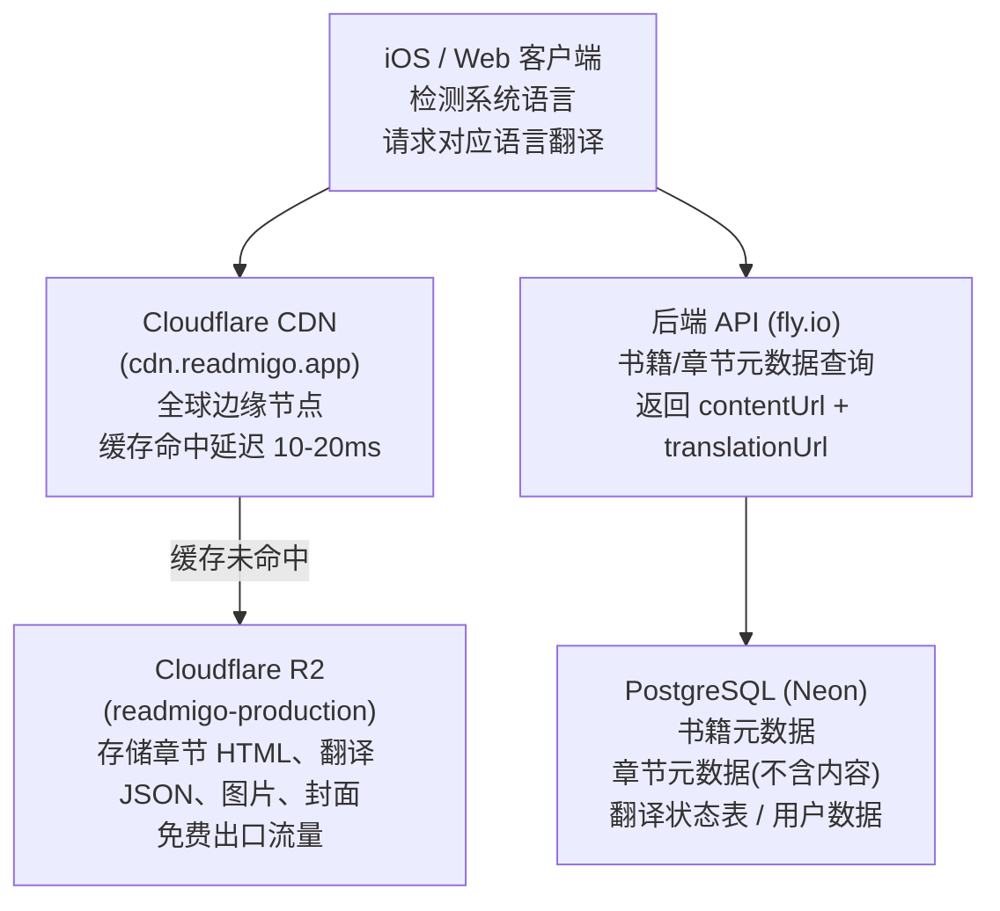
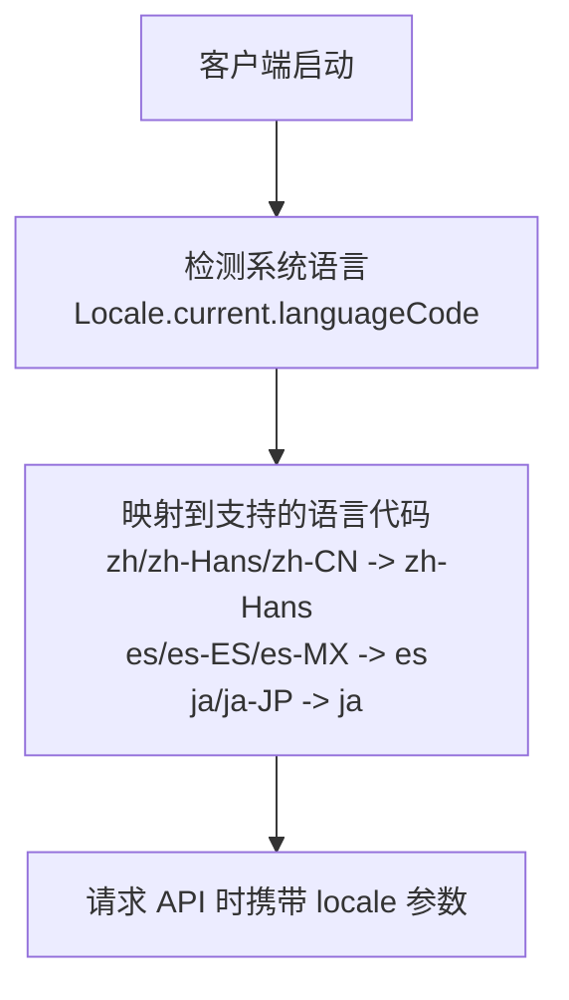

# 章节存储架构设计

## 一、背景

### 1.1 业务目标

| 指标 | 目标值 |
|-----|-------|
| 用户规模 | 100 万 |
| DAU | 10 万 |
| 书籍数量 | 10 万本 |
| 心流模式 | 支持多语言段落同步显示 |

### 1.2 当前问题

| 问题 | 影响 |
|-----|------|
| 章节内容存储在数据库 | 大文本影响性能，存储成本高 |
| 封面路径不统一 | 部分在旧 bucket，部分在新路径 |
| 无 CDN 缓存 | 全球用户访问延迟高 |
| 不支持多语言结构 | 心流模式需要重构 |

---

## 二、规模估算

### 2.1 存储规模

| 项目 | 计算 | 结果 |
|-----|------|------|
| 章节总数 | 10万书 × 30章 | 300 万章 |
| HTML 存储 | 300万 × 10KB | 30 GB |
| 单语言翻译 | 300万 × 8KB | 24 GB |
| 多语言翻译（渐进） | 见 2.3 | 54-120 GB |
| 图片存储 | 10万书 × 20张 × 50KB | 100 GB |

### 2.2 流量规模

| 项目 | 计算 | 结果 |
|-----|------|------|
| 日请求量 | 10万DAU × 5章 | 50 万次/天 |
| 心流模式请求 | 50万 × 30% × 2 | 30 万次/天 |
| 峰值 QPS | 80万 ÷ 86400 × 10 | ~90 QPS |
| 日流量 | 80万 × 12KB | 9.6 GB/天 |
| 月流量 | 9.6GB × 30 | 288 GB/月 |

### 2.3 多语言存储（渐进式）

| 阶段 | 中文 | 西/葡/法 | 日/韩 | 其他 | 总存储 |
|-----|------|---------|-------|------|-------|
| Phase 1 | 100% | 0% | 0% | 0% | 54GB |
| Phase 2 | 100% | 30% | 20% | 0% | 75GB |
| Phase 3 | 100% | 50% | 50% | 30% | 120GB |

---

## 三、方案对比

### 3.1 性能对比

| 维度 | 数据库存储 | R2 + CDN |
|-----|-----------|----------|
| 首次请求 | 50-200ms | 50-100ms |
| 缓存命中 | N/A | **10-20ms** |
| 峰值响应 | 随负载劣化 | 稳定 |
| 数据库连接 | 消耗连接池 | 不占用 |
| 全球访问 | 跨区延迟高 | 边缘加速 |

### 3.2 费用对比（月）

| 项目 | 数据库方案 | R2 方案 |
|-----|-----------|---------|
| 存储 120GB | ~$30 | $1.80 |
| 流量 288GB | 计算时间 | $0（免费） |
| 请求 2400万 | 增加负载 | ~$8.6 |
| 数据库升配 | +$20~30 | $0 |
| **月总计** | **$50~60** | **~$10** |

### 3.3 综合评分

| 维度 | 数据库 | R2 + CDN |
|-----|-------|----------|
| 性能 | ⭐⭐ | ⭐⭐⭐⭐⭐ |
| 费用 | ⭐⭐ | ⭐⭐⭐⭐⭐ |
| 用户体验 | ⭐⭐⭐ | ⭐⭐⭐⭐⭐ |
| 扩展性 | ⭐⭐ | ⭐⭐⭐⭐⭐ |
| 多语言支持 | ⭐⭐ | ⭐⭐⭐⭐⭐ |

---

## 四、推荐方案

### 4.1 架构图



### 4.2 存储结构

```
R2 (cdn.readmigo.app)
└── books/{bookId}/
    ├── cover.jpg                         # 封面原图
    ├── cover_thumb.jpg                   # 封面缩略图
    ├── images/
    │   ├── img-1.jpg                     # 规范化命名
    │   ├── img-2.jpg
    │   └── ...
    └── chapters/
        ├── chapter-1.html                # 英文 HTML（带 data-pid）
        ├── chapter-1.zh-Hans.json        # 简体中文翻译
        ├── chapter-1.es.json             # 西班牙语翻译
        ├── chapter-1.ja.json             # 日语翻译
        ├── chapter-2.html
        ├── chapter-2.zh-Hans.json
        └── ...
```

### 4.3 HTML 结构（带段落 ID）

```html
<h1 class="chapter-title">Chapter I</h1>
<div class="chapter-content">
  <p data-pid="1">The boy walked slowly through the garden.</p>
  <p data-pid="2">He stopped to smell the roses.</p>
  <figure data-pid="3">
    
  </figure>
  <p data-pid="4">The sun was setting behind the hills.</p>
</div>
```

### 4.4 翻译 JSON 结构

```json
{
  "v": 1,
  "locale": "zh-Hans",
  "source": "AI_TRANSLATION",
  "model": "gpt-4o",
  "createdAt": "2026-01-10T00:00:00Z",
  "paragraphs": {
    "1": "男孩慢慢地穿过花园。",
    "2": "他停下来闻玫瑰花。",
    "4": "太阳正在山后落下。"
  }
}
```

---

## 五、多语言支持

### 5.1 目标语言（Top 10）

| 优先级 | 语言 | 代码 | 用户规模 |
|-------|------|------|---------|
| 1 | 简体中文 | zh-Hans | 10亿+ |
| 2 | 西班牙语 | es | 5.5亿 |
| 3 | 印地语 | hi | 6亿 |
| 4 | 阿拉伯语 | ar | 4亿 |
| 5 | 葡萄牙语 | pt | 2.5亿 |
| 6 | 俄语 | ru | 2.5亿 |
| 7 | 日语 | ja | 1.2亿 |
| 8 | 法语 | fr | 3亿 |
| 9 | 德语 | de | 1亿 |
| 10 | 韩语 | ko | 8000万 |

### 5.2 语言自动检测



### 5.3 语言代码映射

| 系统语言 | 映射到 |
|---------|-------|
| zh, zh-Hans, zh-CN | zh-Hans |
| zh-Hant, zh-TW, zh-HK | zh-Hant |
| es, es-ES, es-MX, es-AR | es |
| pt, pt-BR, pt-PT | pt |
| ja, ja-JP | ja |
| ko, ko-KR | ko |
| fr, fr-FR, fr-CA | fr |
| de, de-DE, de-AT | de |
| ru, ru-RU | ru |
| ar, ar-SA, ar-EG | ar |
| hi, hi-IN | hi |

---

## 六、数据库设计

### 6.1 Chapter 表

```sql
CREATE TABLE chapters (
    id UUID PRIMARY KEY,
    book_id UUID NOT NULL,
    "order" INT NOT NULL,
    title VARCHAR(500),
    href VARCHAR(500),
    word_count INT DEFAULT 0,
    content_url VARCHAR(500),           -- HTML URL
    created_at TIMESTAMP DEFAULT NOW()
);
```

### 6.2 ChapterTranslation 表（新增）

```sql
CREATE TABLE chapter_translations (
    id UUID PRIMARY KEY,
    chapter_id UUID NOT NULL REFERENCES chapters(id),
    locale VARCHAR(10) NOT NULL,          -- zh-Hans, es, ja, etc.
    content_url VARCHAR(500),             -- R2 URL
    source VARCHAR(20) NOT NULL,          -- AI_TRANSLATION, EPUB_MATCH, MANUAL
    model VARCHAR(50),                    -- gpt-4o, claude-sonnet, etc.
    status VARCHAR(20) DEFAULT 'PENDING', -- PENDING, IN_PROGRESS, COMPLETED, FAILED
    paragraph_count INT DEFAULT 0,
    created_at TIMESTAMP DEFAULT NOW(),
    updated_at TIMESTAMP DEFAULT NOW(),

    UNIQUE(chapter_id, locale)
);

CREATE INDEX idx_chapter_translation_chapter ON chapter_translations(chapter_id);
CREATE INDEX idx_chapter_translation_locale ON chapter_translations(locale);
```

### 6.3 BookTranslationStatus 表（新增）

```sql
CREATE TABLE book_translation_status (
    id UUID PRIMARY KEY,
    book_id UUID NOT NULL REFERENCES books(id),
    locale VARCHAR(10) NOT NULL,
    status VARCHAR(20) DEFAULT 'PENDING',
    chapters_total INT DEFAULT 0,
    chapters_completed INT DEFAULT 0,
    progress DECIMAL(5,2) DEFAULT 0,
    created_at TIMESTAMP DEFAULT NOW(),
    updated_at TIMESTAMP DEFAULT NOW(),

    UNIQUE(book_id, locale)
);
```

---

## 七、API 设计

### 7.1 获取书籍（含翻译状态）

```
GET /api/v1/books/{bookId}

Response:
{
  "id": "uuid",
  "title": "The Young Pilgrim",
  "translations": {
    "zh-Hans": { "status": "COMPLETED", "progress": 100 },
    "es": { "status": "IN_PROGRESS", "progress": 45 },
    "ja": { "status": "PENDING", "progress": 0 }
  }
}
```

### 7.2 获取章节列表

```
GET /api/v1/books/{bookId}/chapters?locale=zh-Hans

Response:
{
  "chapters": [
    {
      "id": "uuid",
      "order": 1,
      "title": "Chapter I",
      "wordCount": 1500,
      "contentUrl": "https://cdn.../chapter-1.html",
      "translationUrl": "https://cdn.../chapter-1.zh-Hans.json",
      "translationStatus": "COMPLETED"
    }
  ]
}
```

### 7.3 客户端请求流程

```
1. 客户端检测系统语言 -> locale = "zh-Hans"
2. 请求章节列表 -> GET /chapters?locale=zh-Hans
3. 获取 contentUrl (HTML) -> 立即渲染
4. 后台获取 translationUrl (JSON) -> 注入到 JS
5. 用户双击段落 -> 显示翻译浮层
```

---

## 八、心流模式交互

### 8.1 JavaScript 消息处理

```javascript
// 翻译数据（从 JSON 加载）
let translations = {};

// 双击事件监听
document.addEventListener('dblclick', function(e) {
    const p = e.target.closest('[data-pid]');
    if (p) {
        const pid = p.dataset.pid;
        const translation = translations[pid];
        if (translation) {
            window.webkit.messageHandlers.paragraphDoubleTap.postMessage({
                pid: pid,
                original: p.textContent,
                translation: translation
            });
        }
    }
});
```

### 8.2 iOS 处理

```swift
case "paragraphDoubleTap":
    if let translation = body["translation"] as? String {
        showTranslationOverlay(translation)
    }
```

---

## 九、迁移计划

### 9.1 Phase 1: 基础设施

| 任务 | 说明 |
|-----|------|
| 添加 contentUrl 字段 | schema.prisma |
| 创建翻译状态表 | migration |
| HTML 添加 data-pid | book-enrichment.service.ts |
| 章节上传到 R2 | book-enrichment.service.ts |

### 9.2 Phase 2: 翻译生成

| 任务 | 说明 |
|-----|------|
| 翻译任务队列 | BullMQ |
| AI 翻译服务 | GPT-4o / Claude |
| 翻译 JSON 上传 | R2 |

### 9.3 Phase 3: 客户端支持

| 任务 | 说明 |
|-----|------|
| 语言自动检测 | iOS Locale |
| 翻译 JSON 加载 | 后台请求 |
| 双击交互 | JavaScript + Swift |
| 翻译浮层 UI | SwiftUI |

---

## 十、风险与应对

| 风险 | 应对措施 |
|-----|---------|
| R2 不可用 | 保留 htmlContent 字段作为降级 |
| 翻译质量差 | 支持人工校对和反馈 |
| 语言不支持 | 显示"翻译即将上线"提示 |
| CDN 缓存过期 | 设置合理 Cache-Control（7天） |

---

## 十一、验收标准

| 项目 | 标准 |
|-----|------|
| 章节加载延迟 | CDN 命中 < 50ms |
| 翻译加载延迟 | CDN 命中 < 30ms |
| 存储路径 | 100% 使用新结构 |
| 费用 | 月存储+流量 < $15 |
| 语言自动检测 | 正确率 > 99% |
| 心流模式响应 | 双击到显示 < 100ms |
