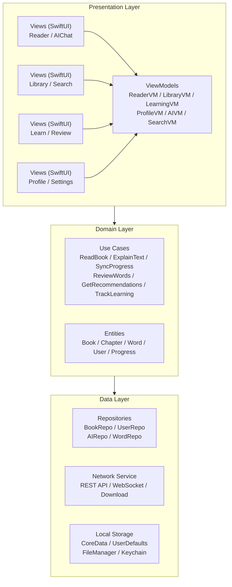
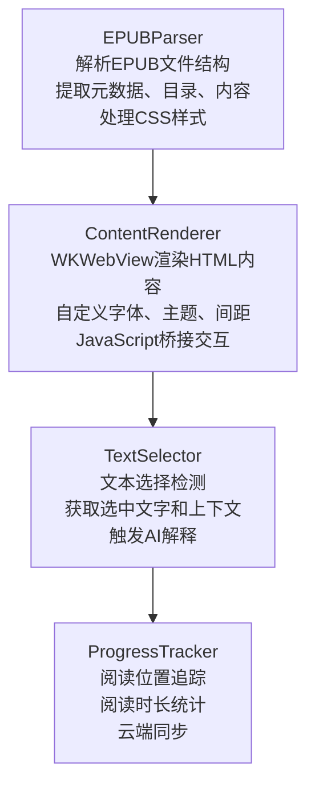
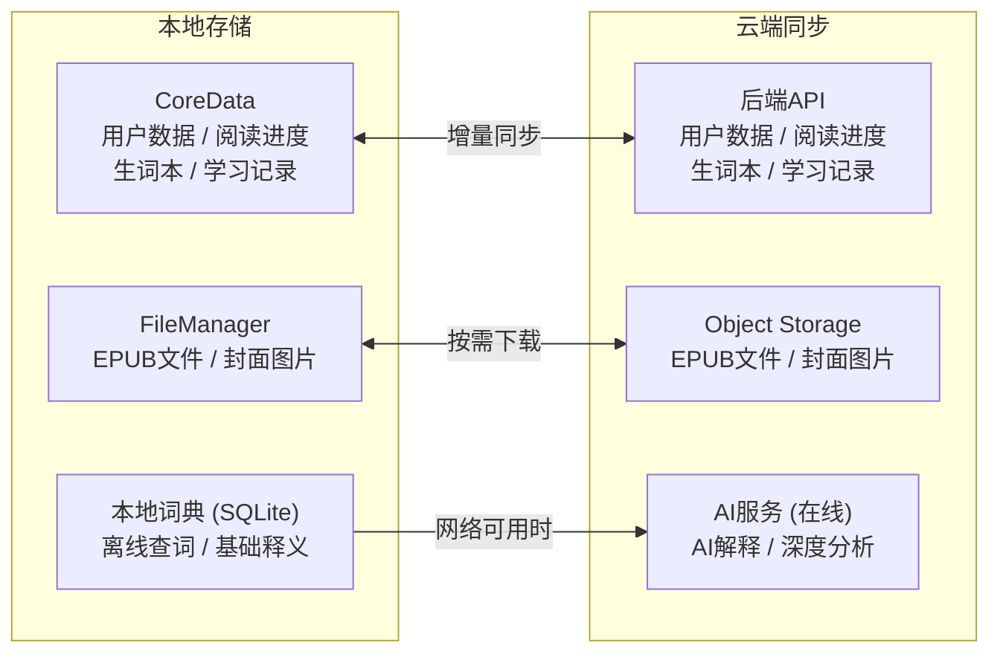

# 客户端架构

### 3.1 多端策略

```
┌─────────────────────────────────────────────────────────────────────────┐
│                          多端开发策略                                    │
├─────────────────────────────────────────────────────────────────────────┤
│                                                                         │
│  Phase 1: iOS优先                                                       │
│  ═══════════════                                                        │
│  • 原生 Swift + SwiftUI                                                 │
│  • 最佳性能和体验                                                       │
│  • App Store 首发                                                       │
│                                                                         │
│  Phase 2: Web版本                                                       │
│  ═══════════════                                                        │
│  • React + Next.js                                                      │
│  • 响应式设计                                                           │
│  • SEO友好                                                              │
│                                                                         │
│  Phase 3: Android                                                       │
│  ═══════════════                                                        │
│  方案A: 原生 Kotlin + Compose (推荐)                                    │
│  方案B: React Native (如果资源有限)                                     │
│                                                                         │
│  Phase 4: 跨平台优化 (可选)                                             │
│  ═══════════════════════════                                            │
│  • 考虑 Flutter 重写                                                    │
│  • 或 React Native 统一                                                 │
│                                                                         │
└─────────────────────────────────────────────────────────────────────────┘
```

### 3.2 iOS客户端架构



### 3.3 iOS核心模块

#### 3.3.1 EPUB阅读器引擎



#### 3.3.2 离线支持设计



**同步策略**:
- 冲突解决：Last-Write-Wins + 版本向量
- 增量同步：只同步变更数据
- 后台同步：利用iOS Background Tasks
- 离线队列：记录离线操作，上线后重放

### 3.4 Web客户端架构

```
┌─────────────────────────────────────────────────────────────────────────┐
│                        Web App Architecture                             │
│                          (Next.js + React)                              │
├─────────────────────────────────────────────────────────────────────────┤
│                                                                         │
│  项目结构：                                                              │
│  ─────────                                                              │
│  src/                                                                   │
│  ├── app/                      # Next.js App Router                     │
│  │   ├── (auth)/               # 认证相关页面                           │
│  │   │   ├── login/                                                     │
│  │   │   └── register/                                                  │
│  │   ├── (main)/               # 主要功能页面                           │
│  │   │   ├── library/          # 书库                                   │
│  │   │   ├── reader/[bookId]/  # 阅读器                                 │
│  │   │   ├── learn/            # 学习中心                               │
│  │   │   └── profile/          # 个人中心                               │
│  │   └── api/                  # API Routes (BFF层)                     │
│  │                                                                      │
│  ├── components/               # 通用组件                               │
│  │   ├── ui/                   # 基础UI组件                             │
│  │   ├── reader/               # 阅读器组件                             │
│  │   ├── ai/                   # AI交互组件                             │
│  │   └── learning/             # 学习组件                               │
│  │                                                                      │
│  ├── hooks/                    # 自定义Hooks                            │
│  │   ├── useReader.ts                                                   │
│  │   ├── useAI.ts                                                       │
│  │   └── useLearning.ts                                                 │
│  │                                                                      │
│  ├── stores/                   # 状态管理 (Zustand)                     │
│  │   ├── readerStore.ts                                                 │
│  │   ├── userStore.ts                                                   │
│  │   └── learningStore.ts                                               │
│  │                                                                      │
│  ├── services/                 # API服务                                │
│  │   ├── api.ts                # API客户端                              │
│  │   ├── bookService.ts                                                 │
│  │   └── aiService.ts                                                   │
│  │                                                                      │
│  └── lib/                      # 工具库                                 │
│      ├── epub/                 # EPUB解析                               │
│      └── utils/                                                         │
│                                                                         │
└─────────────────────────────────────────────────────────────────────────┘
```

### 3.5 共享代码策略

```
┌─────────────────────────────────────────────────────────────────────────┐
│                          跨端共享策略                                    │
├─────────────────────────────────────────────────────────────────────────┤
│                                                                         │
│  可共享部分                       平台特定部分                           │
│  ────────────                     ────────────                           │
│                                                                         │
│  ┌─────────────────────┐         ┌─────────────────────┐                │
│  │  API Schema         │         │  UI组件             │                │
│  │  (OpenAPI/TypeSpec) │         │  • iOS: SwiftUI     │                │
│  │                     │         │  • Web: React       │                │
│  │  • 自动生成类型     │         │  • Android: Compose │                │
│  │  • 接口定义统一     │         │                     │                │
│  └─────────────────────┘         └─────────────────────┘                │
│                                                                         │
│  ┌─────────────────────┐         ┌─────────────────────┐                │
│  │  业务逻辑           │         │  原生能力           │                │
│  │  (可选: KMM/WASM)   │         │  • 文件系统         │                │
│  │                     │         │  • 推送通知         │                │
│  │  • 数据模型         │         │  • 内购支付         │                │
│  │  • 验证规则         │         │  • 系统集成         │                │
│  └─────────────────────┘         └─────────────────────┘                │
│                                                                         │
│  ┌─────────────────────┐         ┌─────────────────────┐                │
│  │  设计系统           │         │  存储实现           │                │
│  │  (Design Tokens)    │         │  • iOS: CoreData    │                │
│  │                     │         │  • Web: IndexedDB   │                │
│  │  • 颜色             │         │  • Android: Room    │                │
│  │  • 字体             │         │                     │                │
│  │  • 间距             │         │                     │                │
│  └─────────────────────┘         └─────────────────────┘                │
│                                                                         │
└─────────────────────────────────────────────────────────────────────────┘
```

---

