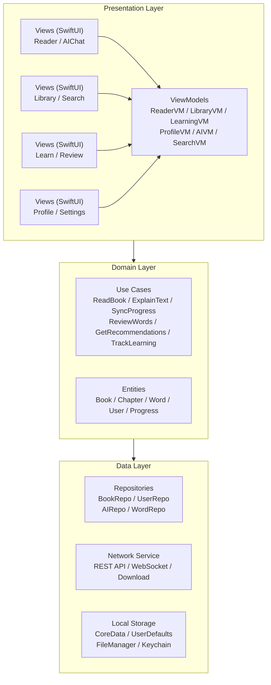
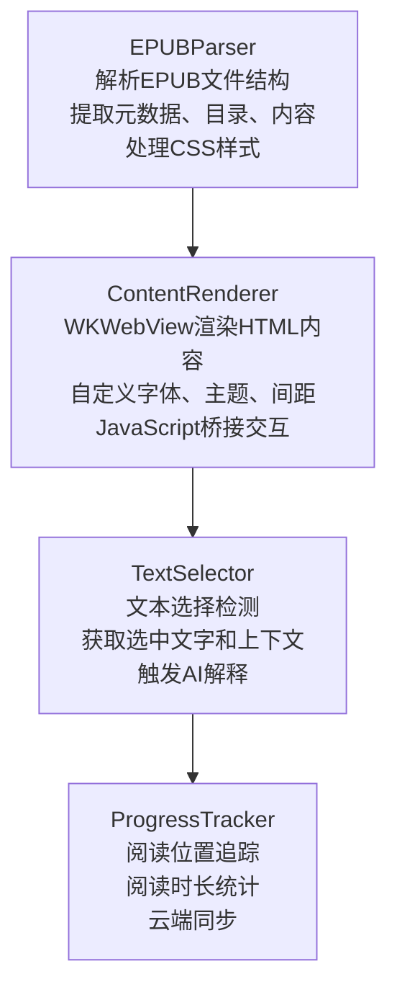
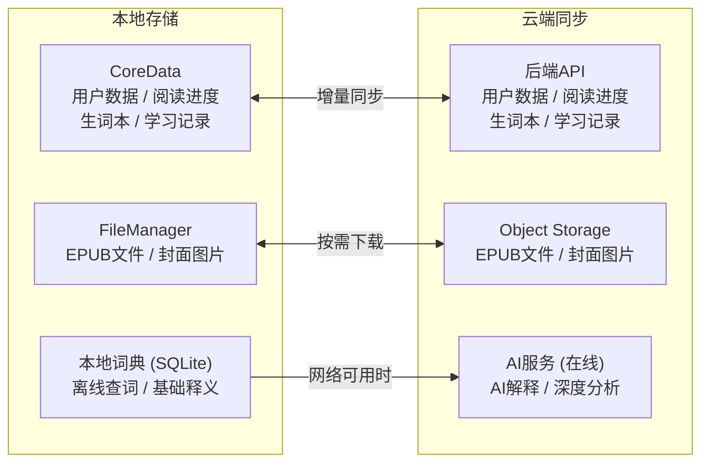

### 3.2 iOS客户端架构

```mermaid
graph TB
    subgraph Presentation["Presentation Layer"]
        V1["Views (SwiftUI)<br>Reader / AIChat"]
        V2["Views (SwiftUI)<br>Library / Search"]
        V3["Views (SwiftUI)<br>Learn / Review"]
        V4["Views (SwiftUI)<br>Profile / Settings"]
        VM["ViewModels<br>ReaderVM / LibraryVM / LearningVM<br>ProfileVM / AIVM / SearchVM"]
        V1 & V2 & V3 & V4 --> VM
    end

    subgraph Domain["Domain Layer"]
        UC["Use Cases<br>ReadBook / ExplainText / SyncProgress<br>ReviewWords / GetRecommendations / TrackLearning"]
        Entities["Entities<br>Book / Chapter / Word / User / Progress"]
    end

    subgraph Data["Data Layer"]
        Repo["Repositories<br>BookRepo / UserRepo<br>AIRepo / WordRepo"]
        Net["Network Service<br>REST API / WebSocket / Download"]
        Local["Local Storage<br>CoreData / UserDefaults<br>FileManager / Keychain"]
    end

    Presentation --> Domain --> Data
```

#### 3.3.1 EPUB阅读器引擎

```mermaid
graph TB
    EP["EPUBParser<br>解析EPUB文件结构<br>提取元数据、目录、内容<br>处理CSS样式"]
    CR["ContentRenderer<br>WKWebView渲染HTML内容<br>自定义字体、主题、间距<br>JavaScript桥接交互"]
    TS["TextSelector<br>文本选择检测<br>获取选中文字和上下文<br>触发AI解释"]
    PT["ProgressTracker<br>阅读位置追踪<br>阅读时长统计<br>云端同步"]

    EP --> CR --> TS --> PT
```

#### 3.3.2 离线支持设计

```mermaid
graph LR
    subgraph Local["本地存储"]
        CD["CoreData<br>用户数据 / 阅读进度<br>生词本 / 学习记录"]
        FM["FileManager<br>EPUB文件 / 封面图片"]
        Dict["本地词典 (SQLite)<br>离线查词 / 基础释义"]
    end

    subgraph Cloud["云端同步"]
        API["后端API<br>用户数据 / 阅读进度<br>生词本 / 学习记录"]
        OBJ["Object Storage<br>EPUB文件 / 封面图片"]
        AI["AI服务 (在线)<br>AI解释 / 深度分析"]
    end

    CD <-->|"增量同步"| API
    FM <-->|"按需下载"| OBJ
    Dict -->|"网络可用时"| AI
```

**同步策略**:
- 冲突解决：Last-Write-Wins + 版本向量
- 增量同步：只同步变更数据
- 后台同步：利用iOS Background Tasks
- 离线队列：记录离线操作，上线后重放

---
