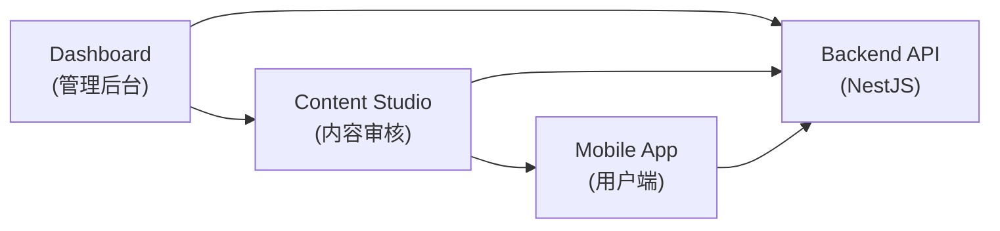
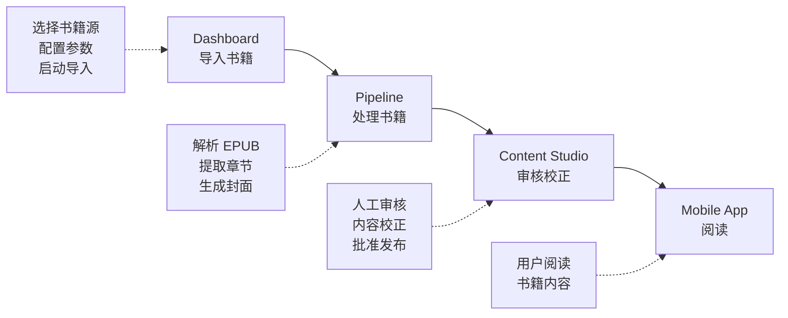
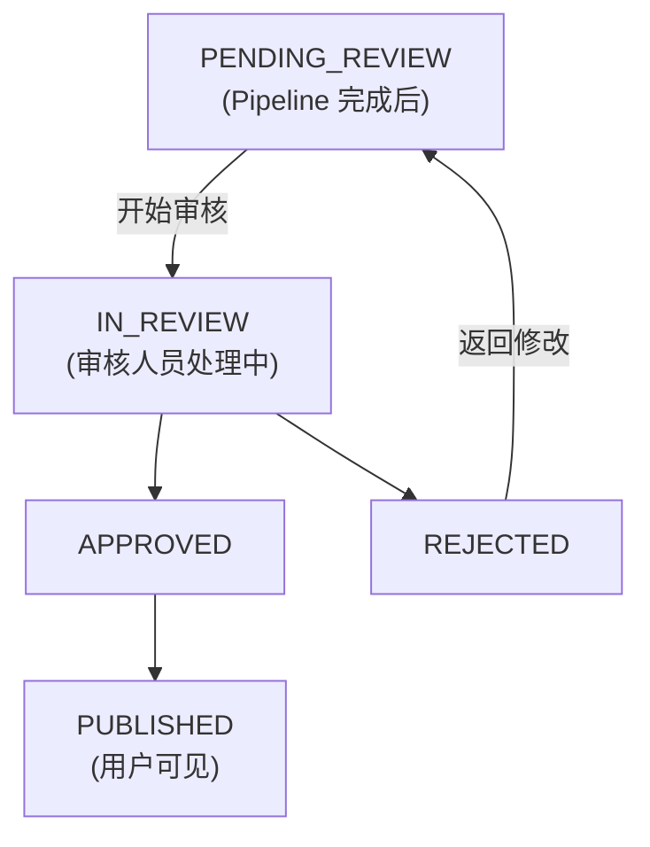

# Content Studio 技术架构文档

## 概述

Content Studio 是 Readmigo 的内容审核与校正工具，用于处理导入书籍的内容质量问题，包括格式清理、版权文本移除、内容审核等功能。

## 系统定位



## 工作流程



## 技术栈

| 层级 | 技术选型 | 说明 |
|------|---------|------|
| 前端框架 | Next.js 15 (App Router) | React 服务端组件 |
| UI 组件 | Radix UI + Tailwind CSS | 无障碍组件库 |
| 状态管理 | Zustand | 轻量级状态管理 |
| 国际化 | next-intl | 多语言支持 (中/英) |
| 代码编辑器 | Monaco Editor | HTML 内容编辑 |
| HTTP 客户端 | Axios | API 请求 |
| 后端框架 | NestJS | 后端 API |
| 数据库 | PostgreSQL + Prisma | 数据持久化 |

## 目录结构

```
tools/content-studio/
├── src/
│   ├── app/                    # Next.js App Router 页面
│   │   ├── page.tsx            # 书籍列表 (首页)
│   │   ├── book/[id]/          # 书籍编辑器
│   │   ├── rules/              # 规则管理
│   │   │   └── migration/      # 规则迁移
│   │   └── learning/           # 学习报告
│   ├── components/             # React 组件
│   │   ├── book-list/          # 书籍列表组件
│   │   ├── editor/             # 编辑器组件
│   │   ├── preview/            # 预览组件
│   │   └── ui/                 # 通用 UI 组件
│   ├── lib/                    # 工具库
│   │   ├── api.ts              # API 客户端
│   │   ├── types.ts            # TypeScript 类型
│   │   └── utils.ts            # 工具函数
│   ├── stores/                 # Zustand 状态
│   │   ├── env-store.ts        # 环境配置
│   │   └── locale-store.ts     # 语言设置
│   ├── config/                 # 配置文件
│   │   └── environments.ts     # 多环境配置
│   └── i18n/                   # 国际化
│       └── messages/           # 翻译文件
└── public/                     # 静态资源
```

## 多环境架构

Content Studio 支持四个环境，用于不同阶段的内容审核：

| 环境 | 用途 | API 地址 |
|------|------|---------|
| LOCAL | 本地开发 | localhost:3000 |
| DEBUG | 调试测试 | debug.api.readmigo.com |
| STAGING | 预发布验证 | staging.api.readmigo.com |
| PRODUCTION | 生产环境 | api.readmigo.com |

```
┌─────────────────────────────────────────────────────────────────────┐
│                        环境切换器 (Header)                           │
├──────────┬──────────┬──────────┬──────────────────────────────────────┤
│  LOCAL   │  DEBUG   │ STAGING  │  PRODUCTION (需二次确认)              │
│   🟢     │   🔵     │   🟡     │      🔴                              │
└──────────┴──────────┴──────────┴──────────────────────────────────────┘
```

## 内容审核状态流转



## 审核追溯

每次审核操作记录以下信息：

| 字段 | 说明 |
|------|------|
| reviewedBy | 审核人员标识 |
| reviewedAt | 审核时间戳 |
| reviewNotes | 审核备注 |
| contentReviewStatus | 审核结果状态 |

## API 端点

| 方法 | 路径 | 说明 |
|------|------|------|
| GET | /content-studio/books | 获取书籍列表 |
| GET | /content-studio/books/:id | 获取书籍详情 |
| GET | /content-studio/books/:id/chapters | 获取书籍章节 |
| PUT | /content-studio/books/:id/start-review | 开始审核 |
| PUT | /content-studio/books/:id/approve | 批准书籍 |
| PUT | /content-studio/books/:id/reject | 拒绝书籍 |
| GET | /content-studio/chapters/:id | 获取章节详情 |
| PUT | /content-studio/chapters/:id | 更新章节内容 |

## 与 Dashboard 集成

```
┌─────────────────────────────────────────────────────────────────────┐
│                          Dashboard                                   │
├─────────────────────────────────────────────────────────────────────┤
│                                                                     │
│  ┌─────────────────┐    ┌─────────────────┐    ┌─────────────────┐ │
│  │   Books 列表    │    │  Pipeline 面板  │    │   侧边栏导航    │ │
│  │                 │    │                 │    │                 │ │
│  │ ┌─────────────┐ │    │ ┌─────────────┐ │    │ ┌─────────────┐ │ │
│  │ │ Review 状态 │ │    │ │待审核书籍数 │ │    │ │Content     │ │ │
│  │ │   列显示    │ │    │ │   提示条    │ │    │ │Studio 链接 │ │ │
│  │ └─────────────┘ │    │ └─────────────┘ │    │ └─────────────┘ │ │
│  │ ┌─────────────┐ │    │ ┌─────────────┐ │    │                 │ │
│  │ │ "审核"按钮  │ │    │ │"开始审核"   │ │    │                 │ │
│  │ │ → Studio   │ │    │ │   按钮      │ │    │                 │ │
│  │ └─────────────┘ │    │ └─────────────┘ │    │                 │ │
│  └─────────────────┘    └─────────────────┘    └─────────────────┘ │
│                                                                     │
└─────────────────────────────────────────────────────────────────────┘
```

## 安全考虑

| 场景 | 措施 |
|------|------|
| 生产环境操作 | 需输入 "CONFIRM" 确认 |
| 环境标识 | 顶部醒目显示当前环境 |
| 操作审计 | 记录审核人和时间戳 |
| 权限控制 | 通过后端 API 鉴权 |

## 后续规划

| 功能 | 状态 | 说明 |
|------|------|------|
| 书籍列表与审核 | ✅ 完成 | 基础审核流程 |
| 章节编辑器 | 🚧 开发中 | Monaco Editor 集成 |
| 规则管理 | 📋 计划中 | 自动校正规则 |
| 学习报告 | 📋 计划中 | AI 学习模式识别 |
| 规则迁移 | 📋 计划中 | 跨环境规则同步 |
