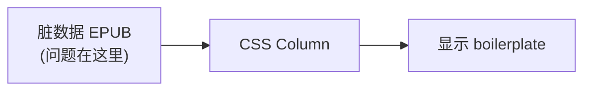
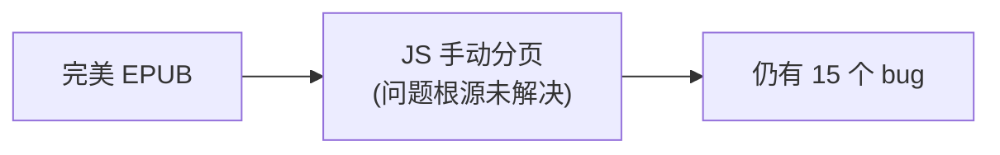
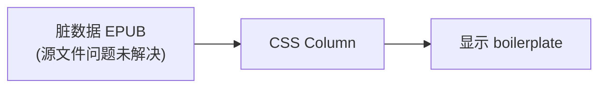

## 决策问题

**方案 A**：Pipeline 处理 Gutenberg 源文件，转换为标准 EPUB 格式
**方案 B**：阅读器迁移到 CSS Multi-Column 分页

**额外约束**：需支持 TTS + 文本进度显示 + 双击翻译

---

## 〇、已记录问题概览

基于三份问题文档的完整统计，当前系统已发现 **26 个问题**（排除 Dropcap 相关问题）：

> **设计决策：不支持 Dropcap（首字下沉）布局**
>
> 原因：Dropcap 布局引入了 7 个复杂问题，增加了大量分页算法复杂度。
> 简化方案：Pipeline 直接移除 Dropcap 图片，使用普通段落首字母显示。

### 问题分类统计

| 问题来源 | 数量 | 已修复 | 待处理 |
|---------|------|-------|-------|
| 阅读器 JS 分页算法 | 15 | 13 | 2 |
| 后端 EPUB 解析 | 6 | 6 | 0 |
| CSS 样式缺失 | 5 | 3 | 2 |

### 问题严重程度分布

| 严重程度 | 数量 | 示例 |
|---------|------|------|
| 🔴 严重 | 6 | 内容截断、文字被削、章节丢失 |
| 🟠 中等 | 15 | 标题重复、空白页、样式丢失 |
| 🟡 轻微 | 5 | 图片尺寸、边距不适配 |

### 关键发现

> **15/26 (58%) 的问题直接由 JS 手动分页算法引起**
>
> 这些问题具有以下特点：
> - 持续性：每本新书都可能触发新 bug
> - 复杂性：修复一个问题可能引入新问题
> - 脆弱性：算法逻辑复杂，难以覆盖所有边界情况

---

### 3.1 行业验证

| 产品 | 分页方案 | TTS 支持 | 进度显示 | 翻译功能 |
|------|----------|---------|---------|---------|
| **Apple Books** | CSS Column | ✅ 朗读+高亮 | ✅ | ✅ 长按查词 |
| **Kindle** | CSS Column | ✅ Whispersync | ✅ | ✅ 内置词典 |
| **Readium** | CSS Column | ✅ Web Speech API | ✅ | 需自行实现 |
| **epub.js** | CSS Column | ✅ 可集成 | ✅ | 需自行实现 |
| **Thorium** | CSS Column | ✅ 句+词高亮 | ✅ | ✅ |

**结论**：CSS Column 方案完全可以支持这些功能，行业已有成熟实现。

---

### 4.2 CSS Column + TTS

**分析**：
- JS 手动分页的复杂度集中在分页算法，而且是持续性问题（每个新书都可能暴露新 bug）
- CSS Column 的复杂度集中在交互功能，但这是一次性投入（实现后对所有书通用）

---

### 5.1 继续使用 JS 手动分页的风险

| 风险 | 概率 | 影响 |
|------|------|------|
| 分页算法持续出 bug | 高 | 高 - 用户体验差 |
| 新书格式触发新问题 | 高 | 中 - 需要持续修复 |
| 排版质量无法媲美竞品 | 确定 | 高 - 竞争力不足 |
| 孤行寡行问题难以完美解决 | 高 | 中 - 阅读体验差 |

### 5.2 迁移到 CSS Column 的风险

| 风险 | 概率 | 影响 |
|------|------|------|
| 迁移工作量 | 确定 | 中 - 一次性投入 |
| TTS/翻译实现复杂 | 中 | 中 - 有行业参考 |
| 旧版浏览器兼容 | 低 | 低 - 目标是移动端 |

---

### 6.2 为什么不只做 Pipeline？

Pipeline 解决的是输入问题，但渲染问题还在。

### 6.3 为什么不只做 CSS Column？

CSS Column 解决的是渲染问题，但源文件问题还在。

---

### 8.3 开源参考

| 项目 | 说明 | 链接 |
|------|------|------|
| Readium CSS | 行业标准样式表 | [GitHub](https://github.com/readium/readium-css) |
| epub.js | JS EPUB 渲染库 | [GitHub](https://github.com/futurepress/epub.js) |
| Foliate-js | 浏览器 EPUB 渲染 | [GitHub](https://github.com/johnfactotum/foliate-js) |
| Thorium Reader | 完整阅读器实现 | [GitHub](https://github.com/edrlab/thorium-reader) |

---

### 9.1 各问题的解决路径

基于 26 个已记录问题（排除 Dropcap 相关），分析各问题在不同方案下的解决情况：

### 9.2 CSS Multi-Column 如何解决 JS 分页问题

| JS 分页问题 | CSS Column 解决机制 |
|------------|-------------------|
| 内容截断/丢失 | 浏览器原生分栏，不存在手动计算错误 |
| 空白页问题 | CSS 自动填充，无需手动处理空元素 |
| 超大元素分割 | `break-inside: avoid` + 自动溢出处理 |
| 文字被削 | 无 overflow:hidden，内容自然流入下一栏 |
| 单词断裂 | CSS `hyphens: auto` + `word-break` 原生控制 |
| 孤行寡行 | CSS `orphans: 2; widows: 2` 原生支持 |

### 9.3 Pipeline 如何解决源文件问题

| 源文件问题 | Pipeline 解决机制 |
|-----------|------------------|
| 章节丢失 | TOC-based 解析，处理同文件多章节 |
| Cover 缺失 | 自动检测并添加封面章节 |
| Boilerplate 残留 | 正则清理 Gutenberg 特定元素 |
| CSS 样式丢失 | 保留 `<style>` 标签，上传外部 CSS |
| Dropcap 图片 | 直接移除，简化排版逻辑 |

### 9.4 仅单一方案的局限性

**仅 Pipeline（不改分页算法）：**

- 即使源文件完美，分页算法的边界情况仍会导致问题
- 每本新书格式都可能触发新的分页 bug

**仅 CSS Column（不清洗源文件）：**

- Gutenberg 版权信息会显示在阅读内容中
- 章节结构混乱，用户体验差

---

### 10.1 数据驱动的决策

| 指标 | 数值 | 结论 |
|------|------|------|
| JS 分页 bug 占比 | 58% (15/26) | 必须迁移到 CSS Column |
| Pipeline 能解决的问题 | 23% (6/26) | 必须保留 Pipeline 清洗 |
| 两者结合能解决的问题 | 100% (26/26) | 必须两者结合 |

### 10.3 总结

| 问题 | 答案 |
|------|------|
| **只做 Pipeline 是否足够？** | ❌ 不够，15 个分页 bug 仍在 |
| **只做 CSS Column 是否足够？** | ❌ 不够，6 个源文件问题仍在 |
| **最佳方案？** | ✅ 两者结合，解决 100% 问题 |
| **TTS/翻译与 CSS Column 兼容？** | ✅ 兼容，行业已验证 |
| **迁移成本值得？** | ✅ 值得，一次性投入换取长期收益 |

---

## 附录：问题文档索引

| 文档 | 问题数量 | 主要内容 |
|------|---------|---------|
| [epub-reader-mobile-issues.md](./epub-reader-mobile-issues.md) | 15 | 第一批问题：图片溢出、Drop Cap、CSS丢失等 |
| [epub-reader-mobile-issues2.md](./epub-reader-mobile-issues2.md) | 16 | 第二批问题：分页算法、ORPHAN PREVENTION、后端解析等 |
| [epub-reader-mobile-issues3.md](./epub-reader-mobile-issues3.md) | 2 | 第三批问题：Cover章节、分页截断 |

---

*文档更新日期: 2026-01-26*
