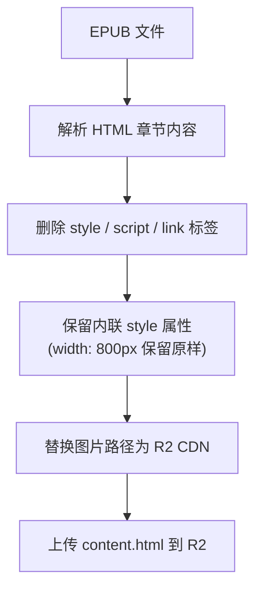
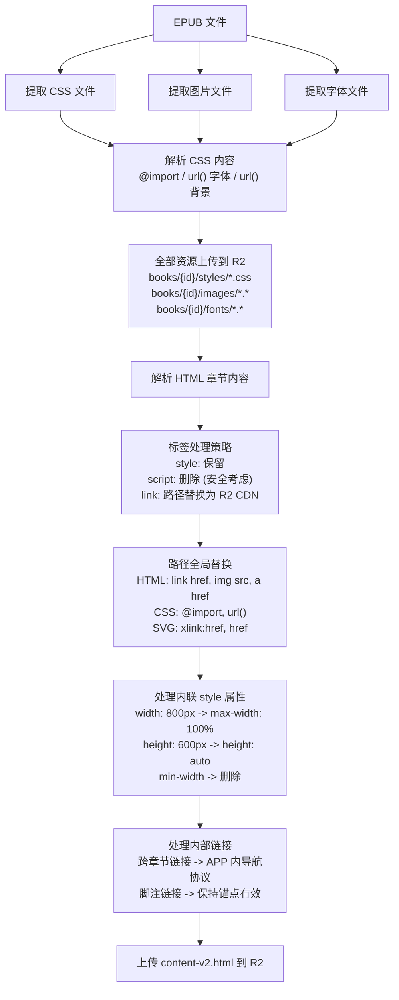
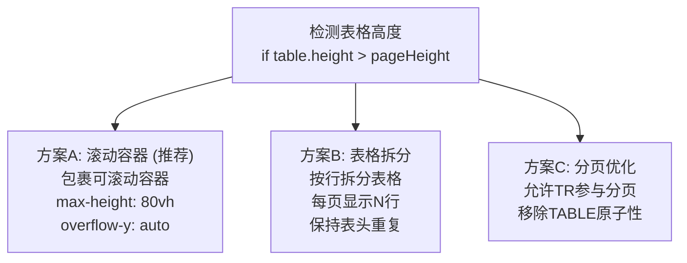

# EPUB内容版本方案对比 (V1 / V2)

## 概述

本文档对比两种EPUB内容处理方案，用于评估最佳的阅读器显示策略。

---

## 方案对比总览

| 对比维度 | V1 (当前) | V2 (目标) |
|----------|-----------|-----------|
| 可行性 | ✅ 已上线 | ✅ 可行 |
| 样式保留度 | 10-20% | 100% |
| 实现复杂度 | 低 | 中 |
| 存储成本 | 基准 | +15-20% |
| 安全性 | ✅ 安全 | ✅ 安全 |
| 客户端版本 | 1.x | 2.x |

---

## 处理流程对比

### V1 处理流程 (当前方案)



V1 的问题：
1. 删除 style 标签 -> 出版商精心设计的布局丢失
2. 删除 link 外部CSS -> 字体、排版样式丢失
3. 保留固定宽高 -> 图片超出屏幕/被裁切
4. Drop cap 首字下沉效果丢失
5. 封面居中/全屏样式丢失

---

### V2 处理流程 (目标方案 - 100%样式保留)



V2 的改进：

1. 保留 `<style>` 标签 -> 恢复所有内联样式
2. 外部CSS上传R2并链接 -> 完整保留出版商样式
3. 字体文件上传R2 -> 还原原始字体效果
4. 优化固定宽高 -> 图片自适应屏幕
5. 跨章节链接 -> APP内导航
6. 最接近Apple Books效果

---

## 各方案详细对比

### 样式处理对比

| 样式类型 | V1 | V2 |
|----------|-----|-----|
| 内联 `<style>` 标签 | ❌ 删除 | ✅ 保留 |
| 外部 CSS 文件 (`<link>`) | ❌ 删除 | ✅ 上传R2并链接 |
| 内联 `style=""` 属性 | ⚠️ 保留原样 | ✅ 优化宽高 |
| `@import` 嵌套CSS | ❌ 不可用 | ✅ 递归解析 |
| `url()` 背景图片 | ❌ 不可用 | ✅ 替换路径 |
| 字体文件 (`@font-face`) | ❌ 不可用 | ✅ 上传R2 |
| CSS变量 | ❌ 不可用 | ✅ 支持 |

### 资源处理对比

| 资源类型 | V1 | V2 |
|----------|-----|-----|
| 图片 (jpg/png/svg) | ✅ R2 CDN | ✅ R2 CDN |
| 外部 CSS 文件 | ❌ 不处理 | ✅ R2 CDN |
| 字体文件 (woff/woff2/ttf) | ❌ 不处理 | ✅ R2 CDN |
| CSS内背景图片 | ❌ 不处理 | ✅ R2 CDN |
| SVG内嵌资源 | ⚠️ 部分 | ✅ 完整 |

### 链接处理对比

| 链接类型 | V1 | V2 |
|----------|-----|-----|
| 同章节锚点 `#xxx` | ✅ 可用 | ✅ 可用 |
| 跨章节链接 | ❌ 失效 | ✅ APP内导航 |
| 脚注链接 | ⚠️ 部分可用 | ✅ 完整支持 |

### 安全性对比

| 安全维度 | V1 | V2 |
|----------|-----|-----|
| `<script>` 标签 | ✅ 删除 | ✅ 删除 |
| 事件处理器 (onclick等) | ⚠️ 保留 | ⚠️ 保留 |
| 外部资源加载 | ✅ 受控 | ✅ 受控 |
| XSS 风险 | 低 | 低 |

### 显示效果对比

| 显示场景 | V1 | V2 |
|----------|-----|-----|
| 封面页布局 | ⭐ | ⭐⭐⭐⭐⭐ |
| 图片自适应 | ⭐⭐ | ⭐⭐⭐⭐⭐ |
| Drop Cap 首字下沉 | ⭐ | ⭐⭐⭐⭐⭐ |
| 复杂表格布局 | ⭐ | ⭐⭐⭐⭐⭐ |
| 诗歌/特殊排版 | ⭐ | ⭐⭐⭐⭐⭐ |
| 注释/脚注样式 | ⭐ | ⭐⭐⭐⭐⭐ |
| 原版字体效果 | ⭐ | ⭐⭐⭐⭐⭐ |
| 跨章节导航 | ⭐ | ⭐⭐⭐⭐⭐ |

---

## V1 存在的问题

| 问题 | 表现 | V2解决方案 |
|------|------|------------|
| 图片裁切 | 图片没有适配手机屏幕，显示不全 | 优化内联样式为响应式 |
| 内容溢出 | 内容过长，超出手机屏幕长度 | 固定宽度 → max-width: 100% |
| 封面留白 | 封面等内容没有全屏显示，留白太多 | 保留居中样式 |
| 首字母图片 | 段落开头首字母用图片显示效果差 | 保留float样式 |
| Drop Cap | 首字母下沉效果丢失 | 保留`<style>`标签 |
| 字体丢失 | 出版商精选字体不显示 | 上传字体文件到R2 |
| 章节跳转失效 | 点击"见第X章"无响应 | 转换为APP内导航 |

---

## V2 实现清单

### 需要处理的资源

| 资源类型 | 处理方式 | 优先级 |
|----------|----------|--------|
| 外部CSS文件 | 上传R2，替换`<link>`路径 | P0 |
| 图片文件 | 上传R2，替换``路径 | P0 |
| 字体文件 | 上传R2，替换CSS中url()路径 | P1 |
| CSS内背景图 | 上传R2，替换url()路径 | P1 |
| @import嵌套CSS | 递归解析上传，替换路径 | P2 |
| 跨章节链接 | 转换为APP导航协议 | P2 |
| 表格元素 | 注入响应式保护样式 | P2 |

### 表格处理方案



### CSS内部资源引用

```
┌─────────────────────────────────────────────────────────────────┐
│  CSS 文件内容                                                    │
├─────────────────────────────────────────────────────────────────┤
│  @import url("fonts.css");              ← 嵌套CSS引用            │
│                                                                 │
│  @font-face {                                                   │
│    font-family: "SE-Lora";                                     │
│    src: url("../fonts/lora.woff2");     ← 字体文件引用          │
│  }                                                              │
│                                                                 │
│  .cover {                                                       │
│    background: url("../images/bg.png"); ← 背景图片引用          │
│  }                                                              │
└─────────────────────────────────────────────────────────────────┘
                                │
                                ▼
┌─────────────────────────────────────────────────────────────────┐
│  处理后的 CSS                                                    │
├─────────────────────────────────────────────────────────────────┤
│  @import url("https://cdn.../styles/fonts.css");               │
│                                                                 │
│  @font-face {                                                   │
│    font-family: "SE-Lora";                                     │
│    src: url("https://cdn.../fonts/lora.woff2");                │
│  }                                                              │
│                                                                 │
│  .cover {                                                       │
│    background: url("https://cdn.../images/bg.png");            │
│  }                                                              │
└─────────────────────────────────────────────────────────────────┘
```

### 字体文件处理

```
┌─────────────────────────────────────────────────────────────────┐
│  EPUB 内的字体文件                                               │
├─────────────────────────────────────────────────────────────────┤
│  /OEBPS/fonts/                                                  │
│      ├── lora-regular.woff2                                     │
│      ├── lora-italic.woff2                                      │
│      ├── lora-bold.woff2                                        │
│      └── dropcap.otf                                            │
└─────────────────────────────────────────────────────────────────┘
                                │
                                ▼
┌─────────────────────────────────────────────────────────────────┐
│  上传到 R2                                                       │
│  books/{bookId}/fonts/*.woff2                                   │
└─────────────────────────────────────────────────────────────────┘
```

| 字体格式 | 优先级 | 说明 |
|----------|--------|------|
| `.woff2` | 高 | 现代格式，压缩率高 |
| `.woff` | 中 | 兼容性好 |
| `.ttf/.otf` | 低 | 文件较大 |
| `.eot` | 跳过 | IE专用，不需要 |

### 跨章节链接处理

```
┌─────────────────────────────────────────────────────────────────┐
│  章节内的跳转链接                                                │
├─────────────────────────────────────────────────────────────────┤
│  <a href="../chapter2.xhtml#section1">见第二章</a>              │
│  <a href="#footnote1">注1</a>                                   │
│  <a href="glossary.xhtml">术语表</a>                            │
└─────────────────────────────────────────────────────────────────┘
                                │
                                ▼
┌─────────────────────────────────────────────────────────────────┐
│  转换为APP内导航                                                 │
├─────────────────────────────────────────────────────────────────┤
│  <a href="readmigo://chapter/{chapterId}#section1"             │
│     data-chapter-order="2">见第二章</a>                         │
│  <a href="#footnote1">注1</a>                                   │
│  <a href="readmigo://chapter/{glossaryChapterId}">术语表</a>   │
└─────────────────────────────────────────────────────────────────┘
```

---

## 实现复杂度对比

### V1 实现要点

| 步骤 | 复杂度 | 状态 |
|------|--------|------|
| 解析EPUB | 低 | ✅ 已完成 |
| 提取章节HTML | 低 | ✅ 已完成 |
| 删除所有style/script/link/meta | 低 | ✅ 已完成 |
| 替换图片路径 | 中 | ✅ 已完成 |
| 上传R2 | 低 | ✅ 已完成 |

### V2 需要新增

| 步骤 | 复杂度 | 说明 |
|------|--------|------|
| 保留`<style>`标签 | 低 | 修改清理逻辑 |
| 提取EPUB内CSS文件 | 中 | 遍历manifest找出CSS |
| 解析CSS内资源引用 | 中 | 处理@import、url() |
| CSS文件上传R2 | 低 | 与图片上传类似 |
| 替换`<link>`中href | 中 | 路径映射逻辑 |
| 提取字体文件 | 低 | 遍历manifest |
| 字体文件上传R2 | 低 | 与图片上传类似 |
| 处理CSS中相对路径 | 高 | 需要完整路径解析 |
| 优化内联样式 | 低 | 正则替换 |
| 跨章节链接转换 | 中 | href解析+章节映射 |

---

## 存储成本对比

### 单本书存储估算

| 存储项 | V1 | V2 | 增量 |
|--------|-----|-----|------|
| 章节HTML | ~500KB | ~550KB | +10% |
| 图片 | ~2MB | ~2MB | 0% |
| CSS文件 | 0 | ~50KB | +50KB |
| 字体文件 | 0 | ~200KB | +200KB |
| CSS内背景图 | 0 | ~50KB | +50KB |
| **总计** | ~2.5MB | ~2.85MB | +14% |

### 1000本书总存储

| 方案 | 预估存储 | R2月费用 |
|------|----------|----------|
| V1 | ~2.5GB | ~$0.04 |
| V2 | ~2.85GB | ~$0.05 |
| **增量** | +350MB | +$0.006 |

---

## 兼容性设计

### 版本共存策略

```
┌─────────────────────────────────────────────────────────────────┐
│                        R2 存储结构                               │
├─────────────────────────────────────────────────────────────────┤
│  /books/{bookId}/                                               │
│      ├── chapters/                                              │
│      │   ├── {chapterId}.html        ← V1 (剥离CSS)             │
│      │   └── {chapterId}-v2.html     ← V2 (完整样式)            │
│      ├── images/                                                │
│      │   └── *.jpg/png/svg                                      │
│      ├── styles/                      ← V2 新增                 │
│      │   └── *.css                                              │
│      └── fonts/                       ← V2 新增                 │
│          └── *.woff2/woff/ttf                                   │
└─────────────────────────────────────────────────────────────────┘
```

### API版本路由

| 客户端版本 | X-App-Version | 返回内容 |
|------------|---------------|----------|
| 1.x | 1.x.x | content.html (V1) |
| 2.x+ | 2.x.x | content-v2.html (V2) |

### 降级策略

```
客户端请求章节内容时:

if (appVersion >= 2 && hasV2Content) {
    return contentV2Url    // V2 完整样式
} else {
    return contentUrl      // V1 (永远可用)
}
```

---

## 技术风险与缓解

| 风险 | 影响 | 缓解措施 |
|------|------|----------|
| 字体版权问题 | 法律风险 | 仅处理开源/公版书字体 |
| CSS解析复杂度 | 处理失败 | 降级到V1 |
| 递归@import | 无限循环 | 限制深度为3层 |
| 超大字体文件 | 存储成本 | 设置单文件上限5MB |
| 跨域字体加载 | 加载失败 | R2配置CORS |

---

## 实施计划

### 后端改造

| 步骤 | 任务 | 状态 |
|------|------|------|
| 1 | 修改HTML清理逻辑：保留`<style>` | ⬜ |
| 2 | 提取EPUB内CSS文件 | ⬜ |
| 3 | 解析CSS内url()引用 | ⬜ |
| 4 | 提取字体文件 | ⬜ |
| 5 | 上传CSS/字体到R2 | ⬜ |
| 6 | 替换`<link>`路径 | ⬜ |
| 7 | 替换CSS内url()路径 | ⬜ |
| 8 | 优化内联样式 | ⬜ |
| 9 | 处理跨章节链接 | ⬜ |
| 10 | 数据库新增字段 | ⬜ |

### 数据库变更

| 表 | 新增字段 | 类型 | 说明 |
|-----|----------|------|------|
| `chapters` | `content_v2_url` | VARCHAR | V2 内容文件 URL |
| `chapters` | `has_v2_content` | BOOLEAN | 是否有 V2 内容 |

### iOS改造

| 步骤 | 任务 | 状态 |
|------|------|------|
| 1 | API请求添加版本号Header | ⬜ |
| 2 | 处理V2内容URL返回 | ⬜ |
| 3 | 实现APP内导航协议 | ⬜ |
| 4 | 调整阅读器CSS注入策略 | ⬜ |

---

## 阅读器配套修复

V2内容处理方案解决了Pipeline层问题，但以下阅读器层问题需要配套修复。

### 问题8：分页文字被削

**问题根因**

```
ReaderContentView.swift 分页模式设置了 overflow: hidden：
├─ .page { overflow: hidden }        ← 超出部分直接裁切
├─ .page-content { overflow: hidden } ← 双重裁切
└─ pageHeight 计算存在误差 (行高、子像素、margin collapse)
```

**修复方案对比**

| 方案 | 实现方式 | 优点 | 缺点 |
|------|----------|------|------|
| A: 安全边距 | pageHeight 额外减 10px | 简单 | 浪费空间 |
| B: CSS Columns | 使用 multi-column 布局 | 浏览器自动处理断行 | 需重构分页逻辑 |
| C: 行对齐分页 | pageHeight 对齐到整行高度 | 精准 | 计算复杂 |

**推荐方案A - 安全边距**

```
修改 ReaderContentView.swift：

// 原代码
const pageHeight = window.innerHeight - 90;

// 修复后
const pageHeight = window.innerHeight - 90 - 10;  // 额外10px安全边距
```

---

### 问题9：章节未新页起始

**问题根因**

```
PagedWebViewContainer.swift 章节切换逻辑问题：
├─ 章节预加载内容可能被错误追加
├─ 章节边界检测不准确
└─ WebView复用时旧内容未清除
```

**修复方案对比**

| 方案 | 实现方式 | 优点 | 缺点 |
|------|----------|------|------|
| A: 独立WebView | 每章节使用新WebView实例 | 彻底隔离 | 内存占用高 |
| B: 强制分页CSS | page-break-before: always | 简单 | 依赖CSS支持 |
| C: 内容隔离 | 章节导航时完全重新加载 | 可靠 | 切换稍慢 |

**推荐方案B - 强制分页CSS**

```
阅读器注入样式添加：

h1, h2.chapter, [class*="chapter"] {
    page-break-before: always;
}

或在 generatePagedContent() 中检测章节开始标记，强制新页。
```

---

### 问题10：封面页留白过多

**问题根因**

```
双重原因：
├─ V1删除CSS → 封面居中/全屏样式丢失 (V2已解决)
└─ 阅读器body padding → 60px top + 100px bottom (需阅读器处理)
```

**修复方案**

```
阅读器端封面页特殊处理：

检测封面页条件：
├─ 章节顺序 = 0 或 1
├─ 包含 .x-ebookmaker-cover 类
├─ 或章节类型 = "cover"

封面页专用样式注入：
┌─────────────────────────────────────────────────────────────────┐
│  body.cover-page {                                              │
│      padding: 0;                                                │
│      margin: 0;                                                 │
│  }                                                              │
│                                                                 │
│  body.cover-page img {                                          │
│      width: 100vw;                                              │
│      height: 100vh;                                             │
│      object-fit: contain;                                       │
│  }                                                              │
└─────────────────────────────────────────────────────────────────┘
```

---

### 阅读器修复实施清单

| 步骤 | 任务 | 修改文件 | 优先级 |
|------|------|----------|--------|
| 1 | 分页安全边距 | ReaderContentView.swift | P0 |
| 2 | 章节强制分页CSS | ReaderContentView.swift | P1 |
| 3 | 封面页检测逻辑 | PagedWebViewContainer.swift | P1 |
| 4 | 封面页专用样式 | ReaderContentView.swift | P1 |

---

## 相关文档

- [多版本兼容架构方案](./multi-version-compatibility.md)
- [EPUB阅读器显示问题修复方案](./epub-reader-display-fix.md)
- [EPUB阅读器手机屏幕适配问题清单](./epub-reader-mobile-issues.md)
