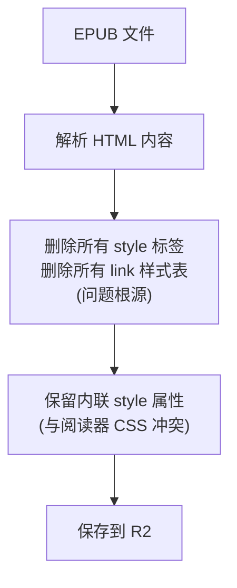
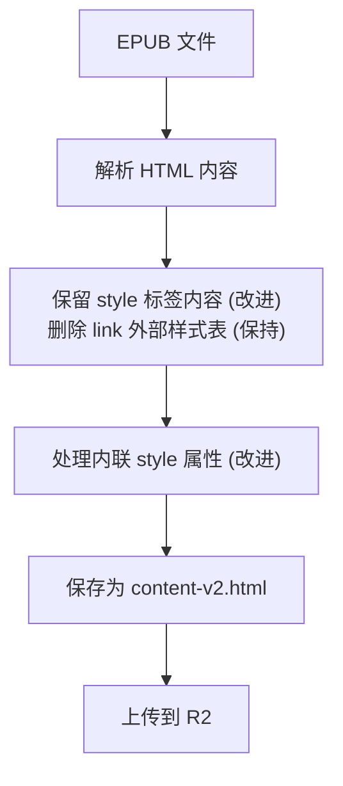
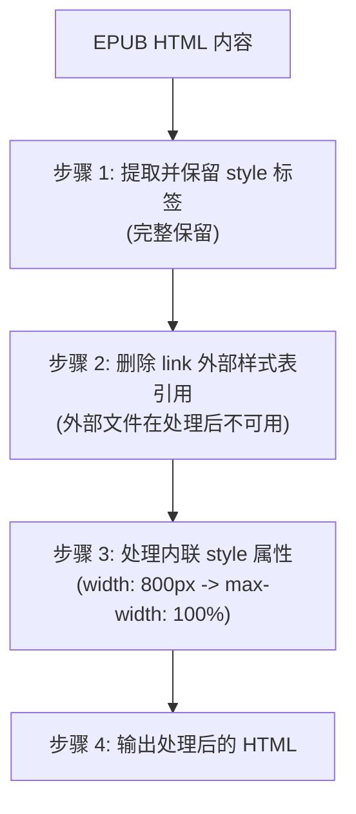

## 问题描述

iOS 阅读器显示 EPUB 内容时存在多个系统性问题：

| 问题 | 表现 |
|------|------|
| 图片裁切 | 图片没有适配手机屏幕，显示不全 |
| 内容溢出 | 内容过长，超出手机屏幕长度 |
| 封面留白 | 封面等内容没有全屏显示，留白太多 |
| 首字母图片 | 段落开头首字母用图片显示效果差，图文不挨着 |

---

### 现有 EPUB 处理逻辑

### 影响分析

| 被删除的内容 | 影响 |
|-------------|------|
| `<style>` 标签 | 出版商精心设计的布局丢失 |
| `<link>` 外部样式表 | 字体、间距、对齐等样式丢失 |
| 图片响应式样式 | 图片无法自适应屏幕 |
| Drop cap 样式 | 首字母下沉效果丢失 |
| 封面布局样式 | 封面无法正确居中/全屏 |

---

### 目标

模拟 Apple Books 的渲染方式：保留出版商样式 + 用户可控属性覆盖。

### 新 EPUB 处理逻辑

### 内联样式处理规则

| 原样式 | 处理后 | 原因 |
|--------|--------|------|
| `width: 800px` | `max-width: 100%` | 防止超出屏幕 |
| `height: 600px` | `height: auto` | 保持宽高比 |
| `min-width: 500px` | (删除) | 防止强制最小宽度 |
| `position: absolute` | 保留 | 布局需要 |
| `float: left/right` | 保留 | Drop cap 等需要 |

### 处理流程图

---

### 强制覆盖的属性

| 属性 | 说明 | CSS 示例 |
|------|------|----------|
| `font-family` | 用户选择的字体 | `* { font-family: "PingFang SC" !important; }` |
| `font-size` | 用户设置的字体大小 | `body { font-size: 18px !important; }` |
| `color` | 主题文字颜色 | `body { color: #333 !important; }` |
| `background-color` | 主题背景色 | `body { background-color: #fff !important; }` |
| `line-height` | 用户设置的行距 | `body { line-height: 1.8 !important; }` |

### 保留的 EPUB 样式

| 属性 | 用途 |
|------|------|
| `float` | Drop cap 首字母下沉 |
| `display` | 元素显示方式 |
| `margin` | 段落/元素间距 |
| `padding` | 内边距 |
| `text-align` | 文本对齐（居中封面等） |
| `position` | 特殊布局 |

---

### 后端改造

| 步骤 | 任务 | 文件 | 状态 |
|------|------|------|------|
| 1 | 修改 HTML 清理逻辑：保留 `<style>` | `book-enrichment.service.ts` | ⬜ |
| 2 | 新增内联样式处理函数 | `book-enrichment.service.ts` | ⬜ |
| 3 | 输出文件改为 `content-v2.html` | `book-enrichment.service.ts` | ⬜ |
| 4 | 更新数据库字段 | Prisma migration | ⬜ |

### iOS 改造

| 步骤 | 任务 | 文件 | 状态 |
|------|------|------|------|
| 1 | 调整阅读器 CSS 注入策略 | `EnhancedReaderView.swift` | ⬜ |
| 2 | 用户属性使用 `!important` | `ReaderStyleManager.swift` | ⬜ |
| 3 | 移除全局样式重置 | `ReaderStyleManager.swift` | ⬜ |

### 存量书籍处理

| 步骤 | 任务 | 说明 | 状态 |
|------|------|------|------|
| 1 | 创建重处理脚本 | 批量生成 v2 内容 | ⬜ |
| 2 | 执行存量处理 | 约 200 本书 | ⬜ |
| 3 | 验证处理结果 | 抽查显示效果 | ⬜ |

---

### 测试用例

| 场景 | 预期效果 |
|------|----------|
| 封面页 | 居中显示，无多余留白 |
| 图片页 | 自适应屏幕宽度，不被裁切 |
| Drop cap | 首字母下沉，与文字正确对齐 |
| 普通段落 | 用户字体/字号/行距生效 |
| 深色模式 | 背景/文字颜色正确切换 |

### 对比验证

| 对比项 | 验证方法 |
|--------|----------|
| vs Apple Books | 同一本书对比显示效果 |
| vs v1 版本 | 确保基本阅读功能正常 |
| 多设备 | iPhone / iPad 不同尺寸验证 |

---

## 相关文档

- [多版本兼容架构方案](./multi-version-compatibility.md)
- [iOS 阅读器技术文档](../04-development/ios/reader.md)
- [EPUB 处理流程](../04-development/backend/epub-processing.md)
