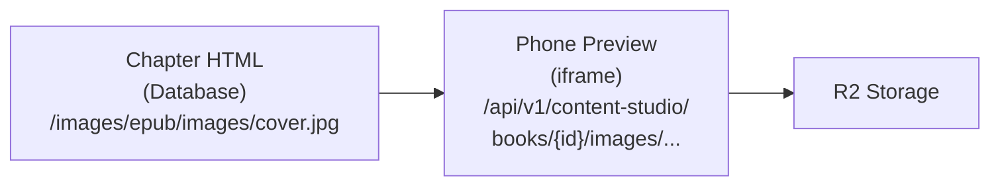
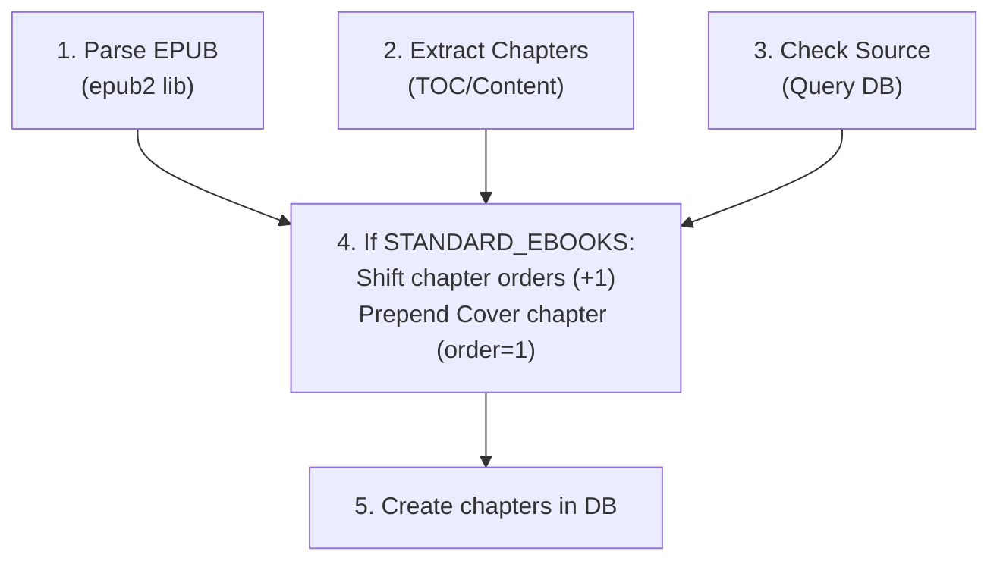
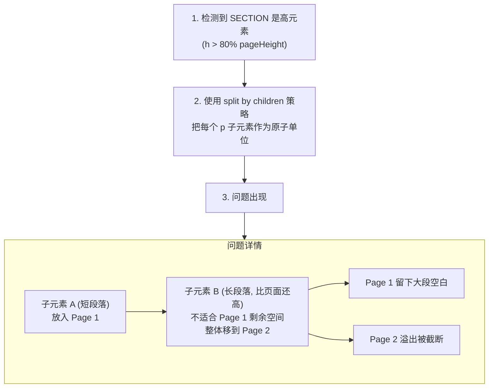
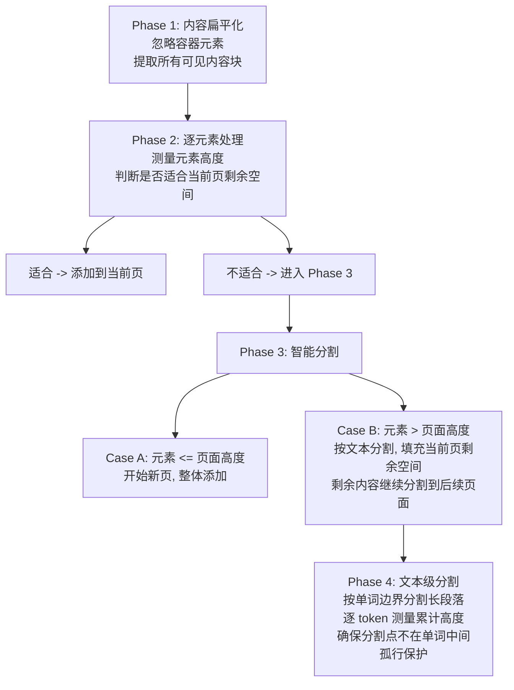

# 阅读器问题汇总（文档3）

## 问题1：Standard Ebooks 书籍缺少封面章节

### 问题描述

Standard Ebooks 来源的书籍导入后，阅读器从第一章开始显示，没有封面页面，用户体验不够沉浸式。

### 解决方案

为书籍添加独立的 Cover 章节，作为第一章，实现全屏沉浸式封面展示。

### 技术实现

#### 数据库结构

| 字段 | 值 |
|------|-----|
| order | 1 (其他章节依次后移) |
| title | Cover |
| html_content | 见下方 HTML 结构 |

#### Cover 章节 HTML 结构

```html
<section class="cover" epub:type="cover">
    
</section>
```

#### 图片 URL 转换流程



转换逻辑位于 `phone-preview.tsx`:

```typescript
html.replace(
  /src="([^"]+\.(jpg|jpeg|png|gif|svg|webp))"/gi,
  (match, path) => `src="${apiUrl}/api/v1/content-studio/books/${bookId}/images/${path.replace(/^\/images\//, '')}"`
);
```

#### 封面样式 (reader-template.ts)

```css
img.cover, img.x-ebookmaker-cover {
    width: 100%;
    height: 100%;
    object-fit: contain;
    margin: 0;
}

.page.cover-page {
    padding: 0;
}
```

### Pipeline 自动处理

导入 Standard Ebooks 书籍时，Pipeline 会自动添加 Cover 章节：



### 相关文件

| 文件 | 作用 |
|------|------|
| `apps/backend/src/modules/pipeline/services/epub-parser.service.ts` | EPUB 解析，自动添加 Cover 章节 |
| `apps/backend/src/modules/content-studio/content-studio.service.ts` | 后端 API，处理图片请求 |
| `tools/content-studio/src/components/preview/phone-preview.tsx` | 图片 URL 转换 |
| `tools/content-studio/src/lib/reader-template.ts` | 封面样式定义 |

### 修复记录

#### 问题：图片 API 返回 500 错误

**错误信息:**
```
Unknown field 'epubUrl' for select statement on model 'books'
```

**原因:** Prisma 字段已迁移为 snake_case 命名

**修复:** `content-studio.service.ts` line 1026

```diff
- select: { id: true, epubUrl: true },
+ select: { id: true, epub_url: true },
```

### 测试验证

测试结果截图显示封面全屏显示正常工作。

---

## 问题2：分页算法导致内容截断和大段空白

### 问题描述

Content Studio 手机预览的分页算法存在两个严重问题：

| 问题 | 症状 | 影响 |
|------|------|------|
| **内容截断** | 长段落末尾文字丢失 | 读者无法阅读完整内容 |
| **大段空白** | 页面底部60%空白未填充 | 浪费空间，阅读体验差 |

### 问题复现

以 *The Picture of Dorian Gray* Chapter I 为例：

**第1页问题（大段空白）：**
```
┌─────────────────────────────┐
│ I                           │  ← 章节标题
│                             │
│ The studio was filled with  │  ← 第一段（短）
│ the rich odour of roses...  │
│                             │
│                             │
│ [大段空白 ~60%]             │  ← 第二段被整体移走
│                             │
│                             │
│                        1/35 │
└─────────────────────────────┘
```

**第2页问题（内容截断）：**
```
┌─────────────────────────────┐
│ From the corner of the      │
│ divan of Persian saddlebags │
│ ...                         │
│ The dim roar of London      │  ← 句子在此被截断！
│                             │
│ [缺失: "was like the        │  ← 后半句完全丢失
│  bourdon note of a          │
│  distant organ."]           │
│                        2/35 │
└─────────────────────────────┘
```

**第3页（跳过丢失内容）：**
```
┌─────────────────────────────┐
│ In the centre of the room,  │  ← 直接跳到第三段
│ clamped to an upright       │
│ easel...                    │
└─────────────────────────────┘
```

### 根本原因分析

#### 控制台日志诊断

```
[Pagination Debug]
pageHeight: 685  pageWidth: 340
totalElements: 2                    ← 只有2个元素：H1 + SECTION

[0] H1 .chapter-title | h: 82
[1] SECTION | h: 20801              ← 整个内容在一个 SECTION 中

→ TALL ELEMENT detected h: 20801
→ SPLITTING ELEMENT by children     ← 按子元素分割，不按文本
→ Element split at child 1          ← 第二段作为整体处理
→ Element split at child 2          ← 溢出内容被截断
```

#### 算法缺陷



#### 代码位置

问题代码在 `tools/content-studio/src/lib/reader-template.ts` 的 `paginateContent()` 函数：

```javascript
// 问题代码：按子元素分割，不处理超长子元素
if (children.length > 1) {
    Array.from(children).forEach((child, childIdx) => {
        // ...
        if (splitPageHeight + childHeight > availableHeight) {
            pages.push(splitPageContent);  // 推送当前页
            splitPageContent = '';
            splitPageHeight = 0;
        }
        splitPageContent += child.outerHTML;  // ❌ 整个子元素添加，不分割
        splitPageHeight += childHeight;
    });
}
```

### 解决方案

#### 目标效果

```
┌─ Page 1 ─┐   ┌─ Page 2 ─┐   ┌─ Page 3 ─┐   ┌─ Page 4 ─┐
│ Title    │   │ Para 2   │   │ Para 2   │   │ Para 3   │
│ Para 1   │   │ (续)     │   │ (续完)   │   │ ...      │
│ Para 2   │   │          │   │ ...organ.│   │          │
│ (开头)   │   │          │   │          │   │          │
└──────────┘   └──────────┘   └──────────┘   └──────────┘
     ↑              ↑              ↑              ↑
   填满页面      继续段落       段落完整        下一段开始
```

#### 算法重构方案



#### 关键修改点

| 修改点 | 当前行为 | 修改后行为 |
|--------|---------|-----------|
| 子元素处理 | 整体添加，不分割 | 检测超长子元素，按需分割 |
| 页面填充 | 不适合就整体移走 | 尽量用部分内容填满当前页 |
| 文本分割 | 仅用于顶层超长元素 | 递归应用于任何超长元素 |
| 分割粒度 | 按 token 分割 | 按单词边界分割，保证完整性 |

#### 伪代码

```javascript
function paginateElement(element, availableHeight, pageWidth) {
    const elHeight = measureHeight(element);

    // Case A: 元素适合可用空间
    if (elHeight <= availableHeight) {
        return { fits: true, content: element.outerHTML, height: elHeight };
    }

    // Case B: 元素不适合，需要分割
    if (element.tagName === 'P' || element.tagName === 'DIV') {
        return splitByText(element, availableHeight, pageWidth);
    }

    // Case C: 其他元素类型，尝试按子元素分割
    if (element.children.length > 0) {
        return splitByChildren(element, availableHeight, pageWidth);
    }

    // Case D: 无法分割，强制添加（可能溢出）
    return { fits: false, content: element.outerHTML, height: elHeight };
}

function splitByText(element, availableHeight, pageWidth) {
    const tokens = tokenize(element.innerHTML);
    let currentPart = '';
    let parts = [];

    for (const token of tokens) {
        const testContent = currentPart + token;
        const testHeight = measureHeight(createTempElement(testContent));

        if (testHeight > availableHeight && currentPart.trim()) {
            // 在单词边界处分割
            const safePart = ensureWordBoundary(currentPart);
            parts.push(safePart);
            currentPart = getRemainder(currentPart, safePart) + token;
            availableHeight = pageHeight; // 后续页面用完整高度
        } else {
            currentPart = testContent;
        }
    }

    if (currentPart.trim()) {
        parts.push(currentPart);
    }

    return parts;
}
```

### 相关文件

| 文件 | 修改内容 |
|------|---------|
| `tools/content-studio/src/lib/reader-template.ts` | 重构 `paginateContent()` 函数 |
| `ios/Readmigo/Features/Reader/ReaderContentView.swift` | 同步 iOS 原生阅读器（如需要） |

### 测试用例

| 测试场景 | 预期结果 |
|---------|---------|
| 短段落 + 长段落 | 长段落应分割，填充短段落后的空白 |
| 超长单段落 | 正确分割到多页，无内容丢失 |
| 段落末尾句子 | 句子完整，不在单词中间截断 |
| 连续短段落 | 尽量合并到同一页 |
| 标题 + 内容 | 标题与首段内容保持同页 |

### 状态

- [x] 方案确认
- [x] 代码实现
- [x] 测试验证
- [ ] iOS 同步

### 修复验证

测试书籍: *The Picture of Dorian Gray* Chapter I

| 问题 | 修复前 | 修复后 |
|-----|-------|-------|
| 内容截断 | "The dim roar of London" 后内容丢失 | ✅ 完整显示 "was like the bourdon note of a distant organ." |
| 大段空白 | 第1页底部60%空白 | ✅ 页面填充良好 |
| 页码 | 35页 | 33页（空间利用更高效） |

---

*更新日期: 2026-01-25*
