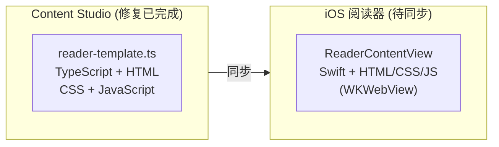
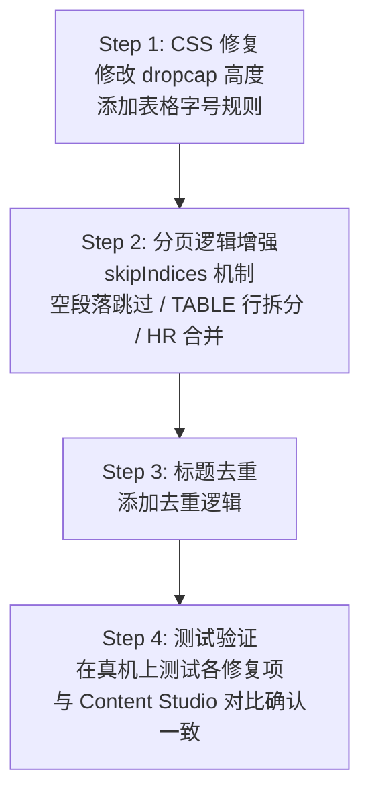

# EPUB 阅读器同步计划：Content Studio → iOS

## 概述

本文档描述将 Content Studio 中已实现的 EPUB 渲染修复同步到 iOS 原生阅读器的计划。

## 架构对比



| 属性 | Content Studio | iOS |
|------|----------------|-----|
| 文件 | `tools/content-studio/src/lib/reader-template.ts` | `ios/Readmigo/Features/Reader/ReaderContentView.swift` |
| 技术 | TypeScript + 内嵌 HTML/CSS/JS | Swift + 内嵌 HTML/CSS/JS |
| 渲染 | iframe 预览 | WKWebView |
| 状态 | 修复完成 ✅ | 待同步 🔴 |

## 同步项清单

| # | 修复项 | Content Studio | iOS | 优先级 |
|---|--------|----------------|-----|--------|
| 1 | Dropcap 尺寸 | `height: 2em` ✅ | `height: 3.5em` 🔴 | P0 |
| 2 | Dropcap 分页保护 | skipIndices 逻辑 ✅ | 无 🔴 | P0 |
| 3 | 空段落跳过 | 检测并跳过 ✅ | 无 🔴 | P1 |
| 4 | TABLE 行拆分 | 按行分组 ✅ | 仅展开子元素 🔴 | P1 |
| 5 | HR 合并 | 合并到上页 ✅ | 无 🔴 | P1 |
| 6 | 表格字号 | `font-size: 0.5em` ✅ | 无全局规则 🔴 | P2 |
| 7 | 标题去重 | 检测重复标题 ✅ | 仅隐藏特定类型 🔴 | P2 |

## 详细对比

### 1. Dropcap 尺寸 (CSS)

**问题**：iOS 的 dropcap 图片过大，影响排版美观。

```
┌─────────────────┐     ┌─────────────────┐
│ Content Studio  │     │      iOS        │
│                 │     │                 │
│  ┌──┐           │     │  ┌────┐         │
│  │D │ ropcap    │     │  │ D  │ ropcap  │
│  └──┘ 2em高度   │     │  │    │ 3.5em   │
│      (正确 ✅)   │     │  └────┘ (过大)   │
└─────────────────┘     └─────────────────┘
```

**Content Studio** (line ~CSS):
```css
img.dropcap {
  height: 2em;
}
```

**iOS** (ReaderContentView.swift:484):
```css
img.dropcap {
  height: 3.5em;  /* 需改为 2em */
}
```

---

### 2. Dropcap 分页保护 (skipIndices)

**问题**：Dropcap 图片可能被分到页面底部，而紧随的段落在下一页，造成孤立。

```
┌─────────────────┐     ┌─────────────────┐
│     问题场景     │     │     修复后      │
│                 │     │                 │
│  Page 1:        │     │  Page 1:        │
│  ...content...  │     │  ...content...  │
│  ┌──┐           │     │                 │
│  │D │ (孤立!)   │     │                 │
│  └──┘           │     │                 │
├─────────────────┤     ├─────────────────┤
│  Page 2:        │     │  Page 2:        │
│  ropcap text    │     │  ┌──┐           │
│  continues...   │     │  │D │ropcap     │
│                 │     │  └──┘ text...   │
└─────────────────┘     └─────────────────┘
```

**Content Studio** (reader-template.ts:635-684):
```javascript
// 检测 dropcap，记录 skipIndices 避免孤立
let dropcapIndex: number | null = null;
const skipIndices = new Set<number>();

elements.forEach((el, idx) => {
  if (el.tagName === 'IMG' && el.classList.contains('dropcap')) {
    dropcapIndex = idx;
  }
  // 如果当前是 dropcap 后的第一个元素，标记为不可分割
  if (dropcapIndex !== null && idx === dropcapIndex + 1) {
    skipIndices.add(idx);
  }
});

// 分页时，dropcap 和紧随段落一起考虑
if (skipIndices.has(idx)) {
  // 将 dropcap 和段落一起放到新页
}
```

**iOS**: 无此逻辑

---

### 3. 空段落跳过

**问题**：EPUB 中可能存在只包含空白或 `&nbsp;` 的段落，浪费页面空间。

**Content Studio** (reader-template.ts:686-693):
```javascript
// Skip empty paragraphs (whitespace or &nbsp; only)
const textContent = el.textContent?.trim() || '';
if (el.tagName === 'P' && (!textContent || textContent === '\u00A0')) {
  return; // Skip empty paragraph
}
```

**iOS**: 无此逻辑

---

### 4. TABLE 行拆分

**问题**：大型表格（如目录）超出单页高度时，需要按行拆分而非整体跳过。

```
┌─────────────────────────────────────┐
│            修复前 (iOS)              │
├─────────────────────────────────────┤
│  Page 1: [整个大表格被跳过或挤压]     │
│                                     │
│  ┌─────────────────────────────┐    │
│  │ Chapter 1 ............ 1   │    │
│  │ Chapter 2 ............ 15  │    │
│  │ Chapter 3 ............ 28  │    │
│  │ Chapter 4 ............ 42  │    │
│  │ Chapter 5 ............ 56  │    │
│  │ ... (超出页面)              │    │
│  └─────────────────────────────┘    │
└─────────────────────────────────────┘

┌─────────────────────────────────────┐
│         修复后 (Content Studio)      │
├─────────────────────────────────────┤
│  Page 1:                            │
│  ┌─────────────────────────────┐    │
│  │ Chapter 1 ............ 1   │    │
│  │ Chapter 2 ............ 15  │    │
│  │ Chapter 3 ............ 28  │    │
│  └─────────────────────────────┘    │
├─────────────────────────────────────┤
│  Page 2:                            │
│  ┌─────────────────────────────┐    │
│  │ Chapter 4 ............ 42  │    │
│  │ Chapter 5 ............ 56  │    │
│  │ Chapter 6 ............ 70  │    │
│  └─────────────────────────────┘    │
└─────────────────────────────────────┘
```

**Content Studio** (reader-template.ts:727-818):
```javascript
// Split TABLE by rows when oversized
if (el.tagName === 'TABLE' && elHeight > pageHeight) {
  const rows = Array.from(el.querySelectorAll('tr'));
  let currentGroup: Element[] = [];
  let groupHeight = 0;

  rows.forEach(row => {
    const rowHeight = row.offsetHeight;
    if (groupHeight + rowHeight > pageHeight && currentGroup.length > 0) {
      // 创建新表格包含当前组的行
      splitTables.push(createTableWithRows(currentGroup));
      currentGroup = [];
      groupHeight = 0;
    }
    currentGroup.push(row);
    groupHeight += rowHeight;
  });
  // 处理剩余行...
}
```

**iOS** `flattenLargeElements()`: 只展开子元素，不拆分 TABLE 行

---

### 5. HR 合并

**问题**：章节末尾的 `<hr>` 元素可能导致出现几乎空白的页面。

```
┌─────────────────┐     ┌─────────────────┐
│     问题场景     │     │     修复后      │
│                 │     │                 │
│  Page N:        │     │  Page N:        │
│  ...content...  │     │  ...content...  │
│  End of chapter │     │  End of chapter │
├─────────────────┤     │  ───────────    │
│  Page N+1:      │     │  (HR 合并到上页) │
│  ───────────    │     │                 │
│  (几乎空白页!)   │     │                 │
└─────────────────┘     └─────────────────┘
```

**Content Studio** (reader-template.ts:848-858):
```javascript
// Merge trailing HR with previous page to avoid near-empty pages
if (pages.length > 0 && currentPageContent) {
  const isOnlyHr = currentPageContent.replace(/<hr[^>]*>/gi, '').trim() === '';
  if (isOnlyHr) {
    pages[pages.length - 1] += currentPageContent;
    currentPageContent = '';
    currentHeight = 0;
  }
}
```

**iOS**: 无此逻辑

---

### 6. 表格字号

**问题**：目录/插图列表等表格字号过大，影响阅读体验。

**Content Studio**:
```css
table {
  font-size: 0.5em;
}
```

**iOS**: 无全局表格字号规则

---

### 7. 标题去重

**问题**：EPUB 内容中可能已包含章节标题，而阅读器又添加了 `<h1>` 标题，造成重复。

```
┌─────────────────────────────────────┐
│              问题场景                │
├─────────────────────────────────────┤
│                                     │
│  Chapter 1: The Beginning  ← 阅读器添加 │
│                                     │
│  CHAPTER 1                 ← EPUB内容 │
│  The Beginning                      │
│                                     │
│  It was a dark and stormy night...  │
│                                     │
└─────────────────────────────────────┘
```

**Content Studio** (reader-template.ts:72-86):
```javascript
// 检测并移除重复标题
function removeDuplicateTitle(content: string, title: string): string {
  const normalizedTitle = title.toLowerCase().replace(/chapter\s*\d+:?\s*/i, '').trim();
  // 检查内容开头是否有相似标题
  const firstH1Match = content.match(/<h1[^>]*>(.*?)<\/h1>/i);
  if (firstH1Match) {
    const contentTitle = firstH1Match[1].toLowerCase().replace(/chapter\s*\d+:?\s*/i, '').trim();
    if (contentTitle === normalizedTitle || levenshteinSimilarity(contentTitle, normalizedTitle) > 0.8) {
      return content.replace(firstH1Match[0], '');
    }
  }
  return content;
}
```

**iOS**: 仅在 `generateScrollContent()` 和 `generatePagedContent()` 中检查 "title page"、"cover" 等关键词

## 修改方案

### 目标文件

`ios/Readmigo/Features/Reader/ReaderContentView.swift`

### 修改内容

| 类型 | 行数估算 | 修改内容 |
|------|---------|---------|
| CSS | ~10 行 | dropcap 高度、表格字号 |
| JavaScript | ~100 行 | 分页逻辑增强 |
| Swift | ~20 行 | 标题去重处理 |
| **总计** | **~130 行** | |

### 具体修改点

1. **CSS 修改** (Line 484)
   - `height: 3.5em` → `height: 2em`
   - 添加 `table { font-size: 0.5em }`

2. **JavaScript `paginateContent()` 函数增强** (Line 1478+)
   - 添加 `skipIndices` 机制
   - 添加空段落检测
   - 添加 TABLE 行拆分
   - 添加 HR 合并逻辑

3. **Swift 标题处理** (Line 1438+)
   - 在 `generatePagedContent()` 中添加标题去重

## 执行计划



## 相关文档

- [EPUB 阅读器问题清单](./epub-reader-mobile-issues.md)
- [EPUB 阅读器问题清单 2](./epub-reader-mobile-issues2.md)
- [EPUB 显示修复](./epub-reader-display-fix.md)
- [阅读器渲染引擎](../07-modules/reader/rendering-engine.md)
