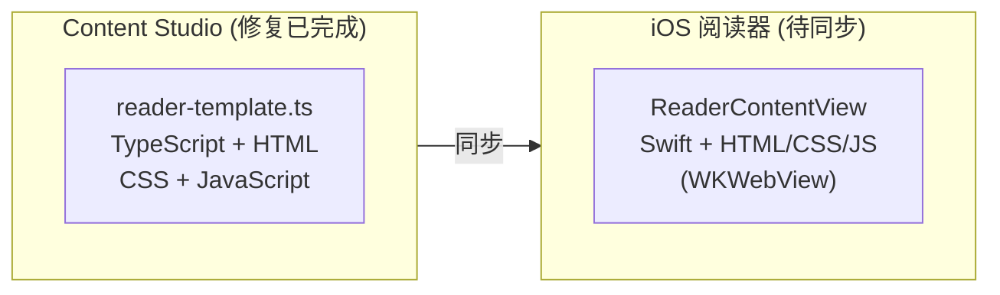
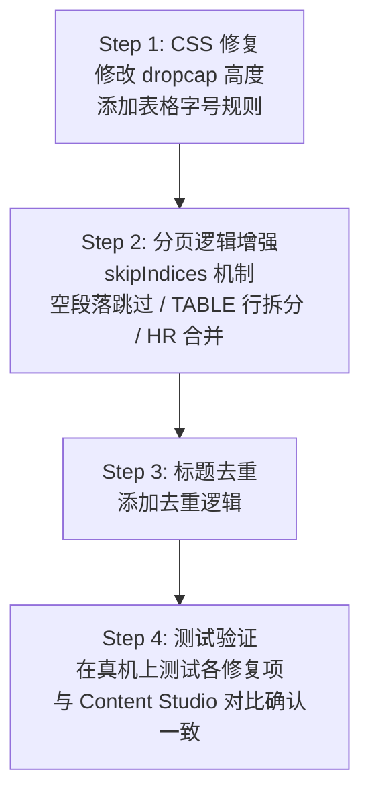

## 概述

本文档描述将 Content Studio 中已实现的 EPUB 渲染修复同步到 iOS 原生阅读器的计划。

## 架构对比

| 属性 | Content Studio | iOS |
|------|----------------|-----|
| 文件 | `tools/content-studio/src/lib/reader-template.ts` | `ios/Readmigo/Features/Reader/ReaderContentView.swift` |
| 技术 | TypeScript + 内嵌 HTML/CSS/JS | Swift + 内嵌 HTML/CSS/JS |
| 渲染 | iframe 预览 | WKWebView |
| 状态 | 修复完成 ✅ | 待同步 🔴 |

## 同步项清单

| # | 修复项 | Content Studio | iOS | 优先级 |
|---|--------|----------------|-----|--------|
| 1 | Dropcap 尺寸 | `height: 2em` ✅ | `height: 3.5em` 🔴 | P0 |
| 2 | Dropcap 分页保护 | skipIndices 逻辑 ✅ | 无 🔴 | P0 |
| 3 | 空段落跳过 | 检测并跳过 ✅ | 无 🔴 | P1 |
| 4 | TABLE 行拆分 | 按行分组 ✅ | 仅展开子元素 🔴 | P1 |
| 5 | HR 合并 | 合并到上页 ✅ | 无 🔴 | P1 |
| 6 | 表格字号 | `font-size: 0.5em` ✅ | 无全局规则 🔴 | P2 |
| 7 | 标题去重 | 检测重复标题 ✅ | 仅隐藏特定类型 🔴 | P2 |

### 1. Dropcap 尺寸 (CSS)

**问题**：iOS 的 dropcap 图片过大，影响排版美观。

**Content Studio** (line ~CSS):

**iOS** (ReaderContentView.swift:484):

---

### 2. Dropcap 分页保护 (skipIndices)

**问题**：Dropcap 图片可能被分到页面底部，而紧随的段落在下一页，造成孤立。

**Content Studio** (reader-template.ts:635-684):

**iOS**: 无此逻辑

---

### 3. 空段落跳过

**问题**：EPUB 中可能存在只包含空白或 `&nbsp;` 的段落，浪费页面空间。

**Content Studio** (reader-template.ts:686-693):

**iOS**: 无此逻辑

---

### 4. TABLE 行拆分

**问题**：大型表格（如目录）超出单页高度时，需要按行拆分而非整体跳过。

**Content Studio** (reader-template.ts:727-818):

**iOS** `flattenLargeElements()`: 只展开子元素，不拆分 TABLE 行

---

### 5. HR 合并

**问题**：章节末尾的 `
` 元素可能导致出现几乎空白的页面。

**Content Studio** (reader-template.ts:848-858):

**iOS**: 无此逻辑

---

### 6. 表格字号

**问题**：目录/插图列表等表格字号过大，影响阅读体验。

**Content Studio**:

**iOS**: 无全局表格字号规则

---

### 7. 标题去重

**问题**：EPUB 内容中可能已包含章节标题，而阅读器又添加了 `<h1>` 标题，造成重复。

**Content Studio** (reader-template.ts:72-86):

**iOS**: 仅在 `generateScrollContent()` 和 `generatePagedContent()` 中检查 "title page"、"cover" 等关键词

### 目标文件

`ios/Readmigo/Features/Reader/ReaderContentView.swift`

### 修改内容

| 类型 | 行数估算 | 修改内容 |
|------|---------|---------|
| CSS | ~10 行 | dropcap 高度、表格字号 |
| JavaScript | ~100 行 | 分页逻辑增强 |
| Swift | ~20 行 | 标题去重处理 |
| **总计** | **~130 行** | |

### 具体修改点

1. **CSS 修改** (Line 484)
   - `height: 3.5em` → `height: 2em`
   - 添加 `table { font-size: 0.5em }`

2. **JavaScript `paginateContent()` 函数增强** (Line 1478+)
   - 添加 `skipIndices` 机制
   - 添加空段落检测
   - 添加 TABLE 行拆分
   - 添加 HR 合并逻辑

3. **Swift 标题处理** (Line 1438+)
   - 在 `generatePagedContent()` 中添加标题去重

## 执行计划

## 相关文档

- [EPUB 阅读器问题清单](./epub-reader-mobile-issues.md)
- [EPUB 阅读器问题清单 2](./epub-reader-mobile-issues2.md)
- [EPUB 显示修复](./epub-reader-display-fix.md)
- [阅读器渲染引擎](../07-modules/reader/rendering-engine.md)
