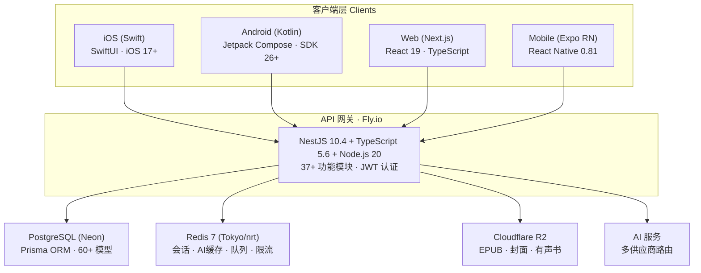
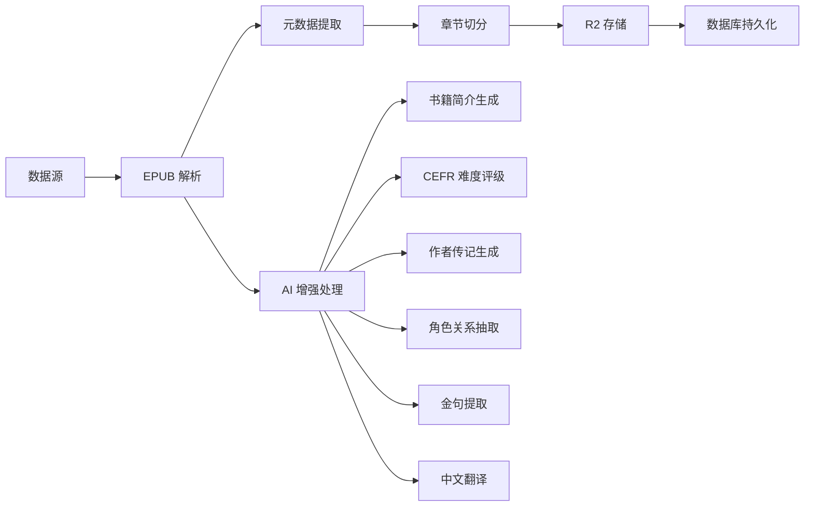

# Readmigo 技术架构文档

> AI原生英文阅读学习产品 | 技术实现方案

---

## 项目概览

| 维度 | 详情 |
|------|------|
| 产品定位 | AI驱动的英文阅读学习平台 |
| 客户端 | iOS (SwiftUI) · Android (Kotlin) · Web (Next.js) · React Native (Expo) |
| 后端 | NestJS 10.x + PostgreSQL + Redis |
| 内容库 | 539+ 书籍 (338 EN + 201 CN) · 345+ 作者 |
| AI 服务 | DeepSeek · OpenAI · Anthropic Claude · Alibaba Qwen |

---

## 技术栈总览

---

### 核心架构
| 文档 | 说明 |
|------|------|
| [系统架构图](./system-architecture.md) | 整体架构、数据流 |
| [客户端架构](./client-architecture.md) | iOS、Android、Web 客户端设计 |
| [扩展性设计](./scalability.md) | 水平扩展、垂直扩展策略 |
| [安全设计](./security.md) | 认证、授权、数据安全 |
| [埋点与数据追踪系统](./analytics-tracking-system.md) | 客户端埋点、BE 埋点、日志、数据分析、结果呈现 |

---

## 后端服务

> 详细后端文档: [backend/README.md](../backend/)

### 模块架构 (37+ 模块)

| 模块类别 | 模块 | 说明 |
|---------|------|------|
| **核心服务** | auth | 认证 (Apple/Google OAuth + JWT) |
| | users | 用户管理、账户体系 |
| | devices | 设备追踪、跨设备同步 |
| | subscriptions | 订阅管理 (IAP 验证) |
| **阅读与内容** | books | 书籍目录 (539+ 本) |
| | chapters | 章节内容 |
| | reading | 阅读会话、进度追踪 |
| | bookmarks | 书签 |
| | import | 内容入库 |
| **学习系统** | vocabulary | 词汇 (SM-2 间隔重复) |
| | characters | 角色关系图谱 (Wikidata 融合) |
| | annual-report | 年度阅读报告 |
| | medal-system | 成就徽章系统 |
| **AI 服务** | ai | 多供应商 LLM 路由 |
| | author-chat | 作者人设聊天 |
| **有声书** | audiobooks | 有声书 (LibriVox/Archive) |
| **社区功能** | agora | 社区动态、评论、点赞 |
| | messages | FAQ、用户消息 |
| | recommendations | 内容推荐 |
| | postcards | 数字明信片 |
| **运营管理** | admin | 管理后台 |
| | analytics | 用户分析 |
| | logs | 日志系统 |
| | jobs | 后台任务 (BullMQ) |
| | search | 全文搜索 |

### 文档
| 文档 | 说明 |
|------|------|
| [后端架构](../api/backend-architecture.md) | NestJS 服务架构 |
| [API设计](../api/api-design.md) | RESTful API 规范 |
| [数据库设计](../api/database-design.md) | PostgreSQL 数据模型 (60+ 表) |
| [TTS 代理层设计](./api/tts-proxy-design.md) | Provider 无感知切换 · R2 持久化 · 用量追踪 |

---

## TTS 语音朗读系统

> 三层文档体系：系统设计 → iOS 实现 → BE 代理层

| 文档 | 职责 |
|------|------|
| [TTS 系统设计](./ios-tts-system-design.md) | 竞品分析 · 功能矩阵 · 五层架构 · 三音频源 · 学习模式 |
| [iOS TTS 实现方案](./ios-tts-implementation.md) | 技术选型 · 三引擎实现 · AudioPlayable 协议 · 状态管理 |
| [BE TTS 代理层设计](./api/tts-proxy-design.md) | Provider 抽象 · 统一声音体系 · R2 持久化 · 订阅权限 |

---

### 多供应商路由策略

| 任务类型 | 主供应商 | 备用供应商 | 成本 |
|----------|----------|------------|------|
| 单词解释 | DeepSeek | OpenAI | 低 |
| 句子简化 | DeepSeek | OpenAI | 低 |
| 段落翻译 | DeepSeek | OpenAI | 中 |
| 内容问答 | OpenAI | Anthropic Claude | 中 |
| 文学分析 | Claude 3.5 Sonnet | GPT-4 | 高 |
| 批量处理 | DeepSeek | - | 低 |
| 中文翻译 | Qwen (阿里) | DeepSeek | 低 |

### 文档
| 文档 | 说明 |
|------|------|
| [AI服务架构](../ai/ai-services-architecture.md) | 多供应商集成与路由 |

---

### 平台矩阵

| 平台 | 技术栈 | 最低版本 | 状态 |
|------|--------|----------|------|
| iOS | SwiftUI + Swift 5.9 | iOS 17.0 | 主力 |
| Android | Jetpack Compose + Kotlin | SDK 26 | 主力 |
| Web | Next.js 16 + React 19 | 现代浏览器 | PWA |
| React Native | Expo 54 + RN 0.81 | iOS 15 / SDK 26 | 辅助 |

### iOS 功能模块 (32+)

| 模块 | 说明 |
|------|------|
| Library | 书架管理 |
| Reader | EPUB/PDF/TXT 阅读器 (WKWebView) |
| Learning | 词汇学习、间隔重复 |
| Audiobooks | 有声书播放、下载 |
| Agora | 社区动态 |
| Authors | 作者资料、AI 聊天 |
| Characters | 角色图谱 |
| Medals | 成就系统 |
| AnnualReport | 年度报告 |
| Postcards | 明信片 |
| Messages | 消息中心 |
| Devices | 设备同步 |
| Help | 帮助中心 |
| CarPlay | 车载支持 (开发中) |

### 文档
| 文档 | 说明 |
|------|------|
| [客户端架构](./client-architecture.md) | 跨平台架构设计 |
| [iOS阅读器引擎](../ios/reader-engine.md) | 核心阅读引擎实现 |

---

### 数据源

| 来源 | 类型 | 数量 |
|------|------|------|
| Standard Ebooks | 高质量公版书 | 主力来源 |
| Project Gutenberg | 公版书库 | 可扩展至 30K+ |
| LibriVox | 免费有声书 | 有声书来源 |
| Internet Archive | 有声书/元数据 | 补充来源 |

### 内容管道

### 文档
| 文档 | 说明 |
|------|------|
| [公版书入库系统](../content/public-domain-books.md) | 自动化入库流程 |
| [内容处理](../content/content-processing.md) | 解析、切分、质量控制 |

---

### 部署架构

| 服务 | 平台 | 域名 |
|------|------|------|
| API (生产) | Fly.io | readmigo-api.fly.dev |
| API (调试) | Fly.io | readmigo-debug.fly.dev |
| Web 应用 | Vercel | web.readmigo.app |
| 管理后台 | Vercel | dashboard.readmigo.app |
| 官网 | Vercel | readmigo.app |

### 依赖服务

| 服务 | 供应商 | 区域 |
|------|--------|------|
| 数据库 | Neon (PostgreSQL) | Tokyo |
| 缓存 | Redis 7 | Tokyo (nrt) |
| 对象存储 | Cloudflare R2 | Global |
| CDN/DNS | Cloudflare | Global |
| 错误监控 | Sentry | - |

### CI/CD 流水线

| Workflow | 说明 |
|----------|------|
| ci.yml | 自动化测试 + 代码检查 |
| deploy.yml | 推送自动部署 |
| deploy-staging.yml | 预发布部署 |
| deploy-production.yml | 生产部署 (手动确认) |
| db-sync.yml | 数据库同步 |

### 文档
| 文档 | 说明 |
|------|------|
| [基础设施](../infrastructure/infrastructure.md) | 服务器、CDN、域名 |
| [性能优化](../infrastructure/performance-optimization.md) | CDN、缓存策略 |
| [日志系统](../infrastructure/logging-and-crash-collection.md) | 全栈日志收集 |
| [监控系统](../infrastructure/monitoring.md) | 监控与告警 |
| [网络服务清单](../infrastructure/network-services.md) | 第三方服务汇总 |

---

## 产品设计

| 文档 | 说明 |
|------|------|
| [设计系统](../design/design-system.md) | UI 组件、设计规范 |
| [交互设计规范](../design/interaction-design.md) | 交互模式、手势 |
| [开发路线图](../product/roadmap.md) | MVP、V1.0、V2.0 规划 |

---

## 运营平台

| 文档 | 说明 |
|------|------|
| [Dashboard 平台](../dashboard/dashboard-platform.md) | React Admin 5.3 管理后台 |

---

## 功能模块文档

| 模块 | 文档 |
|------|------|
| 有声书 | [audiobook.md](../modules/audiobook.md) |
| 学习系统 | [learning.md](../modules/learning.md) |
| 设置 | [settings.md](../modules/settings.md) |
| 订阅 | [subscriptions.md](../modules/subscriptions.md) |
| 账户系统 | [system-design.md](../account/system-design.md) |

---

### 前端开发
- [客户端架构](./client-architecture.md)
- [iOS阅读器引擎](../ios/reader-engine.md)
- [API设计](../api/api-design.md)
- [设计系统](../design/design-system.md)

### 后端开发
- [后端架构](../api/backend-architecture.md)
- [数据库设计](../api/database-design.md)
- [AI服务架构](../ai/ai-services-architecture.md)
- [安全设计](./security.md)

### 运维/DevOps
- [基础设施](../infrastructure/infrastructure.md)
- [性能优化](../infrastructure/performance-optimization.md)
- [日志系统](../infrastructure/logging-and-crash-collection.md)
- [监控系统](../infrastructure/monitoring.md)

### 产品/设计
- [系统架构图](./system-architecture.md)
- [设计系统](../design/design-system.md)
- [交互设计规范](../design/interaction-design.md)
- [开发路线图](../product/roadmap.md)

### 内容运营
- [公版书入库系统](../content/public-domain-books.md)
- [内容处理](../content/content-processing.md)
- [Dashboard平台](../dashboard/dashboard-platform.md)

---

## 更新历史

| 日期 | 更新内容 |
|------|----------|
| 2025-12-28 | 全面更新：反映实际代码库实现、37+ 后端模块、多平台客户端、AI 多供应商路由 |
| 2025-12-25 | 文档拆分：原 monolithic 文档按主题拆分为 22 个独立文档 |
