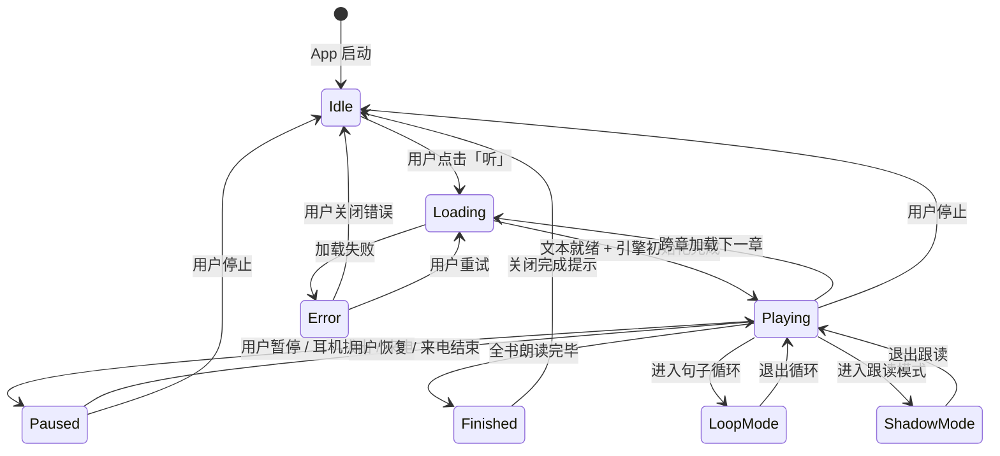

# iOS TTS 实现文档

> 基于 [iOS TTS 系统设计方案](./ios-tts-system-design.md) 的工程实现指南
>
> 技术选型原则：**用户体验优先 · 音质优先**

---

## 一、技术选型总览

### 1.1 选型决策矩阵

| 技术领域 | 选型结论 | 备选方案 | 选型理由 |
|---------|---------|---------|---------|
| **系统 TTS** | AVSpeechSynthesizer | — | iOS 唯一本地 TTS，零成本零延迟 |
| **云端 TTS（主选）** | Azure Speech Service | Google Cloud TTS | 低延迟 (~300ms) + 单词级时间戳 + 性价比最优 |
| **云端 TTS（Premium）** | ElevenLabs | OpenAI TTS | 业界最自然人声，适合精品阅读体验 |
| **精品音频播放** | AVPlayer | AVAudioEngine | AVPlayer 原生流式支持 + 锁屏集成成熟 |
| **文本分句** | NLTokenizer | 正则表达式 | Apple NLP 框架，英文分句准确率 >98% |
| **高亮同步** | WKWebView JS Bridge | Native AttributedString | 与现有阅读器 WebView 架构统一 |
| **状态管理** | Combine (@Published) | AsyncStream | SwiftUI 原生集成，UI 绑定零样板 |
| **音频会话** | AVAudioSession (.playback) | — | 支持后台播放 + spokenAudio 模式 |
| **音频缓存** | URLCache + FileManager | Kingfisher Audio | 系统级缓存足够，无需额外依赖 |
| **进度持久化** | UserDefaults + SwiftData | CoreData | 轻量偏好用 UserDefaults，结构化数据用 SwiftData |

### 1.2 用户体验优先决策

| 决策点 | 选择 | 理由 |
|--------|------|------|
| 首次播放延迟目标 | <500ms | 系统 TTS 本地合成，用户感受即时响应 |
| 默认音频源 | 精品音频 > 云端 TTS > 系统 TTS | 音质从高到低自动降级，用户无感 |
| 默认高亮模式 | 句子级 | 阅读学习最佳平衡点：不过度打扰，又能跟踪位置 |
| 跨章切换 | 预加载 + 无缝衔接 | 提前加载下一章，切换间隔 <300ms |
| 网络失败 | 静默降级到系统 TTS | 不打断用户听读流，toast 轻提示 |
| 耳机拔出 | 自动暂停 | iOS 标准行为，保护隐私 |

### 1.3 音质优先决策

| 决策点 | 选择 | 理由 |
|--------|------|------|
| 系统声音默认 | Samantha Enhanced (en-US) | iOS 英文女声中音质最佳 |
| 云端 TTS 主选 | Azure Neural HD | $16/M chars，但音质显著优于标准版 |
| 云端 TTS 流式格式 | audio-24khz-48kbitrate-mono-opus | 高采样率 + 低带宽，移动端最佳平衡 |
| 精品音频规格 | MP3 128kbps / -16 LUFS | 有声书行业标准，兼顾质量与文件体积 |
| 倍速上限 | 3.0x | >3x 语音失真严重，学习场景无意义 |
| 英式/美式切换 | 根据作者国籍自动推荐 | 口音匹配文学背景，提升沉浸感 |

### 1.4 iOS 框架依赖图

```
┌─────────────────────────────────────────────────────────────────────┐
│                        Readmigo TTS 模块                            │
├─────────────────────────────────────────────────────────────────────┤
│                                                                     │
│  Apple Frameworks                                                   │
│  ┌──────────────────┐  ┌──────────────────┐  ┌──────────────────┐  │
│  │ AVFoundation     │  │ MediaPlayer      │  │ NaturalLanguage  │  │
│  │ · AVSpeech*      │  │ · MPRemote*      │  │ · NLTokenizer    │  │
│  │ · AVAudioSession │  │ · MPNowPlaying*  │  │ · NLLanguage*    │  │
│  │ · AVPlayer       │  │                  │  │                  │  │
│  └──────────────────┘  └──────────────────┘  └──────────────────┘  │
│  ┌──────────────────┐  ┌──────────────────┐  ┌──────────────────┐  │
│  │ WebKit           │  │ Combine          │  │ SwiftUI          │  │
│  │ · WKWebView      │  │ · @Published     │  │ · ObservableObj  │  │
│  │ · WKScriptMsg    │  │ · Subscribers    │  │ · EnvironmentObj │  │
│  └──────────────────┘  └──────────────────┘  └──────────────────┘  │
│                                                                     │
│  Third-party (仅云端 TTS)                                           │
│  ┌──────────────────┐  ┌──────────────────┐                        │
│  │ Azure Speech SDK │  │ ElevenLabs REST  │                        │
│  │ (MicrosoftCog*)  │  │ (URLSession)     │                        │
│  └──────────────────┘  └──────────────────┘                        │
│                                                                     │
└─────────────────────────────────────────────────────────────────────┘
```

---

## 二、系统 TTS 引擎实现

### 2.1 AVSpeechSynthesizer 核心配置

| 参数 | 值 | 说明 |
|------|------|------|
| category | `.playback` | 支持后台播放 |
| mode | `.spokenAudio` | 为语音内容优化（来电自动 duck） |
| options | `[.duckOthers, .allowBluetooth]` | 蓝牙耳机 + 与其他音频共存 |
| postUtteranceDelay | 0.15s | 句间自然停顿 |
| pitchMultiplier | 1.0 | 保持自然音调，不暴露给用户 |

### 2.2 倍速映射表

| 用户倍速 | AVSpeechUtterance.rate | 约 WPM | 适用人群 |
|:--------:|:----------------------:|:------:|---------|
| 0.5x | 0.25 | 75 | 初学者精听 |
| 0.75x | 0.38 | 110 | 初级学习者 |
| 1.0x | 0.50 | 150 | 中级（默认） |
| 1.25x | 0.56 | 190 | 中高级 |
| 1.5x | 0.62 | 225 | 高级学习者 |
| 2.0x | 0.72 | 300 | 熟练用户 |
| 2.5x | 0.82 | 375 | 信息消费 |
| 3.0x | 0.90 | 450 | 最大倍速 |

> 实现要点：用户 UI 展示 0.5x-3x 滑块，内部通过映射函数转换为 0.0-1.0 range。

### 2.3 英文声音选择策略

**声音优先级体系**：

```
用户选择声音
     │
     ├── 已手动选择 → 使用用户偏好（最高优先）
     │
     └── 未选择 → 自动推荐
                    │
                    ├── 检测书籍作者国籍
                    │   ├── 英国作者 (Austen, Dickens...) → en-GB Daniel/Kate
                    │   ├── 美国作者 (Twain, Fitzgerald...) → en-US Samantha/Alex
                    │   └── 其他/未知 → en-US Samantha Enhanced（默认）
                    │
                    └── 在推荐组内按质量排序
                        ├── Premium（最优先，需下载 ~100MB）
                        ├── Enhanced（次优先，需下载 ~50MB）
                        └── Default（兜底，内置）
```

**推荐声音表**：

| 分类 | 声音名 | 标识 | 质量 | 推荐场景 |
|------|--------|------|:----:|---------|
| 美式女声 | Samantha Enhanced | en-US | Enhanced | **默认声音** |
| 美式男声 | Alex | en-US | Enhanced | 男性声音偏好 |
| 美式女声 | Ava Premium | en-US | Premium | 付费用户 |
| 美式男声 | Evan Premium | en-US | Premium | 付费用户 |
| 英式女声 | Kate | en-GB | Enhanced | 英国文学 |
| 英式男声 | Daniel | en-GB | Enhanced | 英国文学 |
| 澳式女声 | Karen | en-AU | Enhanced | 口音多样性 |

### 2.4 Delegate 回调链

```
AVSpeechSynthesizerDelegate 回调流
│
├── willSpeakRangeOfSpeechString(characterRange:, utterance:)
│   频率：每个单词触发一次
│   ──→ HighlightEngine.highlightWord(range)
│   ──→ 驱动单词级高亮（仅单词模式开启时）
│
├── didStart(utterance:)
│   频率：每句触发一次
│   ──→ 更新 currentSentenceIndex
│   ──→ 触发句子级高亮
│   ──→ 更新翻译浮层（如开启）
│
├── didFinish(utterance:)
│   频率：每句结束触发
│   ──→ 推进逻辑：
│       ├── 当前段落还有句子 → 送入下一句 utterance
│       ├── 当前段落结束 → onParagraphEnd → 加载下一段
│       └── 当前章节结束 → onChapterEnd → 协调层决策
│
├── didPause(utterance:)
│   ──→ 同步 PlaybackState.paused
│
└── didCancel(utterance:)
    ──→ 清理当前 utterance 引用
    ──→ 重置句内位置状态
```

### 2.5 willSpeakRange 已知问题修复

| 问题 | 触发场景 | 修复策略 |
|------|---------|---------|
| 数字 range 错位 | "In 2020, he..." 中 "2020" 被拆为多段 | 预处理：检测纯数字 token，转换为英文文字 "twenty twenty" |
| 缩写 range 错位 | "Mr. Smith" 的句号被误判为句子边界 | 维护缩写白名单：Mr. Mrs. Dr. St. Jr. Sr. Prof. etc. |
| UTF-16 字符偏移 | em-dash (—) 等占 3+ bytes 的字符 | range 计算统一使用 UTF-16 offset（与 NSString 一致） |
| 连字符词偏移 | "well-known" 可能被拆为两个回调 | 后处理：合并相邻且间隔为连字符的 range |

---

## 三、云端 TTS 引擎实现

### 3.1 技术选型对比（最终决策）

| 维度 | Azure Speech（主选） | ElevenLabs（Premium） | OpenAI TTS（弃选） |
|------|:-------------------:|:--------------------:|:-----------------:|
| 音质 | ★★★★☆ Neural HD | ★★★★★ 最自然 | ★★★★★ 极高 |
| 首字节延迟 | ~300ms | ~500ms | ~1000ms |
| 流式支持 | ✅ WebSocket | ✅ HTTP chunked | ✅ HTTP chunked |
| 单词时间戳 | ✅ SSML viseme + word boundary | ✅ alignment API | ❌ 不支持 |
| 价格 (1M chars) | $4 标准 / $16 HD | $3-$30 按套餐 | $15 固定 |
| 声音数量 | 400+ | 1000+ | 11 |
| SSML 支持 | ✅ 完整 | ⚠️ 有限 | ❌ 无 |

**决策理由**：

```
为什么 Azure Speech 是主选？
├── 单词时间戳 ← 高亮同步的核心依赖，OpenAI 不支持则无法实现单词级高亮
├── 低延迟 300ms ← 用户体验优先，ElevenLabs 500ms + OpenAI 1000ms 明显慢
├── SSML 支持 ← 英文阅读需要控制标点停顿、缩写发音
└── 性价比 ← $4/M chars 标准版已足够好，HD 版 $16/M 用于 Premium 用户

为什么 ElevenLabs 作为 Premium 选项？
├── 音质业界最高 ← 适合精品阅读体验
├── 情感保留 ← 文学作品朗读更有感染力
└── 声音克隆 ← 未来可做 "Readmigo 专属声音"

为什么放弃 OpenAI TTS？
├── 无单词时间戳 ← 无法实现单词级高亮
├── 延迟最高 (~1s) ← 用户体验差
└── 无 SSML ← 无法精细控制朗读行为
```

### 3.2 Azure Speech 流式播放架构

```
┌─────────────────────────────────────────────────────────────────────┐
│                    Azure Speech 流式播放架构                          │
├─────────────────────────────────────────────────────────────────────┤
│                                                                     │
│  文本输入                                                            │
│     │                                                               │
│     ▼                                                               │
│  ┌──────────────┐     ┌──────────────┐     ┌──────────────────┐    │
│  │ SSML 构建    │ ──→ │ WebSocket    │ ──→ │ 音频 Chunk 缓冲  │    │
│  │ · 标点停顿   │     │ 流式请求     │     │ · Ring Buffer    │    │
│  │ · 语速标注   │     │              │     │ · 水位线管理     │    │
│  │ · 声音指定   │     │              │     │                  │    │
│  └──────────────┘     └──────────────┘     └────────┬─────────┘    │
│                                                      │              │
│                              ┌────────────────────────┤              │
│                              │                        │              │
│                              ▼                        ▼              │
│                     ┌──────────────┐     ┌──────────────────┐       │
│                     │ AVAudioPlayer│     │ 时间戳事件流     │       │
│                     │ 实时播放     │     │ · word boundary  │       │
│                     │              │     │ · viseme         │       │
│                     └──────────────┘     └──────────────────┘       │
│                              │                        │              │
│                              ▼                        ▼              │
│                     ┌──────────────────────────────────────┐        │
│                     │           同步高亮引擎               │        │
│                     │  时间戳 → characterRange → JS Bridge │        │
│                     └──────────────────────────────────────┘        │
│                                                                     │
│  首字节到达 (~300ms) → 立即开始播放                                   │
│  全部到达 → 写入磁盘缓存（下次免请求）                                │
│                                                                     │
└─────────────────────────────────────────────────────────────────────┘
```

### 3.3 音频缓存分层

| 缓存层 | 内容 | 有效期 | 淘汰策略 | 大小限制 |
|--------|------|--------|---------|---------|
| **L1 内存** | 当前章 + 下一章音频 PCM 数据 | 会话内 | 章节切换时释放远端章节 | ~50MB |
| **L2 磁盘** | 最近播放的 10 章已合成音频 | 7 天 | LRU | ~200MB |
| **L3 永久** | 用户主动下载的章节 | 不过期 | 用户手动管理 | 无限制 |

**缓存 Key 设计**：`{bookId}_{chapterIndex}_{voiceId}_{rate}` — 确保声音或语速变更时重新请求。

### 3.4 云端 TTS 降级策略

```
CloudTTSEngine 请求
     │
     ▼
网络可用？
     │
     ├── 否 → 立即降级 SystemTTS + toast "已切换到离线声音"
     │
     └── 是 → 发起 API 请求
              │
              ├── 成功 → 播放 + 写入缓存
              │
              ├── 超时 (>3s) → 降级 SystemTTS + toast "网络较慢，已切换"
              │
              ├── HTTP 429 (限流) → 降级 SystemTTS + 60s 后重试云端
              │
              ├── HTTP 401/403 → 降级 SystemTTS + 提示 "订阅已过期"
              │
              └── HTTP 5xx → 重试 1 次 → 仍失败 → 降级 SystemTTS
```

---

## 四、精品音频引擎实现

### 4.1 AVPlayer 配置

| 配置项 | 值 | 说明 |
|--------|------|------|
| automaticallyWaitsToMinimizeStalling | true | 自动管理缓冲，减少卡顿 |
| preferredForwardBufferDuration | 30s | 预缓冲 30 秒音频 |
| audiovisualBackgroundPlaybackPolicy | .continuesIfPossible | 后台继续播放 |

### 4.2 精品音频数据结构

```
精品音频文件组织
│
├── R2 CDN 存储路径
│   └── /audiobooks/{bookSlug}/{chapterIndex}/
│       ├── audio.mp3              ← 音频文件 (MP3 128kbps, -16 LUFS)
│       └── alignment.json         ← forced alignment 时间戳
│
├── alignment.json 结构
│   └── paragraphs[]
│       ├── index: Int
│       ├── startTime: Double (秒)
│       ├── endTime: Double (秒)
│       └── sentences[]
│           ├── text: String
│           ├── startTime: Double
│           ├── endTime: Double
│           └── words[]
│               ├── word: String
│               ├── startTime: Double
│               └── endTime: Double
│
└── 本地缓存路径
    └── /Documents/audiobooks/{bookSlug}/{chapterIndex}/
        ├── audio.mp3
        └── alignment.json
```

### 4.3 时间戳同步机制

```
AVPlayer 播放精品音频
     │
     ▼
addPeriodicTimeObserver(interval: 0.05s)  ← 50ms 采样间隔
     │
     ▼
当前播放时间 currentTime
     │
     ▼
二分查找 alignment.json
     │
     ├── 匹配到 paragraph → highlightParagraph(index)
     ├── 匹配到 sentence  → highlightSentence(paragraphIndex, sentenceIndex)
     └── 匹配到 word      → highlightWord(paragraphIndex, sentenceIndex, wordRange)
```

**精品音频变速处理**：

| 倍速 | 实现方式 | 音质影响 |
|:----:|---------|:-------:|
| 0.75x-1.25x | AVPlayer.rate 直接设置 | 几乎无损 |
| 0.5x / 1.5x | AVPlayer.rate | 轻微变调 |
| 2.0x+ | AVPlayer.rate + AudioUnit pitch correction | 中等影响 |

> 建议：精品音频倍速超过 1.5x 时，提示用户 "更高倍速建议使用 AI 声音" 并提供切换入口。

---

## 五、AudioPlayable 统一协议

### 5.1 协议接口设计

| 方法/属性 | 类型 | 说明 |
|-----------|------|------|
| `play(text:, from:)` | async throws | 从指定位置开始播放 |
| `pause()` | — | 暂停 |
| `resume()` | — | 恢复 |
| `stop()` | — | 停止并释放资源 |
| `seek(to:)` | async | 跳转到指定段落/句子 |
| `setRate(_:)` | — | 设置倍速 |
| `setVoice(_:)` | async | 设置声音（云端可能需要重新请求） |
| `currentPosition` | ReadOnly | 当前播放位置（章节+段落+句子） |
| `onWordBoundary` | Callback | 单词边界（驱动单词高亮） |
| `onSentenceEnd` | Callback | 句子结束（驱动句子推进） |
| `onParagraphEnd` | Callback | 段落结束（驱动段落推进） |
| `onChapterEnd` | Callback | 章节结束（协调层接管） |
| `onError` | Callback | 错误回调（触发降级） |

### 5.2 三种实现对比

| 能力 | SystemTTSEngine | CloudTTSEngine | PremiumAudioEngine |
|------|:--------------:|:--------------:|:-----------------:|
| 实现基础 | AVSpeechSynthesizer | URLSession + AVAudioPlayer | AVPlayer |
| 音质 | ★★★☆☆ | ★★★★☆ | ★★★★★ |
| 首次延迟 | <100ms | ~300ms-1s | <200ms（已缓存） |
| 离线可用 | ✅ 始终可用 | ❌ 需网络 | ✅ 需提前下载 |
| 单词边界 | ✅ willSpeakRange | ✅ API 时间戳 | ✅ forced alignment |
| 变速质量 | ✅ 无损 | ✅ API 侧处理 | ⚠️ >1.5x 有影响 |
| 覆盖率 | 100% 所有书 | 100% 所有书 | 部分（精品书目） |
| 成本 | 零 | API 费用 | 制作成本（已摊销） |

### 5.3 音频源自动选择流程

```
用户点击「听」按钮
     │
     ▼
该书有精品有声书？(audiobook.status == .published)
     │
     ├── 是 ──→ PremiumAudioEngine
     │          │
     │          ├── 本地已缓存 → 直接播放（<200ms）
     │          └── 未缓存 → 流式播放 R2 CDN 音频
     │
     └── 否 ──→ 用户订阅状态 + 网络状态？
                 │
                 ├── Premium 用户 + 网络可用
                 │   │
                 │   └── 用户偏好？
                 │       ├── 偏好 ElevenLabs → ElevenLabs CloudTTS
                 │       └── 默认 → Azure Speech CloudTTS
                 │
                 ├── 免费用户 + 网络可用
                 │   └── SystemTTSEngine（默认）
                 │       可在设置中试用云端声音（每日限额）
                 │
                 └── 无网络
                     └── SystemTTSEngine（离线保底）
```

### 5.4 引擎热切换

| 场景 | 切换行为 |
|------|---------|
| 用户在设置中切换声音源 | 记录当前位置 → 停止当前引擎 → 初始化新引擎 → 从记录位置恢复 |
| 云端 TTS 超时降级 | 记录当前段落 → 无缝切入系统 TTS → 从当前段落第一句开始 |
| 精品音频用户切回 TTS | 记录当前段落 → 按段落匹配切换 → 从该段落开始 TTS |
| 切换延迟目标 | <500ms（含引擎初始化） |

---

## 六、文本供应层实现

### 6.1 三级文本结构

```
Chapter（章节）
│
├── Paragraph 0（段落）← 导航原子：所有导航操作以段落为最小单位
│   ├── Sentence 0（句子）← 朗读原子：TTS 逐句送入合成器
│   │   ├── Word 0 "He"         characterRange: {0, 2}
│   │   ├── Word 1 "felt"       characterRange: {3, 4}
│   │   └── ...                 ← 高亮原子：willSpeakRange 驱动
│   ├── Sentence 1
│   └── Sentence 2
│
├── Paragraph 1
│   └── ...
│
└── Paragraph N
```

**设计原则**：

| 原则 | 说明 | 实现影响 |
|------|------|---------|
| 段落是导航原子 | 上/下一段、点击跳转、进度条均以段落定位 | Coordinator 维护 currentParagraphIndex |
| 句子是朗读原子 | 每个 AVSpeechUtterance = 一个句子 | Utterance 队列以句子粒度管理 |
| 单词是高亮原子 | willSpeakRange 回调驱动单词级高亮 | JS Bridge 以 word range 通信 |
| 懒拆分 | 句子/单词在即将朗读时才拆分 | 减少内存占用，提升首次加载速度 |

### 6.2 NLTokenizer 英文分句实现

**分句策略**：

| 场景 | NLTokenizer 行为 | 后处理规则 |
|------|-----------------|-----------|
| 标准句号/问号/感叹号 | ✅ 正确分割 | 无需处理 |
| 缩写 (Mr. Mrs. Dr. St.) | ✅ 大部分正确 | 补充自定义白名单 |
| 省略号 (…) | ⚠️ 可能误切 | 后处理：检测省略号后是否紧跟小写字母，是则合并 |
| 对话引号内句号 | ⚠️ 可能误切 | 后处理：短对话 (<50 chars) 不拆 |
| 分号/冒号 | ✅ 不拆分 | 无需处理 |
| 破折号 (—) | ✅ 不拆分 | 无需处理 |

**分句流程**：

```
章节纯文本输入
     │
     ▼
Step 1: 按 \n\n 拆分为段落（Paragraph[]）
     │
     ▼
Step 2: 对每个段落，使用 NLTokenizer(.sentence) 拆分
     │
     ▼
Step 3: 后处理规则（缩写合并、引号内合并、省略号合并）
     │
     ▼
Step 4: 对当前要朗读的句子，使用 NLTokenizer(.word) 拆分单词
     │       并记录每个 word 的 characterRange（UTF-16 offset）
     │
     ▼
输出: Chapter → Paragraph[] → Sentence[] → Word[]（懒加载）
```

### 6.3 文本获取与缓存

```
请求章节纯文本
     │
     ▼
① 内存缓存（NSCache）
     ├── 命中 → 返回（零延迟）
     │
     └── 未命中 ↓
         │
         ▼
② 磁盘缓存（Documents/text_cache/）
     ├── 命中 → 加载到内存 → 返回（<10ms）
     │
     └── 未命中 ↓
         │
         ▼
③ 网络请求 /chapters/{id}/text
     ├── 成功 → 写入磁盘缓存 → 加载到内存 → 返回
     │
     └── 失败 ↓
         │
         ▼
④ 离线 HTML 降级
     ├── 有本地 EPUB HTML → 剥离标签 → 降级返回
     │
     └── 无本地数据 → 显示 "需要网络连接"
```

### 6.4 预加载策略

| 时机 | 动作 | 缓存层级 |
|------|------|---------|
| 开始朗读第 N 章 | 异步预加载第 N+1 章纯文本 | 内存 |
| 当前章剩余 <20% | 预加载第 N+2 章 | 内存 |
| 云端 TTS 模式 | 预请求下一章前 3 段音频 | 内存 + 磁盘 |
| 精品音频模式 | 预缓冲下一章 AVPlayerItem | 内存 |
| 用户下载全书离线 | 所有章节纯文本 + 音频写入磁盘 | 磁盘永久 |
| 翻译缓存存在 | 复用翻译数据中的原文 | 零额外请求 |

---

## 七、同步高亮实现

### 7.1 三档高亮模式

| 模式 | 视觉效果 | JS Bridge 调用频率 | 性能开销 | 适用场景 |
|------|---------|:-----------------:|:-------:|---------|
| **单词级** | 当前单词黄色底色 `#FFF3CD` + 已读区域透明度 0.4 | 每个单词 1 次 (~3/s) | 高 | 精读 · 初学者 · 跟读 |
| **句子级** | 当前句子蓝色底色 `#D6EAF8` + 句首标记 | 每句 1 次 (~0.3/s) | 中 | **默认模式** · 中级 |
| **段落级** | 当前段落左侧 4px 蓝色条 + 淡色背景 | 每段 1 次 (~0.1/s) | 低 | 泛听 · 高级 · 省电 |

### 7.2 JS Bridge 通信协议

| 方向 | 消息名 | 参数 | 触发时机 |
|------|--------|------|---------|
| Swift → JS | `highlightWord` | `{paragraphIndex, sentenceIndex, wordRange}` | willSpeakRange 回调 |
| Swift → JS | `highlightSentence` | `{paragraphIndex, sentenceIndex}` | didStart(utterance:) |
| Swift → JS | `highlightParagraph` | `{paragraphIndex}` | 段落切换时 |
| Swift → JS | `clearHighlight` | — | 停止/暂停时 |
| Swift → JS | `scrollToParagraph` | `{paragraphIndex, animated}` | 段落切换时 |
| JS → Swift | `onParagraphTapped` | `{paragraphIndex}` | 用户点击文本跳转播放 |
| JS → Swift | `onWordTapped` | `{paragraphIndex, wordRange}` | 用户点击单词查词 |

### 7.3 自动滚动策略

| 场景 | 行为 | 动画 |
|------|------|------|
| 段落切换 | smooth scroll，新段落滚动至屏幕 1/3 处 | 300ms ease-in-out |
| 用户手动滚动 | 暂停自动滚动 | — |
| 手动滚动后 3 秒无操作 | 恢复自动滚动，跳回当前朗读位置 | 200ms |
| 快速跳转（拖进度条） | 立即跳转，无动画 | 无 |
| 锁屏状态 | 不执行滚动（省 CPU） | — |
| 解锁回到前台 | 立即同步到当前朗读位置 | 无 |

### 7.4 高亮样式定义

| 元素 | 单词模式 | 句子模式 | 段落模式 |
|------|---------|---------|---------|
| 当前焦点 | 单词黄色底色 `#FFF3CD` | 句子蓝色底色 `#D6EAF8` | 左侧 4px 蓝色条 `#2196F3` |
| 已读区域 | 文字透明度 0.4 | 无变化 | 无变化 |
| 未读区域 | 正常显示 | 正常显示 | 正常显示 |
| 过渡动画 | 150ms ease-in-out | 200ms ease-in-out | 300ms ease-in-out |

### 7.5 高亮性能优化

| 策略 | 说明 |
|------|------|
| DOM 操作最小化 | 只操作可视区域 ±2 段落的 DOM 节点 |
| 批量更新 | 单词高亮使用 requestAnimationFrame 批量提交 |
| CSS 类切换 | 用 classList.toggle 替代直接修改 style，减少重排 |
| 锁屏停更 | App 进入后台时暂停所有 JS Bridge 高亮调用 |
| 回前台刷新 | 回到前台时一次性同步当前高亮位置 |

---

## 八、播放控制与系统集成

### 8.1 AVAudioSession 配置策略

| 场景 | Category | Mode | Options | 理由 |
|------|----------|------|---------|------|
| 普通朗读 | `.playback` | `.spokenAudio` | `[.duckOthers, .allowBluetooth]` | 后台播放 + 来电 duck |
| 跟读模式（需麦克风） | `.playAndRecord` | `.spokenAudio` | `[.defaultToSpeaker, .allowBluetooth]` | 录音 + 播放 |
| 双语朗读（中文TTS） | `.playback` | `.spokenAudio` | `[.duckOthers]` | 同普通朗读 |

### 8.2 MPRemoteCommandCenter 集成

| 锁屏/控制中心命令 | 映射操作 | 说明 |
|-------------------|---------|------|
| `playCommand` | Coordinator.resume() | 播放/恢复 |
| `pauseCommand` | Coordinator.pause() | 暂停 |
| `nextTrackCommand` | Coordinator.nextChapter() | 下一章 |
| `previousTrackCommand` | Coordinator.previousChapter() | 上一章 |
| `skipForwardCommand` (15s) | Coordinator.skipForward(15) | 快进 15 秒 |
| `skipBackwardCommand` (15s) | Coordinator.skipBackward(15) | 快退 15 秒 |
| `changePlaybackRateCommand` | Coordinator.setRate(_:) | 倍速切换 |

### 8.3 MPNowPlayingInfoCenter 显示

| 字段 | 值来源 | 更新时机 |
|------|--------|---------|
| title | 章节标题 "Chapter 3 - The First Meeting" | 章节切换时 |
| artist | 作者名 "Jane Austen" | 书籍切换时 |
| albumTitle | 书名 "Pride and Prejudice" | 书籍切换时 |
| artwork | 书籍封面 UIImage → MPMediaItemArtwork | 书籍切换时 |
| playbackDuration | 章节预估总时长（字数 ÷ WPM × 60） | 章节切换时 |
| elapsedPlaybackTime | 当前已播放秒数 | 每秒更新 |
| playbackRate | 当前倍速 (0.5-3.0) | 倍速变更时 |

### 8.4 中断处理矩阵

| 中断类型 | 检测方式 | 处理 | 恢复 |
|---------|---------|------|------|
| 来电 / FaceTime | AVAudioSession.interruptionNotification (began) | 自动暂停 + 保存位置 | 挂断后检查 shouldResume → 自动恢复 |
| Siri 激活 | interruptionNotification | duck 音量 | Siri 结束后恢复音量 |
| 其他 App 播放 | interruptionNotification | 暂停 | 用户手动恢复 |
| 耳机拔出 | AVAudioSession.routeChangeNotification (oldDeviceUnavailable) | 自动暂停 | 用户手动恢复 |
| 蓝牙断连 | routeChangeNotification | 自动暂停 | 用户手动恢复 |
| App 进入后台 | UIApplication.didEnterBackgroundNotification | 继续播放，停止 UI 更新 | 回前台恢复 UI |
| App 被系统回收 | applicationWillTerminate / 内存压力 | 立即写入断点位置到 UserDefaults | 下次启动恢复 |

### 8.5 睡眠定时器

| 选项 | 行为 |
|------|------|
| 15 / 30 / 45 / 60 分钟 | 后台定时器倒计时 → 最后 10 秒线性淡出音量 → 暂停 → 记录断点 |
| 本章结束时 | 监听 onChapterEnd → 淡出停止 |
| 自定义时间 | 用户输入分钟数 |

**淡出机制**：最后 10 秒，每 0.5 秒降低音量 5%，到 0 后暂停。

---

## 九、学习模式引擎实现

### 9.1 句子循环 (A-B Repeat)

```
正常播放 ──→ 用户开启「循环」
                    │
                    ▼
            记录循环起始位置（当前句子）
                    │
                    ▼
            ┌─── 朗读当前句子 ←──┐
            │                    │
            ▼                    │
        句子结束                 │
            │                    │
            ▼                    │
        循环计数 +1              │
            │                    │
            ├── 未达次数 ────────┘
            │   等待间隔 (默认 0.8s)
            │
            └── 已达次数
                    │
                    ├── 自动下一句模式 → 移到下一句，重置计数，继续循环
                    └── 暂停等待模式 → 暂停，等待用户操作
```

**循环设置**：

| 设置项 | 选项 | 默认 | 存储 |
|--------|------|:----:|------|
| 循环粒度 | 句子 / 段落 | 句子 | UserDefaults |
| 循环次数 | 2 / 3 / 5 / 无限 | 3 | UserDefaults |
| 循环间隔 | 0.5s / 0.8s / 1.5s / 3s | 0.8s | UserDefaults |
| 达次后行为 | 自动下一句 / 暂停等待 | 自动下一句 | UserDefaults |

### 9.2 跟读模式 (Shadowing)

```
跟读模式开启
     │
     ▼
TTS 朗读句子 N
     │
     ▼
didFinish(utterance:) 触发
     │
     ▼
自动暂停 + UI 显示「Your turn」
     │
     ▼
倒计时进度条（默认 = 句子时长 × 1.5）
     │
     ├── 用户点击「下一句」→ 立即进入句子 N+1
     ├── 用户长按「重听」→ 重新播放句子 N
     └── 倒计时结束 → 自动进入句子 N+1
```

**跟读设置**：

| 设置项 | 选项 | 默认 |
|--------|------|:----:|
| 等待时长 | 自动（1.5x 句子时长）/ 手动点击 | 自动 |
| 麦克风录音 | 开 / 关 | 关（P1 不评分） |
| 重听原句 | 长按重听 / 关 | 开 |

### 9.3 双语交替朗读

```
模式 A: 段落交替（默认）
────────────────────
英文声音 → 朗读英文段落 1
     ↓ (停顿 0.5s)
母语声音 → 朗读翻译段落 1
     ↓ (停顿 1.0s)
英文声音 → 朗读英文段落 2
     ↓ ...

模式 B: 句子交替
────────────────────
英文声音 → 朗读英文句子 1
     ↓ (停顿 0.3s)
母语声音 → 朗读翻译句子 1
     ↓ (停顿 0.5s)
英文声音 → 朗读英文句子 2
     ↓ ...
```

**双语声音配置**：

| 角色 | 声音 | 来源 |
|------|------|------|
| 英文朗读 | 用户选择的英文声音 | SystemTTS / CloudTTS |
| 中文翻译 | zh-CN Tingting (Enhanced) | SystemTTS（固定） |
| 日文翻译 | ja-JP O-Ren (Enhanced) | SystemTTS（固定） |
| 韩文翻译 | ko-KR Yuna (Enhanced) | SystemTTS（固定） |

> 翻译语言跟随用户系统语言自动检测。

### 9.4 翻译浮层联动

| 行为 | 触发条件 | 动画 |
|------|---------|------|
| 显示翻译 | 进入新段落 + 翻译开关已开 | 200ms fade-in 从底部滑入 |
| 隐藏翻译 | 离开当前段落 | 150ms fade-out |
| 翻译切换 | 用户点击翻译开关 | 即时切换，不影响朗读 |
| 翻译语言 | 跟随系统语言 (zh/ja/ko) | 自动检测 |

### 9.5 生词联动

| 行为 | 实现 |
|------|------|
| 视觉标记 | 朗读到生词本中的词时，该词增加下划虚线样式 |
| 点击查词 | 朗读中点击任意单词 → 暂停 TTS → 弹出释义卡 → 可加入生词本 → 关闭后恢复 |
| 生词统计 | 进入章节前，比对生词本 → 提示 "本章包含 N 个生词" |

---

## 十、状态管理与持久化

### 10.1 播放状态机



### 10.2 ReadAloudCoordinator Published 属性

| 属性 | 类型 | 说明 | UI 绑定 |
|------|------|------|---------|
| `playbackState` | `PlaybackState` | Idle/Loading/Playing/Paused/Finished/Error | 播放按钮状态 |
| `currentChapter` | `Chapter` | 当前章节 | 标题显示 |
| `currentParagraphIndex` | `Int` | 当前段落 | 高亮 + 进度 |
| `currentSentenceIndex` | `Int` | 当前句子 | 高亮 + 循环 |
| `currentWordRange` | `NSRange?` | 当前单词 range | 单词高亮 |
| `chapterProgress` | `Double` (0-1) | 章节内进度 | 进度条 |
| `bookProgress` | `Double` (0-1) | 全书进度 | 全局进度 |
| `elapsedTime` | `TimeInterval` | 已播放时长 | 时间显示 |
| `remainingTime` | `TimeInterval` | 预估剩余时长 | 时间显示 |
| `currentRate` | `Float` | 当前倍速 | 倍速标签 |
| `currentVoice` | `VoiceInfo` | 当前声音 | 声音选择 |
| `learningMode` | `LearningMode` | Normal/Loop/Shadow/Bilingual | 模式面板 |
| `isTranslationVisible` | `Bool` | 翻译浮层 | 翻译开关 |
| `highlightMode` | `HighlightMode` | Word/Sentence/Paragraph | 高亮设置 |
| `audioSource` | `AudioSource` | SystemTTS/CloudTTS/Premium | 声音源标签 |
| `sleepTimer` | `SleepTimerState?` | 定时器状态 | 定时器 UI |

### 10.3 进度持久化

| 数据 | 存储方式 | 写入时机 | 用途 |
|------|---------|---------|------|
| 最后位置（章节+段落+句子） | UserDefaults | 每段落切换 + App 进后台 | 断点续听 |
| TTS 偏好（声音/倍速/高亮模式） | UserDefaults | 设置变更时 | 偏好记忆 |
| 学习模式偏好（循环次数/间隔等） | UserDefaults | 设置变更时 | 模式记忆 |
| 听读时长统计 | SwiftData → API 同步 | 每分钟采样 | 用户统计 |
| 云端 TTS 音频缓存 | FileManager 磁盘 | 每次请求后 | 避免重复 API 调用 |

---

## 十一、性能与可靠性

### 11.1 性能目标

| 指标 | 目标值 | 测量方式 |
|------|:------:|---------|
| 点击「听」→ 开始朗读 | <500ms | Instruments Time Profiler |
| 跨章切换间隔 | <300ms | 预加载生效的前提下 |
| 单词高亮延迟 | <50ms | willSpeakRange → JS 执行完成 |
| 云端 TTS 首字节 | <1s | 流式请求 + 缓冲预填 |
| 点击文本跳转 | <200ms | 中止当前 utterance → 新位置开始 |
| 内存占用（朗读中） | <80MB | 含文本缓存 + 音频缓冲 |
| 电量消耗（纯听 1 小时） | <8% | 锁屏纯听，段落级高亮 |

### 11.2 内存管理策略

| 策略 | 说明 |
|------|------|
| 文本窗口 | 仅保留 N-1, N, N+1 三章文本在内存 |
| 懒拆分 | 句子/单词结构在即将朗读时才计算 |
| 流式音频 | 云端 TTS 流式播放，不一次性加载全章 |
| DOM 窗口 | WebView 只操作可视区域 ±2 段落 DOM |
| 内存警告 | didReceiveMemoryWarning → 释放非当前章节所有缓存 |

### 11.3 电量优化策略

| 场景 | 策略 |
|------|------|
| 锁屏纯听 | 停止 WebView 渲染 + 停止高亮更新 + 停止进度条动画 |
| 段落级高亮 | JS Bridge 调用频次从 ~3/s（单词）降为 ~0.1/s（段落） |
| 系统 TTS | 纯本地计算，不消耗网络和 GPS |
| 网络策略 | Wi-Fi 下预加载多章；蜂窝网络仅加载当前章 |

### 11.4 异常恢复矩阵

| 异常 | 检测方式 | 恢复策略 | 用户感知 |
|------|---------|---------|---------|
| TTS 引擎无响应 | 5 秒无 delegate 回调 | 销毁重建 AVSpeechSynthesizer 实例 → 从当前句恢复 | 短暂停顿 ~1s |
| 云端 TTS 请求失败 | HTTP 错误 / 超时 3s | 自动降级系统 TTS + toast | "已切换到离线声音" |
| 内存警告 | didReceiveMemoryWarning | 释放非当前章节缓存，保留播放状态 | 无感知 |
| 文本加载失败 | API 错误 + 无本地缓存 | 显示重试按钮 | "加载失败，请检查网络" |
| WebView 崩溃 | WKWebView processTerminated | 重新加载 WebView → 恢复到当前段落位置 | 短暂白屏 ~2s |
| AVAudioSession 被抢占 | interruptionNotification | 暂停等待 → 中断结束后检查 shouldResume | 自动暂停/恢复 |
| 精品音频加载缓慢 | AVPlayerItem.status == .failed | 降级到 CloudTTS 或 SystemTTS | "音频加载中..." |

### 11.5 监控埋点

| 埋点事件 | 参数 | 用途 |
|---------|------|------|
| `tts_session_start` | audioSource, voiceId, bookId | 追踪音频源使用分布 |
| `tts_session_end` | duration, chaptersPlayed, learningMode | 听读时长统计 |
| `tts_engine_switch` | from, to, reason (user/fallback) | 追踪降级频率 |
| `tts_latency` | firstByteMs, engineType | 性能监控 |
| `tts_error` | errorType, engineType, recoveryAction | 错误率监控 |
| `tts_learning_mode` | mode, sentenceCount, loopCount | 学习模式使用率 |
| `tts_cloud_cost` | charCount, provider, voiceId | 云端 TTS 成本追踪 |

---

*创建日期：2026-02-08*
*基于设计文档：[ios-tts-system-design.md](./ios-tts-system-design.md)*
