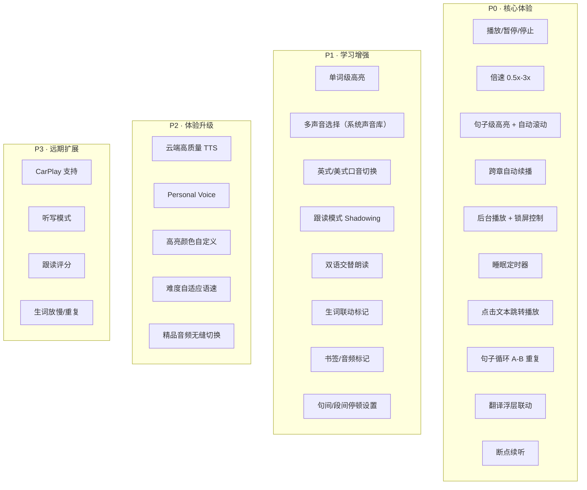
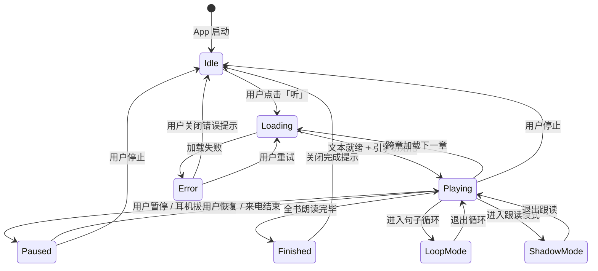
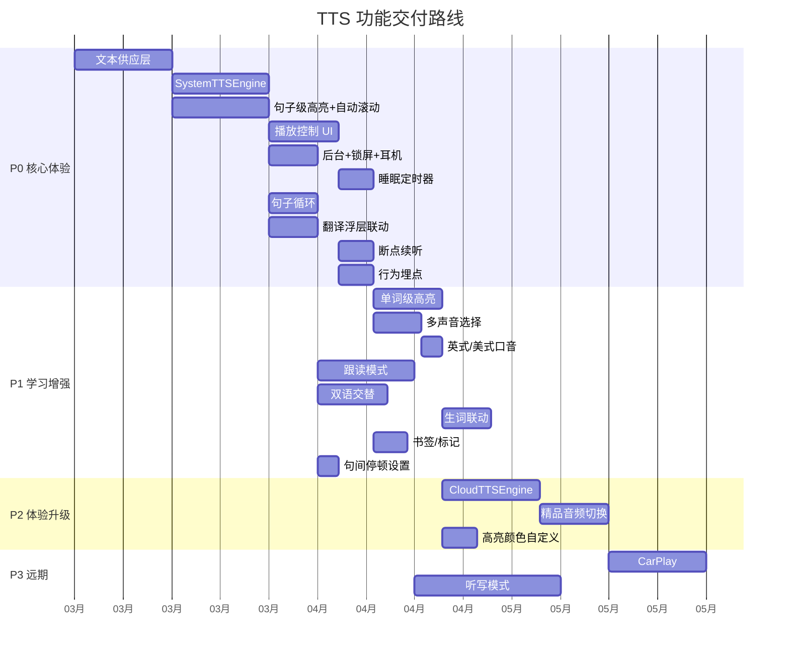

# iOS TTS 系统设计方案

> 面向英文阅读学习的全功能语音朗读系统
>
> 设计原则：从市面竞品功能全集出发，针对英语学习场景做取舍与增强

---

## 一、竞品功能矩阵

### 1.1 主流产品功能对标

| 功能 | Speechify | Kindle Immersion | Apple Books | Voice Dream | Readmigo 决策 |
|------|:---------:|:----------------:|:-----------:|:-----------:|:------------:|
| **基础播放** | | | | | |
| 播放/暂停 | ✅ | ✅ | ✅ | ✅ | ✅ 必做 |
| 倍速调节 | 0.5x-4.5x | 0.5x-3x | 0.75x-2x | 0.5x-5x | ✅ 0.5x-3x |
| 语速微调（无级） | ✅ 滑块 | ❌ 档位 | ❌ 档位 | ✅ 滑块 | ✅ 滑块 |
| 睡眠定时器 | ✅ | ✅ | ✅ | ✅ | ✅ 必做 |
| **导航** | | | | | |
| 上/下一句 | ✅ | ❌ | ❌ | ✅ | ✅ 必做 |
| 上/下一段 | ✅ | ❌ | ❌ | ✅ | ✅ 必做 |
| 上/下一章 | ✅ | ✅ | ✅ | ✅ | ✅ 必做 |
| 快进快退 15s/30s | ✅ | ✅ | ✅ | ✅ | ✅ 15s |
| 点击文本跳转播放 | ✅ | ❌ | ❌ | ✅ | ✅ 关键功能 |
| 进度条拖拽 | ✅ | ✅ | ✅ | ✅ | ✅ 必做 |
| **声音** | | | | | |
| 多声音选择 | 1000+ | N/A (真人) | 系统声音 | 200+ | ✅ 系统+云端 |
| 男/女声切换 | ✅ | N/A | ✅ | ✅ | ✅ 必做 |
| 英式/美式口音 | ✅ | N/A | ✅ | ✅ | ✅ 关键功能 |
| Personal Voice | ❌ | ❌ | ✅ | ❌ | ⏳ P2 |
| 声音试听 | ✅ | N/A | ✅ | ✅ | ✅ 必做 |
| **视觉同步** | | | | | |
| 单词级高亮 | ✅ | ✅ | ❌ | ✅ | ✅ 关键功能 |
| 句子级高亮 | ✅ | ❌ | ❌ | ✅ | ✅ 默认模式 |
| 段落级高亮 | ❌ | ❌ | ❌ | ✅ | ✅ 省电模式 |
| 自动滚动 | ✅ | ✅ | ❌ | ✅ | ✅ 必做 |
| 高亮颜色自定义 | ✅ | ❌ | ❌ | ✅ | ⏳ P2 |
| **系统集成** | | | | | |
| 后台播放 | ✅ | ✅ | ✅ | ✅ | ✅ 必做 |
| 锁屏控制 | ✅ | ✅ | ✅ | ✅ | ✅ 必做 |
| 耳机线控 | ✅ | ✅ | ✅ | ✅ | ✅ 必做 |
| CarPlay | ❌ | ✅ | ✅ | ❌ | ⏳ P3 |
| AirPlay | ✅ | ✅ | ✅ | ✅ | ✅ 自动支持 |
| **高级功能** | | | | | |
| 书签/标记 | ✅ | ✅ | ✅ | ✅ | ✅ 必做 |
| 离线 TTS | ✅ (系统) | N/A | ✅ | ✅ | ✅ 系统声音 |
| 跳过非正文 | ✅ | ❌ | ❌ | ✅ | ✅ 跳过 HTML 结构 |
| SSML 控制 | 部分 | N/A | ✅ | 部分 | ✅ 标点停顿 |

### 1.2 英语学习专属功能（竞品空白）

以下功能在主流 TTS 产品中**不存在或极弱**，是 Readmigo 的差异化空间：

| 功能 | 竞品现状 | Readmigo 方案 | 优先级 |
|------|---------|--------------|:------:|
| 句子循环播放 | Voice Dream 有简单重复 | A-B 循环 + 次数设定 + 自动下一句 | P0 |
| 跟读模式 (Shadowing) | 无 | 听一句 → 暂停等待 → 用户跟读 → 下一句 | P1 |
| 双语交替朗读 | 无 | 英文段落 → 母语翻译 → 下一段 | P1 |
| 生词联动 | 无 | 朗读到生词本中的词时视觉标记 | P1 |
| 翻译浮层联动 | 无 | 当前朗读段落自动显示翻译 | P0 |
| 难度自适应语速 | 无 | 根据文本 CEFR 等级自动调整基础语速 | P2 |
| 听写模式 | 无 | 朗读句子 → 隐藏文本 → 用户默写 → 对照 | P3 |

---

## 二、Readmigo TTS 功能全集

### 2.1 功能分层与优先级



### 2.2 决策说明：为什么这样取舍

| 决策 | 理由 |
|------|------|
| 倍速上限 3x 而非 4.5x | 英语学习场景，>3x 失去学习意义；Speechify 4.5x 面向信息消费 |
| 句子级高亮为默认 | 英语学习核心需求：看到正在读的句子 → 视听结合记忆；单词级作为进阶 |
| 句子循环列为 P0 | 学英语最高频操作：「这句再听一遍」；竞品仅有粗糙重复 |
| 翻译浮层列为 P0 | Readmigo 核心差异化：边听边看翻译 → 其他 TTS 产品无此能力 |
| CarPlay 列为 P3 | 用户场景验证后再投入；开车场景与「看文本学英语」冲突 |
| 听写模式列为 P3 | 功能链长（隐藏文本 → 输入 → 比对），需要大量 UI 工作 |

---

## 三、系统分层架构

### 3.1 五层架构总览

```
┌──────────────────────────────────────────────────────────────────┐
│                         Layer 5: UI 表现层                       │
│                                                                  │
│  ┌──────────────┐  ┌──────────────┐  ┌───────────────────────┐  │
│  │ 播放控制面板  │  │ 高亮同步视图  │  │ 设置面板（声音/速度） │  │
│  └──────────────┘  └──────────────┘  └───────────────────────┘  │
│  ┌──────────────┐  ┌──────────────┐  ┌───────────────────────┐  │
│  │ 锁屏/控制中心 │  │ 迷你播放条   │  │ 学习模式面板          │  │
│  └──────────────┘  └──────────────┘  └───────────────────────┘  │
└───────────────────────────┬──────────────────────────────────────┘
                            │ 状态订阅 / 用户操作
                            ▼
┌──────────────────────────────────────────────────────────────────┐
│                    Layer 4: 协调层 (Coordinator)                  │
│                                                                  │
│  ReadAloudCoordinator                                            │
│  ├── 管理听读会话生命周期                                          │
│  ├── 协调文本供应 ↔ 语音引擎 ↔ 视觉同步                            │
│  ├── 处理跨章续播、学习模式切换                                     │
│  └── 统一状态输出（@Published / Combine）                          │
│                                                                  │
└──────┬──────────────────┬────────────────────┬───────────────────┘
       │                  │                    │
       ▼                  ▼                    ▼
┌──────────────┐  ┌──────────────┐  ┌──────────────────┐
│ Layer 3:     │  │ Layer 3:     │  │ Layer 3:         │
│ 视觉同步引擎  │  │ 语音引擎     │  │ 学习模式引擎      │
│              │  │              │  │                  │
│ · 单词高亮    │  │ · 系统 TTS   │  │ · 句子循环       │
│ · 句子高亮    │  │ · 云端 TTS   │  │ · 跟读模式       │
│ · 段落高亮    │  │ · 精品音频    │  │ · 双语交替       │
│ · 自动滚动    │  │ (统一接口)   │  │ · 翻译联动       │
└──────┬───────┘  └──────┬───────┘  └────────┬─────────┘
       │                  │                    │
       ▼                  ▼                    ▼
┌──────────────────────────────────────────────────────────────────┐
│                    Layer 2: 文本供应层                             │
│                                                                  │
│  ChapterTextProvider                                             │
│  ├── 章节纯文本获取（API / 缓存 / 离线回退）                        │
│  ├── 段落结构化（Paragraph[]）                                     │
│  ├── 句子拆分（Sentence[]）                                       │
│  ├── 单词标注（Word[] + characterRange）                           │
│  └── 预加载管理（当前章 + 下一章）                                   │
│                                                                  │
└───────────────────────────┬──────────────────────────────────────┘
                            │
                            ▼
┌──────────────────────────────────────────────────────────────────┐
│                    Layer 1: 系统服务层                             │
│                                                                  │
│  ┌──────────────┐  ┌──────────────┐  ┌───────────────────────┐  │
│  │AVSpeech      │  │ AVAudio      │  │ MPRemoteCommand       │  │
│  │Synthesizer   │  │ Session      │  │ Center                │  │
│  └──────────────┘  └──────────────┘  └───────────────────────┘  │
│  ┌──────────────┐  ┌──────────────┐  ┌───────────────────────┐  │
│  │ AVPlayer     │  │ MPNowPlaying │  │ URLSession            │  │
│  │ (精品音频)    │  │ InfoCenter   │  │ (云端 TTS API)        │  │
│  └──────────────┘  └──────────────┘  └───────────────────────┘  │
└──────────────────────────────────────────────────────────────────┘
```

### 3.2 层间通信规则

| 规则 | 说明 |
|------|------|
| 单向依赖 | 上层依赖下层，不可反向 |
| 协调层统一出口 | UI 层只与 Coordinator 通信，不直接访问引擎层 |
| 协议抽象 | 语音引擎通过 `AudioPlayable` 协议抽象，三种音源实现同一接口 |
| 响应式状态 | Coordinator 通过 `@Published` 暴露状态，UI 通过 Combine 订阅 |
| 异步非阻塞 | 文本获取、音频加载均为 async/await，不阻塞主线程 |

---

## 四、音频源抽象层

### 4.1 三源统一接口

```
AudioPlayable (Protocol)
│
├── SystemTTSEngine        ← AVSpeechSynthesizer（离线/免费）
├── CloudTTSEngine         ← OpenAI TTS / ElevenLabs API（高质量/付费）
└── PremiumAudioEngine     ← AVPlayer 播放 R2 精品音频文件
```

### 4.2 AudioPlayable 协议设计

| 方法/属性 | 说明 |
|-----------|------|
| `play(text:, from:)` | 从指定位置开始播放 |
| `pause()` | 暂停 |
| `resume()` | 恢复 |
| `stop()` | 停止并释放资源 |
| `seek(to:)` | 跳转到指定段落/句子 |
| `setRate(_:)` | 设置倍速 |
| `setVoice(_:)` | 设置声音 |
| `currentPosition` | 当前播放位置（章节+段落+句子） |
| `onWordBoundary` | 单词边界回调（用于单词级高亮） |
| `onSentenceEnd` | 句子结束回调 |
| `onParagraphEnd` | 段落结束回调 |
| `onChapterEnd` | 章节结束回调 |
| `onError` | 错误回调 |

### 4.3 音频源自动选择策略

```
用户点击「听」
     │
     ▼
该书有精品有声书？(Audiobook.status == PUBLISHED)
     │
     ├── 是 → PremiumAudioEngine（最高质量）
     │         用户可在设置中切回 TTS
     │
     └── 否 → 用户是否为付费用户 + 网络可用？
               │
               ├── 是 → CloudTTSEngine（高质量 AI 声音）
               │
               └── 否 → SystemTTSEngine（系统声音，离线可用）
```

### 4.4 三种引擎对比

| 维度 | SystemTTSEngine | CloudTTSEngine | PremiumAudioEngine |
|------|:--------------:|:--------------:|:-----------------:|
| 音质 | 中等 | 高 | 最高（真人/精品 AI） |
| 延迟 | 极低（本地） | 中（网络请求） | 低（流式/已下载） |
| 成本 | 零 | API 费用 | 制作成本（已摊销） |
| 离线 | ✅ | ❌ | ✅（已下载） |
| 单词边界 | ✅ willSpeakRange | ✅ 时间戳返回 | ✅ forced alignment |
| 覆盖率 | 100% | 100% | 部分（精品书目） |
| 语速可调 | ✅ 0.5x-3x | ✅ 取决于 API | ⚠️ 变速会影响音质 |

---

## 五、文本供应层

### 5.1 三级文本结构

```
Chapter（章节）
│
├── Paragraph 0（段落）
│   ├── Sentence 0（句子）
│   │   ├── Word 0 "He"         range: {0, 2}
│   │   ├── Word 1 "felt"       range: {3, 4}
│   │   ├── Word 2 "the"        range: {8, 3}
│   │   ├── Word 3 "rain"       range: {12, 4}
│   │   └── ...
│   ├── Sentence 1
│   └── Sentence 2
│
├── Paragraph 1
│   ├── Sentence 0
│   └── Sentence 1
│
└── Paragraph N
```

**设计原则**：

| 原则 | 说明 |
|------|------|
| 段落是导航原子 | 所有导航操作以段落为最小单位定位 |
| 句子是朗读原子 | TTS 引擎逐句送入合成器 |
| 单词是高亮原子 | willSpeakRange 回调驱动单词级高亮 |
| 懒拆分 | 句子/单词拆分在即将朗读时才执行，不预计算全章 |

### 5.2 英文文本拆分策略

**句子拆分规则（英文特化）**：

| 场景 | 处理方式 |
|------|---------|
| 标准句号/问号/感叹号 | 标准句子边界 |
| 缩写 (Mr. Mrs. Dr. St.) | 不作为句子边界 |
| 省略号 (…) | 不拆分，视为句内停顿 |
| 对话引号内的句号 | 视上下文：短对话不拆，长对话按句号拆 |
| 分号/冒号 | 不拆分（英文文学中常用于复合句） |
| 破折号 (—) | 不拆分，SE 精校文本使用 em-dash |

**推荐实现**：使用 `NLTokenizer` (Natural Language framework) + 自定义后处理规则

### 5.3 文本获取优先级

```
请求章节纯文本
     │
     ▼
① 内存缓存？ ─── 命中 ──→ 返回（零延迟）
     │ 未命中
     ▼
② 磁盘缓存？ ─── 命中 ──→ 加载到内存 → 返回
     │ 未命中
     ▼
③ 网络可用？
     ├── 是 ──→ /chapters/{id}/text API → 写入缓存 → 返回
     └── 否 ──→ ④ 有离线 HTML？
                    ├── 是 ──→ 剥离 HTML → 降级返回
                    └── 否 ──→ 提示「需要网络连接」
```

### 5.4 预加载策略

| 时机 | 动作 | 缓存层级 |
|------|------|---------|
| 开始朗读第 N 章 | 异步预加载第 N+1 章 | 内存 |
| 当前章剩余 <20% | 预加载第 N+2 章 | 内存 |
| 用户下载全书离线 | 所有章节纯文本写入磁盘 | 磁盘 |
| 翻译缓存存在 | 复用翻译数据中的原文 | 零额外请求 |

---

## 六、语音引擎层

### 6.1 SystemTTSEngine 核心设计

**AVSpeechSynthesizer 配置**：

| 参数 | 默认值 | 范围 | 说明 |
|------|--------|------|------|
| rate | 0.5 (AVSpeechUtteranceDefaultSpeechRate) | 0.0-1.0 | 映射到用户可见的 0.5x-3x |
| pitchMultiplier | 1.0 | 0.5-2.0 | 不暴露给用户，保持自然 |
| volume | 1.0 | 0.0-1.0 | 跟随系统音量 |
| preUtteranceDelay | 0.0 | — | 句间停顿由协调层控制 |
| postUtteranceDelay | 0.15 | — | 句子间自然停顿 |

**倍速映射表**：

| 用户可见 | AVSpeechUtterance.rate | 约 WPM |
|:--------:|:----------------------:|:------:|
| 0.5x | 0.25 | 75 |
| 0.75x | 0.38 | 110 |
| 1.0x | 0.50 | 150 |
| 1.25x | 0.56 | 190 |
| 1.5x | 0.62 | 225 |
| 2.0x | 0.72 | 300 |
| 2.5x | 0.82 | 375 |
| 3.0x | 0.90 | 450 |

> 英语学习建议：初级 0.75x (110 WPM)，中级 1.0x (150 WPM)，高级 1.5x+ (225+ WPM)

### 6.2 声音选择策略（英文特化）

**声音分类体系**：

| 分类 | 声音 | 标识 | 推荐场景 |
|------|------|------|---------|
| **美式英语** | | | |
| 女声 · 标准 | Samantha (Enhanced) | en-US | 默认声音 |
| 男声 · 标准 | Alex | en-US | 男性声音偏好 |
| 女声 · Premium | Ava (Premium) | en-US | 付费用户 |
| 男声 · Premium | Evan (Premium) | en-US | 付费用户 |
| **英式英语** | | | |
| 女声 · 标准 | Kate | en-GB | 英式偏好 |
| 男声 · 标准 | Daniel | en-GB | 英国文学 |
| **澳式英语** | | | |
| 女声 | Karen | en-AU | 口音多样性 |

**声音推荐逻辑**：

| 书籍属性 | 推荐声音 | 理由 |
|---------|---------|------|
| 英国作者（Austen, Dickens） | en-GB Daniel/Kate | 口音匹配文学背景 |
| 美国作者（Twain, Fitzgerald） | en-US Samantha/Alex | 口音匹配文学背景 |
| 其他/默认 | en-US Samantha (Enhanced) | 最广泛适用 |
| 用户手动选择 | 优先用户偏好 | 用户偏好 > 自动推荐 |

### 6.3 Delegate 回调处理

**核心回调链**：

```
AVSpeechSynthesizerDelegate
│
├── willSpeakRangeOfSpeechString(characterRange:, utterance:)
│   └── 触发频率：每个单词
│       └── 用途：单词级高亮 → HighlightEngine.highlightWord(range)
│
├── didStart(utterance:)
│   └── 用途：句子开始 → 更新 UI 状态
│
├── didFinish(utterance:)
│   └── 用途：句子结束 → 推进到下一句
│       ├── 当前段落还有句子 → 送入下一句
│       ├── 当前段落结束 → onParagraphEnd → 下一段
│       └── 当前章节结束 → onChapterEnd → 协调层决策
│
├── didPause(utterance:)
│   └── 用途：暂停状态同步
│
└── didCancel(utterance:)
    └── 用途：清理状态
```

**willSpeakRange 已知问题与修复**：

| 问题 | 场景 | 修复策略 |
|------|------|---------|
| 数字 range 错位 | "2020" 被拆分朗读 | 预处理：数字转文字（"two thousand twenty"） |
| 缩写 range 错位 | "Mr." 的句号被误判 | 预处理：缩写列表白名单 |
| 特殊字符偏移 | em-dash (—) 占 3 bytes | 使用 UTF-16 offset 计算 |

### 6.4 CloudTTSEngine 设计

**API 选型对比**：

| 维度 | OpenAI TTS | ElevenLabs | Azure Speech |
|------|:----------:|:----------:|:------------:|
| 音质 | 极高 | 极高 | 高 |
| 延迟 | 中 (~1s) | 低 (~500ms) | 低 (~300ms) |
| 流式 | ✅ | ✅ | ✅ |
| 单词时间戳 | ❌ | ✅ | ✅ (SSML) |
| 价格 (1M chars) | $15 | $3-$30 | $4-$16 |
| 声音数 | 11 | 1000+ | 400+ |
| 离线 | ❌ | ❌ | ❌ |

**推荐方案**：Azure Speech 作为主选（低延迟 + 单词时间戳 + 性价比高），ElevenLabs 作为 Premium 选项。

**流式播放架构**：

```
文本输入 → API 请求（流式） → 音频 chunk 缓冲 → AVAudioPlayer 播放
                                    │
                                    ├── chunk 1 到达 → 开始播放（首字节延迟 ~300ms）
                                    ├── chunk 2 到达 → 追加缓冲
                                    └── 全部到达 → 缓存到磁盘（下次免请求）
```

**缓存策略**：

| 缓存层 | 内容 | 有效期 | 淘汰策略 |
|--------|------|--------|---------|
| 内存 | 当前章 + 下一章音频 | 会话内 | 章节切换时释放远端章节 |
| 磁盘 | 最近播放的 10 章 | 7 天 | LRU |
| 永久 | 用户主动下载的章节 | 不过期 | 用户手动管理 |

---

## 七、同步高亮层

### 7.1 三档高亮模式

| 模式 | 视觉效果 | 性能开销 | 适用场景 |
|------|---------|:-------:|---------|
| **单词级** | 当前单词底色高亮 + 前方文本淡化 | 高 | 精读 · 初学者 · 跟读 |
| **句子级** | 当前句子底色高亮 + 句首标记 | 中 | 默认模式 · 中级学习者 |
| **段落级** | 当前段落左侧彩条 + 背景淡色 | 低 | 泛听 · 高级学习者 · 省电 |

### 7.2 高亮实现方案（WebView 场景）

**JS Bridge 通信协议**：

| 方向 | 消息 | 参数 |
|------|------|------|
| Swift → JS | `highlightWord` | `{paragraphIndex, sentenceIndex, wordRange}` |
| Swift → JS | `highlightSentence` | `{paragraphIndex, sentenceIndex}` |
| Swift → JS | `highlightParagraph` | `{paragraphIndex}` |
| Swift → JS | `clearHighlight` | — |
| Swift → JS | `scrollToParagraph` | `{paragraphIndex, animated}` |
| JS → Swift | `onParagraphTapped` | `{paragraphIndex}` → 跳转朗读位置 |
| JS → Swift | `onWordTapped` | `{paragraphIndex, wordRange}` → 查词 |

### 7.3 自动滚动策略

| 场景 | 行为 |
|------|------|
| 段落切换 | smooth scroll，将新段落滚动至屏幕 1/3 处 |
| 用户手动滚动 | 暂停自动滚动，3 秒无操作后恢复 |
| 快速跳转（拖进度条） | 立即跳转，无动画 |
| 锁屏状态 | 不执行滚动（省资源），解锁后立即同步位置 |

### 7.4 高亮样式定义

| 元素 | 单词模式 | 句子模式 | 段落模式 |
|------|---------|---------|---------|
| 当前焦点 | 单词黄色底色 `#FFF3CD` | 句子蓝色底色 `#D6EAF8` | 段落左侧 4px 蓝色条 |
| 已读区域 | 文字透明度 0.4 | 无变化 | 无变化 |
| 未读区域 | 正常显示 | 正常显示 | 正常显示 |
| 过渡动画 | 150ms ease-in-out | 200ms ease-in-out | 300ms ease-in-out |

---

## 八、播放控制层

### 8.1 播放器 UI 组件

```
┌─────────────────────────────────────────────────────────────┐
│                     全屏播放器面板                            │
│                                                             │
│  ┌─────────────────────────────────────────────────────┐    │
│  │  章节标题: Chapter 3 - The First Meeting            │    │
│  │  书名: Pride and Prejudice                          │    │
│  └─────────────────────────────────────────────────────┘    │
│                                                             │
│  ┌─────────────────────────────────────────────────────┐    │
│  │  ▓▓▓▓▓▓▓▓▓▓▓▓▓░░░░░░░░░░░░░░░░░░░░  34%          │    │
│  │  3:42                                 -7:18        │    │
│  └─────────────────────────────────────────────────────┘    │
│                                                             │
│         ◁◁ 15s      ◁ 上一句     ▶ ︎/ ⏸      下一句 ▷     15s ▷▷  │
│                                                             │
│  ┌──────────┐  ┌──────────┐  ┌──────────┐  ┌──────────┐   │
│  │ 🔄 循环   │  │ 🌐 翻译  │  │ ⏱ 定时   │  │ 🎙 声音  │   │
│  │ 关/句/段  │  │ 开/关    │  │ 15m/30m  │  │ 选择     │   │
│  └──────────┘  └──────────┘  └──────────┘  └──────────┘   │
│                                                             │
│  ┌─────────────────────────────────────────────────────┐    │
│  │  倍速:  0.5x   0.75x   [1.0x]   1.5x   2.0x       │    │
│  │         ▓▓▓▓▓▓▓▓▓▓▓▓▓▓▓▓▓▓░░░░░░░░░░              │    │
│  └─────────────────────────────────────────────────────┘    │
│                                                             │
└─────────────────────────────────────────────────────────────┘

┌─────────────────────────────────────────────────────────────┐
│                     迷你播放条（阅读器底部）                    │
│                                                             │
│  ▶ ︎/ ⏸   Chapter 3 · 1.0x · 34%                  [展开 ↑]  │
│                                                             │
└─────────────────────────────────────────────────────────────┘
```

### 8.2 睡眠定时器

| 选项 | 行为 |
|------|------|
| 15 分钟 / 30 分钟 / 45 分钟 / 60 分钟 | 倒计时到 → 淡出停止 |
| 本章结束时 | 当前章节朗读完毕后停止 |
| 自定义时间 | 用户输入分钟数 |

**淡出停止**：最后 10 秒音量从当前值线性降低至 0 → 暂停 → 记录断点

### 8.3 锁屏 / 控制中心集成

**MPRemoteCommandCenter 注册**：

| 命令 | 映射操作 |
|------|---------|
| `playCommand` | 播放/恢复 |
| `pauseCommand` | 暂停 |
| `nextTrackCommand` | 下一章 |
| `previousTrackCommand` | 上一章 |
| `skipForwardCommand` (15s) | 快进 15 秒 |
| `skipBackwardCommand` (15s) | 快退 15 秒 |
| `changePlaybackRateCommand` | 倍速切换 |

**MPNowPlayingInfoCenter 显示**：

| 字段 | 值 |
|------|------|
| title | 章节标题 "Chapter 3 - The First Meeting" |
| artist | 作者名 "Jane Austen" |
| albumTitle | 书名 "Pride and Prejudice" |
| artwork | 书籍封面图 |
| currentPlaybackDuration | 章节预估总时长 |
| elapsedPlaybackTime | 当前已播放时长 |
| playbackRate | 当前倍速 |

### 8.4 音频会话管理

**AVAudioSession 配置**：

| 属性 | 值 | 理由 |
|------|------|------|
| category | `.playback` | 支持后台播放 |
| mode | `.spokenAudio` | 为语音内容优化（接电话时 duck） |
| options | `[.duckOthers, .allowBluetooth]` | 与其他音频共存 + 蓝牙支持 |

**中断处理**：

| 中断类型 | 处理 |
|---------|------|
| 来电 / FaceTime | 自动暂停 → 挂断后自动恢复 |
| Siri 激活 | duck 音量 → Siri 结束后恢复 |
| 其他 App 播放音频 | 暂停，用户手动恢复 |
| 耳机拔出 | 自动暂停（系统默认行为） |
| 蓝牙断连 | 自动暂停 |
| App 进入后台 | 继续播放（已配置 `.playback`） |
| App 被系统回收 | 记录断点位置 → 下次启动恢复 |

---

## 九、英语学习增强模式

### 9.1 句子循环 (A-B Repeat)

**最高频学习操作：「这句再听一遍」**

```
正常播放 → 用户点击「循环」→ 进入循环模式
                                │
                                ▼
                        当前句子开始
                             │
                             ▼
                        朗读当前句子
                             │
                             ▼
                        句子结束 → 循环计数 +1
                             │
                             ├── 未达次数 → 重新朗读
                             │     间隔停顿 0.8s（给用户消化时间）
                             │
                             └── 已达次数 → 自动进入下一句循环
                                   或用户手动退出循环模式
```

**循环设置**：

| 设置项 | 选项 | 默认 |
|--------|------|:----:|
| 循环粒度 | 句子 / 段落 | 句子 |
| 循环次数 | 2次 / 3次 / 5次 / 无限 | 3次 |
| 循环间隔 | 0.5s / 0.8s / 1.5s / 3s | 0.8s |
| 达次后行为 | 自动下一句 / 暂停等待 | 自动下一句 |

### 9.2 跟读模式 (Shadowing)

```
跟读模式开启
     │
     ▼
TTS 朗读句子 1
     │
     ▼
句子结束 → 自动暂停
     │
     ▼
屏幕提示「Your turn」+ 倒计时进度条
     │
     ├── 用户跟读中（麦克风可选开启）
     │
     ▼
等待时间到 / 用户点击「下一句」
     │
     ▼
TTS 朗读句子 2
     │
     ...循环
```

**跟读设置**：

| 设置项 | 选项 | 默认 |
|--------|------|:----:|
| 等待时长 | 自动（1.5x 句子时长）/ 手动点击 | 自动 |
| 麦克风录音 | 开 / 关 | 关（P1 不评分） |
| 重听原句 | 开 / 关 | 开（可长按重听） |

### 9.3 双语交替朗读

```
模式 A: 段落交替
──────────────
TTS 朗读英文段落 1
     ↓ (停顿 0.5s)
TTS 朗读中文翻译段落 1
     ↓ (停顿 1.0s)
TTS 朗读英文段落 2
     ↓ ...

模式 B: 句子交替
──────────────
TTS 朗读英文句子 1
     ↓ (停顿 0.3s)
TTS 朗读中文翻译句子 1
     ↓ (停顿 0.5s)
TTS 朗读英文句子 2
     ↓ ...
```

**翻译来源**：Readmigo 已有多语言翻译数据，直接复用。

**双语声音**：英文使用用户选择的英文声音，翻译使用系统对应语言声音（如中文用 zh-CN Tingting）。

### 9.4 翻译浮层联动

```
┌──────────────────────────────────────────┐
│                                          │
│  He felt the rain on his face as he      │ ← 当前朗读段落（高亮）
│  walked through the darkened streets.    │
│                                          │
│  ┌──────────────────────────────────┐    │
│  │ 他感到雨水打在脸上，                │    │ ← 翻译浮层（自动显示/隐藏）
│  │ 走过昏暗的街道。                    │    │
│  └──────────────────────────────────┘    │
│                                          │
│  No one else was out at this hour.       │ ← 未朗读段落（无翻译）
│  The city slept while he wandered.       │
│                                          │
└──────────────────────────────────────────┘
```

| 行为 | 说明 |
|------|------|
| 进入段落 | 翻译浮层以动画滑入（200ms fade-in） |
| 离开段落 | 翻译浮层淡出（150ms fade-out） |
| 翻译开关 | 全局开/关，不影响朗读 |
| 翻译语言 | 跟随系统语言（中/日/韩） |

### 9.5 生词联动

| 行为 | 说明 |
|------|------|
| 视觉标记 | 朗读到用户生词本中的词时，该词增加下划虚线 |
| 点击暂停查词 | 朗读中点击任意单词 → 暂停 → 弹出释义卡 → 可加入生词本 → 恢复 |
| 生词统计 | 该章节包含 N 个生词本中的词（进入章节前提示） |

---

## 十、状态管理

### 10.1 播放状态机



### 10.2 Coordinator 状态输出

| 属性 | 类型 | 说明 |
|------|------|------|
| `playbackState` | `PlaybackState` (enum) | Idle/Loading/Playing/Paused/Finished/Error |
| `currentChapter` | `Chapter` | 当前章节信息 |
| `currentParagraphIndex` | `Int` | 当前段落索引 |
| `currentSentenceIndex` | `Int` | 当前句子索引 |
| `currentWordRange` | `NSRange?` | 当前单词 range（单词高亮用） |
| `chapterProgress` | `Double` (0-1) | 章节内进度 |
| `bookProgress` | `Double` (0-1) | 全书进度 |
| `elapsedTime` | `TimeInterval` | 已播放时长 |
| `remainingTime` | `TimeInterval` | 预估剩余时长 |
| `currentRate` | `Float` | 当前倍速 |
| `currentVoice` | `VoiceInfo` | 当前声音信息 |
| `learningMode` | `LearningMode` (enum) | Normal/Loop/Shadow/Bilingual |
| `isTranslationVisible` | `Bool` | 翻译浮层是否显示 |
| `highlightMode` | `HighlightMode` (enum) | Word/Sentence/Paragraph |
| `audioSource` | `AudioSource` (enum) | SystemTTS/CloudTTS/Premium |
| `sleepTimer` | `SleepTimerState?` | 睡眠定时器状态 |

### 10.3 进度持久化

| 数据 | 存储位置 | 写入时机 | 用途 |
|------|---------|---------|------|
| 最后位置（章节+段落+句子） | UserDefaults | 每段落切换 | 断点续听 |
| TTS 偏好（声音/倍速/高亮模式） | UserDefaults | 设置变更时 | 偏好记忆 |
| 学习模式偏好 | UserDefaults | 设置变更时 | 模式记忆 |
| 听读时长统计 | 本地 DB → 服务端同步 | 每分钟采样 | 用户统计 |
| 云端 TTS 音频缓存 | 磁盘缓存 | 每次请求后 | 避免重复付费 |

---

## 十一、性能优化

### 11.1 内存管理

| 策略 | 说明 |
|------|------|
| 章节级文本缓存窗口 | 仅保留 N-1, N, N+1 三章文本在内存 |
| 懒拆分 | 句子/单词结构在即将朗读时才计算 |
| 云端 TTS 音频流 | 流式播放，不一次性加载全章音频到内存 |
| WebView 高亮 DOM | 只操作可视区域 ±2 段落的 DOM |

### 11.2 电量优化

| 场景 | 策略 |
|------|------|
| 锁屏纯听 | 停止 WebView 渲染、停止高亮更新 |
| 段落级高亮 | 减少 JS Bridge 调用频次（每段落 1 次 vs 每单词 1 次） |
| 系统 TTS | 本地计算，不消耗网络 |
| 预加载 | Wi-Fi 下预加载，蜂窝网络下仅加载当前章 |

### 11.3 延迟优化

| 环节 | 目标延迟 | 策略 |
|------|:--------:|------|
| 点击「听」→ 开始朗读 | <500ms | 文本缓存 + 引擎预热 |
| 跨章切换间隔 | <300ms | 预加载下一章 + 预初始化 utterance |
| 单词高亮延迟 | <50ms | JS Bridge 批量调用 |
| 云端 TTS 首字节 | <1s | 流式请求 + 缓冲区预填 |
| 点击文本跳转 | <200ms | 中止当前 utterance → 立即从新位置开始 |

### 11.4 异常恢复

| 异常 | 检测 | 恢复策略 |
|------|------|---------|
| TTS 引擎无响应 | 5 秒无 delegate 回调 | 销毁重建 AVSpeechSynthesizer 实例 |
| 云端 TTS 请求失败 | HTTP 错误 / 超时 | 自动降级到系统 TTS + toast 提示 |
| 内存警告 | didReceiveMemoryWarning | 释放非当前章节缓存 |
| 文本加载失败 | API 错误 + 无本地缓存 | 显示重试按钮 + 提示检查网络 |
| WebView 崩溃 | WKWebView 进程终止 | 重新加载 + 恢复到当前段落位置 |

---

## 十二、功能实现路线

### P0 → P1 → P2 → P3 渐进交付



### 各阶段交付物

| 阶段 | 工期预估 | 交付物 | 用户可感知价值 |
|:----:|:-------:|--------|--------------|
| **P0** | 6-8 周 | 全功能 TTS 播放器 + 句子循环 + 翻译联动 | 「能听 + 能学」 |
| **P1** | 4-6 周 | 单词高亮 + 多声音 + 跟读 + 双语 + 生词 | 「学得好」 |
| **P2** | 3-4 周 | 云端高质量声音 + 精品音频切换 | 「听得爽」 |
| **P3** | 按需 | CarPlay + 听写 + 跟读评分 | 场景扩展 |

---

*创建日期：2026-02-08*
