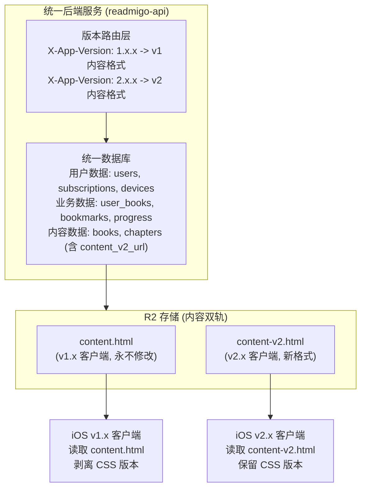
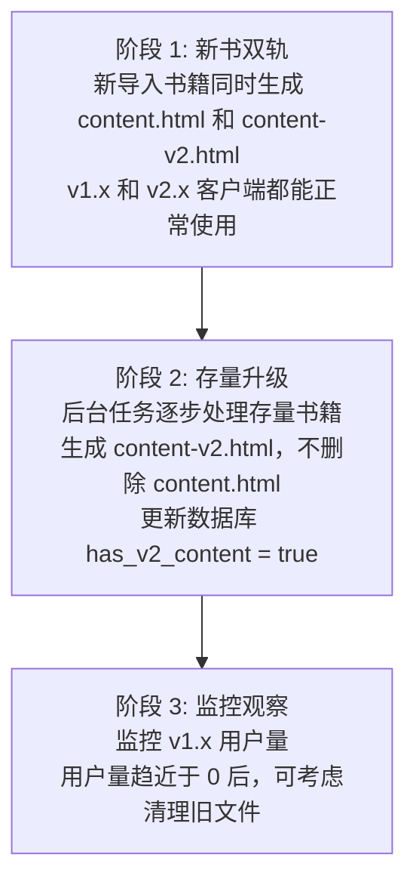

# 多版本兼容架构方案

## 背景

### 业务需求

- 已发布的 v1.x 版本完全不受影响
- v2.0 使用新内容格式（保留 EPUB CSS）
- 用户数据统一，无数据孤岛
- 支持每年 50+ 版本发布
- 支持 1 亿用户规模

### 核心原则

```
内容版本化，而非架构版本化：
- 统一后端服务
- 统一数据库
- 统一用户数据
- 只有内容文件按版本区分
```

---

## 整体架构



---

## 组件隔离策略

| 组件 | 策略 | 说明 |
|------|------|------|
| 后端服务 | 统一 | 单一 Fly.io 应用，版本路由逻辑 |
| 数据库 | 统一 | 单一 Neon 数据库，字段扩展 |
| 用户数据 | 统一 | 书架、进度、书签等所有版本共享 |
| 内容文件 | 双轨 | 同一章节存储两个版本文件 |
| API 域名 | 统一 | api.readmigo.app |
| 代码分支 | 统一 | main 分支，逻辑分支处理版本差异 |

---

## 保护已发布版本

### 核心原则

```
v1.x 客户端看到的一切都不变：
- 相同的 API 端点
- 相同的响应格式
- 相同的内容文件
```

### 内容文件保护

```
R2 存储规则：

1. content.html 文件永不修改、永不删除
2. 新格式使用新文件名 content-v2.html
3. v1.x 客户端请求时返回 content.html
4. v2.x 客户端请求时返回 content-v2.html (如存在)
```

### API 版本路由

```
GET /chapters/{id}/content
     │
     ├── Header: X-App-Version: 1.x.x
     │      → 返回 content.html URL
     │
     └── Header: X-App-Version: 2.x.x
            → 返回 content-v2.html URL (如存在)
            → 否则返回 content.html URL (降级)
```

### 风险隔离清单

| 风险点 | 隔离措施 | 验证方法 |
|--------|----------|----------|
| API 响应格式变化 | 版本号路由，v1.x 返回原格式 | 保留 v1.x 测试设备验证 |
| 内容文件被覆盖 | 新文件使用新路径，原文件只读 | R2 文件校验和比对 |
| 数据库 Schema 变更 | 只新增字段，不修改/删除现有字段 | Migration review |
| 阅读进度/书签失效 | 进度按章节 ID 存储，与内容格式无关 | 升级前后进度对比测试 |

---

## 数据库设计

### 变更原则

- 只新增字段，不修改现有字段
- 只新增表，不删除现有表
- 新字段可为空，有默认值

### 新增字段

| 表 | 新增字段 | 类型 | 说明 |
|-----|----------|------|------|
| `chapters` | `content_v2_url` | VARCHAR | v2 内容文件 URL |
| `chapters` | `has_v2_content` | BOOLEAN | 是否有 v2 内容 |

### Migration 示例

```sql
-- 只新增，不修改
ALTER TABLE chapters ADD COLUMN content_v2_url VARCHAR;
ALTER TABLE chapters ADD COLUMN has_v2_content BOOLEAN DEFAULT false;

-- 创建索引优化查询
CREATE INDEX idx_chapters_has_v2 ON chapters(has_v2_content) WHERE has_v2_content = true;
```

---

## R2 存储设计

### 目录结构

```
/books/
  └── {bookId}/
      ├── cover.jpg
      ├── metadata.json
      └── chapters/
          └── {chapterId}/
              ├── content.html       ← v1 格式 (永不修改)
              ├── content-v2.html    ← v2 格式 (新增)
              └── images/
                  └── ...
```

### 文件命名规则

| 版本 | 文件名 | 说明 |
|------|--------|------|
| v1 | `content.html` | 现有文件，剥离 CSS |
| v2 | `content-v2.html` | 新文件，保留 CSS |
| v3+ | `content-v3.html` | 未来扩展 |

---

## 渐进式内容升级

### 升级流程



### 降级策略

```
v2.x 客户端请求内容时:

if (chapter.has_v2_content) {
    return chapter.content_v2_url    // 返回 v2 格式
} else {
    return chapter.content_url       // 降级到 v1 格式
}

确保 v2.x 客户端在存量书籍未升级时仍能正常阅读
```

---

## 实施计划

### 阶段一：后端改造

| 步骤 | 任务 | 影响 v1.x | 状态 |
|------|------|-----------|------|
| 1.1 | 数据库新增 content_v2_url 字段 | ❌ 无影响 | ⬜ |
| 1.2 | 数据库新增 has_v2_content 字段 | ❌ 无影响 | ⬜ |
| 1.3 | API 新增版本检测逻辑 | ❌ 无影响 (默认返回 v1) | ⬜ |
| 1.4 | API 新增 v2 内容返回逻辑 | ❌ 无影响 | ⬜ |
| 1.5 | 部署后端更新 | ❌ 无影响 | ⬜ |

### 阶段二：iOS v2.0 开发

| 步骤 | 任务 | 文件 | 状态 |
|------|------|------|------|
| 2.1 | API 请求添加版本号 Header | `APIClient.swift` | ⬜ |
| 2.2 | 处理 v2 内容 URL 返回 | `ChapterService.swift` | ⬜ |

### 阶段三：测试与发布

| 步骤 | 任务 | 说明 | 状态 |
|------|------|------|------|
| 3.1 | v1.x 回归测试 | 确保无任何影响 | ⬜ |
| 3.2 | v2.0 功能测试 | 新格式显示效果 | ⬜ |
| 3.3 | 升级场景测试 | v1→v2 用户数据保留 | ⬜ |
| 3.4 | TestFlight 内测 | 小范围验证 | ⬜ |
| 3.5 | App Store 提交 | v2.0.0 | ⬜ |

---

## 版本生命周期

### 内容格式版本

| 格式版本 | 状态 | 说明 |
|----------|------|------|
| v1 | 维护 | 不再新增功能，只修复严重问题 |
| v2 | 开发中 | 当前开发重点 |

### 客户端版本

| 客户端版本 | 内容格式 | 状态 |
|------------|----------|------|
| v1.0.x | v1 | 已发布，维护模式 |
| v2.0.x | v2 | 开发中 |

### 下线策略

1. 监控 v1.x 客户端活跃用户数
2. 用户量低于阈值后，App 内引导升级
3. 确认无活跃用户后，可选择性清理 v1 内容文件

---

## 成本评估

### 统一架构成本

| 资源 | 月费用 | 说明 |
|------|--------|------|
| Fly.io (单一服务) | ~$5-15 | 可按需扩容 |
| Neon DB (单一数据库) | $0-25 | 按用量计费 |
| R2 存储 | ~$5-20 | 内容双轨，约 2x 存储 |
| **合计** | **~$10-60** | 可控 |

### 与全栈隔离方案对比

| 对比项 | 全栈隔离 | 内容版本化 |
|--------|----------|-----------|
| 3 版本并存成本 | $18-50/月 | $10-60/月 |
| 50 版本/年成本 | 不可行 | 增量存储成本 |
| 运维复杂度 | 高 (N 套系统) | 低 (1 套系统) |
| 用户数据 | 孤岛 | 统一 |
| 多设备同步 | 困难 | 自然支持 |

---

## 回滚方案

### 后端回滚

```
# 版本路由逻辑问题时
# 修改代码，所有请求返回 v1 内容
# 部署更新
fly deploy
```

### 内容回滚

- v1 内容文件永不删除
- 任何时候都可以回退到返回 v1 内容

### iOS 回滚

- App Store 支持版本回退审核
- 或发布 hotfix 版本

---

## 附录

### API 版本检测实现

```typescript
// 从请求头获取客户端版本
function getClientVersion(req: Request): string {
  return req.headers['x-app-version'] || '1.0.0';
}

// 判断是否使用 v2 内容
function shouldUseV2Content(clientVersion: string): boolean {
  const [major] = clientVersion.split('.');
  return parseInt(major) >= 2;
}

// 获取章节内容 URL
function getChapterContentUrl(chapter: Chapter, clientVersion: string): string {
  if (shouldUseV2Content(clientVersion) && chapter.has_v2_content) {
    return chapter.content_v2_url;
  }
  return chapter.content_url;
}
```

### iOS 版本号 Header 实现

```swift
// APIClient.swift
extension URLRequest {
    mutating func addAppVersionHeader() {
        let version = Bundle.main.infoDictionary?["CFBundleShortVersionString"] as? String ?? "1.0.0"
        self.setValue(version, forHTTPHeaderField: "X-App-Version")
    }
}
```

---

## 相关文档

- [EPUB 阅读器显示问题修复方案](./epub-reader-display-fix.md)
- [iOS 阅读器技术文档](../04-development/ios/reader.md)
- [部署指南](../05-operations/deployment.md)
