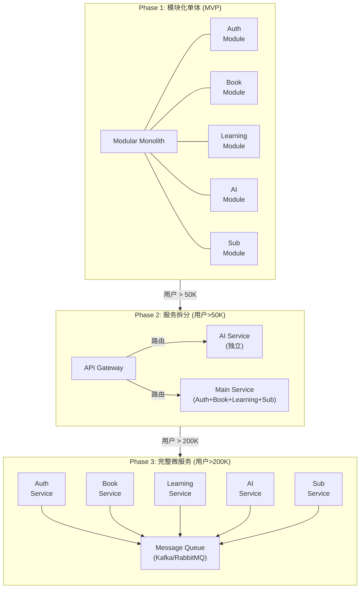

# 扩展性设计

### 10.1 水平扩展策略

```
┌─────────────────────────────────────────────────────────────────────────┐
│                       Horizontal Scaling Strategy                       │
├─────────────────────────────────────────────────────────────────────────┤
│                                                                         │
│  无状态应用层                                                            │
│  ══════════════                                                          │
│  • 应用服务器无状态，Session存Redis                                     │
│  • 支持多实例部署                                                       │
│  • 负载均衡器分发请求                                                   │
│                                                                         │
│  ┌─────────────────────────────────────────────────────────────────┐    │
│  │                                                                  │    │
│  │  用户量      实例数      数据库         Redis                   │    │
│  │  ────────────────────────────────────────────────────────────   │    │
│  │  < 10K      1           单机           单机                     │    │
│  │  10K-50K    2-3         主从           主从                     │    │
│  │  50K-200K   3-5         主从+只读副本  集群                     │    │
│  │  > 200K     5+          分片集群       集群+本地缓存            │    │
│  │                                                                  │    │
│  └─────────────────────────────────────────────────────────────────┘    │
│                                                                         │
│  数据库扩展                                                              │
│  ══════════                                                              │
│  1. 读写分离 (主从复制)                                                 │
│     • 写操作 → 主库                                                     │
│     • 读操作 → 从库                                                     │
│                                                                         │
│  2. 分表策略 (未来)                                                     │
│     • user_vocabulary按user_id分表                                      │
│     • reading_sessions按时间分表                                        │
│     • ai_interactions按时间分表                                         │
│                                                                         │
│  缓存策略                                                                │
│  ══════════                                                              │
│  • L1: 应用本地缓存 (热点数据，1分钟TTL)                                │
│  • L2: Redis分布式缓存                                                  │
│  • L3: CDN边缘缓存 (静态资源)                                           │
│                                                                         │
└─────────────────────────────────────────────────────────────────────────┘
```

### 10.2 微服务演进路径



---

