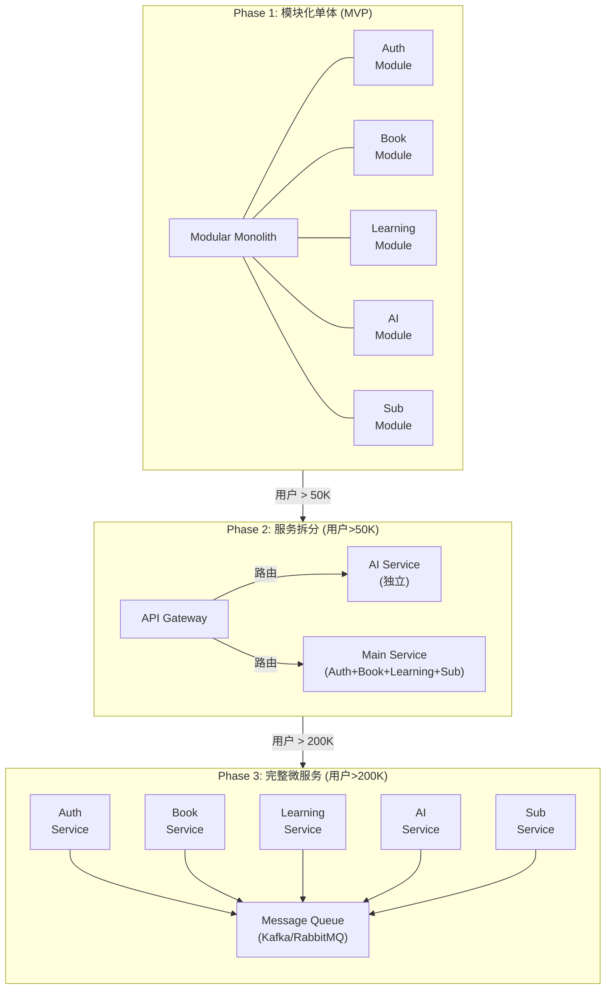

### 10.2 微服务演进路径

```mermaid
graph TB
    subgraph Phase1["Phase 1: 模块化单体 (MVP)"]
        direction LR
        MM["Modular Monolith"]
        Auth1["Auth<br>Module"]
        Book1["Book<br>Module"]
        Learn1["Learning<br>Module"]
        AI1["AI<br>Module"]
        Sub1["Sub<br>Module"]
        MM --- Auth1 & Book1 & Learn1 & AI1 & Sub1
    end

    subgraph Phase2["Phase 2: 服务拆分 (用户>50K)"]
        direction LR
        GW["API Gateway"] -->|路由| AIS["AI Service<br>(独立)"]
        GW -->|路由| Main["Main Service<br>(Auth+Book+Learning+Sub)"]
    end

    subgraph Phase3["Phase 3: 完整微服务 (用户>200K)"]
        direction TB
        Auth3["Auth<br>Service"]
        Book3["Book<br>Service"]
        Learn3["Learning<br>Service"]
        AI3["AI<br>Service"]
        Sub3["Sub<br>Service"]
        MQ["Message Queue<br>(Kafka/RabbitMQ)"]
        Auth3 & Book3 & Learn3 & AI3 & Sub3 --> MQ
    end

    Phase1 -->|"用户 > 50K"| Phase2
    Phase2 -->|"用户 > 200K"| Phase3
```

---
