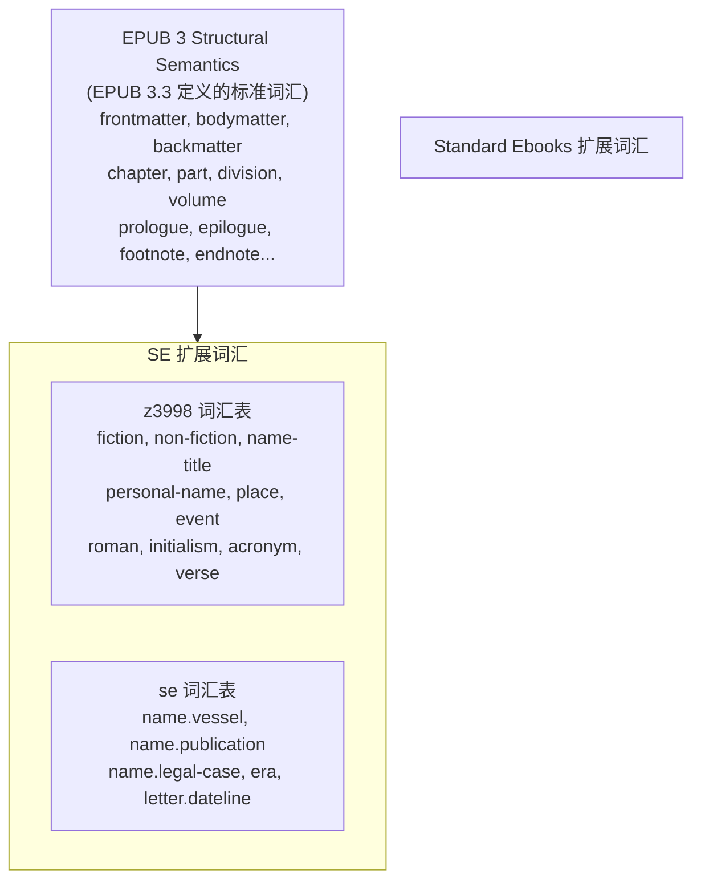
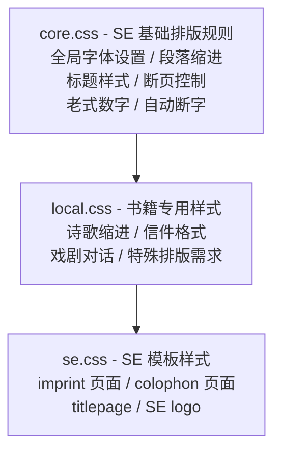

# Standard Ebooks vs EPUB 3 格式对比

## 概述

Standard Ebooks (SE) 是基于 EPUB 3 标准的**严格子集 + 扩展约定**。所有 SE 电子书都是有效的 EPUB 3 文件，但 SE 在标准之上添加了更严格的规范和排版约定。

```
┌────────────────────────────────────────────────────────────────┐
│                      EPUB 3.3 标准                              │
│  ┌──────────────────────────────────────────────────────────┐  │
│  │                Standard Ebooks 规范                       │  │
│  │                                                          │  │
│  │  • 文件命名：强制语义化命名                                │  │
│  │  • 目录结构：固定的 epub/ 目录布局                        │  │
│  │  • 元数据：扩展的 Dublin Core + SE 专用属性               │  │
│  │  • 语义：z3998 + se 扩展词汇表                           │  │
│  │  • 排版：typogrify 排版规范化                            │  │
│  │  • CSS：分层架构 (core/local/se.css)                    │  │
│  │  • 验证：EPUBCheck + SE Lint (300+ 规则)                │  │
│  │                                                          │  │
│  └──────────────────────────────────────────────────────────┘  │
└────────────────────────────────────────────────────────────────┘
```

---

## 一、版本与标准

| 维度 | EPUB 3.3 | Standard Ebooks |
|------|----------|-----------------|
| 发布组织 | W3C | Standard Ebooks 社区 |
| 最新版本 | EPUB 3.3 (2023) | SE Manual 1.8.x |
| 规范性质 | 开放标准 | 实践指南 (基于 EPUB 3) |
| 验证工具 | EPUBCheck | EPUBCheck + SE Lint |
| 适用范围 | 所有电子书 | 公共领域文学作品 |

---

## 二、文件结构对比

### 2.1 目录结构

```
EPUB 3 标准 (灵活)                    Standard Ebooks (固定)
─────────────────────────────────    ─────────────────────────────────
book.epub/                           book.epub/
├── mimetype                         ├── mimetype
├── META-INF/                        ├── META-INF/
│   └── container.xml                │   └── container.xml
└── OEBPS/          ← 名称可变       └── epub/           ← 固定名称
    ├── content.opf                      ├── content.opf
    ├── toc.ncx     ← 可选               ├── toc.xhtml    ← 必须 EPUB 3 NAV
    ├── nav.xhtml                        ├── onix.xml     ← SE 专用
    ├── *.xhtml     ← 命名自由           ├── css/
    ├── *.css                            │   ├── core.css  ← SE 基础样式
    └── images/                          │   ├── local.css ← 书籍专用
                                         │   └── se.css    ← SE 标准样式
                                         ├── images/
                                         │   ├── cover.svg  ← SVG 封面
                                         │   ├── titlepage.svg
                                         │   └── logo.svg
                                         ├── text/
                                         │   ├── colophon.xhtml
                                         │   ├── imprint.xhtml
                                         │   ├── titlepage.xhtml
                                         │   ├── chapter-1.xhtml ← 语义化命名
                                         │   └── ...
                                         └── fonts/        ← 可选嵌入字体
```

### 2.2 文件命名规范

| 类型 | EPUB 3 | Standard Ebooks |
|------|--------|-----------------|
| 章节文件 | 任意命名 | `chapter-1.xhtml`, `chapter-2.xhtml` |
| 封面图片 | 任意命名 | `cover.svg` (必须 SVG) |
| 扉页 | 无要求 | `titlepage.xhtml` + `titlepage.svg` |
| 版权页 | 无要求 | `imprint.xhtml` (固定模板) |
| 版本说明 | 无要求 | `colophon.xhtml` (固定模板) |
| 字符大小写 | 无限制 | 全小写 + 连字符 |

---

## 三、元数据对比

### 3.1 OPF 元数据

| 元数据 | EPUB 3 要求 | SE 要求 |
|--------|-------------|---------|
| `dc:identifier` | 必须 | 必须，格式: `url:https://standardebooks.org/ebooks/...` |
| `dc:title` | 必须 | 必须，含 `file-as` 和 `title-type` 属性 |
| `dc:language` | 必须 | 必须 |
| `dc:creator` | 推荐 | 必须，含 `file-as`, `role`, `display-seq` |
| `dc:source` | 可选 | 必须，原始来源 URL |
| `dc:description` | 可选 | 必须，长短两种描述 |
| `dc:subject` | 可选 | 必须，LCSH 主题词 |
| `meta property="dcterms:modified"` | 必须 | 必须 |
| `meta property="se:*"` | 不存在 | SE 专用扩展属性 |

### 3.2 SE 专用元数据属性

```
SE 扩展的 meta property:
├── se:subject              # SE 分类标签
├── se:production-notes     # 制作说明
├── se:word-count           # 字数统计
├── se:reading-ease         # 可读性评分
├── se:url.encyclopedia.wikipedia  # 维基百科链接
└── se:url.vcs.github       # GitHub 仓库链接
```

---

## 四、语义标记对比

### 4.1 epub:type 词汇表



### 4.2 语义标记示例对比

| 内容 | EPUB 3 (无要求) | Standard Ebooks |
|------|-----------------|-----------------|
| `Mr. Smith` | `Mr. Smith` | `<abbr epub:type="z3998:name-title">Mr.</abbr> Smith` |
| `Chapter XII` | `Chapter XII` | `Chapter <span epub:type="z3998:roman">XII</span>` |
| `U.S.A.` | `U.S.A.` | `<abbr epub:type="z3998:initialism">U.S.A.</abbr>` |
| `1850 AD` | `1850 AD` | `1850 <abbr epub:type="se:era">AD</abbr>` |
| 船名 *Titanic* | `<i>Titanic</i>` | `<i epub:type="se:name.vessel">Titanic</i>` |

---

## 五、CSS 规范对比

### 5.1 CSS 架构

| 维度 | EPUB 3 | Standard Ebooks |
|------|--------|-----------------|
| CSS 版本 | CSS 3 (部分) | CSS 3 (限定子集) |
| 文件数量 | 无限制 | 固定 3 个: core.css, local.css, se.css |
| 命名空间 | 无要求 | 严格的 class 命名规范 |
| 字体单位 | 任意 | 相对单位 (em, %) |

### 5.2 SE CSS 分层架构



### 5.3 SE 特有 CSS 规则

| 规则 | EPUB 3 支持 | SE 强制使用 |
|------|-------------|-------------|
| `font-variant: small-caps` | ✅ | 标题必用 |
| `font-variant-numeric: oldstyle-nums` | ✅ | 全局启用 |
| `hyphens: auto` | ✅ | 全局启用 |
| `text-wrap: pretty` | ✅ | 全局启用 |
| `page-break-after: avoid` | ✅ | 标题必用 |
| `text-indent: 1em` | ✅ | 段落首行 |
| `margin: 0` (段落) | ✅ | 段落无间距 |

---

## 六、排版约定对比

### 6.1 字符处理

| 字符类型 | EPUB 3 | Standard Ebooks |
|----------|--------|-----------------|
| 引号 | `"text"` 或 `"text"` | 必须智能引号 `"text"` |
| 省略号 | `...` 或 `…` | 必须 `…` (U+2026) |
| 破折号 | `--` 或 `—` | 必须 em-dash `—` |
| 连接号 | `-` 或 `–` | 范围用 en-dash `–` |
| 分数 | `1/2` | 必须 `½` (Unicode 分数) |
| 缩写空格 | `Mr. X` | `Mr.␣X` (不换行空格 U+00A0) |

### 6.2 SE 特有字符处理

```
┌─────────────────────────────────────────────────────────────────┐
│                    SE typogrify 处理                             │
├─────────────────────────────────────────────────────────────────┤
│                                                                 │
│  Word Joiner (U+2060) - 防止行首破折号:                          │
│  ├─ 原文: "word—"                                               │
│  └─ 处理后: "word⁠—" (word + WORD_JOINER + em-dash)             │
│                                                                 │
│  Hair Space (U+200A) - 相邻引号间距:                             │
│  ├─ 原文: "'"                                                   │
│  └─ 处理后: "'␣" (开双引号 + HAIR_SPACE + 开单引号)              │
│                                                                 │
│  No-Break Space (U+00A0) - 缩写不换行:                           │
│  ├─ 原文: "Mr. Smith"                                           │
│  └─ 处理后: "Mr.␣Smith" (Mr. + NO_BREAK_SPACE + Smith)          │
│                                                                 │
│  连续破折号合并:                                                  │
│  ├─ ——— → ⸻ (three-em-dash U+2E3B)                            │
│  └─ —— → ⸺ (two-em-dash U+2E3A)                               │
│                                                                 │
└─────────────────────────────────────────────────────────────────┘
```

---

## 七、验证标准对比

### 7.1 验证工具

| 验证器 | 验证范围 | 规则数量 |
|--------|----------|----------|
| EPUBCheck | EPUB 3 标准合规 | ~200 条 |
| SE Lint | SE 规范合规 | 300+ 条 |

### 7.2 验证层次

```
┌─────────────────────────────────────────────────────────────────┐
│                        验证层次                                   │
├─────────────────────────────────────────────────────────────────┤
│                                                                 │
│  Level 1: EPUBCheck (EPUB 3 标准)                               │
│  ├─ ZIP 结构验证                                                │
│  ├─ mimetype 位置和内容                                         │
│  ├─ OPF 必需元素                                                │
│  ├─ XHTML 语法正确性                                            │
│  ├─ 资源引用完整性                                              │
│  └─ 媒体类型正确性                                              │
│                                                                 │
│  Level 2: SE Lint (SE 规范)                                     │
│  ├─ 文件命名规范                                                │
│  ├─ 元数据完整性 (dc:source, se:* 等)                           │
│  ├─ 语义标记正确性 (epub:type)                                  │
│  ├─ CSS 规范遵守                                                │
│  ├─ 排版规则 (引号、破折号等)                                    │
│  ├─ 拼写检查                                                    │
│  └─ 模板文件完整性                                              │
│                                                                 │
└─────────────────────────────────────────────────────────────────┘
```

### 7.3 SE Lint 规则分类

| 分类 | 规则前缀 | 示例 |
|------|----------|------|
| 元数据 | m-xxx | m-001: 缺少 dc:source |
| 语义 | s-xxx | s-001: 缺少 epub:type |
| CSS | c-xxx | c-001: 使用绝对单位 |
| 排版 | t-xxx | t-001: 直引号未替换 |
| 文件结构 | f-xxx | f-001: 文件命名不规范 |
| XHTML | x-xxx | x-001: 属性名大写 |

---

## 八、兼容性分析

### 8.1 SE EPUB 在标准阅读器中的表现

| 阅读器 | 兼容性 | 说明 |
|--------|--------|------|
| Apple Books | ✅ 完全 | 支持所有 SE 特性 |
| Kindle | ⚠️ 部分 | 需转换格式，部分样式丢失 |
| Kobo | ✅ 完全 | 良好支持 |
| Google Play Books | ✅ 完全 | 良好支持 |
| Calibre | ✅ 完全 | 良好支持 |
| Readium | ✅ 完全 | 参考实现 |

### 8.2 潜在兼容性问题

| 特性 | 问题 | 影响范围 |
|------|------|----------|
| SVG 封面 | 部分阅读器不支持 | 显示问题 |
| 老式数字 | 需字体支持 | 视觉差异 |
| Word Joiner | 部分阅读器忽略 | 排版差异 |
| z3998 词汇 | 阅读器不解析 | 无语义增强 |
| se: 词汇 | 阅读器不解析 | 无语义增强 |

---

## 九、对 Readmigo 的启示

### 9.1 可借鉴的 SE 实践

| 实践 | 价值 | 实现复杂度 |
|------|------|-----------|
| 智能引号 | 高 - 提升阅读体验 | 低 |
| 破折号规范化 | 高 - 统一排版 | 低 |
| Word Joiner | 中 - 防止行首标点 | 低 |
| 语义标记 | 低 - 阅读器不支持 | 高 |
| 严格文件命名 | 低 - 内部使用 | 中 |

### 9.2 不需要借鉴的部分

| 实践 | 原因 |
|------|------|
| 固定目录结构 | 内部处理不需要 |
| ONIX 元数据 | 非商业出版 |
| SE 模板页面 | 品牌相关 |
| 严格 Lint | 过度工程化 |

---

## 十、参考资源

| 资源 | 链接 |
|------|------|
| EPUB 3.3 规范 | https://www.w3.org/TR/epub-33/ |
| SE Manual of Style | https://standardebooks.org/manual/1.8.5 |
| EPUB Structural Semantics | https://www.w3.org/TR/epub-ssv-11/ |
| z3998 词汇表 | https://www.daisy.org/z3998/2012/vocab/structure/ |
| EPUBCheck | https://www.w3.org/publishing/epubcheck/ |

---

*文档创建日期: 2026-01-26*
