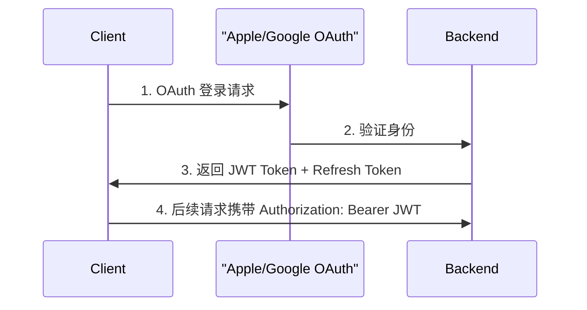

# 安全设计

### 9.1 认证授权



**JWT Token 结构**: sub (user_uuid), email, subscription, iat, exp (1小时过期)

**Token 刷新策略**:
- Access Token: 1小时过期
- Refresh Token: 30天过期，单次使用后更新
- 客户端在 Access Token 过期前5分钟自动刷新

### 9.2 数据安全

```
┌─────────────────────────────────────────────────────────────────────────┐
│                          Data Security                                  │
├─────────────────────────────────────────────────────────────────────────┤
│                                                                         │
│  传输安全                                                                │
│  ══════════                                                              │
│  • 全站HTTPS (TLS 1.3)                                                  │
│  • HSTS头部                                                             │
│  • Certificate Pinning (iOS)                                            │
│                                                                         │
│  存储安全                                                                │
│  ══════════                                                              │
│  • 数据库加密 (AWS RDS / 托管服务自带)                                  │
│  • 敏感字段加密 (如refresh token)                                       │
│  • iOS Keychain存储凭证                                                 │
│  • 定期备份 + 异地容灾                                                  │
│                                                                         │
│  隐私保护                                                                │
│  ══════════                                                              │
│  • GDPR合规                                                             │
│  • 数据最小化原则                                                       │
│  • 用户数据导出功能                                                     │
│  • 账号删除功能                                                         │
│                                                                         │
│  API安全                                                                 │
│  ══════════                                                              │
│  • 速率限制 (Rate Limiting)                                             │
│    - 匿名: 60次/分钟                                                    │
│    - 认证: 300次/分钟                                                   │
│    - AI接口: 10次/分钟 (免费) / 60次/分钟 (付费)                        │
│  • 输入验证和清理                                                       │
│  • SQL注入防护 (参数化查询)                                             │
│  • XSS防护 (内容转义)                                                   │
│                                                                         │
└─────────────────────────────────────────────────────────────────────────┘
```

---

