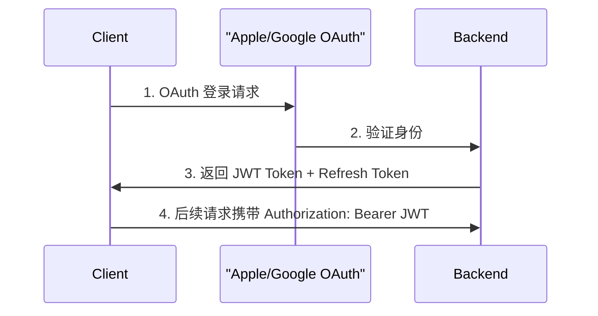

### 9.1 认证授权

```mermaid
sequenceDiagram
    participant C as Client
    participant O as "Apple/Google OAuth"
    participant B as Backend

    C->>O: 1. OAuth 登录请求
    O->>B: 2. 验证身份
    B->>C: 3. 返回 JWT Token + Refresh Token
    C->>B: 4. 后续请求携带 Authorization: Bearer JWT
```

**JWT Token 结构**: sub (user_uuid), email, subscription, iat, exp (1小时过期)

**Token 刷新策略**:
- Access Token: 1小时过期
- Refresh Token: 30天过期，单次使用后更新
- 客户端在 Access Token 过期前5分钟自动刷新

---
