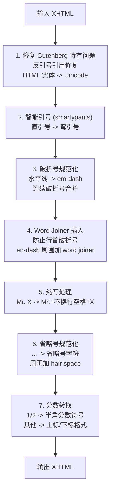

# Standard Ebooks 工具源码分析

## 概述

Standard Ebooks (SE) 是一个开源项目，专门将 Project Gutenberg 等来源的公共领域书籍转换为高质量 EPUB。本文档分析其核心工具源码，为 Readmigo Pipeline 提供参考。

**源码仓库**: https://github.com/standardebooks/tools

---

## 一、项目结构

```
se-tools/
├── se/
│   ├── __init__.py           # 常量定义、异常类
│   ├── typography.py         # 排版处理（typogrify）
│   ├── formatting.py         # 代码格式化（clean）
│   ├── spelling.py           # 拼写现代化
│   ├── se_epub.py            # EPUB 处理核心
│   ├── se_epub_lint.py       # 样式检查（299KB，最大文件）
│   ├── se_epub_build.py      # EPUB 构建
│   ├── se_epub_generate_toc.py # TOC 生成
│   ├── easy_xml.py           # XML 处理封装
│   ├── css.py                # CSS 处理
│   └── commands/             # CLI 命令实现
│       ├── clean.py
│       ├── typogrify.py
│       ├── create_draft.py   # 从 Gutenberg 创建草稿
│       ├── modernize_spelling.py
│       └── ...
└── tests/
```

---

## 二、关键常量定义

**文件**: `se/__init__.py`

```python
# Unicode 特殊字符
NO_BREAK_SPACE = "\u00a0"      # 不换行空格
WORD_JOINER = "\u2060"         # 词连接符（防止换行）
HAIR_SPACE = "\u200a"          # 毛细空格（引号间距）
SHY_HYPHEN = "\u00ad"          # 软连字符
NO_BREAK_HYPHEN = "\u2011"     # 不换行连字符
ZERO_WIDTH_SPACE = "\ufeff"    # 零宽空格

# 封面尺寸标准
COVER_HEIGHT = 2100
COVER_WIDTH = 1400
```

### 用途说明

| 字符 | Unicode | 用途 |
|-----|---------|------|
| NO_BREAK_SPACE | U+00A0 | `Mr.` 后面，防止缩写与名字分行 |
| WORD_JOINER | U+2060 | em-dash 前面，防止破折号成为行首 |
| HAIR_SPACE | U+200A | 相邻引号之间 `"'` → `"␣'` |
| SHY_HYPHEN | U+00AD | 单词内部，允许在此处断字 |

---

## 三、Gutenberg Boilerplate 清理

**文件**: `se/commands/create_draft.py`

### 3.1 清理策略

```
┌─────────────────────────────────────────────────────────────────┐
│                    Gutenberg 文件结构                            │
├─────────────────────────────────────────────────────────────────┤
│                                                                 │
│  ┌─────────────────────────────────────────┐                   │
│  │ PG Header (需删除)                       │                   │
│  │ - Project Gutenberg 元信息               │                   │
│  │ - 版权声明                               │                   │
│  │ - *** START OF THIS PROJECT ***         │                   │
│  └─────────────────────────────────────────┘                   │
│                                                                 │
│  ┌─────────────────────────────────────────┐                   │
│  │ 正文内容 (保留)                          │                   │
│  └─────────────────────────────────────────┘                   │
│                                                                 │
│  ┌─────────────────────────────────────────┐                   │
│  │ PG Footer (需删除)                       │                   │
│  │ - End of Project Gutenberg              │                   │
│  │ - 许可证信息                             │                   │
│  │ - 捐款信息                               │                   │
│  └─────────────────────────────────────────┘                   │
│                                                                 │
└─────────────────────────────────────────────────────────────────┘
```

### 3.2 核心清理代码

```python
# 新版 PG 结构：有明确的 CSS 类标记
nodes = dom.xpath("//section[contains(@class, 'pg-boilerplate')]")
if nodes:
    for node in nodes:
        node.remove()
else:
    # 旧版 PG 结构：基于文本模式匹配

    # 1. 删除 "*** START OF" 标记及其之前的所有内容
    for node in dom.xpath(
        "//*[re:test(text(), '\\*\\*\\*\\s*START OF (THE|THIS)')]"
    ):
        for sibling in node.xpath("./preceding-sibling::*"):
            sibling.remove()
        node.remove()

    # 2. 删除 "End of Project Gutenberg" 标记及其之后的所有内容
    for node in dom.xpath(
        "//*[re:test(text(), 'End of (the )?Project Gutenberg')]"
    ):
        for sibling in node.xpath("./following-sibling::*"):
            sibling.remove()
        node.remove()
```

### 3.3 可复用的正则模式

```typescript
// TypeScript 版本 - 可用于 Readmigo Pipeline
const PG_BOILERPLATE_PATTERNS = {
  // 新版 PG HTML 结构
  newStyleBoilerplate: /class="pg-boilerplate"/,

  // 旧版 PG 文本标记
  startMarker: /\*{3}\s*START OF (THE|THIS) PROJECT GUTENBERG/i,
  endMarker: /End of (the )?Project Gutenberg/i,
  endMarkerAlt: /\*{3}\s*END OF (THE|THIS) PROJECT GUTENBERG/i,

  // 其他常见 PG 元素
  smallPrint: /\*{3}\s*START:\s*FULL LICENSE/i,
  transcribersNote: /Transcriber'?s? Note/i,
};
```

---

## 四、排版处理 (typogrify)

**文件**: `se/typography.py`

### 4.1 处理流程



### 4.2 核心正则表达式

```python
# Gutenberg 反引号修复
xhtml = xhtml.replace("`", "'")

# 水平线 → em-dash
xhtml = xhtml.replace("―", "—")

# 空格 + en-dash → em-dash
xhtml = regex.sub(r"\s–\s?", f"{WORD_JOINER}—", xhtml)

# 连续破折号合并
xhtml = xhtml.replace("———", "⸻")  # three-em-dash
xhtml = xhtml.replace("——", "⸺")   # two-em-dash

# em-dash 前加 word joiner
xhtml = regex.sub(
    fr"([^\s{WORD_JOINER}{NO_BREAK_SPACE}{HAIR_SPACE}])([—⸻])",
    fr"\1{WORD_JOINER}\2",
    xhtml
)

# en-dash 两侧加 word joiner
xhtml = regex.sub(
    fr"{WORD_JOINER}?–{WORD_JOINER}?",
    fr"{WORD_JOINER}–{WORD_JOINER}",
    xhtml
)

# 缩写 + 不换行空格
xhtml = regex.sub(
    r"\b(Mr|Mrs|Ms|Dr|Prof|Lt|Capt|Esq|Mt|St)\.\s+",
    fr"\1.{NO_BREAK_SPACE}",
    xhtml
)

# 省略号规范化
xhtml = regex.sub(r"\s*\.\s*\.\s*\.\s*", r"…", xhtml)

# 相邻引号加 hair space
xhtml = regex.sub(fr""[\s]*'", fr""{HAIR_SPACE}'", xhtml)
xhtml = regex.sub(fr"'[\s]*"", fr"'{HAIR_SPACE}"", xhtml)

# 分数转换
FRACTION_MAP = {
    r"1/4": "¼", r"1/2": "½", r"3/4": "¾",
    r"1/3": "⅓", r"2/3": "⅔",
    r"1/5": "⅕", r"2/5": "⅖", r"3/5": "⅗", r"4/5": "⅘",
    r"1/6": "⅙", r"5/6": "⅚",
    r"1/8": "⅛", r"3/8": "⅜", r"5/8": "⅝", r"7/8": "⅞",
}
```

### 4.3 TypeScript 移植版本

```typescript
// 可直接用于 Readmigo Pipeline
const WORD_JOINER = '\u2060';
const NO_BREAK_SPACE = '\u00a0';
const HAIR_SPACE = '\u200a';

function typogrify(html: string): string {
  // 1. Gutenberg 反引号修复
  html = html.replace(/`/g, "'");

  // 2. 破折号规范化
  html = html.replace(/―/g, '—');  // 水平线 → em-dash
  html = html.replace(/\s–\s?/g, `${WORD_JOINER}—`);
  html = html.replace(/———/g, '⸻');
  html = html.replace(/——/g, '⸺');

  // 3. Word joiner 插入
  html = html.replace(/([^\s\u2060\u00a0\u200a])([—⸻])/g, `$1${WORD_JOINER}$2`);

  // 4. En-dash word joiner
  html = html.replace(/\u2060?–\u2060?/g, `${WORD_JOINER}–${WORD_JOINER}`);

  // 5. 省略号
  html = html.replace(/\s*\.\s*\.\s*\.\s*/g, '…');

  // 6. 相邻引号 hair space
  html = html.replace(/"\s*'/g, `"${HAIR_SPACE}'`);
  html = html.replace(/'\s*"/g, `'${HAIR_SPACE}"`);

  // 7. 分数
  const fractions: Record<string, string> = {
    '1/4': '¼', '1/2': '½', '3/4': '¾',
    '1/3': '⅓', '2/3': '⅔',
  };
  for (const [pattern, replacement] of Object.entries(fractions)) {
    html = html.replace(new RegExp(`\\b${pattern}\\b`, 'g'), replacement);
  }

  return html;
}
```

---

## 五、代码格式化 (clean)

**文件**: `se/formatting.py`

### 5.1 处理流程

```
se clean
    │
    ├── .xhtml → format_xhtml()
    │   ├── HTML 实体 → Unicode
    │   ├── 移除 DOCTYPE
    │   ├── 移除标签与文本间空白
    │   ├── XML 规范化 (c14n)
    │   ├── 缩进美化
    │   └── 属性名小写化
    │
    ├── .svg → format_svg()
    │   └── XML 规范化 + 缩进
    │
    ├── .opf → format_opf()
    │   └── 元数据排序 + 规范化
    │
    └── .css → format_css()
        ├── tinycss2 解析
        ├── @规则排序
        ├── 选择器格式化
        ├── 声明排序
        └── 移除空规则
```

### 5.2 XHTML 格式化核心代码

```python
def format_xhtml(xhtml: str) -> str:
    # 1. HTML 实体 → Unicode
    xhtml = regex.sub(r"&#?\w+;", _replace_character_references, xhtml)

    # 2. 移除 DOCTYPE (EPUB3 不需要)
    xhtml = regex.sub(r"<!DOCTYPE[^>]+?>", "", xhtml)

    # 3. 移除标签与文本间的空白
    xhtml = regex.sub(r"(<[^!/][^>]*?>)\s+([^\s<])", r"\1\2", xhtml)
    xhtml = regex.sub(r"([^\s>])\s+(</[^>]+?>)", r"\1\2", xhtml)

    # 4. XML 规范化
    tree = etree.fromstring(xhtml.encode())
    canonical_bytes = etree.tostring(tree, method="c14n")
    tree = etree.fromstring(canonical_bytes)

    # 5. 缩进美化
    _indent(tree, space="\t")

    # 6. 属性名小写化
    for node in tree.xpath("//*[attribute::*]"):
        for key, value in node.items():
            if key != key.lower():
                node.attrib.pop(key)
                node.set(key.lower(), value)

    return etree.tostring(tree, encoding="unicode")
```

---

## 六、语义标记 (semanticate)

**文件**: `se/formatting.py`

### 6.1 自动添加的语义标签

| 原文 | 转换后 | 语义类型 |
|-----|-------|---------|
| `Mr.` | `<abbr epub:type="z3998:name-title">Mr.</abbr>` | 称谓缩写 |
| `Dr.` | `<abbr epub:type="z3998:name-title">Dr.</abbr>` | 称谓缩写 |
| `U.S.A.` | `<abbr epub:type="z3998:initialism z3998:place">U.S.A.</abbr>` | 首字母缩写+地名 |
| `XII` | `<span epub:type="z3998:roman">XII</span>` | 罗马数字 |
| `AD` | `<abbr epub:type="se:era">AD</abbr>` | 年代标记 |
| `10 kg` | `10<abbr>kg</abbr>` | 单位 |
| `etc.` | `<abbr class="eoc">etc.</abbr>` | 从句结尾 |

### 6.2 罗马数字识别

```python
def _is_roman(numeral: str) -> bool:
    """验证是否为有效罗马数字"""
    numeral = regex.sub(r"(st|[nr]d|th)$", "", numeral)  # 移除序数后缀
    numeral = regex.sub(r"([a-z])+j", r"\1i", numeral)   # j → i (古典写法)

    try:
        roman.fromRoman(numeral.upper())
        return True
    except roman.InvalidRomanNumeralError:
        return False

# 识别并标记罗马数字
xhtml = regex.sub(
    r"(?<![<>/\"])\b(?=[IXV]+)((?:X{0,3})(?:I[XV]|V?I{0,3}J?))(\b|st\b|[nr]d\b|th\b)",
    lambda m: f'<span epub:type="z3998:roman">{m.group(1)}</span>{m.group(2) or ""}'
              if _is_roman(m.group(1)) else m.group(1),
    xhtml,
    flags=regex.IGNORECASE
)
```

---

## 七、Lint 检查规则

**文件**: `se/se_epub_lint.py` (299KB，3800+ 行)

### 7.1 Gutenberg 相关检查

```python
# 检查 Gutenberg URL 格式是否规范
LINT_RULES = {
    "m-002": "Non-canonical Project Gutenberg Canada URL",
    "m-006": "Non-canonical Project Gutenberg URL",
    "m-076": "Non-canonical Project Gutenberg Australia URL",
}

# 期望的 URL 格式
EXPECTED_PG_URL = r"^https://www\.gutenberg\.org(/|/ebooks/[0-9]+)$"
EXPECTED_PG_CA_URL = r"^https://gutenberg\.ca/.+\.html$"
EXPECTED_PG_AU_URL = r"^https://www\.gutenberg\.net\.au(/|/.+\.html)$"
```

### 7.2 Boilerplate 检查

```python
# 检查是否引用了不应存在的样式文件
"x-020": "Link to se.css in <head>, but this file isn't an S.E. boilerplate file"

# 检查源文件链接格式
for node in dom.xpath("//a[contains(@href, 'gutenberg.org')]"):
    if f'<a href="{link}">Project Gutenberg</a>' not in source_file:
        missing_source_links.append(...)
```

---

## 八、与 Readmigo Pipeline 的映射

### 8.1 功能对应表

| SE 工具 | SE 功能 | Readmigo 对应 | 状态 |
|--------|--------|--------------|------|
| `se create-draft --pg-id` | 下载并清理 PG 书籍 | Pipeline Import | 需实现 |
| `se clean` | XHTML/CSS 规范化 | Pipeline Normalize | 部分实现 |
| `se typogrify` | 排版规范化 | Pipeline Typography | 需实现 |
| `se semanticate` | 语义标记 | - | 可选 |
| `se lint` | 样式检查 | Content Studio Validation | 需实现 |
| `se build` | 构建 EPUB | 现有流程 | 已实现 |

### 8.2 建议实现优先级

```
┌─────────────────────────────────────────────────────────────────┐
│                    实现优先级                                     │
├─────────────────────────────────────────────────────────────────┤
│                                                                 │
│  P0 (必须)                                                       │
│  ├─ Boilerplate 清理 (create_draft.py 逻辑)                     │
│  └─ 基础排版规范化 (破折号、省略号)                               │
│                                                                 │
│  P1 (重要)                                                       │
│  ├─ Word Joiner 处理 (防止行首破折号)                            │
│  ├─ 智能引号处理                                                 │
│  └─ 缩写不换行空格                                               │
│                                                                 │
│  P2 (可选)                                                       │
│  ├─ 分数 Unicode 转换                                            │
│  ├─ 语义标记 (abbr, roman)                                       │
│  └─ Lint 规则                                                    │
│                                                                 │
└─────────────────────────────────────────────────────────────────┘
```

---

## 九、关键依赖库

| 库 | 用途 | PyPI |
|---|------|------|
| smartypants | 智能引号 | `pip install smartypants` |
| pyphen | 断字处理 | `pip install pyphen` |
| tinycss2 | CSS 解析 | `pip install tinycss2` |
| lxml | XML 处理 | `pip install lxml` |
| roman | 罗马数字 | `pip install roman` |
| regex | 高级正则 | `pip install regex` |

### TypeScript/JavaScript 替代

| Python 库 | JS/TS 替代 |
|----------|-----------|
| smartypants | `smartquotes` / 自实现 |
| pyphen | `hyphenopoly` |
| tinycss2 | `css-tree` / `postcss` |
| lxml | `cheerio` / `jsdom` |
| roman | `roman-numerals` |

---

## 十、参考资源

| 资源 | 链接 |
|-----|------|
| SE 工具 GitHub | https://github.com/standardebooks/tools |
| SE Manual of Style | https://standardebooks.org/manual/1.8.5 |
| 排版规范章节 | https://standardebooks.org/manual/1.8.5/8-typography |
| XHTML/CSS 模式 | https://standardebooks.org/manual/1.8.5/5-general-xhtml-and-css-patterns |
| 制作指南 | https://standardebooks.org/contribute/producing-an-ebook-step-by-step |

---

*文档创建日期: 2026-01-26*
