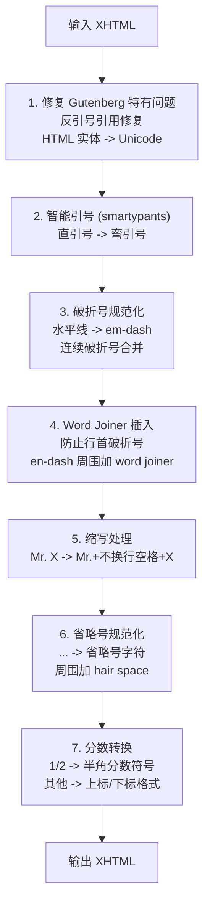

## 概述

Standard Ebooks (SE) 是一个开源项目，专门将 Project Gutenberg 等来源的公共领域书籍转换为高质量 EPUB。本文档分析其核心工具源码，为 Readmigo Pipeline 提供参考。

**源码仓库**: https://github.com/standardebooks/tools

---

## 二、关键常量定义

**文件**: `se/__init__.py`

### 用途说明

| 字符 | Unicode | 用途 |
|-----|---------|------|
| NO_BREAK_SPACE | U+00A0 | `Mr.` 后面，防止缩写与名字分行 |
| WORD_JOINER | U+2060 | em-dash 前面，防止破折号成为行首 |
| HAIR_SPACE | U+200A | 相邻引号之间 `"'` → `"␣'` |
| SHY_HYPHEN | U+00AD | 单词内部，允许在此处断字 |

---

## 三、Gutenberg Boilerplate 清理

**文件**: `se/commands/create_draft.py`

---

## 四、排版处理 (typogrify)

**文件**: `se/typography.py`

### 4.1 处理流程

---

## 五、代码格式化 (clean)

**文件**: `se/formatting.py`

---

## 六、语义标记 (semanticate)

**文件**: `se/formatting.py`

### 6.1 自动添加的语义标签

| 原文 | 转换后 | 语义类型 |
|-----|-------|---------|
| `Mr.` | `<abbr epub:type="z3998:name-title">Mr.</abbr>` | 称谓缩写 |
| `Dr.` | `<abbr epub:type="z3998:name-title">Dr.</abbr>` | 称谓缩写 |
| `U.S.A.` | `<abbr epub:type="z3998:initialism z3998:place">U.S.A.</abbr>` | 首字母缩写+地名 |
| `XII` | `XII` | 罗马数字 |
| `AD` | `<abbr epub:type="se:era">AD</abbr>` | 年代标记 |
| `10 kg` | `10<abbr>kg</abbr>` | 单位 |
| `etc.` | `<abbr class="eoc">etc.</abbr>` | 从句结尾 |

---

## 七、Lint 检查规则

**文件**: `se/se_epub_lint.py` (299KB，3800+ 行)

---

### 8.1 功能对应表

| SE 工具 | SE 功能 | Readmigo 对应 | 状态 |
|--------|--------|--------------|------|
| `se create-draft --pg-id` | 下载并清理 PG 书籍 | Pipeline Import | 需实现 |
| `se clean` | XHTML/CSS 规范化 | Pipeline Normalize | 部分实现 |
| `se typogrify` | 排版规范化 | Pipeline Typography | 需实现 |
| `se semanticate` | 语义标记 | - | 可选 |
| `se lint` | 样式检查 | Content Studio Validation | 需实现 |
| `se build` | 构建 EPUB | 现有流程 | 已实现 |

---

## 九、关键依赖库

| 库 | 用途 | PyPI |
|---|------|------|
| smartypants | 智能引号 | `pip install smartypants` |
| pyphen | 断字处理 | `pip install pyphen` |
| tinycss2 | CSS 解析 | `pip install tinycss2` |
| lxml | XML 处理 | `pip install lxml` |
| roman | 罗马数字 | `pip install roman` |
| regex | 高级正则 | `pip install regex` |

### TypeScript/JavaScript 替代

| Python 库 | JS/TS 替代 |
|----------|-----------|
| smartypants | `smartquotes` / 自实现 |
| pyphen | `hyphenopoly` |
| tinycss2 | `css-tree` / `postcss` |
| lxml | `cheerio` / `jsdom` |
| roman | `roman-numerals` |

---

## 十、参考资源

| 资源 | 链接 |
|-----|------|
| SE 工具 GitHub | https://github.com/standardebooks/tools |
| SE Manual of Style | https://standardebooks.org/manual/1.8.5 |
| 排版规范章节 | https://standardebooks.org/manual/1.8.5/8-typography |
| XHTML/CSS 模式 | https://standardebooks.org/manual/1.8.5/5-general-xhtml-and-css-patterns |
| 制作指南 | https://standardebooks.org/contribute/producing-an-ebook-step-by-step |

---

*文档创建日期: 2026-01-26*
