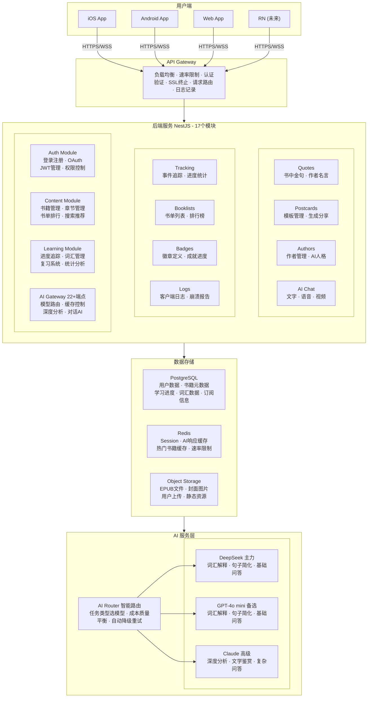
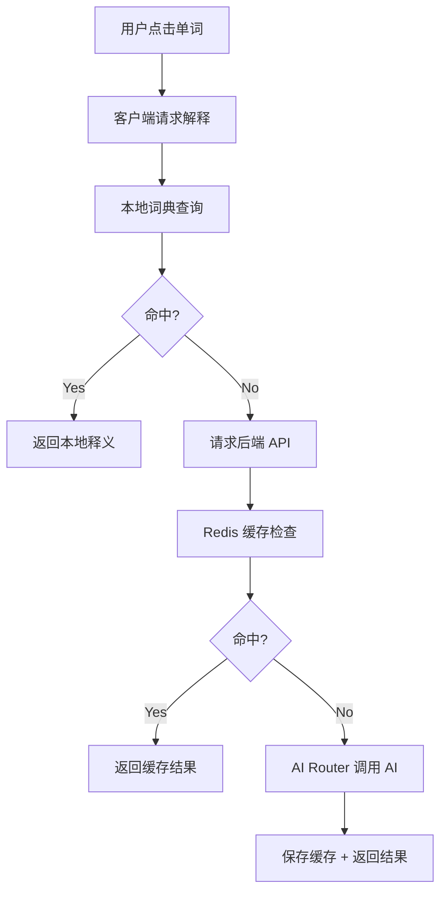

# 系统架构图

### 2.1 整体架构

```mermaid
graph TD
    subgraph UserLayer["用户端"]
        direction LR
        iOS[iOS App]
        Android[Android App]
        Web[Web App]
        RN["RN (未来)"]
    end

    subgraph GW["API Gateway"]
        Gateway["负载均衡 · 速率限制 · 认证验证 · SSL终止 · 请求路由 · 日志记录"]
    end

    iOS -->|HTTPS/WSS| Gateway
    Android -->|HTTPS/WSS| Gateway
    Web -->|HTTPS/WSS| Gateway
    RN -->|HTTPS/WSS| Gateway

    subgraph Backend["后端服务 NestJS - 17个模块"]
        subgraph Row1[" "]
            direction LR
            Auth["Auth Module\n登录注册 · OAuth\nJWT管理 · 权限控制"]
            Content["Content Module\n书籍管理 · 章节管理\n书单排行 · 搜索推荐"]
            Learning["Learning Module\n进度追踪 · 词汇管理\n复习系统 · 统计分析"]
            AIGw["AI Gateway 22+端点\n模型路由 · 缓存控制\n深度分析 · 对话AI"]
        end
        subgraph Row2[" "]
            direction LR
            Tracking["Tracking\n事件追踪 · 进度统计"]
            Booklists["Booklists\n书单列表 · 排行榜"]
            Badges["Badges\n徽章定义 · 成就进度"]
            Logs["Logs\n客户端日志 · 崩溃报告"]
        end
        subgraph Row3[" "]
            direction LR
            Quotes["Quotes\n书中金句 · 作者名言"]
            Postcards["Postcards\n模板管理 · 生成分享"]
            Authors["Authors\n作者管理 · AI人格"]
            AIChat["AI Chat\n文字 · 语音 · 视频"]
        end
        Row1 ~~~ Row2 ~~~ Row3
    end

    Gateway --> Backend

    subgraph Storage["数据存储"]
        direction LR
        PG["PostgreSQL\n用户数据 · 书籍元数据\n学习进度 · 词汇数据 · 订阅信息"]
        Redis["Redis\nSession · AI响应缓存\n热门书籍缓存 · 速率限制"]
        ObjStore["Object Storage\nEPUB文件 · 封面图片\n用户上传 · 静态资源"]
    end

    Backend --> Storage

    subgraph AILayer["AI 服务层"]
        Router["AI Router 智能路由\n任务类型选模型 · 成本质量平衡 · 自动降级重试"]
        subgraph Models[" "]
            direction LR
            DeepSeek["DeepSeek 主力\n词汇解释 · 句子简化 · 基础问答"]
            GPT["GPT-4o mini 备选\n词汇解释 · 句子简化 · 基础问答"]
            Claude["Claude 高级\n深度分析 · 文学鉴赏 · 复杂问答"]
        end
        Router --> DeepSeek
        Router --> GPT
        Router --> Claude
    end

    Storage --> AILayer
```

### 2.2 数据流图

```mermaid
flowchart TD
    A[用户点击单词] --> B[客户端请求解释]
    B --> C[本地词典查询]
    C --> D{命中?}
    D -->|Yes| E[返回本地释义]
    D -->|No| F[请求后端 API]
    F --> G[Redis 缓存检查]
    G --> H{命中?}
    H -->|Yes| I[返回缓存结果]
    H -->|No| J[AI Router 调用 AI]
    J --> K[保存缓存 + 返回结果]
```

---

