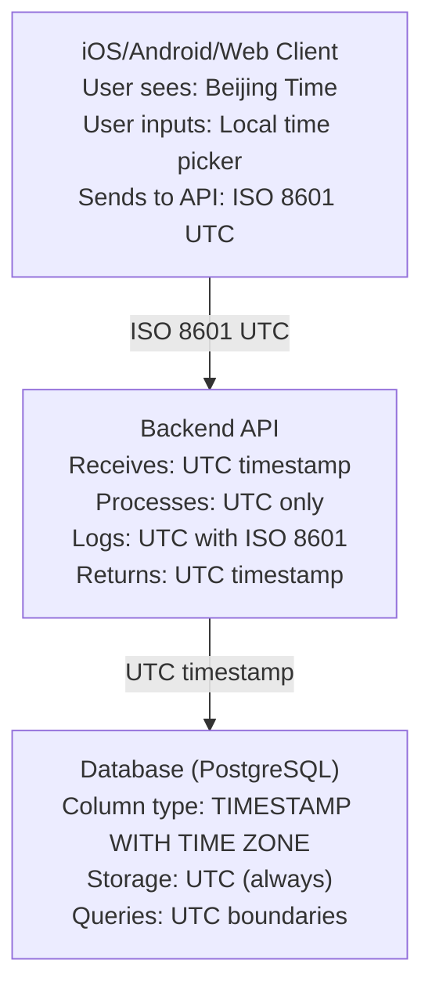

## Overview

本文档定义 Readmigo 全栈时区处理规范，确保：
- 服务全球用户
- 数据统计准确
- Bug 排查高效

---

### Why UTC?

| Aspect | UTC Approach | Local Time Approach |
|--------|--------------|---------------------|
| Storage consistency | Single source of truth | Ambiguous during DST |
| Cross-timezone queries | Simple range queries | Complex conversions |
| Data aggregation | Direct comparison | Requires normalization |
| Debug tracing | One timeline | Multiple timelines |

---

## Architecture Overview

---

#### PostgreSQL Storage

| Column Type | Storage | Recommendation |
|-------------|---------|----------------|
| `TIMESTAMP WITH TIME ZONE` | UTC internally | **Use this** |
| `TIMESTAMP WITHOUT TIME ZONE` | No timezone info | Avoid |
| `DATE` | Date only (no time) | For date-only fields |

---

#### UTC Method Reference

| Local Method | UTC Equivalent | Usage |
|--------------|----------------|-------|
| `getDate()` | `getUTCDate()` | Day of month |
| `getMonth()` | `getUTCMonth()` | Month (0-11) |
| `getFullYear()` | `getUTCFullYear()` | Year |
| `getHours()` | `getUTCHours()` | Hour |
| `setDate()` | `setUTCDate()` | Set day |
| `setMonth()` | `setUTCMonth()` | Set month |
| `setFullYear()` | `setUTCFullYear()` | Set year |
| `setHours()` | `setUTCHours()` | Set hour |

---

### Debugging Checklist

When a user reports a time-related issue:

### Common Issues & Solutions

| Issue | Cause | Solution |
|-------|-------|----------|
| DAU shows 0 but users are active | Using `setHours()` instead of `setUTCHours()` | Use UTC methods |
| Events appear on wrong day | Server timezone ≠ UTC | Set server to UTC or use UTC methods |
| User sees wrong time | Client not converting UTC to local | Add timezone conversion on display |
| "Yesterday" data missing | Date boundary off by hours | Use UTC midnight boundaries |

---

### User-Facing Reports

For user-facing time displays (e.g., "Your reading history"):

---

## Code Review Checklist

When reviewing timezone-related code:

---

### Fixing Existing Code

When migrating from local time to UTC:

1. **Audit** all `setHours()`, `getDate()`, etc. calls
2. **Replace** with UTC equivalents
3. **Test** with server in different timezones
4. **Verify** cron jobs produce consistent results

---

## Summary

| Layer | Storage | Transmission | Display |
|-------|---------|--------------|---------|
| Database | UTC (TIMESTAMP WITH TIME ZONE) | - | - |
| Backend | UTC | ISO 8601 UTC | - |
| API | - | ISO 8601 UTC (`...Z`) | - |
| Client | UTC internally | ISO 8601 UTC | User's local time |
| Logs | UTC | - | - |

**Remember**: Store UTC, Transmit UTC, Display Local.
