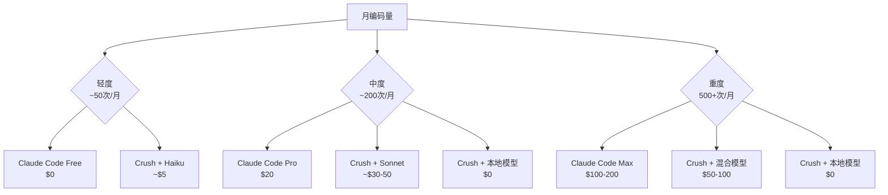
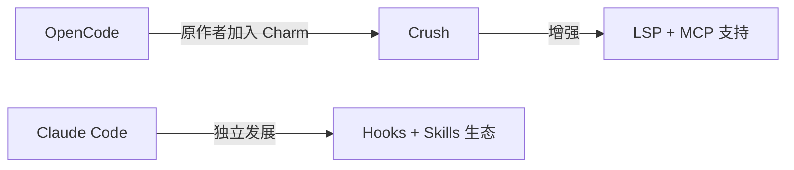
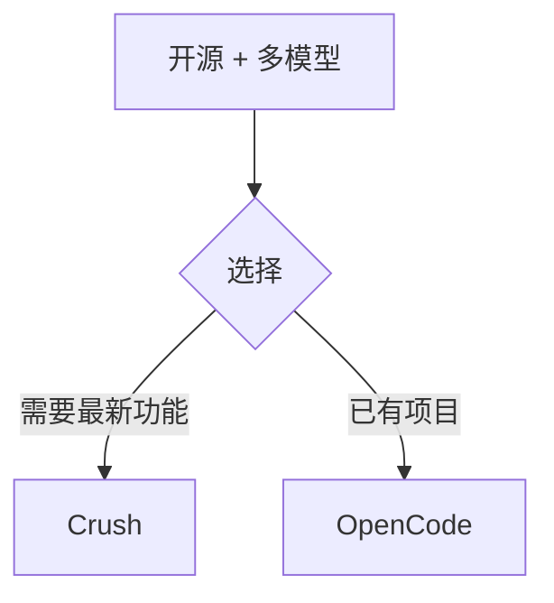
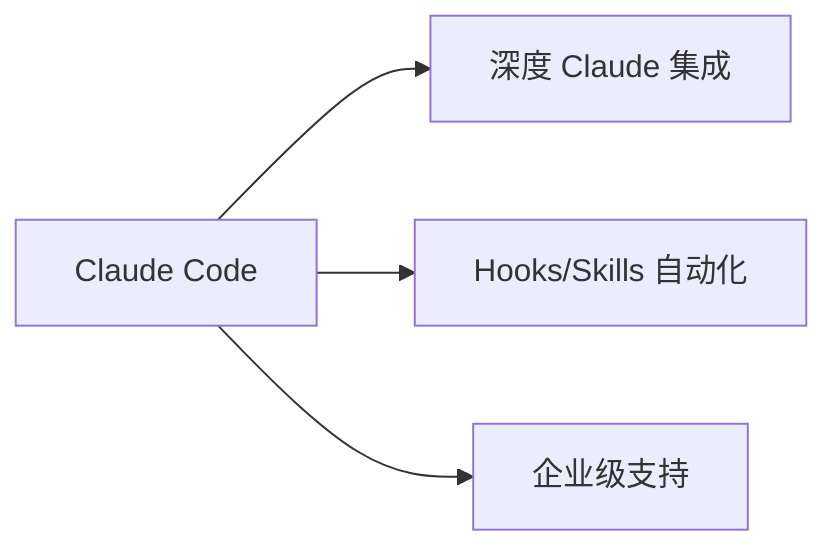
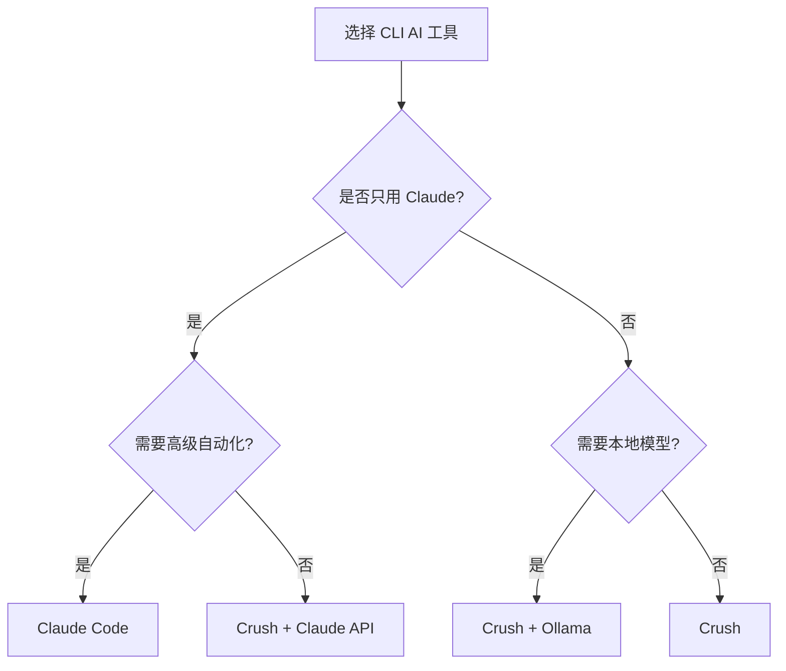

# OpenCode vs Claude Code vs Crush 对比

## 基本信息

| 维度 | OpenCode | Crush | Claude Code |
|------|----------|-------|-------------|
| **开发者** | 开源社区 | Charm 团队 (charmbracelet) | Anthropic 官方 |
| **关系** | 原版 | OpenCode 继任者 | 独立产品 |
| **开源协议** | MIT License | MIT License | 专有 |
| **语言** | Go | Go | TypeScript |
| **模型支持** | 75+ 提供商 | 多模型（OpenAI, Claude, Gemini, Groq 等） | 仅 Claude 系列 |
| **界面** | TUI + 桌面 + IDE | TUI 终端 | 终端 + IDE 扩展 |
| **定价** | 免费 + API 费用 | 免费 + API 费用 | Claude API 用量计费 |
| **GitHub Stars** | 48,000+ | 8,900+ | 47,000+ |

## ⭐ 编码能力效果（核心维度）

### 基准测试

| 指标 | OpenCode/Crush | Claude Code |
|------|----------------|-------------|
| **SWE-Bench Verified** | 取决于所用模型 | 80.9%（Claude Opus 4.5） |
| **任务完成速度** | 9m16s（完整测试） | 3m16s（子集测试） |
| **测试覆盖** | 更彻底（完整测试套件） | 更快（子集验证） |
| **基础功能完整性** | 部分功能缺失 | 完全可用 |

### 效果评价

```
编码质量      ░░░░░░░░░░░░░░░░░░░░░░░░░░░░░░░░░░░░░░░░
              |-------- 取决于模型 --------|-- Claude 专属优化 --|

OpenCode/Crush: ████████████████████████░░░░░░░░░░░░░░░░  (模型决定上限)
Claude Code:    ████████████████████████████████████████  (深度优化 Claude)
```

| 工具 | 编码效果评价 |
|------|-------------|
| **OpenCode/Crush** | 效果取决于所选模型；用 Claude API 时效果接近；用便宜模型时效果下降 |
| **Claude Code** | 针对 Claude 深度优化，Prompt Engineering + 工具链完美适配，同模型下效果最佳 |

### 关键结论

> **"Claude Code 为速度而生，OpenCode/Crush 为彻底性而生"**
>
> 评测显示 Crush 在基础功能测试中存在缺陷，Claude Code 是唯一完全可用的选项（尽管仅限 Claude 模型）

## ⭐ 费用对比（核心维度）

### 工具本身费用

| 工具 | 工具费用 | 说明 |
|------|----------|------|
| **OpenCode** | 免费 | MIT 开源 |
| **Crush** | 免费 | MIT 开源 |
| **Claude Code** | 免费 / $20-200/月 | 可用 API Key 或订阅 |

### Claude Code 订阅方案

| 方案 | 月费 | 用量 |
|------|------|------|
| Free | $0 | 每日有限消息 |
| Pro | $20 | ~45 消息/5小时 |
| Max 5x | $100 | Pro 的 5 倍 |
| Max 20x | $200 | Pro 的 20 倍 |

### API Token 费用（2026 年初）

| 模型 | 输入 ($/1M tokens) | 输出 ($/1M tokens) | 适用场景 |
|------|-------------------|-------------------|----------|
| **Claude Haiku 4.5** | $1 | $5 | 简单任务、批量处理 |
| **Claude Sonnet** | $3 | $15 | 日常编码 |
| **Claude Opus 4.5** | $15 | $75 | 复杂任务、高质量需求 |
| **GPT-4o** | $2.5 | $10 | OpenCode/Crush 可选 |
| **Gemini Pro** | $1.25 | $5 | OpenCode/Crush 可选 |
| **本地 Ollama** | $0 | $0 | OpenCode/Crush 专属 |

### 实际费用场景分析



### 费用效率

| 场景 | 更省钱的选择 | 原因 |
|------|-------------|------|
| 只用 Claude，轻度使用 | Claude Code Free | 免费额度足够 |
| 只用 Claude，中重度 | Claude Code Pro/Max | 订阅比 API 划算 |
| 想省钱，质量可接受 | Crush + Haiku/Gemini | 便宜模型 |
| 极致省钱 | Crush + Ollama 本地 | 零 API 费用 |
| 多模型混用 | Crush | 灵活切换最优价格 |

### Token 效率对比

> Claude Code 有 **5.5x Token 效率优势**：同样任务在 Cursor 消耗 100K tokens，在 Claude Code 可能仅需 18K tokens

## 核心功能对比

| 功能 | OpenCode | Crush | Claude Code |
|------|----------|-------|-------------|
| **多模型支持** | ✅ 75+ 提供商 | ✅ 主流提供商 | ❌ 仅 Claude |
| **本地模型** | ✅ Ollama | ✅ Ollama | ❌ |
| **LSP 集成** | ✅ | ✅ | ❌ |
| **MCP 协议** | ❌ | ✅ stdio/HTTP/SSE | ✅ |
| **Hooks 系统** | ❌ | ❌ | ✅ PreToolUse/PostToolUse |
| **Skills 系统** | ❌ | ❌ | ✅ 自定义技能 |
| **计划模式** | ❌ | ❌ | ✅ Plan Mode |
| **多会话并行** | ✅ | ✅ | ✅ Task agent |
| **会话管理** | ✅ | ✅ 按项目保存 | ✅ |
| **模型热切换** | ✅ | ✅ | ❌ |
| **跨平台** | macOS/Linux/Windows | macOS/Linux/Windows/BSD | macOS/Linux/Windows |

## 演进关系



## 适用场景

### 选 OpenCode / Crush



- 需要多模型自由切换
- 想用本地模型（隐私/离线）
- 需要 LSP 代码智能
- 预算有限

**Crush vs OpenCode**：Crush 是 OpenCode 的官方继任者，推荐新用户直接用 Crush

### 选 Claude Code



- 追求最佳 Claude 体验
- 需要 Hooks/Skills 高级工作流
- 已投入 Anthropic 生态
- 需要官方技术支持

## 功能矩阵

```
                    模型灵活性    LSP智能    MCP扩展    工作流自动化    官方支持
OpenCode            ████████████  ████████   ░░░░░░░░   ░░░░░░░░░░░░   ░░░░░░░░
Crush               ████████████  ████████   ████████   ░░░░░░░░░░░░   ████████
Claude Code         ░░░░░░░░░░░░  ░░░░░░░░   ████████   ████████████   ████████
```

## 总结

| 工具 | 核心优势 | 核心劣势 |
|------|----------|----------|
| **OpenCode** | 开源先驱、多模型 | 已停止更新，建议迁移到 Crush |
| **Crush** | 多模型 + LSP + MCP、Charm 团队维护 | 无 Hooks/Skills 系统 |
| **Claude Code** | Hooks/Skills/深度 Claude 集成 | 仅支持 Claude、无 LSP |

**推荐决策树**：



## 参考链接

### 官方资源
- [OpenCode GitHub](https://github.com/opencode-ai/opencode)
- [Crush GitHub](https://github.com/charmbracelet/crush)
- [Crush 官方博客](https://charm.land/blog/crush-comes-home/)
- [Claude Code GitHub](https://github.com/anthropics/claude-code)
- [Claude Code 产品页](https://claude.com/product/claude-code)

### 对比评测
- [OpenCode vs Claude Code vs Cursor 30天测试](https://www.nxcode.io/resources/news/opencode-vs-claude-code-vs-cursor-2026)
- [OpenCode vs Claude Code 深度技术对比](https://ascii.co.uk/news/article/news-20260118-71d9a621/opencode-vs-claude-code-deep-technical-comparison)
- [OpenCode 基准测试评测](https://solvedbycode.ai/blog/opencode-benchmark-review-january-2026)
- [Terminal Agents 全面对比](https://app.daily.dev/posts/terminal-agents-codex-vs-crush-vs-opencode-vs-cursor-cli-vs-claude-code-geyyw8ohw)

### 费用参考
- [Claude Code 定价指南](https://claudelog.com/claude-code-pricing/)
- [Claude Code vs Cursor 费用对比](https://zoer.ai/posts/zoer/claude-code-vs-cursor-pricing-2026)
- [7 Best CLI AI Coding Agents in 2026](https://www.scriptbyai.com/best-cli-ai-coding-agents/)
