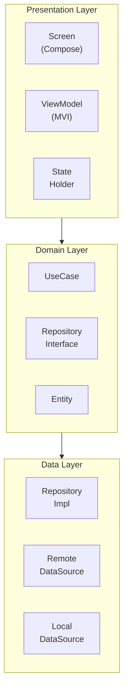
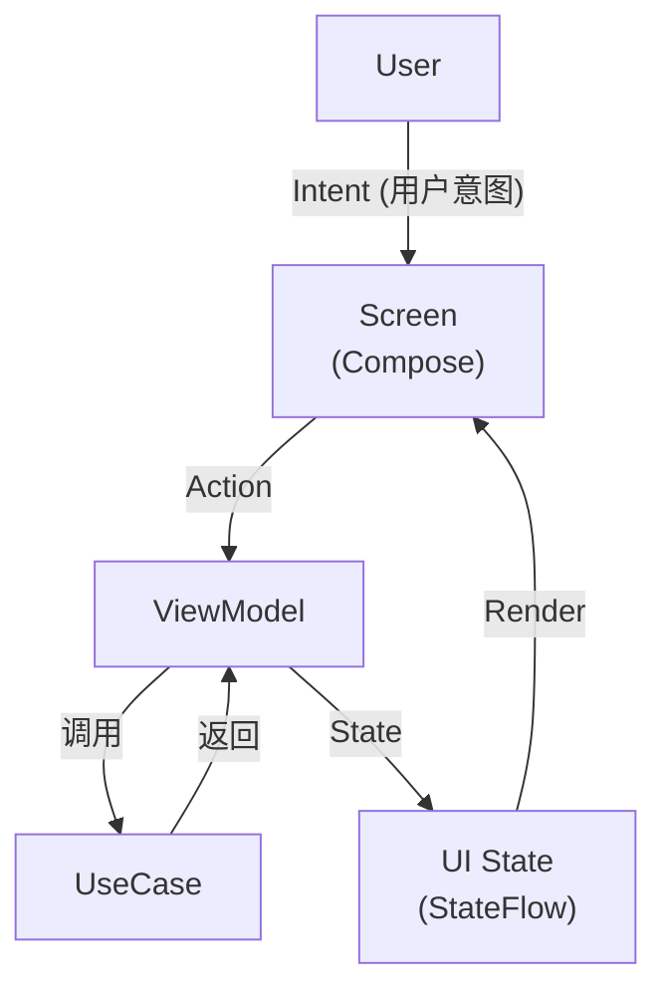
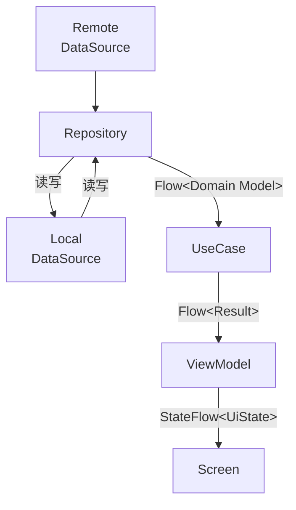

# Android 应用架构

> Clean Architecture + MVI + Kotlin

---

## 1. 架构概览



---

## 2. 模块结构

### 2.1 功能模块目录

```
feature/{module}/
├── data/
│   ├── repository/          # Repository 实现
│   ├── remote/              # 远程数据源
│   │   ├── api/             # Retrofit API
│   │   └── dto/             # 数据传输对象
│   └── local/               # 本地数据源
│       ├── dao/             # Room DAO
│       └── entity/          # Room Entity
├── domain/
│   ├── model/               # 领域模型
│   ├── repository/          # Repository 接口
│   └── usecase/             # 用例
└── presentation/
    ├── screen/              # Compose Screen
    ├── viewmodel/           # ViewModel
    ├── state/               # UI State
    └── component/           # 模块专属组件
```

### 2.2 核心模块

| 模块 | 职责 |
|------|------|
| core:common | 通用工具、扩展函数 |
| core:data | 数据层基础设施 |
| core:domain | 领域层基础 |
| core:network | 网络配置、拦截器 |
| core:ui | 基础 UI 组件、主题 |

---

## 3. MVI 模式

### 3.1 状态流转



### 3.2 State 设计

| 类型 | 说明 |
|------|------|
| UiState | 完整 UI 状态 |
| ViewState | 可组合的状态部分 |
| SideEffect | 一次性事件 (导航、Toast) |

---

## 4. 依赖注入

### 4.1 Hilt 模块组织

```
┌─────────────────────────────────────────────────────────────────┐
│                    Hilt 模块结构                                 │
├─────────────────────────────────────────────────────────────────┤
│                                                                  │
│  @Module                                                        │
│  ├── NetworkModule         Retrofit, OkHttp                    │
│  ├── DatabaseModule        Room Database                       │
│  ├── DataStoreModule       DataStore                           │
│  ├── RepositoryModule      Repository 绑定                      │
│  └── UseCaseModule         UseCase 提供                         │
│                                                                  │
│  @HiltViewModel                                                 │
│  └── 各功能模块 ViewModel                                        │
│                                                                  │
│  Scope                                                          │
│  ├── @Singleton            应用级单例                           │
│  ├── @ActivityScoped       Activity 级                          │
│  └── @ViewModelScoped      ViewModel 级                         │
│                                                                  │
└─────────────────────────────────────────────────────────────────┘
```

### 4.2 依赖关系

| 层级 | 依赖 |
|------|------|
| Presentation | Domain |
| Domain | 无 (纯 Kotlin) |
| Data | Domain, Network, Database |

---

## 5. 导航架构

### 5.1 Navigation Compose

```
┌─────────────────────────────────────────────────────────────────┐
│                    导航结构                                      │
├─────────────────────────────────────────────────────────────────┤
│                                                                  │
│  NavHost                                                        │
│  ├── AuthGraph                                                  │
│  │   ├── login                                                  │
│  │   └── register                                               │
│  │                                                              │
│  ├── MainGraph                                                  │
│  │   ├── library (起始)                                         │
│  │   ├── explore                                                │
│  │   ├── learn                                                  │
│  │   └── settings                                               │
│  │                                                              │
│  └── ReaderGraph                                                │
│      └── reader/{bookId}                                        │
│                                                                  │
│  底部导航: library, explore, learn, settings                    │
│                                                                  │
└─────────────────────────────────────────────────────────────────┘
```

### 5.2 导航参数

| 类型 | 传递方式 |
|------|----------|
| 简单类型 | 路由参数 |
| 复杂对象 | SavedStateHandle |
| 全局状态 | Hilt 单例 |

---

## 6. 数据流

### 6.1 单向数据流



### 6.2 缓存策略

| 策略 | 说明 |
|------|------|
| Cache First | 先显示缓存，后台更新 |
| Network First | 先请求网络，失败用缓存 |
| Refresh | 强制刷新，清除缓存 |

---

## 7. 错误处理

### 7.1 Result 封装

```
┌─────────────────────────────────────────────────────────────────┐
│                    Result 类型                                   │
├─────────────────────────────────────────────────────────────────┤
│                                                                  │
│  sealed class Result<T> {                                       │
│    data class Success<T>(val data: T)                          │
│    data class Error<T>(val exception: Throwable)               │
│    data class Loading<T>(val data: T? = null)                  │
│  }                                                              │
│                                                                  │
│  扩展函数                                                        │
│  ├── onSuccess { }                                              │
│  ├── onError { }                                                │
│  ├── onLoading { }                                              │
│  └── getOrDefault(default)                                     │
│                                                                  │
└─────────────────────────────────────────────────────────────────┘
```

### 7.2 异常类型

| 类型 | 说明 |
|------|------|
| NetworkException | 网络错误 |
| ApiException | API 错误 |
| DatabaseException | 数据库错误 |
| AuthException | 认证错误 |

---

## 8. 相关文档

| 文档 | 说明 |
|------|------|
| [state-management.md](./state-management.md) | 状态管理详解 |
| [testing.md](./testing.md) | 测试策略 |
| [performance.md](./performance.md) | 性能优化 |

---

*最后更新: 2025-12-31*
